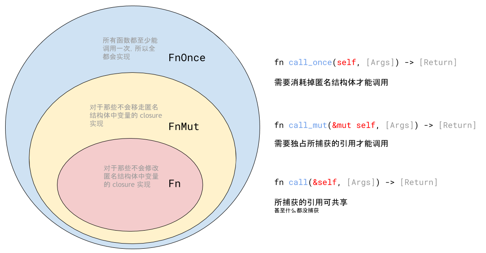
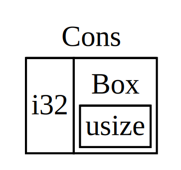

# 前言

Rust 语法规则比较复杂，rust 组织也发明了很多术语，使得学习 Rust 相比其它语言要困难得多。多数 Rust 资料篇幅很大，让人望而生畏。几乎没有人会将 Rust 作为第一门编程语言来学习，学习者通常**已经具有其它语言的经验**，需要一份**精简**而**整性**的资料。这份资料是开源的，可以放在案头随时查阅。

本教程按照概念和语法项组织内容，每个章节内容尽可能系统而完整，这对于有其它语言经验的读者是有好处的，知识分类更清晰，反复查阅更方便，但是带来的负面问题是造成一些知识点的循环依赖。教程尽力减少前面的内容对后面的内容的依赖，对于具有其它高级语言的先验知识的读者不会造成太大的困扰。建议阅读时保持耐心，顺序阅读，暂时抑制完全明白顺序阅读的每一句话的欲望。

实际上，有些教程为了减少没有其它语言经验者的学习难度，将同一类内容分割离散到各处，也仍难以完全避免前面的内容依赖后面内容的问题，根本原因在于语言要素本身就是相互依赖的。

总体上，不需要记住所有的语法细节，Rust 编译器的错误提示非常明确，给出的建议也非常准确，在实践中慢慢就熟练了。Rust 创新的术语非常多，要理解这些术语，这样才能看懂 Rust 的错误提示和建议，另外再保留这篇目录结构清晰的教程，随时查阅。

学习一门编程语言，首先需要了解它的设计思想和目的，Rust 也不例外。如果理解了 Rust 的目的和思想，就会对它的复杂性标识理解和宽容了。

很多教程介绍语法内容时涉及了标准库，参考附件中的关键字列表和运算符列表，可以明确哪些是语法规范，哪些是标准库提供的功能。

与其它高级语言不同，Rust 语言规范不限于关键字和运算符的语法逻辑，还包括一些特定的 Trait，比如 Sized、Drop、Copy，……等，这些 Trait 是内嵌于语言中的。在特定的情形下，编译器会自动调用变量类型所实现的特定的 Trait，编译器也会通过查看变量类型是否支持特定的 Trait 而判断是否存在语言错误。

---

# 概述

Rust 核心目标是可靠、效率和通用。对标 C++，Rust 具有极高的执行效率，适合底层开发，同时避免 C++的内存不安全性。

为了实现核心目标，主要设计思路是：

- 编译型语言，直接编译为 CPU 的机器指令，效率高；
- 支持指针，适合底层开发，比如开发操作系统内核；
- 发明了所有权的概念，在编译时就保证任何内存数据都只被**唯一**的变量拥有所有权，也就是说，编译器跟踪了变量的生命周期就能准确地确定变量所占内存空间的生命周期，这样，当变量生命周期结束，就能够**可靠**地释放变量占内存，避免内存泄漏，保证了可靠性，同时也避免了使用垃圾回收机制，保证了程序运行效率。
- 区分对变量的可变引用和不可变引用，而且任何时候可变引用只能有一个，保证数据一致性。
- 允许编写 unsafe 的代码，绕开 Rust 的安全检查机制，适应贴近硬件的底层开发。

所有权的概念是 Rust 的核心中的核心，Rust 很多语法都由所有权引起，为了实现所有权策略，也造成了很多语法晦涩难懂。

本教程针对的是 Rust 2021 版。

---

# 开发环境

学习编程语言必须动手实验，先来了解一下 Rust 的开发环境。

Rust SDK 主要提供三个工具 *rustc*、*cargo* 和 *rustup*

- rustc：rust 编译器。
- cargo：项目管理工具，包括项目管理和包管理，项目的编译最终还是调用的 rustc。参考：[简介 - Cargo 手册 中文版 (rustwiki.org)](https://rustwiki.org/zh-CN/cargo/)。
- rustup：rust 工具链管理工具，能够安装 Rust 工具链、切换工具链。参考：[Introduction - The rustup book (rust-lang.github.io)](https://rust-lang.github.io/rustup/index.html)。

Rust 开发工具类比 *Python* 和 *Nodejs* 的开发工具：

|         | Rust   | Python | Nodejs |
| ------- | ------ | ------ | ------ |
| 编译器     | rustc  | python | node   |
| 包管理工具   | cargo  | pip    | npm    |
| 工具链管理工具 | rustup | pyenv  | nvm    |

## 用 rustup -init 在线安装

从 [Other Installation Methods - Rust Forge (rust-lang.org)](https://forge.rust-lang.org/infra/other-installation-methods.html) 下载所需平台的 `rustup-init` 工具。

`rustup-init` 下载链接列表的描述格式为 `cpu + vendor + OS + ABI`。比如目标平台为 `x86_64-unknown-linux-gnu`，含义为：CPU 是 `x86_64`，厂商未知，操作系统为 `linux`，应用程序二进制接口 ABI 为 `gnu`。

以 Windows 平台为例，运行 `rustup-init.exe`，命令行程序以问答的形式进行安装。默认安装路径为 `C:\Users\xxx\.cargo` 和 `C:\Users\xxx\.rustup`。

### `C:\Users\xxx\.rustup` 目录结构

`C:\Users\xxx\.rustup` 目录结构为：

```shell
C:\Users\xxx\.rustup
│   settings.toml # 配置文件
│   
├───downloads
├───tmp
├───toolchains  # 工具链
│   └───stable-x86_64-pc-windows-msvc  # windows 平台下的工具链
│       ├───bin                        # SDK 工具
│       │       cargo.exe
│       │       rustc.exe
│       │       rustdoc.exe
│       │       rustfmt.exe
│       │       ...
│       │     
│       ├───etc
│       │   └───bash_completion.d      # bash下的 rust 命令行工具自动补全工具
│       │           cargo
│       │         
│       ├───lib                        # rust 库文件
│       │   └───rustlib
│       │       │   components
│       │       │   manifest-cargo-x86_64-pc-windows-msvc
│       │       │   ...
│       │       │   
│       │       ├───etc
│       │       │       intrinsic.natvis
│       │       │       ...
│       │       │     
│       │       └───x86_64-pc-windows-msvc
│       │           ├───bin               # 面向 windows 平台的连接工具
│       │           │   │   rust-lld.exe
│       │           │   │   
│       │           │   └───gcc-ld
│       │           │           ld.lld.exe
│       │           │           ld64.lld.exe
│       │           │           lld-link.exe
│       │           │           wasm-ld.exe
│       │           │         
│       │           └───lib
│       │                   liballoc-cb2478631e21007b.rlib
│       │                   ...
│       │                 
│       ├───libexec
│       │       rust-analyzer-proc-macro-srv.exe
│       │     
│       └───share
│           ├───doc
│               ...      
└───update-hashes
        stable-x86_64-pc-windows-msvc
```

- `C:\Users\xxx\.rustup\toolchains`：存放多个版本的工具链，可以看到本例当前只有一个版本的工具链 `stable-x86_64-pc-windows-msvc`，这是 `x86_64-pc-windows-msvc` 工具链的稳定版。
- `C:\Users\xxx\.rustup\toolchains\stable-x86_64-pc-windows-msvc\bin`：工具链中的工具，最重要的是 `cargo.exe` 和 `rustc.exe`。

### `C:\Users\xxx\.cargo` 目录结构

`C:\Users\xxx\.cargo` 目录结构为

```shell
C:\Users\xxx\.cargo
└───bin
        cargo-clippy.exe
        cargo-fmt.exe
        cargo-miri.exe
        cargo.exe
        clippy-driver.exe
        rls.exe
        rust-analyzer.exe
        rust-gdb.exe
        rust-gdbgui.exe
        rust-lldb.exe
        rustc.exe
        rustdoc.exe
        rustfmt.exe
        rustup.exe
```

需要在系统 `path` 环境变量中增加路径 `C:\Users\xxx\.cargo\bin`。观察 `C:\Users\xxx\.cargo\bin` 中的文件：

```shell
2024/03/18  15:37         9,684,992 cargo-clippy.exe
2024/03/18  15:37         9,684,992 cargo-fmt.exe
2024/03/18  15:37         9,684,992 cargo-miri.exe
2024/03/18  15:37         9,684,992 cargo.exe
2024/03/18  15:37         9,684,992 clippy-driver.exe
2024/03/18  15:37         9,684,992 rls.exe
2024/03/18  15:37         9,684,992 rust-analyzer.exe
2024/03/18  15:37         9,684,992 rust-gdb.exe
2024/03/18  15:37         9,684,992 rust-gdbgui.exe
2024/03/18  15:37         9,684,992 rust-lldb.exe
2024/03/18  15:37         9,684,992 rustc.exe
2024/03/18  15:37         9,684,992 rustdoc.exe
2024/03/18  15:37         9,684,992 rustfmt.exe
2024/03/18  15:37         9,684,992 rustup.exe
```

可以看到，`C:\Users\xxx\.cargo\bin` 目录下的所有文件大小相同，**实际上文件内容也完全一样**。该目录下的可执行文件为代理工具，最终这些代理工具启动的是 `.rustup\toolchains` 中的工具链中相应的可执行文件，通过这种机制实现多版本的工具链切换。

将任意一个文件**改名**为 `test.exe`，运行 `test.exe`，可以看到：

```shell
C:\Users\xxx\.cargo\bin>test

error: unknown proxy name: 'test'; valid proxy names are 'rustc', 'rustdoc', 'cargo', 'rust-lldb', 'rust-gdb', 'rust-gdbgui', 'rls', 'cargo-clippy', 'clippy-driver', 'cargo-miri', 'rust-analyzer', 'rustfmt', 'cargo-fmt'
```

这证明 `C:\Users\xxx\.cargo\bin` 中的可执行文件只是代理，有些命令代理可以直接执行，比如 `rustup.exe`，有些需要代理到相应版本的工具链的工具，比如 `rustc.exe`。这些代理程序获取命令行的内容，根据命令行中的 *命令字符串* 即可知晓需要代理哪个程序。

`C:\Users\xxx\.cargo\bin` 目录中有 `rustup.exe` 工具，该工具用于安装和管理 *Rust sdk* 版本，因此使用 `rustup-ini.exe` 完成安装后，该 `rustup-ini.exe` 工具也就不需要了，以后通过 `rustup.exe` 安装其它版本的工具链即可。正如其名字一样，`rustup-ini.exe` 仅用于初始安装，安装工具链以及 `rustup.exe`。

使用 `rustup-init` 工具前，通过设置环境变量 `CARGO_HOME` 和 `RUSTUP_HOME` 可以定制安装位置。

- `RUSTUP_HOME` 设置了 `rustup` 的根文件夹（默认为 `C:\Users\xxx\.rustup`），用于存储已安装的工具链和配置选项。
- `CARGO_HOME` 设置了 `cargo` 工具 的根文件夹（默认为 `C:\Users\xxx\.cargo`）。

注意，还需要将 `CARGO_HOME/bin` 设置在 `PATH` 环境变量中。

## 便携安装

理解了上述内容，可以很容易制作便携版本的 Rust 开发环境：

1. 在虚拟机中通过 `rustup-ini.exe` 安装 Rust
2. 设置环境变量 `CARGO_HOME` 和 `RUSTUP_HOME`
3. 将虚拟机中的 `.cargo` 和 `.rustup` 分别拷贝到 `CARGO_HOME` 和  `RUSTUP_HOME` 目录。
4. 将 `CARGO_HOME/bin` 设置在 `PATH` 环境变量中

## 独立安装

从 [Other Installation Methods - Rust Forge (rust-lang.org)](https://forge.rust-lang.org/infra/other-installation-methods.html) 下载完整的独立安装包，可离线安装。Windows 平台安装包为 `.msi` 格式，Linxu 平台为 `.tar.gz` 格式。

以 Windows 平台为例，下载 `rust-1.76.0-x86_64-pc-windows-msvc.msi`，双击即可安装。默认安装目录为 `C:\Program Files\Rust stable MSVC 1.76`，并自动在系统 `path` 环境变量中增加路径 `C:\Program Files\Rust stable MSVC 1.76\bin`。

这种安装方式不会在用户目录下生成 `.cargo` 和 `.rustup` 目录，也不会安装 rustup 工具，因此不具有版本切换功能，但是开发功能是完整的。

 `C:\Program Files\Rust stable MSVC 1.76` 目录内容为：

```shell
C:\Program Files\Rust stable MSVC 1.76
├───bin
│       cargo.exe
│       rust-windbg.cmd
│       rustc.exe
│       rustdoc.exe
│       ...
├───etc
│   └───bash_completion.d
│           cargo
├───lib
│   └───rustlib
│       ├───etc
│       │       ...
│       │     
│       └───x86_64-pc-windows-msvc
│           ├───bin
│           │   │   rust-lld.exe
│           │   │   
│           │   └───gcc-ld
│           │           ld.lld.exe
│           │           ld64.lld.exe
│           │           lld-link.exe
│           │           wasm-ld.exe
│           │         
│           └───lib
│                   ...
├───libexec
│       rust-analyzer-proc-macro-srv.exe
└───share
    ├───doc
        ...      
```

主要就是 `cargo.exe` 和 `rustc.exe`。由于这种安装方式不会安装 rustup 工具，不便于维护，因此不建议在开发中采用。

## 设置 Cargo 的国内源

Cargo 是 Rust 的包管理工具，在开发工作中，往往需要引入第三方包，Cargo 够根据项目配置文件自动下载所需的第三方包。第三方包存储在国外服务器中，国内也有镜像。如果需要使用国内的镜像，需要在 `CARGO_HOME` 根目录下配置`config.toml` 文件 (没有则新建)：

```shell
[source.crates-io]
registry = "https://github.com/rust-lang/crates.io-index"
#指定镜像名
replace-with = 'ustc'
# 中国科学技术大学
[source.ustc]
registry = "git://mirrors.ustc.edu.cn/crates.io-index"
[http]
check-revoke = false
```

Rust 工具链也在存储在国外，rustup 工具会自动从服务器上下载最新的版本。也可以配置从国内镜像下载，则需要配置环境变量，比如：

```shell
RUSTUP_DIST_SERVER= http://mirrors.ustc.edu.cn/rust-static
RUSTUP_UPDATE_ROOT= http://mirrors.ustc.edu.cn/rust-static/rustup
```

## 安装 MSVC

在 windows 平台部署 Rust 工具链还需要用到 msvc 工具：

1. 下载 Microsoft C++ 生成工具 [Microsoft C++ Build Tools](https://visualstudio.microsoft.com/visual-cpp-build-tools/) ，Microsoft C++ 生成工具通过可编写脚本的独立安装程序提供 MSVC 工具集，无需使用 `Visual Studio`。安装时勾选“Desktop development with C++” 选项。`Visual Studio` 也包含这些工具，


2. **为了正常使用 VS 的命令行编译工具，需要设置完整的环境变量，在命令行中运行 `C:\Program Files\Microsoft Visual Studio\2022\Community\Common7\Tools\VsDevCmd.bat`**

## 更新工具链

运行 `rustup update` 还可以检查 rustup 的更新，并自动安装最新的版本。

要手动检查更新并安装最新版本的 rustup 而不更新已安装的工具链，请输入 `rustup self update`。

```shell
$ rustup self update
info: checking for self-updates
info: downloading self-updates
```

注意：rustup 在任何工具链安装结束时也会自动更新自己。你可以在运行 `rustup update` 或 `rustup toolchain install` 时，通过传递 `--no-self-update` 参数来防止这种自动行为。

rustup 命令举例：

| 命令                                                         | 描述                               |
| ---------------------------------------------------------- | -------------------------------- |
| `rustup default nightly`                                   | 将默认的工具链设置为最新的日更版                 |
| `rustup set profile minimal`                               | 设置默认的 "profile"                  |
| `rustup target list`                                       | 列出活动工具链的所有可用目标                   |
| `rustup target add arm-linux-androideabi`                  | 安装 Android 目标                    |
| `rustup target remove arm-linux-androideabi`               | 删除 Android 目标                    |
| `rustup run nightly rustc foo.rs`                          | 无论活动的工具链如何，都要运行日更版运行             |
| `rustc +nightly foo.rs`                                    | 运行日更版编译器的速记方法                    |
| `rustup run nightly bash`                                  | 运行为日更版编译器配置的外壳                   |
| `rustup default stable-msvc`                               | 在 Windows 上，使用 MSVC 工具链而不是 GNU   |
| `rustup override set nightly-2015-04-01`                   | 对于当前目录，使用特定日期的日更版编译器             |
| `rustup toolchain link my-toolchain "C:\RustInstallation"` | 通过符号链接现有的安装程序来安装一个自定义的工具链        |
| `rustup show`                                              | 显示当前目录下将使用的工具链                   |
| `rustup toolchain uninstall nightly`                       | 卸载一个指定的工具链                       |
| `rustup toolchain help`                                    | 显示一个子命令（如 toolchain）的帮助页面        |
| `rustup man cargo`                                         | (仅适用于 Unix) 查看指定命令（如 cargo）的手册页面 |

---

# Hello World

## 使用 rustc

任意文本编辑器编写：

```rust
fn main() {
    println!("Hello, world!");
}
```

用 `rustc` 工具编译：

```shell
rustc hello_world.rs
```

得到 `hello_workd.exe`，运行：

```shell
hello_world
```

输出：

```shell
Hello, world!
```

## 使用 cargo

cargo 能够生成具有规范目录结构的项目，就像 maven 那样。

### 创建新项目

我们将在新的 Rust 开发环境中编写一个小应用。首先用 Cargo 创建一个新项目。在您的终端中执行：

```shell
cargo new hello_rust
```

这会生成一个名为 `hello_rust` 的新目录，其中包含以下文件：

```shell
hello_rust
|- Cargo.toml
|- src
  |- main.rs
```

- `Cargo.toml` 为 Rust 的清单文件。其中包含了项目的元数据和依赖库。
- `src/main.rs` 为编写应用代码的地方。

进入新创建的目录 `hello_rust` ，执行下面的命令来运行此程序：

```shell
cargo run
```

您应该会在终端中看到如下内容：

```shell
$ cargo run
   Compiling hello_rust v0.1.0 (/Users/ag_dubs/rust/hello_rust)
    Finished dev [unoptimized + debuginfo] target(s) in 1.34s
     Running `target/debug/hello_rust`
Hello, world!
```

### 添加依赖

现在我们来为应用添加依赖。您可以在 [crates.io](https://crates.io/)，即 Rust 包的仓库中找到所有类别的库。在 Rust 中，我们通常把包称作“crates”。

在本项目中，我们使用了名为 [`ferris-says`](https://crates.io/crates/ferris-says) 的库。

我们在 `Cargo.toml` 文件中添加以下信息：

```toml
[dependencies]
ferris-says = "0.3.1"
```

接着运行：

```shell
cargo build
```

之后 Cargo 就会自动安装该依赖。

`%CARGO_HOME%/registry` 是存放第三方包的地方。

第三方包 `ferris-says` 被下载到 `%CARGO_HOME%\registry\src\index.crates.io-6f17d22bba15001f\ferris-says-0.3.1` 目录下，其中有 `ferris-says` 的源文件。文件 `%CARGO_HOME%\registry\cache\index.crates.io-6f17d22bba15001f\ferris-says-0.3.1.crate` 是 `ferris-says` 包的缓存文件，这是一个压缩文件，用 `7zip` 等工具可以解压缩。

类似 nodejs，运行此命令会创建一个新文件 `Cargo.lock`，该文件记录了本地所用依赖库的精确版本。

要使用该依赖库，我们可以打开 `main.rs`，删除其中所有的内容，然后在其中添加下面这行代码：

```rust
use ferris_says::say; // from the previous step
use std::io::{stdout, BufWriter};

fn main() {
    let stdout = stdout();
    let message = String::from("Hello fellow Rustaceans!");
    let width = message.chars().count();

    let mut writer = BufWriter::new(stdout.lock());
    say(&message, width, &mut writer).unwrap();
}
```

我们可以输入以下命令来运行此应用：

```shell
cargo run
```

可以看到程序输出：

```shell
 __________________________
< Hello fellow Rustaceans! >
 --------------------------
        \
         \
            _~^~^~_
        \) /  o o  \ (/
          '_     -   _'
          / '-----' \
```

## 注释

注释对任何程序都不可缺少，同样 Rust 支持几种不同的注释方式。

- **普通注释**，其内容将被编译器忽略掉：
    - `// 单行注释，注释内容直到行尾`
    - `/* 块注释，注释内容一直到结束分隔符 */`
- **文档注释**，其内容将被解析成 HTML 帮助文档：
    - `/// 为接下来的项生成帮助文档`
    - `//! 为注释所属于的项（译注：如 crate、模块或函数）生成帮助文档`

## 格式化输出

这部分内容不属于 Rust 的语法范畴，而是 Rust 标准库中的内容。先介绍这些内容是为了提早能够练习编写程序，输出一些信息，以验证程序的逻辑，更好地理解 Rust 语法。

这部分内容有些概念在后面的章节才能介绍，这里只要能够依葫芦画瓢参照例子输出变量内容即可。

打印输出操作由标准库 `std::fmt` 里面所定义的一系列功能相似的 *宏* 来处理，包括：

- `format!`：将格式化文本写到字符串。
- `print!`：与 `format!` 类似，但将文本输出到控制台（io::stdout）。
- `println!`: 与 `print!` 类似，但输出结果追加一个换行符。
- `eprint!`：与 `print!` 类似，但将文本输出到标准错误（io::stderr）。
- `eprintln!`：与 `eprint!` 类似，但输出结果追加一个换行符。

宏类似于函数，这些宏都以相同的做法解析文本。[std::fmt - Rust (rust-lang.org)](https://doc.rust-lang.org/std/fmt/index.html) 对格式控制语法有详细的介绍。

### 格式参数

在 Rust 中，格式化参数是通过一系列占位符和相应的参数值来实现的。让我们先看一个简单的例子：

```rust
println!("{}天有{}小时", 1, 24);
```

这里，字符串 "{}天有{}小时" 可以被视为一个模板，模板中的 {} 称为格式参数。从第二个参数开始，后续所有参数构成了被格式化的参数列表——在上述例子中，1 和 24 是参数列表的成员。参数列表的长度没有限制：它可以包含任意数量的参数，而参数在列表中的索引从 0 开始。

一个格式参数的完整形式是`{which:how}`，其中的 which 和 how 都是可选的。因此，`{}` 表示既没有指定 which 也没有指定 how，即使用默认设置。

which 用于指定要格式化的特定参数，可以通过索引下标或者名称来选择。如果没有指定 which，则默认按照参数列表的顺序，从 0 到 n 自动选择参数。例如：

```rust
println!("{0} {1} {} {}", 66, 77);
// 等同于
println!("{0} {1} {2} {3}", 66, 77, 66, 77);
```

可以使用命名参数来个性化参数列表，但是如果同时使用索引和命名参数，那么命名参数必须放在最后。下面的例子演示了使用命名参数：

```rust
println!("{days}天有{hours}小时", days=1, hours=24);
```

至于 how，它定义了参数的格式化方式，例如对齐方式、浮点数的精度、数值基数等。若 how 部分存在，那么 : 是必须的。

### 文本类型的格式化

在 Rust 中，对字符串相关类型（如 String 或 &str）进行格式化时，how 部分的格式可能包括以下几个方面：

- fill（可选）：填充字符，用于当内容的宽度小于所需的最小宽度时进行填充，默认是空格。
- align（可选）：对齐方式，其中 < 代表左对齐，> 代表右对齐，^ 代表居中对齐，默认是左对齐。
- width（可选）：指定最小宽度，如果内容的长度小于此宽度，将根据设置的对齐方式用填充字符补充。
- precision（可选，通常用于数字和字符串）：对于字符串，它指定了最大输出宽度。如果字符串的长度超出这个值，会根据最大宽度截断字符串。

在使用对齐、填充、宽度和精度这些选项时，必须遵循它们的特定顺序。一个格式化占位符的典型结构如下所示：

```rust
{:[fill][align][width][.precision]}
```

重要的是要注意，fill 字符位于 align 字符之前，且两者之间不应有空格或其他分隔符。如果省略了 align 字符，默认会使用右对齐，并且填充字符默认是空格。

以下是一个展示这些元素如何被使用的简单示例：

```rust
println!("{:>8}", "foo"); // 输出 "     foo"，默认使用空格填充以及右对齐
println!("{:*>8}", "foo"); // 输出 "*****foo"，使用 '*' 填充并右对齐
println!("{:*<8}", "foo"); // 输出 "foo*****"，使用 '*' 填充并左对齐
println!("{:*^8}", "foo"); // 输出 "**foo***"，使用 '*' 填充并居中对齐
```

### 数值类型的格式化

对于数值类型的格式化，Rust 采用的语法类似于文本类型，但具体内容会根据数值的特性有所不同。以下是数值类型格式化语法的概括：

```rust
{:[fill][align][sign][#][0][width][.precision][type]}
```

- `fill`：（可选）一个填充字符，用于当文本表示的字符数不足宽度（width）时进行填充。
- `align`：（可选）对齐标志，`<`表示左对齐，`^`表示居中对齐，`>`表示右对齐（默认）。如果设置了`0`标志来填充零，则默认为右对齐。
- `sign`：（可选）符号，可用的选项有`+`或`-`或 `空格`。`+`会强制为正数显示加号，负数显示减号；`-`只有负数时显示符号（这是默认行为）；`空格`会在正数前面留一个空格。
- `#`：（可选）替换标志，用于对不同类型的格式增加特殊前缀，例如对于十六进制加`0x`，八进制加`0o`。
- `0`：（可选）用于在数值的左边填充0，直到达到指定宽度时停止。
- `width`：（可选）指明最小宽度，如果数值的字符串表示不足这个宽度，将会使用fill进行填充。
- `.precision`：（可选）对于整数表示最小位数；对于浮点数表示小数点后的位数；对于字符串表示最大宽度。
- `type`：指定数值的进制或者是格式化的类型。例如：`b` 表示二进制，`x` 表示小写十六进制，`X` 表示大写十六进制，`o` 表示八进制，`e/E` 表示指数形式（科学计数法），`p` 表示指针地址。

以下是一些常见的数值格式化指令：

|                         |                                      |
| ----------------------- | ------------------------------------ |
| 格式说明符                   | 功能说明                                 |
| `{}`                    | 使用 Display 类型进行默认格式化                 |
| `{:b}`                  | 以二进制形式格式化整数                          |
| `{:o}`                  | 以八进制形式格式化整数                          |
| `{:x}`                  | 以十六进制形式格式化整数（小写字母）                   |
| `{:X}`                  | 以十六进制形式格式化整数（大写字母）                   |
| `{:e}`                  | 以科学计数法（小写 e）格式化浮点数                   |
| `{:E}`                  | 以科学计数法（大写 E）格式化浮点数                   |
| `{:?}`                  | 使用 Debug Trait 进行格式化                 |
| `{:width$}`             | 设定最小宽度，未达到宽度时使用空格填充                  |
| `{:0width$}`            | 设定最小宽度，未达到宽度时使用0填充                   |
| `{:width$.*precision$}` | 一起设置最小宽度和精度，`.precision$` 部分用来格式化浮点数 |
| `{:<width$}`            | 左对齐，使用空格填充到指定宽度                      |
| `{:^width$}`            | 居中对齐，使用空格填充到指定宽度                     |
| `{:>width$}`            | 右对齐，使用空格填充到指定宽度                      |
| `{:+}`                  | 显示数值的正负号                             |
| `{: }`                  | 对于正数留空格，对于负数显示负号                     |
| `{:#}`                  | 实现数值的替代格式（例如在十六进制前加 0x）              |

注意：并不是所有的组合都有效，某些说明符仅对某些类型的数值有效。例如，`precision`通常不适用于整数。需要注意的是，整数类型（例如 i32, u32 等）不支持使用`.precision`设置精度，该设置通常用于浮点数。

以下是一些数值类型格式化的示例：

```rust
fn main() {
    // 格式化整数
    println!("{:04}", 42); // 输出：0042
    println!("{:+}", 42); // 输出：+42
    println!("{:#x}", 255); // 输出：0xff
    println!("{:#b}", 5); // 输出：0b101
    println!("{:0>5}", 14); // 输出：00014

    // 格式化浮点数
    println!("{:.*}", 2, 1.234567); // 输出：1.23
    println!("{:+.2}", 3.141592); // 输出：+3.14
    println!("{:.2}", 3.141592); // 输出：3.14
    println!("{:10.4}", 1234.56); // 输出："   1234.5600"，宽度为10，小数点后4位
    println!("{:0>10.4}", 1234.56); // 输出："0001234.5600"，填充0，宽度为10，小数点后4位

    // 格式化时使用特定的填充字符
    println!("{:*>10}", 42); // 输出：********42
    println!("{:.*}", 2, 1.234567); // 输出：1.23
}
```

### 参数化宽度和精度

格式化字符串时可以动态指定 width 和 precision。这可以通过命名参数或位置参数来实现，并且需要在参数名后加上`$`符号作为后缀。例如：

```text
let my_string = "Rust";
println!("{:>width$}", my_string, width = 10); // 命名参数指定宽度
println!("{:>1$}", my_string, 10);             // 位置参数指定宽度
```

在这里，`width$` 或 `1$` 表明 width 的值将被取自相对应的参数。在上面的代码中，`my_string` 将被右对齐并打印在一个至少10字符宽的字段中。

### 打印内存地址

当涉及到打印一个内存地址时，对于引用、Box、以及其他实现了 Pointer trait 的类型，`{:p}` 格式说明符可用于输出这些类型的内存地址，这个特性通常用于调试和研究目的。下面的代码展示了如何打印一个变量的内存地址：

```rust
fn main() {
    let my_var = 10;
    println!("The memory address of my_var is: {:p}", &my_var);
}
```

在这个例子中，操作 `&my_var` 获取了变量 `my_var` 的引用，其类型是 `&i32`。输出的地址是 `my_var` 储存值的内存地址。请注意，程序每次运行时，或者在不同的系统上，输出的具体内存地址可能会有所不同。这是因为操作系统根据当前的内存使用情况、地址空间布局随机化等多种因素来分配变量的具体内存位置。

### 格式符号和特性

在 Rust 中，每个格式符号背后其实对应着一个特性（Trait），其中最经常用到的是 Display 和 Debug。目前，您不必深入了解特性的具体含义；可以简单地将其视作类似于接口的功能。

|                |                    |                                     |
| -------------- | ------------------ | ----------------------------------- |
| 格式符号           | 特性                 | 说明                                  |
| `{}`           | Display            | 用于用户友好的输出，通常用于打印给终端用户看的信息。          |
| `{:?}`         | Debug              | 用于开发人员调试的输出，输出可能包含更多详细信息，不保证一致性或美观。 |
| `{:#?}`        | Debug              | 用于开发人员调试的输出，输出可能包含更多详细信息，保证美观。      |
| `{:o}`         | Octal              | 用于按八进制形式输出整数。                       |
| `{:x}`         | LowerHex           | 用于按小写十六进制形式输出整数。                    |
| `{:X}`         | UpperHex           | 用于按大写十六进制形式输出整数。                    |
| `{:b}`         | Binary             | 用于按二进制形式输出整数。                       |
| `{:e}`, `{:E}` | LowerExp, UpperExp | 用于按科学计数法输出浮点数，`e` 用小写字符，`E` 用大写字符。  |

Display 特性在某种程度上类似于 Java 中每个对象的 toString 方法，它定义了如何将类型以一种用户友好的方式进行格式化输出。另一方面，Debug 特性提供了一个用于调试目的的 “字符串化” 表示，它被很多容器类型所实现，以便在调试时能够方便地输出变量和数据结构的内容。

Rust 特意区分用于普通展示的 toString 功能（Display 特性）和用于调试目的的输出（Debug 特性）。在大多数情况下，如果单独使用 `{}` 导致编译错误，那么通常可以通过使用 `{:?}` 来替代，并使其能够成功编译并输出。`{:?}` 格式说明符表示使用类型所实现的 Debug 特性来进行格式化，从而在标准输出中呈现变量的内部状态，这通常是在开发过程中检查值的快速且不那么正式的方法。

## 使用 VSCode 调试 Rust 代码

您需要安装扩展程序。选择哪一个取决于你的平台：

- [C/C++ (Windows)](https://marketplace.visualstudio.com/items?itemName=ms-vscode.cpptools) / [CodeLLDB (OS X / Linux)](https://marketplace.visualstudio.com/items?itemName=vadimcn.vscode-lldb)
- [Rust extension](https://marketplace.visualstudio.com/items?itemName=rust-lang.rust) 。

接下来需要配置你的 VS Code 启动项。

- 点击 `调试` -> `添加配置`
- 如果你使用的是 Windows，选择 `C++ (Windows)`
- 如果你使用的是 Mac/Linux，选择 `LLDB: Custom Launch`
- 添加配置应该会创建并打开启动配置文件 `launch.json`。你必须手动修改配置项 `"program"` 对应的可执行文件名称。

```json
{
    "version": "0.2.0",
    "configurations": [
        {
            "name": "(Windows) Launch",
            "type": "cppvsdbg",
            "request": "launch",
            "program": "${workspaceRoot}/target/debug/foo.exe",
            "args": [],
            "stopAtEntry": false,
            "cwd": "${workspaceRoot}",
            "environment": [],
            "externalConsole": true
        },
        {
            "name": "(OSX) Launch",
            "type": "lldb",
            "request": "launch",
            "program": "${workspaceRoot}/target/debug/foo",
            "args": [],
            "cwd": "${workspaceRoot}",
        }
    ]
}
```

- 添加一个断点。按 F5 键启动。

---

# 项目源码组织

这一章较为复杂，建议参考完整的示例代码来阅读。

开发项目往往涉及到多个源程序文件，都离不开对源码的组织，需要对源码的组织有一个约定。

Cargo 是 Rust 的构建工具和包管理器，它对 Rust 项目源码的组织有专门的约定。

- **项目**（*Package*）：Cargo 用来组织、构建、测试和分享包 Crate。
- **包**（*Crate*） ：由多个模块组成的树形结构构成的*逻辑单元*，**注意是模块树，不是承载模块的文件树，因为一个文件可以包含多个模块**。*Crate* 被编译为库文件（*lib*）或可执行文件（*bin*），是 Rust 的最小编译单元。
- **模块**（*Module*）：一组用模块名包裹的程序资源，比如函数、trait、常量、复合数据类型等，一个文件中可以定义多个模块，也可以一个文件一个模块，但是同一个模块不能分布在多个文件中。
- **路径**（*Path*）：一个命名例如结构体、函数或模块等项的方式。
- **工作空间**（*WorkSpace*)：对于大型项目，多个项目组成工作空间。

Rust 组织的术语总是有些标新立异，*Package* 更类似其它语言中的 *Project*，*Crate* 类似其它语言中的 *Packege*，因此采用了上述翻译。下文直接使用英文来表达。

## Crate 和 Package

crate 是 Rust 在编译时最小的代码单位。前文最简单的 `hello_world.rs` 就是一个 crate。

crate 有两种类型：*bin crate* 和 *lib crate*：

- *bin crate* 被编译为可执行程序，它们必须有一个 `main` 函数。
- *lib crate* 没有 `main` 函数，它们提供一些诸如函数之类的东西，供其它 *crate* 使用。

*crate root* 是一个源文件，Rust 编译器以它为起始点，并构成 *crate* 的根文件，编译器由根文件开始搜索组成 *crate* 的部件。

*package* 是提供一系列功能的**一个或者多个** *crate*。一个 *package* 还会包含一个 `Cargo.toml` 文件，描述如何去构建这些 *crate*。

*package* 中可以包含**至多一个** *lib crate*，**任意多个** *bin crate*，但是必须**至少包含一个** *crate*，无论是 *lib crate* 还是 *bin crate*。

### *bin crate*

输入命令 `cargo new`：

```shell
$ cargo new my_project
     Created binary (application) `my_project` package
```

得到：

```shell
my_project
│   Cargo.toml
└───src
        main.rs
```

Cargo 会给我们的 *package* 创建一个包含 `Cargo.toml` 文件的的新目录，`Cargo.toml` 包含以下内容：

```toml title:Cargo.toml
[package]
name = "my_project"
version = "0.1.0"
edition = "2021"

# See more keys and their definitions at https://doc.rust-lang.org/cargo/reference/manifest.html

[dependencies]
```

在 `my_project` 目录中运行 `cargo build`，生成 `my_project.exe`。

查看 `Cargo.toml` 的内容，*package* 名为 `my_project`，其中并没有提到 `src/main.rs` 作为程序的入口，原因是 Cargo 遵循一个约定：`src/main.rs` 是 *bin crate* 的根文件，该 *bin crate* 的名称与所属 *package* 相同，在这里都是 `my_project` ，代码执行从该文件中的 `fn main()` 函数开始。

### *lib crate*

输入命令 `cargo new`：

```shell
$ cargo new my_lib --lib
     Created library `my_lib` package
```

得到：

```shell
my_lib
│   Cargo.toml
└───src
        lib.rs
```

在 `my_lib` 目录中运行 `cargo build`，生成 `libmy_lib.rlib`。

同样的，Cargo 知道如果包目录中包含 `src/lib.rs`，则 *package* 带有与其同名的 *lib crate*，这里名称是 `my_lib`，且 `src/lib.rs` 是 crate 根，这也是默认的约定。crate 根文件将由 Cargo 传递给 `rustc` 来实际构建库或者可执行文件。

如果一个 *package* 同时含有 `src/main.rs` 和 `src/lib.rs`，则它有两个 crate：一个 *bin crate* 和一个 *lib crate* ，且名字都与 *package* 相同。通过将 `*.rs` 文件放在 `src/bin` 目录下，一个 *package* 可以拥有多个 *bin crate*：每个 `src/bin` 下的文件都会被编译成一个独立的 *bin crate*。

看完上面，相信大家看出来为何 *package* 和 *crate* 容易被混淆了吧？因为用 `cargo new` 创建的 *package* 和它其中包含的 *crate* 是同名的！

不过，只要你牢记 *package* 是一个项目工程，而 *crate* 只是一个编译单元，基本上也就不会混淆这个两个概念了。

说 `src/main.rs` 或 `src/lib.rs` 是 *crate* 是不准确的，严格来说，*crate* 是逻辑上的概念，*crate* 所涉及的东西并不只在 `src/main.rs` 和 `src/lib.rs` 文件中，这两个文件只是 *crate root* 。关于根节点的作用参考后续关于模块的小节。

### 典型的 *package* 结构

一个真实项目中典型的 *package*，会包含多个 *bin crate*，这些 crate 文件被放在 `src/bin` 目录下，每一个文件都是独立的 *bin crate*，同时也会包含一个 *lib crate*，*lib crate* 只能有一个，*crate root* 是 `src/lib.rs`：

```shell
my_project
├── Cargo.toml
├── Cargo.lock
├── src
│   ├── main.rs
│   ├── lib.rs
│   └── bin
│       └── main1.rs
│       └── main2.rs
├── tests
│   └── some_integration_tests.rs
├── benches
│   └── simple_bench.rs
└── examples
    └── simple_example.rs
```

`Cargo.toml` 内容为：

```toml title:Cargo.toml
[package]
name = "my_project"
version = "0.1.0"
edition = "2021"

# See more keys and their definitions at https://doc.rust-lang.org/cargo/reference/manifest.html

[dependencies]
```

- 唯一 *lib crate*：`src/lib.rs`，生成库文件 `libmy_project.rlib`
- 默认 *bin crate*：`src/main.rs`，编译后生成的可执行文件 `my_project.exe`，与 *package* 同名
- 其余 *bin crate*：`src/bin/main1.rs` 和 `src/bin/main2.rs`，它们会分别生成一个与源程序文件同名的二进制可执行文件—— `main1.exe` 和 `main2.exe`
- 集成测试文件：`tests` 目录下
- 基准性能测试 `benchmark` 文件：`benches` 目录下
- 项目示例：`examples` 目录下

这种目录结构基本上是 Rust 的标准目录结构。

==强调一下==：`src/bin` 目录下的每个源文件对应一个 *bin crate* ，文件中都必须有一个 *main* 函数，当然也可以有其它被 *main* 函数调用的子函数，当然更规范的做法是将子函数放在模块中。

如果希望将子函数分门别类第放在其它文件中，并不能像 C 语言那样简单地在 `src` 下创建目录和源文件，然后再通过 *import* 引入到 *main* 函数所在的文件中，正确的做法是创建模块，见下一节。

## 模块 Module 基本规则

先罗列一下基本规则，然后接着通过例子理解这些规则。

- **从 crate 根节点开始**: 当编译一个 crate, 编译器首先在 *crate root* 根文件中寻找需要被编译的代码，通常，对于一个 *lib crate* 而言是 `src/lib.rs`，对于一个 *bin crate* 而言是 `src/main.rs`。
- **声明模块**: 在 *crate root*  根文件中，可以声明一个新模块；比如，用 `mod parent_mod;` 声明了一个叫做 `parent_mod` 的模块。编译器会在下列路径中寻找模块代码：
    - 内联在大括号中，当 `mod parent_mod` 后方不是一个分号而是一个大括号
    - 在文件 `src/parent_mod.rs`
    - 在文件 `src/parent_mod/mod.rs`
- **声明子模块**: 在除了 crate 根节点以外的其他文件中，可以定义子模块。比如，可能在 `src/parent_mod.rs` 中定义了 `mod child_mod;`。编译器会在以父模块命名的目录中寻找子模块代码：
    - 内联在大括号中，当 `mod child_mod` 后方不是一个分号而是一个大括号
    - 在文件 `src/parent_mod/child_mod.rs`
    - 在文件 `src/parent_mod/child_mod/mod.rs`

>[!Note]
注意，模块的声明不在本级模块，而是父级模块！这与其它语言的思路有所不同，也是比较别扭的地方。

- **模块中的代码路径**: 一旦一个模块是 crate 的一部分，可以在隐私规则允许的前提下，从同一个 crate 内的任意地方，通过代码路径引用该模块的代码。比如，一个 `child_mod` 模块下的 `child_fn` 函数可以在 `crate::parent_mod::child_mod::child_fn` 被找到。
- **私有 vs 公用**: 一个模块里的代码默认对其父模块私有。为了使一个模块公用，应当在声明时使用 `pub mod` 替代 `mod`。为了使一个公用模块内部的成员公用，应当在声明前使用 `pub`。
- **`use` 关键字**: 在一个作用域内，`use` 关键字创建了一个成员的快捷方式，用来减少长路径的重复。在任何可以引用 `crate::parent_mod::child_mod::child_fn` 的作用域，你可以通过 `use crate::parent_mod::child_mod::child_fn;` 创建一个快捷方式，然后你就可以在作用域中只写 `child_fn` 来使用该类型。

## 理解模块树

*模块* 可以将一个 crate 中的代码进行分组，以提高可读性与重用性。因为一个模块中的代码默认是私有的，所以还可以利用模块控制项的 *私有性*。私有项是不可为外部使用的内在实现。我们也可以将模块和其中的项标记为公开的，这样，外部代码就可以使用并依赖与它们。

通过执行 `cargo new --lib my_lib`，来创建一个新的名为 `my_lib` 的库，然后在 `src/lib.rs` 中定义一些模块和函数。

```rust
mod parent_mod {
    mod child1_mod {
        fn child1_fn1() {}
        fn child1_fn2() {}
    }

    mod child2_mod {
        fn child2_fn1() {}
        fn child2_fn2() {}
        fn child2_fn3() {}
    }
}
```

以 `mod` 关键字为起始定义模块，指定模块的名字，本例中叫做 `parent_mod`，并且用花括号包围模块的主体。在模块内，还可以定义其他的模块，就像本例中的 `child1_mod` 和 `child2_mod` 模块。模块可以定义各种程序项，比如结构体、枚举、常量、特性、或者函数。

通过使用模块，可以将相关的程序项定义组织到一起，保持程序的结构性。

在前面我们提到了，`src/main.rs` 和 `src/lib.rs` 叫做 crate 根。之所以这样叫它们是因为这两个文件的内容都分别构成了该 crate 的模块树形结构的根，该结构被称为 *模块树*（*module tree*），该模块树从逻辑上构成了 `crate` 。

上例模块树的结构为：

```shell
crate
 └── parent_mod
     ├── child1_mod
     │   ├── child1_fn1
     │   └── child1_fn2
     └── child2_mod
         ├── child2_fn1
         ├── child2_fn2
         └── child2_fn3
```

从上面模块树的结构上看，“crate” 才是这棵树的根，后面会看到，使用 `user` 关键字引入模块时形如：`crate::parent_mod::child1_mod`，也是从“crate” 标识符开始。感觉 Rust 组织定义术语时不是很严谨。

==强调一下==：

- 这个**树形结构**构成了重要的逻辑概念—— *crate* ，树的枝叶并不一定与包含这些模块的文件一一对应！
- 同时也应理解，说 `src/main.rs` 或 `src/lib.rs` 文件是一个 *crate* 是不严谨的，它们只是 *crate 根* 。

这个树展示了一些模块是如何被嵌入到另一个模块的（例如，`child1_mod` 嵌套在 `parent_mod` 中）。这个树还展示了一些模块是互为 *兄弟*（*siblings*）的，这意味着它们定义在同一模块中（`child1_mod` 和 `child2_mod` 被一起定义在 `parent_mod` 中）。继续沿用家庭关系的比喻，如果一个模块 A 被包含在模块 B 中，我们将模块 A 称为模块 B 的 *子*（*child*），模块 B 则是模块 A 的 *父*（*parent*）。注意，整个模块树都植根于名为 `crate` 的隐式模块下。

这个模块树可能会令你想起电脑上文件系统的目录树；这是一个非常恰当的类比！就像文件系统的目录，你可以使用模块来组织你的代码。并且，就像目录中的文件，我们需要一种方法来找到模块。

> [!note]
> 忍不住吐槽一下，rust 程序组织的模型和概念术语非常别扭，远不如 java 的中的包管理中的概念直观清晰。

## 将模块拆分成多个文件

当模块变得更大时，可能想要将它们的定义移动到单独的文件中，从而使代码更容易阅读。

我们会将模块在各自的文件中定义，而不是将所有模块都定义到 crate 根文件中。

Rust 模块树的构建规则是：

- `main.rs` 和 `lib.rs` 为模块树的根；
- 模块在上一级模块中使用 `mod xxx` 语句声明，`xxx` 为模块名，模块的实现代码在与模块名同名的**文件**中；
- 子模块的实现文件统一放在与父模块名同名的**文件夹**下；

Rust 设计这样的规则的目的是为了便于从 `main.rs` 或 `lib.rs` 根据声明的模块名称定位到模块的实现文件，从而构建模块树。

>[!Note]
这与其它语言的思路有所不同，也是比较别扭的地方。比如 Java 语言，包（类似于 Rust 的模块）的声明语句在包实现文件的前部，通过扫描源程序中的所有文件，同样能够构建出包的树形结构。


Rust 构建模块树的规则由下图所示。



图：模块树的规则构建规则

### 用模块组织 bin crate 中的函数

这里创建一个名为 `my_project` 的 *bin crate* 来说明模块树的构建规则，*lib crate*与此完全类似。该 crate 的路径同样命名为 `my_project`，该路径包含了这些文件和目录：

```shell
my_project
├── Cargo.toml
└── src
    ├── parent_mod
    │   └── child_mod.rs
    ├── parent_mod.rs
    └── main.rs
```

示例中 **`parent_mod`** 和 **`child_mod`** 名称可以是任意的，之所以这样取名，一是为了表示与模块相关，二是为了清晰地反映层次关系。

这个例子中的 *crate* 根文件是 `src/main.rs`。

```rust title:src/main.rs
use crate::parent_mod::child_mod::child_fn;

pub mod parent_mod;

fn main() {
    let a=child_fn();
    println!("I'm {}!", a);
}
```

第 1 行，`use crate::parent_mod::child_mod::child_fn;` 告诉编译器引入当前 crate 指定路径的模块中的 `child_fn` 函数，这样 `child_fn` 函数就可以在第 6 行直接使用。

第 3 行 `pub mod parent_mod;` 声明了一个模块，告诉编译器应该包含/引入在 `src/parent_mod.rs` 文件中发现的代码，可以看出，**这个文件的文件名与模块名同名，文件位于当前文件 `main.rs` 同级目录中**！文件内容为：

```rust title:src/parent_mod.rs
pub mod child_mod;
```

在此处， `pub mod child_mod;` 意味着在 `src/parent_mod/child_mod.rs` 中的代码也应该被包括/引入，可以看出，**这个文件的文件名与模块名同名，文件位于当前文件 `src/parent_mod.rs` 同名的目录 `src/parent_mod` 中**！，模块代码是：

```rust title:/src/parent_mod/child_mod.rs
pub fn child_fn() -> i32 {
    return 5;
}
```

可以看到 Rust 如何从源码中梳理出 *crate* 编译单元的：**首先，模块的声明在上一级模块中，实现模块功能文件名与模块名相同**。默认 `src/main.rs` 是 *crate 根* ，其中的 `pub mod parent_mod;` 声明了一个名为 `parent_mod` 的模块，根据模块名 `parent_mod` 找到文件 `src/parent_mod.rs`，同样根据 `pub mod child_mod;` 语句找到 `src/parent_mod/child_mod.rs` ，从而收集到了这个 *crate* 的全部模块。

可以看出，Rust 从 *crate 根*  文件开始，根据文件内容 `pub mod xxx;` 语句为线索，而该语句根据约定**隐含地**指出了文件位置和文件名，从而找到文件。由此，rust 既知道该 *crate* 涉及哪些文件，进而知道涉及哪些模块。

### 用模块组织 lib crate 中的函数

 前面提到过 *package* 可以同时包含一个 `src/main.rs` *bin crate* 根和一个 `src/lib.rs` *lib crate* 根，并且这两个 crate 默认以 *package* 名来命名。通常， *bin crate* 调用 *lib crate* 中的代码。因为 *lib crate* 可以共享，这使得其它项目也能共享 *package* 中的功能。

 将公用 API 封装到 `lib crate` 中，这样通过以 *package* 名开头的路径，公有项就可以在 *bin crate* 中使用。*bin crate* 就完全变成了同其它外部 crate 一样的 *lib crate* 的用户：它只能使用公有 API。这有助于你设计一个好的 API；你不仅仅是作者，也是用户！

这里创建一个名为 `my_project` 的 *bin crate* ，添加 `src/lib.js` 文件，于是我们在项目中又得到了一个 *lib crate* ，我们将上例中*bin crate*用到的函数都放到*lib crate*，然后在 `main.rs` 中调用，最终得到的目录结构为：

```shell
 my_project  
 ├── Cargo.toml  
 └── src  
     ├── parent_mod  
     │   └── child_mod.rs  
     ├── parent_mod.rs  
     ├── main.rs
     └── lib.rs
```

`lib.rs` 文件内容为：

```rust title:src/lib.rs
mod parent_mod;
use crate::parent_mod::child1_mod;

pub fn parent_fn() {
    child1_mod::child1_fn1();
}
```

我们将 `parent_fn` 函数公开，为的是能够在 `main.rs` 中调用。

`parent_mod.rs` 文件：

```rust title:src/parent_mod.rs
pub mod child1_mod;
```

`parent_mod\child1_mod.rs` 文件：

```rust title:src/parent_mode/child1_mod.rs
pub fn child1_fn1() {
    println!("I am child1_fn1");
}
```

这样，*lib crate* 就完整了。

下面在 *bin crate* 中调用 `parent_fn` 函数：

```rust title:src/main.rs
use my_project::parent_fn;
fn main() {
    parent_fn();
}
```

### 另一种文件模块位置约定

目前为止我们介绍了 Rust 编译器所最常用的模块文件位置约定；不过一种更老的文件位置约定也仍然是支持的。

对于声明于 crate 根的 `parent_mod` 模块，编译器会在如下位置查找模块代码：

- `src/parent_mod.rs`（我们所介绍的）
- `src/parent_mod/mod.rs`（老风格，不过仍然支持）

对于 `parent_mod` 的子模块 `child1_mod`，编译器会在如下位置查找模块代码：

- `src/parent_mod/child1_mod.rs`（我们所介绍的）
- `src/parent_mod/child1_mod/mod.rs`（老风格，不过仍然支持）

如果你对同一模块同时使用这两种模块位置约定风格，会得到一个编译错误。在同一项目中的不同模块混用不同的风格是允许的，不过这会使他人感到疑惑。

使用 `mod.rs` 这一文件名的风格的主要缺点是会导致项目中出现很多 `mod.rs` 文件，当你在编辑器中同时打开它们时会感到疑惑。

我们将各个模块的代码移动到独立文件了，同时模块树依旧相同。`child1_fn1` 中的函数调用也无需修改继续保持有效，即便其定义存在于不同的文件中。这个技巧让你可以在模块代码增长时，将它们移动到新文件中。

注意， `src/lib.rs` 中的 `pub use crate::parent_mod::child1_mod` 语句也并未发生改变。use 也不会对哪些文件会被编译为 crate 的一部分有任何影响。`mod` 关键字声明了模块，而 Rust 会在与模块同名的文件中查找模块的代码。

## 模块的路径

来看一下 Rust 如何在模块树中找到一个项的位置，我们使用路径的方式，就像在文件系统使用路径一样。为了调用一个函数，需要知道它的路径。==强调一下：这里讲的路径是模块树中的路径，而不是源文件在文件系统中路径。==

路径有两种形式：

- **绝对路径**（*absolute path*）是以 *crate* 根开头的全路径；
	- 对于外部 *crate* 的代码，是以 *crate 名* 开头的绝对路径，比如引入标准库中的模块中的程序项的形式为 `use std::time::Duration`；
	- 对于当前项目 *crate* 的代码，则以标识符 `crate` 开头，比如 `use crate::parent_mod::child1_mod`。
- **相对路径**（*relative path*）以当前模块为基准（当前模块名不出现在路径中），以 `self`（表示当前模块，含义类似文件系统中的 `.\`）、`super`（表示父模块，含义类似文件系统中的 `..\`）或定义在当前模块中的子模块名称标识符为开头。

绝对路径和相对路径都以 `::` 作为分割符。

下面举例通过这两种路径来使用程序项。在 *crate 根*定义了一个新函数 `parent_fn`，并在其中展示调用 `child1_fn1` 函数的两种方法。

```rust title:src/lib.rs
mod parent_mod {
    pub mod child1_mod {
        pub fn child1_fn1() {}
    }
}

pub fn parent_fn() {
    // 绝对路径
    crate::parent_mod::child1_mod::child1_fn1();

    // 相对路径
    parent_mod::child1_mod::child1_fn1();
}
```

模块树为：

```shell
crate
 └── parent_fn
 └── parent_mod
     └── child1_mod
         └── child1_fn1
```

第一种方式，我们在 `parent_fn` 中调用 `child1_fn1` 函数，使用的是绝对路径。`child1_fn1` 函数与 `parent_fn` 被定义在同一 crate 中，这意味着我们可以使用 `crate` 关键字为起始的绝对路径。

第二种方式，我们在 `parent_fn` 中调用 `child1_fn1`，使用的是相对路径。从模块树可以看出，当前模块为根模块，因此相对路径以 `parent_mod` 为起始。以模块名开头意味着该路径是相对路径。

### 使用 `pub` 关键字暴露路径

在 Rust 中，默认所有项（函数、方法、结构体、枚举、模块和常量）对父模块都是私有的。**父模块中的项不能使用子模块中的私有项，但是子模块中的项可以使用它们父模块中的所有项，包括私有项**。这是因为子模块封装并隐藏了它们的实现详情，但是子模块可以看到它们定义的上下文。

Rust 选择以这种方式来实现模块系统功能，默认隐藏内部实现细节。这样一来，可以更改内部代码而不会破坏外部代码。Rust 通过使用 `pub` 关键字来创建公共项，使子模块的内部部分暴露给上级模块。

修改上面的例子，去掉 `pub` 关键字：

```rust title:src/lib.rs
mod parent_mod {
 mod child1_mod {
  fn child1_fn1() {}
    }
}

pub fn parent_fn(){
    // 绝对路径
    crate::parent_mod::child1_mod::child1_fn1();

    // 相对路径
    parent_mod::child1_mod::child1_fn1();
}
```

这会引起编译错误，注意第 2 行，编译器指出 `child1_mod` 模块是私有的。

在第 2 行加上 `pub` 关键，编译器仍然报错，指出 `child1_fn1` 是私有的。这表明使模块公有并不使其内容也是公有的。模块上的 `pub` 关键字只允许其父模块引用它，而不允许访问内部代码。因为模块是一个容器，只是将模块变为公有能做的其实并不太多；同时需要更深入地选择将一个或多个项变为公有。

私有性规则不但应用于模块，还应用于模块中的结构体、枚举、函数和方法等程序项。

继续将 `pub` 关键字放置在 `child1_fn1` 函数的定义之前，使其变成公有：

```rust title:src/lib.rs
mod parent_mod {
    pub mod child1_mod {
        pub fn child1_fn1() {}
    }
}

pub fn parent_fn(){
    // 绝对路径
    crate::parent_mod::child1_mod::child1_fn1();

    // 相对路径
    parent_mod::child1_mod::child1_fn1();
}
```

现在代码可以编译通过了！

为了了解为何增加 `pub` 关键字后可以在 `parent_fn` 中调用模块路径中的函数与私有性规则有关，让我们看看绝对路径和相对路径。

第 9 行，使用绝对路径，从 `crate` 也就是 crate 根开始。crate 根中定义了 `parent_mod` 模块。虽然 `parent_mod` 模块不是公有的，但是因为 `parent_fn` 函数与 `parent_mod` 定义于同一模块中（即，`parent_fn` 和 `parent_mod` 是兄弟），因此可以从 `parent_fn` 中访问 `parent_mod` 标识符。接下来是使用 `pub` 标记的 `child1_mod` 模块。由于可以访问 `child1_mod` 的父模块，所以可以访问 `child1_mod`。最后，`child1_fn1` 函数被标记为 `pub` ，我们可以访问定义该函数的模块，所以这个函数调用是有效的！

第 12 行，使用相对路径，其逻辑与绝对路径相同，除了第一步：不同于从 crate 根开始，路径从 `parent_mod` 开始。`parent_mod` 模块与 `parent_fn` 定义于同一模块，所以从 `parent_fn` 中定义的该模块下的相对路径是有效的。接下来因为 `child1_mod` 和 `child1_fn1` 被标记为 `pub`，路径其余的部分也是有效的，因此函数调用也是有效的！

### `self` 开始的相对路径
可以通过在路径的开头使用 `self` ，从当前模块开始构建相对路径。这类似以 `.\` 为起始的一个文件系统路径。比如上例可以写为：

```rust title:src/lib.rs
mod parent_mod {
    pub mod child1_mod {
        pub fn child1_fn1() {}
    }
}

pub fn parent_fn(){
    // 绝对路径
    crate::parent_mod::child1_mod::child1_fn1();

    // 相对路径
    self::parent_mod::child1_mod::child1_fn1()
}
```

### `super` 开始的相对路径

可以通过在路径的开头使用 `super` ，从父模块开始构建相对路径，而不是从当前模块或者 crate 根开始。这类似以 `..\` 为起始的一个文件系统路径。使用 `super` 允许我们引用父模块中的已知项，这使得重新组织模块树变得更容易，**父模块移动到模块树的其它位置时，这个相对路径仍然有效**。

下面的示例中，`child_mod` 模块中的定义的 `child_fn` 函数通过指定的 `super` 起始的 `parent_fn` 路径，来调用父模块中的 `parent_fn` 函数：

```rust title:src/lib.rs
pub mod child_mod {
    fn child_fn1() {
        child_fn2();  // 同级中的函数
        super::parent_fn(); // 父模块中的函数
    }
    fn child_fn2() {}
}

fn parent_fn() {}
```

`child_fn1` 函数在 `child_mod` 模块中，所以我们可以使用 `super` 进入 `child_mod` 父模块，在这里，我们可以找到 `parent_fn`。

### 创建公有的结构体和枚举

如果我们在一个结构体定义的前面使用了 `pub` ，这个结构体会变成公有的，**但是这个结构体的字段仍然是私有的**。我们可以根据情况决定每个字段是否公有。在下面的示例中，定义了一个公有结构体 `child_mod:ChildStruct`，其中有一个公有字段 `x` 和私有字段 `y`。

```rust title:src/lib.rs
mod child_mod {
    pub struct ChildStruct {
        pub x: i32,
        y: i32,
    }
    // 为结构体增加一个方法，创建一个结构体实例
    impl ChildStruct {
        pub fn init(x: i32) -> ChildStruct {
            ChildStruct { x, y: 2 }
        }
    }
}

fn parent_fn() {
    // 调用模块方法，创建一个结构体实例
    let mut child_struct = child_mod::ChildStruct::init(5);
    child_struct.x = 9;

    // 不允许访问私有字段
    // child_struct.y = 9;
}
```

因为 `child_mod:ChildStruct` 结构体的 `x` 字段是公有的，所以我们可以在 `parent_fn` 中使用点号来随意的读写 `x` 字段。注意，我们不能在 `parent_fn` 中使用 `y` 字段，因为 `y` 是私有的。尝试去除那一行修改 `y` 字段值的代码的注释，会引起编译错误。

还要注意一点，因为 `child_mod:ChildStruct` 具有私有字段，所以这个结构体需要提供一个公共的关联函数来构造 `ChildStruct` 的实例，这里我们命名为 `init`。如果 `ChildStruct` 没有这样的函数，我们将无法在 `parent_fn` 中创建 `ChildStruct` 实例，因为我们不能在 `ChildStruct` 中设置私有字段 `y` 的值。

与之相反，如果我们将枚举设为公有，则它的所有成员都将变为公有。我们只需要在 `enum` 关键字前面加上 `pub`，比如：

```rust src/lib.rs
mod child_mod {
    pub enum ChildEnum {
        x,
        y,
    }
}

fn parent_fn() {
    // 调用模块方法，创建一个结构体实例
    let cx = child_mod::ChildEnum::x;
    let cy = child_mod::ChildEnum::y;
}
```

因为创建了名为 `ChildEnum` 的公有枚举，所以我们可以在 `parent_fn` 中使用 `x` 和 `y` 成员。

如果枚举成员不是公有的，那么枚举会显得用处不大；给枚举的所有成员挨个添加 `pub` 显得很麻烦，因此枚举成员默认就是公有的。结构体通常使用时，不必将它们的字段公有化，因此结构体遵循常规，内容全部是私有的，除非使用 `pub` 关键字。

## 使用 `use` 关键字将路径引入作用域

使用路径来调用函数显得冗长且重复，可以使用 `use` 关键字创建一个短路径，然后就可以在作用域中的任何地方使用这个更短的名字。

在下面的示例中，将 `crate::parent_mod::child1_mod` 模块引入了 `parent_fn` 函数所在的作用域，这样只需要指定 `child1_mod::child1_fn1` 即可在 `parent_fn` 中调用 `child1_fn1` 函数。

```rust title:src/lib.rs
mod parent_mod {
    pub mod child1_mod {
        pub fn child1_fn1() {}
    }
}
use crate::parent_mod::child1_mod;

pub fn parent_fn() {
    child1_mod::child1_fn1();
}
```

在作用域中增加 `use` 和路径类似于在文件系统中创建软连接（符号连接，symbolic link）。通过在 crate 根增加 `use crate::parent_mod::child1_mod`，现在 `child1_mod` 在作用域中就是有效的名称了。通过 `use` 引入作用域的路径也会检查私有性，同其它路径一样。

注意 `use` 只能创建 `use` 所在的特定作用域内的短路径。下面的示例将 `parent_fn` 函数移动到了一个叫 `customer` 的子模块，这又是一个不同于 `use` 语句的作用域，所以函数体不能编译。

```rust title:src/lib.rs
mod parent_mod {
    pub mod child1_mod {
        pub fn child1_fn1() {}
    }
}
use crate::parent_mod::child1_mod;

mod parent_mod2 {
    pub fn parent_fn() {
        child1_mod::child1_fn1();
    }
}
```

编译器错误显示短路径不再适用于 `parent_mod2` 模块中。为了修复这个问题，可以将 `use` 移动到 `parent_mod2` 模块内，或者在子模块 `parent_mod2` 内通过 `super::child1_mod` 引用父模块中的这个短路径。

### `use` 路径的习惯用法

上例指定 `use crate::parent_mod::child1_mod;` ，然后在 `parent_fn` 中调用 `child1_mod::child1_fn1` ，而不是通过指定一直到 `child1_fn1` 函数的 `use` 路径来得到相同的结果，比如：

```rust title:src/lib.rs
mod parent_mod {
    pub mod child1_mod {
        pub fn child1_fn1() {}
    }
}
use crate::parent_mod::child1_mod::child1_fn1;

pub fn parent_fn() {
    child1_fn1();
}
```

使用 `use` 将 `child1_fn1` 函数引入作用域，这并不符合习惯。好的习惯是使用 `use` 将函数的父模块引入作用域，在调用函数时指定父模块，这样可以清晰地表明函数不是在本地定义的，同时使完整路径的重复度最小化。上例的代码不清楚 `child1_fn1` 是在哪里被定义的。

另一方面，使用 `use` 引入结构体、枚举和其他项时，习惯是指定它们的完整路径。下例展示了将 `HashMap` 结构体引入二进制 crate 作用域的习惯用法。

```rust title:src/main.rs
use std::collections::HashMap;

fn main() {
    let mut map = HashMap::new();
    map.insert(1, 2);
}
```

这种习惯用法背后没有什么硬性要求：它只是一种惯例，人们已经习惯了以这种方式阅读和编写 Rust 代码。

这个习惯用法有一个例外，那就是我们想使用 `use` 语句将两个具有相同名称的项带入作用域，因为 Rust 不允许这样做。下例 展示了如何将两个具有相同名称但不同父模块的 `Result` 类型引入作用域，以及如何引用它们。

```rust
use std::fmt;
use std::io;

fn function1() -> fmt::Result {
    // --snip--
}

fn function2() -> io::Result<()> {
    // --snip--
}
```

可见，使用父模块可以区分这两个 `Result` 类型。如果指定 `use std::fmt::Result` 和 `use std::io::Result`，将在同一作用域拥有了两个 `Result` 类型，当使用 `Result` 时，Rust 则不知道我们要用的是哪个。

### 使用 `as` 关键字提供新的名称

使用 `use` 将两个同名类型引入同一作用域这个问题还有另一个解决办法：在这个类型的路径后面，我们使用 `as` 指定一个新的本地名称或者别名。下例展示了通过 `as` 重命名其中一个 `Result` 类型。

```rust
use std::fmt::Result;
use std::io::Result as IoResult;

fn function1() -> Result {
}

fn function2() -> IoResult<()> {
}
```

### 使用 `pub use` 重导出名称

使用 `use` 关键字，将某个名称导入当前作用域后，这个名称在此作用域中就可以使用了，但它对此作用域之外还是私有的。如果想让其他人调用我们的代码时，也能够使用这个名称，就好像它本来就在当前作用域一样，那我们可以将 `pub` 和 `use` 合起来使用，将名称重新导出。比如：

```rust
mod parent_mod {
    pub mod child1_mod {
        pub fn child1_fn1() {}
    }
}
pub use crate::parent_mod::child1_mod;

pub fn parent_fn() {
    child1_mod::child1_fn1();
}
```

在这个修改之前，外部代码需要使用路径 `my_lib::parent_mod::child1_mod::child1_fn1()` 来调用 `child1_fn1` 函数。现在这个 `pub use` 从根模块重导出了 `child1_mod` 模块，外部代码现在可以使用路径 `my_lib::child1_mod::child1_fn1`。

当你代码的内部结构与调用你代码的程序员所想象的结构不同时，重导出会很有用。使用 `pub use`，我们可以使用一种结构编写代码，却将不同的结构形式暴露出来。这样做使我们的库井井有条，也使开发这个库的程序员和调用这个库的程序员都更加方便。

### 使用外部包

为了在项目中使用随机数包 `rand`，在 `Cargo.toml` 中加入了如下行：

```toml
rand = "0.8.5"
```

在 `Cargo.toml` 中加入 `rand` 依赖告诉了 Cargo 要从 [crates.io](https://crates.io/) 下载 `rand` 和其依赖，并使其可在项目代码中使用。

接着，为了将 `rand` 定义引入项目包的作用域，我们加入一行 `use` 起始的包名，它以 `rand` 包名开头并列出了需要引入作用域的项。

```rust
use rand::Rng;

fn main() {
    let secret_number = rand::thread_rng().gen_range(1..=100);
}
```

[crates.io](https://crates.io/) 上有很多 Rust 社区成员发布的包，将其引入你自己的项目都需要一道相同的步骤：在 `Cargo.toml` 列出它们并通过 `use` 将其中定义的项引入项目包的作用域中。

注意 `std` 标准库对于你的包来说也是外部 crate。因为标准库随 Rust 语言一同分发，无需修改 `Cargo.toml` 来引入 `std`，不过需要通过 `use` 将标准库中定义的项引入项目包的作用域中来引用它们，比如我们使用的 `HashMap`：

```rust
use std::collections::HashMap;
```

这是一个以标准库 crate 名 `std` 开头的绝对路径。

### 嵌套路径来消除大量的 `use` 行

当需要引入很多定义于相同包或相同模块的项时，为每一项单独列出一行会占用源码很大的空间，比如：

```rust
use std::cmp::Ordering;
use std::io;
```

相反，可以使用嵌套路径将相同的项在一行中引入作用域。这需要指定路径的相同部分，接着是两个冒号，接着是大括号中的各自不同的路径部分，比如：

```rust
use std::{cmp::Ordering, io};
```

在较大的程序中，使用嵌套路径从相同包或模块中引入很多项，可以显著减少所需的独立 `use` 语句的数量！

我们可以在路径的任何层级使用嵌套路径，这在组合两个共享子路径的 `use` 语句时非常有用。下例展示了两个 `use` 语句：一个将 `std::io` 引入作用域，另一个将 `std::io::Write` 引入作用域：

```rust
use std::io;
use std::io::Write;
```

两个路径的相同部分是 `std::io`，这正是第一个路径。为了在一行 `use` 语句中引入这两个路径，可以在嵌套路径中使用 `self`：

```rust
use std::io::{self, Write};
```

这一行便将 `std::io` 和 `std::io::Write` 同时引入作用域。

### 通过 glob 运算符将所有的公有定义引入作用域

如果希望将一个路径下 **所有** 公有项引入作用域，可以指定路径后跟 `*`，glob 运算符：

```rust
use std::collections::*;
```

这个 `use` 语句将 `std::collections` 中定义的所有公有项引入当前作用域。使用 glob 运算符时请多加小心！Glob 会使得我们难以推导作用域中有什么名称和它们是在何处定义的。

glob 运算符经常用于测试模块 `tests` 中，这时会将所有内容引入作用域。

## WorkSpace

参考连接：[Cargo Workspaces](https://doc.rust-lang.org/book/ch14-03-cargo-workspaces.html)
完整代码示例：[rust_workspaces](https://github.com/superfreeeee/Blog-code/tree/main/back_end/rust/rust_workspaces)

*workspaces* 把多个关联的项目放到同一个目录下；然而这与子项目的概念是不同的，大多数的实现主要用于一次构建多个平行、顶级的包作为独立模块，当然你用 workspaces 的时候定义一个对外暴露的主包，并用它来关联其他包也是可以的。

不过最重要的一个特征就是，在 workspaces 下每个包都应该是能够独立运行的个体，能够被本项目以外的项目引入并运行。

除了这些之外，cargo worksapces 还提出了其它约束，如相同的依赖包版本应该一致等，有兴趣可以看看[官方介绍](https://doc.rust-lang.org/book/ch14-03-cargo-workspaces.html)。

接下来通过示例讲解 Cargo Workspaces。

### 项目结构

在开始之前我们先来看看最终产物的项目结构

```shell
rust_workspaces
├── Cargo.lock
├── Cargo.toml
└── crates
    ├── add-one
    │   ├── Cargo.toml
    │   └── src
    │       └── lib.rs
    ├── add-two
    │   ├── Cargo.toml
    │   └── src
    │       └── lib.rs
    └── adder
        ├── Cargo.toml
        └── src
            └── main.rs
```

本篇的最终产物会有三个包，分别是 `adder`、`add-one`、`add-two`，其中 `adder` 又依赖了其余两个包；全部三个包都放到 `crates` 目录下，当然放在其它位置也可以，因为这些包都是通过 `rust_workspaces\Cargo.toml` 引入，引入路径和包的位置一致即可。

### 项目构建

接下来构建 cargo workspaces 多 crate 项目，实际上与原来用 cargo 的方式一模一样！

#### 构建项目

首先把三个小项目都建起来

```bash
# 目录结构
mkdir rust_workspaces
cd rust_workspaces
mkdir crates
cd crates
# 构建三个包
cargo new adder --bin
cargo new add-one --lib
cargo new add-two --lib
```

#### 根目录配置文件 Cargo.toml

我们知道一个由 Cargo 管理的 Rust 项目的配置文件是 `Cargo.toml`；一个 workspaces 项目也是一样的

- 创建 workspaces 配置文件 `rust_workspaces\Cargo.toml`

这里与我们通常熟悉的部分就不同了，我们不需要填哪些正常项目或是包应该要填的东西，只需要一个 `workspace` 属性，声明当前 workspaces 有哪些项目就可以了！

- `/Cargo.toml`

```toml
[workspace]
members = [
    "crates/adder",
    "crates/add-one",
    "crates/add-two",
]
```

可以看到实际上就是指定每一个 package 根目录就可以了，所以**也可以将这三个 package 直接平铺在 workspace 根目录下**，而不用放到 `crates` 目录下。

#### 声明依赖

分别在每个 package 下自己的 `Cargo.toml` 定义好自己的依赖关系，比如 `adder` package 需要依赖另外两个包：

- `/crates/adder/Cargo.toml`

```toml
[package]
name = "adder"
version = "0.1.0"
edition = "2021"

# See more keys and their definitions at https://doc.rust-lang.org/cargo/reference/manifest.html

[dependencies]
add-one = { path = "../add-one" }
add-two = { path = "../add-two" }
```

### 编写代码

接下来编写各个项目的内容代码

- `/crates/add-one/src/lib.rs`

```rust
pub fn add_one(x: i32) -> i32 {
    x + 1
}
```

- `/crates/add-two/src/lib.rs`

```rust
pub fn add_two(x: i32) -> i32 {
    x + 2
}
```

- `/crates/adder/src/main.rs`

```rust
use {add_one, add_two};

fn main() {
    let num = 10;
    println!("Hello, world! {} + 1 = {}", num, add_one::add_one(num));
    println!("Hello, world! {} + 2 = {}", num, add_two::add_two(num));
}
```

### 打包运行

只需要在根目录下进行打包，Cargo 就会自动识别，将最终产物统一构建在根目录的 `/target` 目录下，甚至我们进入到单个项目的根目录下运行相同指令也是一样的效果，不会产生多余的 target 目录

```bash
# 当前在根目录，也就是 rust_workspaces 目录下
pwd  # ~/rust_workspaces

cargo build  # 打包项目（可以省略）
cargo run --bin adder  # 指定运行 adder 项目（adder 是一个 bin 项目）
```

- 最终结果

```shell
   Compiling adder v0.1.0 (~/rust_workspaces/crates/adder)
    Finished dev [unoptimized + debuginfo] target(s) in 0.53s
     Running `target/debug/adder`
Hello, world! 10 + 1 = 11
Hello, world! 10 + 2 = 12
```

---

# 原生数据类型

Rust 是 **静态类型**（*statically typed*）语言，也就是说在编译时就必须知道所有变量的类型。根据值及其使用方式，编译器通常可以推断出我们想要用的类型。当多种类型均有可能时，必须增加类型注解，像这样：

```Rust
let a: u32 = 42;
```

与其它很多高级语言（比如 Javacript）类似，Rust 中所有数据类型都是 *类 (class)* 的概念，都有特定的方法，甚至常量也有方法，比如：

```rust
fn main() {
    let a: i32 = 5;
    println!("{}", a.to_string());
    println!("{}", 9.to_string());
}
```

## 栈（Stack）与堆（Heap）

在很多语言中，你并不需要经常考虑到栈与堆。不过在像 Rust 这样的系统编程语言中，值是位于栈上还是堆上在更大程度上影响了语言的行为以及为何必须做出这样的抉择。

栈和堆都是代码在运行时可供使用的内存，栈中的所有数据都必须占用**已知且固定**的大小，在编译时大小未知或大小可能变化的数据存储在堆上。

堆是缺乏组织的：当向堆放入数据时，你要请求一定大小的空间。堆内存由操作**系统内核**管理，操作系统内存分配器（memory allocator）在堆的某处找到一块足够大的空位，把它标记为已使用，并返回一个表示该位置地址的 **指针**。这个过程称作 **在堆上分配内存**，有时简称为 *分配* 。将数据推入栈中并不被认为是分配，因为指向放入堆中数据的指针是已知的并且大小是固定的，你可以将该指针存储在栈上，不过当需要实际数据时，必须通过指针访问。

**入栈比在堆上分配内存要快，因为（入栈时）分配器无需为存储新数据去搜索内存空间**；其位置总是在栈顶。相比之下，在堆上分配内存则需要更多的工作，这是因为分配器必须首先找到一块足够存放数据的内存空间，并接着做一些记录为下一次分配做准备。

访问堆上的数据比访问栈上的数据慢，因为必须通过指针来访问。现代处理器在内存中跳转越少就越快（缓存）。处理器在处理的数据彼此较近的时候（比如在栈上）比较远的时候（比如可能在堆上）能更好的工作。

当代码调用一个函数时，传递给函数的值（包括可能指向堆上数据的指针）和函数的局部变量被压入栈中。当函数结束时，这些值被移出栈。

跟踪哪部分代码正在使用堆上的哪些数据，最大限度的减少堆上的重复数据的数量，以及清理堆上不再使用的数据确保不会耗尽空间，这些问题正是所有权系统要处理的。一旦理解了所有权，你就不需要经常考虑栈和堆了，不过明白了**所有权的主要目的就是管理堆数据**，能够帮助解释为什么所有权要以这种方式工作。

## Rust 变量及数据存储

**首先强调：Rust 任何类型的变量本身都存储在栈上，都是尺寸已知且固定不变的。虽然引用类型的变量通过指针指向堆内存，堆内存中的容量可变，但是引用类型的变量本身存储在栈上，且尺寸已知且固定。**

Rust 中有裸指针、引用和胖指针的类型：

- 裸指针：一个机器字长
- 普通引用：一个机器字长
- 胖指针：除了指针外还包含其他元数据信息，智能指针也是一种带有额外功能的胖指针，胖指针实际上是一个 Struct 结构

Rust 除了使用堆栈，还使用全局内存区 (静态变量区和字面量区)。Rust 编译器会将全局内存区的数据直接嵌入在二进制程序文件中，当启动并加载程序时，嵌入在全局内存区的数据被放入内存的某个位置。全局内存区的数据是编译期间就可确定的，且存活于整个程序运行期间。字符串字面量、static 定义的静态变量 (相当于全局变量) 都会硬编码嵌入到二进制程序的全局内存区。

例如：

```rust
fn main() {
    let s = "hello"; // (1)
    let _ss = String::from("hello"); // (2)
    let _arr = ["hello"; 3]; // (3)
    let _tuple = ("hello",); // (4)

    println!("{:p}", s.as_ptr());
    println!("{:p}", _ss.as_ptr());
    println!("{:p}", _arr[0].as_ptr());
    println!("{:p}", _tuple.0.as_ptr());
}
```

输出：

```shell
0x7ff6fd45c499 <---
0x23973f6af70
0x7ff6fd45c499 <---
0x7ff6fd45c499 <---
```

上面代码中的几个变量都使用了字符串字面量，且使用的都是相同的字面量"hello"，在编译期间，它们会共用同一个"hello"，该"hello"会硬编码到二进制程序文件中。当程序被加载到内存时，该被放入到全局内存区，它在全局内存区有自己的内存地址，当运行到以上各行代码时：

- 代码 (1)、(3)、(4)，将根据地址取得其引用，并分别保存到变量 `_s`、`_arr` 各元素、`_tuple` 元素中
- 代码 (2)，将根据地址取得数据并将其拷贝到堆中 (转换为 `Vec<u8>` 的方式存储，它是 String 类型的底层存储方式)

Rust 中允许使用 const 定义常量。常量将在编译期间直接以硬编码的方式内联 (inline) 插入到使用常量的地方。所谓内联，即将它代表的值直接替换到使用它的地方。

比如，定义了常量 `ABC=33`，在第 100 行和第 300 行处都使用了常量 ABC，那么在编译期间，会将 33 硬编码到第 100 行和第 300 行处。

Rust 中，除了 const 定义的常量会被内联，某些函数也可以被内联。将函数进行内联，表示将该函数对应的代码体直接展开并插入到调用该函数的地方，这样就没有函数调用的开销 (比如没有调用函数时申请栈帧、在寄存器保存某些变量等的行为)，效率会更高一些。但只有那些频繁调用的短函数才适合被内联，并且内联会导致程序的代码膨胀。

## 变量与常量

### 变量命名

> 官方详细程序风格指南参考：
> -  [Style Guidelines (rust-lang.org)](https://doc.rust-lang.org/1.0.0/style/README.html)
> -  [简介 - Rust 语言风格指南 中文版 (rustwiki.org)](https://rustwiki.org/zh-CN/style-guide/index.html)

一般来说，Rust 倾向于对 `类型（type-level）` 含义的标识符采用驼峰命名法（ `CamelCase`），对 `值（ value-level）` 含义的标识符采用蛇形命名法（`snake_case`）。**静态变量和常量通常用大写**。

对于**驼峰命名法**，复合词的缩略形式我们认为是一个单独的词语，所以**只对首字母进行大写**：使用 `Uuid` 而不是 ~~`UUID`~~，`Usize` 而不是 ~~`USize`~~，`Stdin` 而不是 ~~`StdIn`~~。

对于**蛇形命名法**，缩略词通常用小写：`is_xid_start`。除了最后一部分，其它部分的词语都不能由单个字母组成： `btree_map` 而不是 ~~`b_tree_map`~~，`PI_2` 而不是 ~~`PI 2`~~.

| Item                    | Convention                                                     |
| ----------------------- | -------------------------------------------------------------- |
| Crates                  | `snake_case` (but prefer single word)                       |
| Modules                 | `snake_case`                                                 |
| Types                   | `CamelCase`                                                  |
| Traits                  | `CamelCase`                                                  |
| Enum variants           | `CamelCase`                                                  |
| Functions               | `snake_case`                                                 |
| Methods                 | `snake_case`                                                 |
| General constructors    | `new` or `with_more_details`                             |
| Conversion constructors | `from_some_other_type`                                       |
| Local variables         | `snake_case`                                                 |
| Static variables        | `SCREAMING_SNAKE_CASE`                                       |
| Constant variables      | `SCREAMING_SNAKE_CASE`                                       |
| Type parameters         | concise `CamelCase`, usually single uppercase letter: `T` |
| Lifetimes               | short, lowercase: `'a`                                        |

### 变量绑定

在有些语言中，我们用 `var a = "hello world"` 的方式给 `a` 赋值，也就是把等式右边的 `"hello world"` 字符串赋值给变量 `a` ，而在 Rust 中，我们这样写： `let a = "hello world"` ，同时给这个过程起了另一个名字：*变量绑定*。

为何不用赋值而用绑定呢，其实也可以称之为赋值，但是绑定的含义更清晰准确。这里就涉及 Rust 最核心的原则——**所有权**，简单来讲，任何内存对象都是有主人的，而且一般情况下完全属于它的主人，绑定就是把这个对象**绑定**给一个变量，让这个变量成为它的主人。

### 变量可变性

Rust 的变量在默认情况下是**不可变的**，这是 Rust 团队精心设计的语言特性之一，让我们编写的代码更安全，性能也更好。当然你可以通过 `mut` 关键字让变量变为**可变的**，让设计更灵活。

如果变量 `a` 不可变，那么一旦为它绑定值，就不能再修改 `a`。比如下面的例子编译错误，原因是变量 `a` 被修改。

```rust
fn main() {
    let x = 5;
    println!("The value of x is: {}", x);
    x = 6;
    println!("The value of x is: {}", x);
}
```

这种错误是为了避免无法预期的错误发生在变量上：一个变量往往被多处代码所使用，其中一部分代码假定该变量的值永远不会改变，而另外一部分代码却无情的改变了这个值，在实际开发过程中，这个错误是很难被发现的，特别是在**多线程编程**中。

这种规则让我们的代码变得非常清晰，只有你想让你的变量改变时，它才能改变，这样就不会造成心智上的负担，也给别人阅读代码带来便利。

在 Rust 中，可变性很简单，只要在变量名前加一个 `mut` 即可，而且这种显式的声明方式还会给后来人传达这样的信息：这个变量在后面代码部分会发生改变。

```rust hl:2
fn main() {
    let mut x = 5;
    println!("The value of x is: {}", x);
    x = 6;
    println!("The value of x is: {}", x);
}
```

### 常量

**常量**(*constant*)。与不可变变量一样，常量也是绑定到一个常量名且不允许更改的值，但是常量和变量之间存在一些差异：

- 常量不允许使用 `mut`。**常量不仅仅默认不可变，而且自始至终不可变**，因为常量在编译完成后，已经确定它的值。
- 常量使用 `const` 关键字而不是 `let` 关键字来声明，并且值的类型**必须**标注。

下面是一个常量声明的例子，其常量名为 `MAX_POINTS`，值设置为 `100,000`。Rust 常量的命名约定是全部字母都使用大写，并使用下划线分隔单词，另外对**数字字面量可插入下划线以提高可读性**：

```rust
const MAX_POINTS: u32 = 100_000;
```

常量可以在任意作用域内声明，包括全局作用域。

### 使用下划线开头忽略未使用的变量

如果创建了一个变量却不在任何地方使用它，Rust 通常会给你一个警告，因为这可能会是个 BUG。但是有时创建一个不会被使用的变量是有用的，比如你正在设计原型或刚刚开始一个项目。这时**你希望告诉 Rust 不要警告未使用的变量，为此可以用下划线作为变量名的开头**：

```rust
fn main() {
    let _x = 5;
    let y = 10;
}
```

### 变量解构

`let` 表达式不仅仅用于变量的绑定，还能进行复杂变量的解构：从一个相对复杂的变量中，匹配出该变量的一部分内容：

```rust
fn main() {
    let (a, mut b): (bool,bool) = (true, false);
    // a = true,不可变; b = false，可变
    println!("a = {:?}, b = {:?}", a, b);

    b = true;
    assert_eq!(a, b);
}
```

在 Rust 1.59 版本后，可以在**赋值语句**的左式中使用元组、切片和结构体模式了。

```rust
struct Struct {
    f: i32,
    g: i32,
}

fn main() {
    let (a, b, c, d, e, f, g);

    (a, b) = (1, 2);

    // '_' 代表匹配一个值，但是我们不关心具体的值是什么，因此没有使用一个变量名而是使用了 '_'
    [c, .., e, _] = [1, 2, 3, 4, 5, 6];

    // '..' 表示只对结构体部分成员赋值，剩余的成员忽略
    Struct { f, .. } = Struct { f: 6, g: 7 };

    d = 4;
    g = 7;

    assert_eq!([1, 2, 1, 4, 5, 6, 7], [a, b, c, d, e, f, g]);
}
```

这种使用方式跟之前的 `let` 保持了一致性，但是 `let` 会重新绑定，而这里仅仅是对之前绑定的变量进行再赋值。需要注意的是，使用 `+=` 的赋值语句还不支持解构式赋值。

第 12 行，`_` 代表匹配一个值，但是我们不关心具体的值是什么，因此没有使用一个变量名而是使用了 `_`。

第 15 行，`..` 表示只对结构体部分成员赋值，剩余的成员忽略。

### 变量遮蔽 (shadowing)

Rust 允许声明相同的变量名，在后面声明的变量会遮蔽掉前面声明的，如下所示：

```rust
fn main() {
    let x = 5;
    // 在main函数的作用域内对之前的x进行遮蔽
    let x = x + 1;

    {
        // 在当前的花括号作用域内，对之前的x进行遮蔽
        let x = x * 2;
        println!("The value of x in the inner scope is: {}", x);
    }

    println!("The value of x is: {}", x);
}
```

这个程序首先将数值 `5` 绑定到 `x`，然后通过重复使用 `let x =`  来遮蔽之前的 `x`，并取原来的值加上 `1`，所以 `x` 的值变成了 `6`。第三个 `let` 语句同样遮蔽前面的 `x`，取之前的值并乘上 `2`，得到的 `x` 最终值为 `12`。

这和 `mut` 变量的使用是不同的，第二个 `let` 生成了完全不同的新变量，**两个变量只是恰好拥有同样的名称**，涉及一次内存对象的再分配，而 `mut` 声明的变量，可以修改同一个内存地址上的值，并不会发生内存对象的再分配，性能要更好。

变量遮蔽的用处在于，如果你在某个作用域内无需再使用之前的变量（在被遮蔽后，无法再访问到之前的同名变量），就可以重复的使用变量名字，而不用取更多的名字。

## 标量类型

**标量**（*scalar*）类型代表一个单独的值。Rust 有四种基本的标量类型：整型、浮点型、布尔类型和字符类型，这与其它语言基本类似。

### 整型

下面的表格展示了 Rust 内建的整数类型。

表格: Rust 中的整型

| 长度      | 有符号     | 无符号     |
| ------- | ------- | ------- |
| 8-bit   | `i8`    | `u8`    |
| 16-bit  | `i16`   | `u16`   |
| 32-bit  | `i32`   | `u32`   |
| 64-bit  | `i64`   | `u64`   |
| 128-bit | `i128`  | `u128`  |
| arch    | `isize` | `usize` |

`isize` 和 `usize` 类型依赖运行程序的计算机架构：64 位架构上它们是 64 位的，32 位架构上它们是 32 位的。

可以使用表格中的任何一种形式编写数字字面值。请注意可以是多种数字类型的数字字面值允许使用类型后缀，例如 `57u8` 来指定类型，同时也允许使用 `_` 做为分隔符以方便读数，例如 `1_000`，它的值与你指定的 `1000` 相同。

表格: Rust 中的整型字面值

| 数字字面值                  | 例子            |
| ---------------------- | ------------- |
| Decimal (十进制)          | `98_222`      |
| Hex (十六进制)             | `0xff`        |
| Octal (八进制)            | `0o77`        |
| Binary (二进制)           | `0b1111_0000` |
| Byte (单字节字符)(仅限于 `u8`) | `b'A'`        |

数字类型默认是 `i32`。`isize` 或 `usize` 主要作为某些集合的索引。

整型数存在溢出问题，这会导致以下两种行为之一的发生：

- 当在 debug 模式编译时，Rust 检查这类问题并使程序 *panic*，Rust 用这个术语表示程序因错误而退出。
- 使用 `--release` flag 在 release 模式中构建时，Rust **不会**检测会导致 panic 的整型溢出。相反发生整型溢出时，Rust 会进行一种被称为二进制补码 wrapping（*two’s complement wrapping*）的操作。简而言之，比此类型能容纳最大值还大的值会回绕到最小值，值 `256` 变成 `0`，值 `257` 变成 `1`，依此类推。程序不会 panic，不过变量可能也不会是你所期望的值。

### 浮点型

Rust 也有两个原生的 **浮点数**（*floating-point numbers*）类型，它们是带小数点的数字。Rust 的浮点数类型是 `f32` 和 `f64`，分别占 32 位和 64 位。默认类型是 `f64`，因为在现代 CPU 中，它与 `f32` 速度几乎一样，不过精度更高。所有的浮点型都是有符号的。

这是一个展示浮点数的实例：

```rust title:src/main.rs
fn main() {
    let x = 2.0; // f64

    let y: f32 = 3.0; // f32
}
```

浮点数采用 IEEE-754 标准表示。`f32` 是单精度浮点数，`f64` 是双精度浮点数。

### 布尔型

正如其他大部分编程语言一样，Rust 中的布尔类型有两个可能的值：`true` 和 `false`。Rust 中的布尔类型使用 `bool` 表示。例如：

```rust
fn main() {
    let t = true;

    let f: bool = false; // with explicit type annotation
}
```

### 字符类型

Rust 的 `char` 类型是语言中最原生的类型。下面是一些声明 `char` 值的例子：

```rust
fn main() {
    let a='\u{d007}';
    let c = 'z';
    let z: char = 'ℤ'; // with explicit type annotation
    let heart_eyed_cat = '😻';
    println!("{} {} {} {}", a, c, z, heart_eyed_cat);
}
```

注意，我们用单引号声明 `char` 字面量，而与之相反的是，使用双引号声明字符串字面量。Rust 的 `char` 类型的大小为四个字节 (four bytes)，并代表了一个 Unicode 标量值（Unicode Scalar Value），这意味着它可以比 ASCII 表示更多的符号。在 Rust 中，带变音符号的字母（Accented letters）、中文、日文、韩文等字符，emoji（绘文字）以及零长度的空白字符都是有效的 `char` 值。Unicode 标量值包含从 `U+0000` 到 `U+D7FF` 和 `U+E000` 到 `U+10FFFF` 在内的值。可以直接使用 Unocde 标量值，形式为：`'\u{d007}'`

### 字面量

对数值字面量，只要把类型作为后缀加上去，就完成了类型说明。比如指定字面量 `42` 的类型是 `i32`，只需要写 `42i32`。

无后缀的数值字面量，其类型取决于怎样使用它们。如果没有限制，编译器会对整数使用 `i32`，对浮点数使用 `f64`。

```rust
fn main() {
    // 带后缀的字面量，其类型在初始化时已经知道了。
    let x = 1u8;
    let y = 2u32;
    let z = 3f32;

    // 无后缀的字面量，其类型取决于如何使用它们。
    let i = 1;
    let f = 1.0;
}
```

## 复合类型

**复合类型**（*Compound types*）可以将多个值组合成一个类型。Rust 有两个原生的复合类型：*元组*（tuple）和*数组*（array）。

### 元组

元组是一个将多个其他类型的值组合进一个复合类型的一种方式。**元组长度固定**：一旦声明，其长度不会增大或缩小。

我们使用包含在圆括号中的逗号分隔的值列表来创建一个元组。元组中的每一个位置都有一个类型，而且这些**不同值的类型也不必是相同的**。这个例子中使用了可选的类型注解：

```rust title:src/main.rs
fn main() {
    let tup: (i32, f64, u8) = (500, 6.4, 1);
}
```

元组没有专门的类型名，`(i32, f64, u8)` 相当于类项名。`tup` 变量绑定到整个元组上，因为元组是一个单独的复合元素。为了从元组中获取单个值，可以使用*模式匹配*（pattern matching）来*解构*（destructure）元组值，像这样：

```rust title:src/main.rs
fn main() {
    let tup = (500, 6.4, 1);

    let (x, y, z) = tup;

    println!("The value of y is: {y}");
}
```

程序首先创建了一个元组并绑定到 `tup` 变量上。接着使用了 `let` 和一个模式将 `tup` 分成了三个不同的变量，`x`、`y` 和 `z`。这叫做 **解构**（*destructuring*），因为它将一个元组拆成了三个部分。最后，程序打印出了 `y` 的值，也就是 `6.4`。

我们也可以使用点号（`.`）后跟值的索引来直接访问它们。例如：

```rust title:src/main.rs
fn main() {
    let x: (i32, f64, u8) = (500, 6.4, 1);

    let five_hundred = x.0;

    let six_point_four = x.1;

    let one = x.2;
}
```

这个程序创建了一个元组`x`，然后使用其各自的索引访问元组中的每个元素。跟大多数编程语言一样，元组的第一个索引值是 0。

不带任何值的元组有个特殊的名称，叫做 *单元（unit）元组* 。这种值以及对应的类型都写作 `()`，表示空值或空的返回类型。如果表达式不返回任何其他值，则会隐式返回单元值。

### 数组

#### 定义数组

另一个包含多个值的方式是 **数组**（*array*）。与元组不同，数组中的每个**元素的类型必须相同**。**Rust 中的数组长度是固定的**。

数组（array）是一组拥有相同类型 `T` 的对象的集合，在内存中是连续存储的。数组使用中括号 `[]` 来创建，且它们的大小在编译时会被确定。数组的类型标记为 `[T; length]`，`T` 为元素类型，`length` 表示数组大小。

```rust
// 定长数组（类型标记是多余的）
let a: [i32; 5] = [1, 2, 3, 4, 5];
```

列出数组元素的值，rust 就能够推断出数组元素的类型和长度，可以省略类型标记：

```rust
let a = [1, 2, 3, 4, 5];
```

对于多维数组的定义，以二维数组为例，其它更高维的类似：

```rust
let a: [[i32; 2]; 3] = [[1, 2], [3, 4], [5, 6]];    // 三行两列的二维数组
```

当你想要在栈（stack）而不是在堆（heap）上为数据分配空间，或者是想要确保总是有固定数量的元素时，数组非常有用。但是数组并不如标准库中的 vector 类型灵活。vector 是允许增长和缩小长度的类似数组的集合类型。当不确定是应该使用数组还是 vector 的时候，那么很可能应该使用 vector。

你还可以通过在方括号中指定初始值加分号再加元素个数的方式来创建一个每个元素都为相同值的数组：

```rust
let a = [3; 5];
```

变量名为 `a` 的数组将包含 `5` 个元素，这些元素的值最初都将被设置为 `3`。这种写法与 `let a = [3, 3, 3, 3, 3];` 效果相同，但更简洁。

#### 访问数组元素

可以使用索引来访问数组的元素，像这样：

```rust title:src/main.rs
fn main() {
    let a = [1, 2, 3, 4, 5];

    let first = a[0];
    let second = a[1];
}
```

#### 无效的数组元素访问

让我们看看如果我们访问数组结尾之后的元素会发生什么呢，比如你执行以下代码：

```rust
use std::io;

fn main() {
    let a = [1, 2, 3, 4, 5];

    println!("Please enter an array index.");

    let mut index = String::new();

    // 从键盘输入数组的索引
    io::stdin()
        .read_line(&mut index)
        .expect("Failed to read line");

    // 将用户输入的字符串转换为整数
    let index: usize = index
        .trim()
        .parse()
        .expect("Index entered was not a number");

    let element = a[index];

    println!("The value of the element at index {index} is: {element}");
}
```

程序使用了标准库。如果您使用 `cargo run` 运行此代码并输入 `0`、`1`、`2`、`3` 或 `4`，程序将在数组中的索引处打印出相应的值。如果你输入一个超过数组末端的数字，如 10，你会看到这样的输出：

```console
thread 'main' panicked at 'index out of bounds: the len is 5 but the index is 10', src/main.rs:19:19
note: run with `RUST_BACKTRACE=1` environment variable to display a backtrace
```

程序在索引操作中使用一个无效的值时导致 **运行时** 错误。程序带着错误信息退出，并且没有执行最后的 `println!` 语句。**每次通过索引访问一个元素时，Rust 都会检查指定的索引是否小于数组的长度，数组长度是硬编码到检查程序片段中的**。如果索引超出了数组长度，Rust 程序会 *panic*，这是 Rust 术语，它用于程序因为错误而退出的情况。这种检查必须在运行时进行，因为编译器不可能知道用户在以后运行代码时将输入什么值。

反编译，得到类似如下代码片段：

```armasm
cmpq   $0x5, %rax   ;0x5 就是数组长度的硬编码            
setb   %al                      
testb  $0x1, %al                
jne    0x1400010d1                ; <+81> at main.rs:5
jmp    0x140001165                ; 越界跳转到panic
movq   0x30(%rsp), %rax    
```

在很多底层语言中，并没有进行这类检查，这样当提供了一个不正确的索引时，就会访问无效的内存。操作系统**通常**会发现这种异常，并终止程序。需要强调的是，**这是操作系统的行为，而不是程序本身的功能**。

**遇到 Rust 程序通过立即退出而不是允许内存访问并继续执行，注意，是Rust 程序本身让你避开此类错误，而不是依赖操作系统**。

### 切片

*切片*（slice）是一种动态内存宽度类型 (dynamically sized type)，它代表类型为 `T` 的元素组成的**数据序列**的一个“视图 (view)”。切片类型写为 `[T]`。

切片不是固定内存尺寸的类型，因此**无法实例化**，也就是说无法定义切片类型的变量，只能切片的**引用**来使用，标记为 `&[T]`。**切片的引用是一个双字对象（two-word object），第一个字是一个指向数据的指针，第二个字是切片的长度，这样，编译后的程序访问切片时，很容易检测越界问题**。

>[! note]
>Rust中任何变量都存储在栈上，因此要求内存尺寸固定

**通常切片的引用也称为切片**，注意上下文，分清是切片还是切片的引用。

切片常用来借用数组的一部分。

```rust
let a: [i32; 5] = [10, 20, 30, 40, 50];

let slice: &[i32] = &a[1..3];

assert_eq!(slice, &[20, 30]);
```

上面的数组切片 `slice` 的类型是 `&[i32]`，与之对比，数组的类型是 `[i32;5]`。

### 字符串

字符串类型 `str` 的值的表示方法与 `[u8]` 相同，也一个 8-bit 无符号字节类型的**切片**。但是，Rust 标准库对 `str` 做了额外的假定：`str` 上的方法会假定并确保其中的数据是有效的 UTF-8。调用 `str` 的方法来处理非UTF-8 缓冲区上的数据可能或早或晚地出现未定义行为。

同样，由于 `str` 没有固定的内存尺寸，**无法实例化**，所以它只能通过引用实例化，比如 `&str`，这同样是一个双字节对象，第一个字是指向字符串的指针，第二个字是字符串长度。

字符串字面量当然也是字符串切片的引用。

```rust
let s = "Hello, world!";
```

`s` 的类型是 `&str`，因此也可以这样声明：

```rust
let s: &str = "Hello, world!";
```

`Hello, world!` 存储在程序的静态存储区，而不是存储在堆上，不能扩展长度。该字符串切片的引用指向了字符串字面量的**起始地址**，长度值为 11。

处理长度可变的字符串使用 Rust 原生类型显然是很不方便的，标准库中提供了 String 类型专门用于处理长度变化的字符串。String 是一个结构体，其中包含 3 个字段：`prt` 为指向存储在堆中字符串数据；`len` 为当前字符串长度；`capacity` 为容量。

```rust
fn main() {
    let s:String = String::from("hello world");

    let hello:&str = &s[0..5];
    let world:&str = &s[6..11];
}
```

`hello` 是一个切片，是对部分 `String` 的引用，由 `[0..5]` 部分指定范围。其中 `..` 是 Rust 范围操作符，`..` 和 `..=` 操作符会根据下表中的规则构造 ` std::ops::Range `（或 ` core::ops::Range `）的某一变体类型的对象：

| 产生式/句法规则           | 句法          | 类型                          | 区间语义              |
|------------------------|---------------|------------------------------|-----------------------|
| *RangeExpr*            | start`..`end  | [std::ops::Range]            | start &le; x &lt; end |
| *RangeFromExpr*        | start`..`     | [std::ops::RangeFrom]        | start &le; x          |
| *RangeToExpr*          | `..`end       | [std::ops::RangeTo]          |            x &lt; end |
| *RangeFullExpr*        | `..`          | [std::ops::RangeFull]        |              -          |
| *RangeInclusiveExpr*   | start`..=`end | [std::ops::RangeInclusive]   | start &le; x &le; end |
| *RangeToInclusiveExpr* | `..=`end      | [std::ops::RangeToInclusive] |            x &le; end |

比如，`0..5` 表示 0、1、2、3、4 范围内的数，注意不包括 5！`0..=5` 表示 0、1、2、3、4、5 范围内的数，包括 5！

可以使用一个由中括号中的 `[starting_index..ending_index]` 指定的 range 创建一个 slice，其中 `starting_index` 是 slice 的第一个位置，`ending_index` 则是 slice 最后一个位置的后一个值。在其内部，slice 的数据结构存储了 slice 的开始位置和长度，长度对应于 `ending_index` 减去 `starting_index` 的值。所以对于 `let world = &s[6..11];` 的情况，`world` 将是一个包含指向 `s` 索引 6 的指针和长度值 5 的 slice。

图 1 展示了一个图例。


图 1：引用了部分 `String` 的字符串 slice

### 结构体

#### 结构体定义与实例化

结构体包含多个字段（field），每个字段需要描述字段名和数据类型，比如：

```rust
struct Color {
    red: u8,
    green: u8,
    blue: u8,
}
fn main() {
    let mut color: Color = Color {
        red: 255,
        green: 0,
        blue: 0,
    };
    color.green = 255;
}
```

#### 字段初始化简写语法

```rust
struct Color {
    red: u8,
    green: u8,
    blue: u8,
}

fn build_color(green: u8, blue: u8) -> Color {
    Color {
        red: 0,
        green,  //与 参数 green 相同
        blue,   //与 参数 blue 相同
    }
}
fn main() {
    let color1: Color = build_color(0, 0); // 初始化
}
```

注意，由于 `build_color` 函数参数名与 `Color` 结构体字段名相同，因此 Rust 编译器能够推断出符合赋值。

#### 使用结构体更新语法从其他实例创建实例

`..` 语法指定了剩余未显式设置值的字段应有与给定实例对应字段相同的值。

```rust
struct Color {
    red: u8,
    green: u8,
    blue: u8,
}
fn main() {
    let color1: Color = Color {
        red: 255,
        green: 0,
        blue: 0,
    };
    let color2 = Color {
        blue: 0,
        ..color1
    };
}
```

`..color1` 必须放在最后，以指定 `color2` 其余的字段应从 `color1` 的相应字段中获取其值，但我们可以选择以任何顺序为任意字段指定值，而不用考虑结构体定义中字段的顺序。

#### 使用没有命名字段的元组结构体来创建不同的类型

也可以定义与元组类似的结构体，称为 **元组结构体**（*tuple structs*）。元组结构体有结构体名称，但没有字段名，只有字段的类型。**元组是没有类型名字的**，当你想给整个元组取一个名字，并使元组成为与其他元组不同的类型时，元组结构体是很有用的，这时像常规结构体那样为每个字段命名就显得多余和形式化了。

要定义元组结构体，以 `struct` 关键字和结构体名开头并后跟元组中的类型。例如，下面是两个分别叫做 `Color` 和 `Point` 元组结构体的定义和用法：

```rust
 struct Color(i32, i32, i32);  
 struct Point(i32, i32, i32);  
   
 fn main() {  
     let black = Color(0, 0, 0);  
     let origin = Point(0, 0, 0);  
 }
```

注意 `black` 和 `origin` 值的类型不同，因为它们是不同的元组结构体的实例。你定义的每一个结构体有其自己的类型，即使结构体中的字段可能有着相同的类型。例如，一个获取 `Color` 类型参数的函数不能接受 `Point` 作为参数，即便这两个类型都由三个 `i32` 值组成。在其他方面，元组结构体实例类似于元组，你可以将它们解构为单独的部分，也可以使用 `.` 后跟索引来访问单独的值，等等。

#### 没有任何字段的类单元结构体

我们也可以定义一个没有任何字段的结构体！它们被称为 *类单元结构体*（*unit-like structs*）因为它们类似于 `()`，即元组类型一节中提到的 unit 类型。类单元结构体常常在你想要在某个类型上实现 trait 但不需要在类型中存储数据的时候发挥作用。下面是一个声明和实例化一个名为 `AlwaysEqual` 的 unit 结构的例子。

```rust
struct AlwaysEqual;  
   
fn main() {  
    let subject = AlwaysEqual;  
}
```

为了定义 `AlwaysEqual`，我们使用 `struct` 关键字，接着是我们想要的名称，然后是一个分号。不需要花括号或圆括号！然后，我们可以以类似的方式在 `subject` 变量中创建 `AlwaysEqual` 的实例：只需使用我们定义的名称，无需任何花括号或圆括号。设想我们稍后将为这个类型实现某种行为，使得每个 `AlwaysEqual` 的实例始终等于任何其它类型的实例，也许是为了获得一个已知的结果以便进行测试。我们无需要任何数据来实现这种行为！

### 枚举

#### 枚举的基本使用

枚举使用关键字 `enum` 来声明。

```rust
enum Animal {
    Dog,
    Cat,
}

let mut a: Animal = Animal::Dog;
a = Animal::Cat;
```

注意，`Animal` 是枚举类型，枚举类型的成员 `Animal::Dog` 是枚举类型实例，也就是枚举值。

枚举的成员可以**带关联数据**，关联的数据可以没有字段名，用元组表示；也可以有字段名，用结构体表示。

```rust
enum Animal {
    Dog(String, f64),  // 关联数据没有字段名
    Cat { name: String, weight: f64 }, //关联数据有字段名
}

let mut a: Animal = Animal::Dog("Cocoa".to_string(), 37.2);
a = Animal::Cat { name: "Spotty".to_string(), weight: 2.7 };
```

没有关联数据的枚举可以认为关联了 *类单元结构体* 或 *单元元组*：

```rust
enum Fieldless {
    Tuple(),
    Struct{},
    Unit,
}
```

#### 获取关联数据的值

使用 `match` 运算符可以获取枚举的关联数据，`match` 在后面会专门讲到。

```rust
fn main() {  
    enum Book {  
        Papery {index: u32},  
        Electronic {url: String},  
    }  
     
    let book = Book::Papery{index: 1001};  
    let ebook = Book::Electronic{url: String::from("url...")};  
     
    match book {  
        Book::Papery { index } => {  
            println!("Papery book {}", index);  
        },  
        Book::Electronic { url } => {  
            println!("E-book {}", url);  
        }  
    }  
}  
```

运行结果:

```shell
Papery book 1001
```

#### 判别值

每个枚举实例都有一个判别值：一个逻辑上与其关联的整数，用于确定它持有的是哪个成员。

##### 显式判别值

在两种情况下，判别值可以通过在变量名称后面加上 `=` 和常量表达式来显式设置：

1. 如果枚举变体全是 *单元体*
2. 如果使用了原语表型。

例如：

   ```rust
   #[repr(u8)]
   enum Enum {
       Unit = 3,
       Tuple(u16),
       Struct {
           a: u8,
           b: u16,
       } = 1,
   }
   ```

注解 `#[repr(u8)]` 表示判别值采用 `u8` 类型的值表示。

##### 隐式判别值

如果未指定变体的判别值，则将其的判别值设置为比当前声明中前一个变体的判别值加 1。如果声明中第一个判别值未指定，则将其设置为零。

```rust
enum Foo {
    Bar,            // 0
    Baz = 123,      // 123
    Quux,           // 124
}

let baz_discriminant = Foo::Baz as u32;
assert_eq!(baz_discriminant, 123);
```

同一枚举中，两个成员使用相同的判别值是错误的。

```rust,compile_fail
enum SharedDiscriminantError {
    SharedA = 1,
    SharedB = 1
}

enum SharedDiscriminantError2 {
    Zero,       // 0
    One,        // 1
    OneToo = 1  // 1 (和前值冲突！)
}
```

当前一个成员的判别值是当前表形允许的的最大值时，再使用默认判别值就也是错误的。

```rust,compile_fail
#[repr(u8)]
enum OverflowingDiscriminantError {
    Max = 255,
    MaxPlusOne // 应该是256，但枚举溢出了
}

#[repr(u8)]
enum OverflowingDiscriminantError2 {
    MaxMinusOne = 254, // 254
    Max,               // 255
    MaxPlusOne         // 应该是256，但枚举溢出了。
}
```

##### 读取判别值

如果枚举是单元体枚举（没有元组和结构体变体），则可以使用数字类型转换直接访问其判别值；例如：

```rust
enum Enum {
    Foo,
    Bar,
    Baz,
}

assert_eq!(0, Enum::Foo as isize);
assert_eq!(1, Enum::Bar as isize);
assert_eq!(2, Enum::Baz as isize);
```

如果没有显式判别值，或者只有单元体变体是显式指定的，则无字段枚举也可以转换。

```rust
enum Fieldless {
    Tuple(),
    Struct{},
    Unit,
}

assert_eq!(0, Fieldless::Tuple() as isize);
assert_eq!(1, Fieldless::Struct{} as isize);
assert_eq!(2, Fieldless::Unit as isize);

#[repr(u8)]
enum FieldlessWithDiscrimants {
    First = 10,
    Tuple(),
    Second = 20,
    Struct{},
    Unit,
}

assert_eq!(10, FieldlessWithDiscrimants::First as u8);
assert_eq!(11, FieldlessWithDiscrimants::Tuple() as u8);
assert_eq!(20, FieldlessWithDiscrimants::Second as u8);
assert_eq!(21, FieldlessWithDiscrimants::Struct{} as u8);
assert_eq!(22, FieldlessWithDiscrimants::Unit as u8);
```

### 联合体

这部分内容涉及大量后面才会讲到的内容，但从分类上讲，联合体属于数据类型的内容。建议学习完后面的内容后再回头深化这部分内容的理解。从学习方法上讲，学习本就是反复迭代的过程。

除了用 `union` 代替 `struct` 外，联合体声明使用和结构体声明相同的句法。

```rust
#[repr(C)]
union MyUnion {
    f1: u32,
    f2: f32,
}
```

联合体的关键特性是联合体的所有字段共享同一段存储。因此，对联合体的一个字段的写操作会覆盖其他字段，而联合体的内存宽度由其内存宽度最大的字段的内存宽度所决定。

联合体字段类型仅限于以下类型子集：

- `Copy` 类型
- 引用 (任意 `T` 上的 `&T` 和 `&mut T`)
- `ManuallyDrop<T>` (任意 `T`)
- 仅包含了以上被允许的联合体字段类型的元组或数组

这个限制专门用来确保联合体的字段永远不需要销毁操作。与结构体和枚举一样，可以对联合体使用 `impl Drop` 来自定义被销毁时发生的操作。

#### 联合体的初始化

可以使用与结构体类型相同的句法创建联合体类型的值，但只能指定一个字段：

```rust
union MyUnion {
    f1: u32,
    f2: f32,
}

let u = MyUnion { f1: 1 };
```

上面的表达式创建了一个类型为 `MyUnion` 的值，并使用字段 `f1` 初始化了其存储。可以使用与结构体字段相同的句法访问联合体：

```rust
fn main() {
    union MyUnion {
        f1: u32,
        f2: f32,
    }
    let u = MyUnion { f1: 1 };
    let f = unsafe { u.f1 };
}
```

访问联合体是不安全操作，需要放在 `unsafe` 块中。`unsafe` 关键字将在后面讲到。

#### 读写联合体字段

每次读取联合体只是将此联合体的存储解释为此访问的字段类型。读取联合体的字段就是以当前读取字段的类型来解读此联合体的存储位。

字段可以有一个非零的偏移量存在（使用 C 表型的除外）；在这种情况下，读取将从字段的相对偏移量的 bit 开始。

程序员有责任确保此数据在当前字段类型下有效。否则会导致未定义行为 (undefined behavior)。例如，在 `bool` 类型的字段下读取到数值 `3` 是未定义行为。因此，所有的联合体字段的读取必须放在 `unsafe` 块里：

```rust
## union MyUnion { f1: u32, f2: f32 }
## let u = MyUnion { f1: 1 };
#
unsafe {
    let f = u.f1;
}
```

通常，那些用到联合体的程序代码会先在非安全的联合体字段访问操作上提供一层安全包装，然后再使用。

相反，对联合体字段的写入操作是安全的，因为它们只是覆盖任意数据，不会导致未定义行为。请注意，联合体字段类型不会关联到 drop 操作，因此联合字段的写入永远不会隐式销毁任何内容。

#### 联合体上的模式匹配

访问联合体字段的另一种方法是使用模式匹配。联合体字段上的模式匹配与结构体上的模式匹配使用相同的句法，只是这种模式只能一次指定一个字段。因为模式匹配就像使用特定字段来读取联合体，所以它也必须被放在非安全 (`unsafe`) 块中。

```rust
## union MyUnion { f1: u32, f2: f32 }
#
fn f(u: MyUnion) {
    unsafe {
        match u {
            MyUnion { f1: 10 } => { println!("ten"); }
            MyUnion { f2 } => { println!("{}", f2); }
        }
    }
}
```

模式匹配可以将联合体作为更大的数据结构的一个字段进行匹配。特别是，当使用 Rust 联合体通过 FFI 实现 C 标签联合体 (C tagged union) 时，这允许同时在标签和相应字段上进行匹配：

```rust
#[repr(u32)]
enum Tag { I, F }

#[repr(C)]
union U {
    i: i32,
    f: f32,
}

#[repr(C)]
struct Value {
    tag: Tag,
    u: U,
}

fn is_zero(v: Value) -> bool {
    unsafe {
        match v {
            Value { tag: Tag::I, u: U { i: 0 } } => true,
            Value { tag: Tag::F, u: U { f: num } } if num == 0.0 => true,
            _ => false,
        }
    }
}
```

#### 引用联合体字段

由于联合体字段共享存储，因此拥有对联合体一个字段的写访问权就同时拥有了对其所有其他字段的写访问权。因为这一事实，引用的借用检查规则必须调整。因此，如果联合体的一个字段所有权被出借，那么在相同的生存期内它的所有其他字段也都处于所有权出借状态。

```rust,compile_fail
## union MyUnion { f1: u32, f2: f32 }
// 错误: 不能同时对 `u` (通过 `u.f2`)拥有多余一次的可变借用
fn test() {
    let mut u = MyUnion { f1: 1 };
    unsafe {
        let b1 = &mut u.f1;
//                      ---- 首次可变借用发生在这里 (通过 `u.f1`)
        let b2 = &mut u.f2;
//                    ^^^^ 二次可变借用发生在这里 (通过 `u.f2`)
        *b1 = 5;
    }
//    - 首次借用在这里结束
    assert_eq!(unsafe { u.f1 }, 5);
}
```

如您所见，在许多方面（除了布局、安全性和所有权），联合体的行为与结构体完全相同，这很大程度上是因为联合体继承使用了结构体的句法的结果。对于 Rust 语言未明确提及的许多方面（比如隐私性 (privacy)、名称解析、类型推断、泛型、trait 实现、固有实现、一致性、模式检查等等）也是如此。

## 指针类型

### 引用

对变量的引用指向该变量值拥有的内存的地址，引用的含义为内存地址。和普通类型的变量一样，引用分为不可变引用 (`&`) 和可变引用 (`&mut`)。

#### 不可变引用 (`&`)

对变量的不可变引用可以防止对该值的直接更改。顾名思义，对一个变量的不可变引用的次数没有限制。不可变引用类型被写为 `&type`。不可变引用也称为共享引用。

```rust
fn main() {
    let a: i32 = 5;
    let addr = &a as *const i32 as usize;
    println!("0x{:X}", addr);  //输出：0xCEA3AFA4C
    let s: &i32 = &a;
    let addr = s as *const i32 as usize;
    println!("0x{:X}", addr);  //输出：0xCEA3AFA4C
    // *s = 9; //错误
}
```

变量 `s` 是变量 `a` 的不可变引用，程序输出变量 `a` 的地址和变量 s 的值，两次输出相同的值，说明 `s` 的值就是变量 `a` 的地址。

第 8 行，通过不可变引用修改引用指向的值会引发编译错误：`Cannot assign a new value to immutable borrowed content`

#### 可变引用 (`&mut`)

可变引用类型被写为 `&mut type` 。

```rust
fn main() {
    let mut a: i32 = 5;
    let addr = &a as *const i32 as usize;
    println!("0x{:X}", addr);
    let s: &mut i32 = &mut a;
    let addr = s as *const i32 as usize;
    println!("0x{:X}", addr);
    *s=9;
    println!("{}", a);
}
```

第 8 行，语句 `*s=9;` 中的 `*` 号是 *解引用运算符* ，含义是取出引用指向的值。

### 裸指针 (`*const` 和 `*mut`)

和引用一样，裸指针是不可变或可变的，分别写作 `*const T` 和 `*mut T`。这里的星号不是解引用运算符，它是类型名称的一部分。在裸指针的上下文中，**不可变** 意味着指针解引用之后不能直接赋值。

示例展示了如何从引用同时创建不可变和可变裸指针。

```rust
 fn main() {  
     let mut num = 5;  
   
     let r1 = &num as *const i32;  
     let r2 = &mut num as *mut i32;  
 }
```

注意这里没有引入 `unsafe` 关键字。可以在安全代码中 **创建** 裸指针，只是不能在 `unsafe` 块之外 **解引用** 裸指针，稍后便会看到。

这里使用 `as` 将不可变和可变引用强转为对应的裸指针类型。因为直接从保证安全的引用来创建它们，可以知道这些特定的裸指针是有效，但是不能对任何裸指针做出如此假设。比如下例创建一个不能确定其有效性的裸指针。尝试使用任意内存是危险的，此地址可能是无效地址，引起段访问错误（segmentation fault）。

```rust
 fn main() {
    let address = 0x012444usize;
    let r = address as *const i32;
    unsafe {
        let v = *r;
        println!("{}", v)
    }
}
```

可以在安全代码中创建裸指针，不过不能 **解引用** 裸指针和读取其指向的数据。现在我们要做的就是对裸指针使用解引用运算符 `*`，这需要一个 `unsafe` 块，如下例所示：

```rust
 fn main() {  
     let mut num = 5;  
   
     let r1 = &num as *const i32;  
     let r2 = &mut num as *mut i32;  
   
     unsafe {  
         println!("r1 is: {}", *r1);  
         println!("r2 is: {}", *r2);  
     }  
 }
```

创建一个指针不会造成任何危险；只有当访问其指向的值时才有可能遇到无效的值。

还需注意示例中创建了同时指向相同内存位置 `num` 的裸指针 `*const i32` 和 `*mut i32`。相反如果尝试同时创建 `num` 的不可变和可变引用，将无法通过编译，**因为 Rust 的所有权规则不允许在拥有任何不可变引用的同时再创建一个可变引用**。通过裸指针，就能够同时创建同一地址的可变指针和不可变指针，若通过可变指针修改数据，则可能潜在造成数据竞争。

### 引用与裸指针的区别

引用和裸指针，本质完全一致。但是，**Rust 编译器保证引用的安全，而裸指针不保证安全**。对裸指针的解引用需要 unsafe 关键字。

裸指针存在危险，而且Rust 已经有引用了，为什么还要有裸指针？

简单来说，**一是**为了 FFI（Foreign Function Interface），FFI是一种编程框架，它允许在一个编程语言中调用另一个编程语言编写的函数；**二是**编写开发人员能够保证安全，而 Rust 借用检查器无法理解代码，提高 Rust 语言的底层开发能力。

引用在一些方面做不到与指针完全兼容，保留指针类型是有意义的：

1. 存在空指针和悬挂指针（比如很多 FFI 的中空指针是合法的参数值），但不存在空引用和悬挂引用（语义上不存在，尽管事实上可以在 unsafe 中通过指针强转得到）
2. 指针除了有 *引用数据* 的语义，还有 *内存地址* 的语义在，体现在： ① 指针的比较只比较内存地址，引用的比较则会比较引用的数据； ② 指针可以参与加减计算
3. 引用在 *引用数据* 时，其内存地址始终是对齐的，而指针在*引用数据* 时，其内存地址可以是不对齐的，这在 `repr(C)` 时很常见，一些库中还会利用引用的内存对齐的特性做 tagged pointer
4. 引用是有生命期的，而指针是没有生命期的。为 FFI 中每个指针添加生命期的泛型参数是不合适的
5. 引用有借用检查（不能存在多个可变引用，不能同时存在不可变引用和可变引用），但指针是不接受检查的

## 类型别名

可以用 `type` 语句给已有的类型取个新的名字。类型的名字必须遵循驼峰命名法（像是
 `CamelCase` 这样），否则编译器将给出警告，但原生类型是例外，比如：
 `usize`、`f32`，等等。

```rust
// `NanoSecond` 是 `u64` 的新名字。
type NanoSecond = u64;
type Inch = u64;

// 通过这个属性屏蔽警告。
#[allow(non_camel_case_types)]
type u64_t = u64;
// 试一试 ^ 移除上面那个属性

fn main() {
    // `NanoSecond` = `Inch` = `u64_t` = `u64`.
    let nanoseconds: NanoSecond = 5 as u64_t;
    let inches: Inch = 2 as u64_t;

    // 注意类型别名*并不能*提供额外的类型安全，因为别名*并不是*新的类型。
    println!("{} nanoseconds + {} inches = {} unit?",
             nanoseconds,
             inches,
             nanoseconds + inches);
}
```

别名的主要用途是避免写出冗长的模板化代码（boilerplate code）。如 `IoResult<T>` 是 `Result<T, IoError>` 类型的别名。

## never

never类型(`!`)是一个没有值的类型，表示永远不会完成计算的结果。`!` 的类型表达式可以强转为任何其他类型。

目前 `!` 类型仍是实验性的，只能出现在函数返回类型中，该函数永远不会返回，比如死循环，或者调用了 `panic!()` 退出程序。比如：

```rust
fn divide(a: i32, b: i32) -> i32 {
    if b == 0 {
        panic!("divide by zero!"); //返回never类型，也就是永远不返回，在语法上可以转换为i32类型
    }
    a / b
}
fn test1() -> ! { 
    loop {} // 永不返回
}
fn test2() -> ! {
    panic!(); // 永不返回
}
fn main() {
    let x=divide(5, 0);
    let x: u32 = test1(); //可以转化为任何类型
    let y: f32 = test2(); //可以转化为任何类型
}
```

当参数 `b` 等于 0 时，函数 `divide` 不返回，返回值为 `!`，由于 `!` 可以转化为任何类型，因此 `divide` 函数签名 `-> i32` 是合法的。

`test1` 函数和 `test2` 函数都不会返回，因此更不会有返回值，虽然第 15、16 行符合语法，但是实际上不会被执行。

## 类型转换

Rust 不提供原生类型之间的隐式类型转换（coercion），但可以使用 `as` 关键字进行显式类型转换（casting）。

在一些特定场景中，类型会被隐式地强制转换。这种转换通常导致类型被“弱化”，主要针对指针和生命周期。主要目的是让Rust适用于更多的场景，并且基本上是无害的。

强制转换包括下面几种：

如下几种类型之间允许进行强制转换：

- 传递性：当`T_1`可以强制转换为`T_2`且`T_2`可以强制转换为`T_3`时，`T_1`就可以强制转换为`T_3`
- 指针弱化：
    - `&mut T`转换为`&T`
    - `*mut T`转换为`*const T`
    - `&T`转换为`*const T`
    - `&mut T`转换为`*mut T`
- Unsize：如果`T`实现了`CoerceUnsized<U>`，那么`T`可以强制转换为`U`
- 强制解引用：如果`T`可以解引用为`U`（比如`T: Deref<Target=U>`），那么`&T`类型的表达式`&x`可以强制转换为`&U`类型的`&*x`

所有的指针类型（包括Box和Rc这些智能指针）都实现了`CoerceUnsized<Pointer<U>> for Pointer<T> where T: Unsize<U>`。Unsize只能被自动实现，并且实现如下转换方式：

- `[T; n]` => `[T]`
- `T` => `Trait`，其中`T: Trait`
- `Foo<..., T, ...>` => `Foo<..., U, ...>`，其中
    - `T: Unsize<U>`
    - `Foo`是一个结构体
    - 只有`Foo`的最后一个成员是和`T`有关的类型
    - 其他成员的类型与`T`无关
    - 如果最后一个成员的类型是`Bar<T>`，那么必须有`Bar<T>: Unsize<Bar<U>>`

强制转换会在“强制转换位置”处发生。每一个显式声明了类型的位置都会引起到该类型的强制转换。但如果必须进行类型推断，则不会发生类型转换。表达式`e`到类型`U`的强制转换位置包括：

- let表达式，静态变量或者常量：`let x: U = e`
- 函数的参数：`takes_a_U(e)`
- 函数返回值：`fn foo() -> U {e}`
- 结构体初始化：`Foo { some_u: e }`
- 数组初始化：`let x: [U; 10] = [e, ...]`
- 元组初始化：`let x: (U, ..) = (e, ..)`
- 代码块中的最后一个表达式：`let x: U = { ..; e }`

注意，在匹配trait的时候不会发生强制类型转换（receiver除外，具体见下）。也就是说，如果为`U`实现了一个trait，`T`可以强制转换为`U`，并不能认为`T`也实现了这个trait。例如，下面的代码无法通过类型检查，虽然`t`可以强制转换为`&T`，而且有一个`&T`的trait实现。

```rust
trait Trait {}

fn foo<X: Trait>(t: X) {}

impl<'a> Trait for &'a i32 {}

fn main() {
    let t: &mut i32 = &mut 0;
    foo(t);
}
```

错误信息：

```
<anon>:10:5: 10:8 error: the trait bound `&mut i32 : Trait` is not satisfied [E0277]
<anon>:10     foo(t);
              ^~~
```

---
# 流程控制

## 分支

### 条件语句

所有的 `if` 表达式都以 `if` 关键字开头，其后跟一个条件。

```rust
fn main() {
    let number = 3;

    if number < 5 {
        println!("condition was true");
    } else {
        println!("condition was false");
    }
}
```

Rust 比其它语言有更严格的类型要求，if 语句中的条件**必须是** bool 值。

### 在 `let` 语句中使用 `if`

因为 `if` 是一个表达式，我们可以在 `let` 语句的右侧使用它，例如：

```rust
fn main() {
    let condition = true;
    let number = if condition { 5 } else { 6 };

    println!("The value of number is: {number}");
}
```

`number` 变量将会绑定到表示 `if` 表达式结果的值上。

记住，代码块的值是其最后一个表达式的值，而数字本身就是一个表达式。在这个例子中，整个 `if` 表达式的值取决于哪个代码块被执行。这意味着 `if` 的每个分支的可能的**返回值都必须是相同类型**；例子中`if` 分支和 `else` 分支的结果都是 `i32` 整型。如果它们的类型不匹配，如下面这个例子，则会出现一个错误：

```rust
fn main() {
    let condition = true;

    let number = if condition { 5 } else { "six" };

    println!("The value of number is: {number}");
}
```

### match

#### `match` 控制流结构

Rust 有一个叫做 `match` 的强大的控制流运算符，它允许我们将一个值与一系列的模式相比较，并根据相匹配的模式执行相应代码。模式可由字面值、变量、通配符和许多其他内容构成；`match` 的强大来源于模式的表现力以及编译器检查，它确保了目标的**所有可能的情况都得到处理**。

match 有点类似与其它语言的 switch。首先来看看 `match` 的通用形式：

```rust
match target {
    模式1 => 表达式1,
    模式2 => {
        语句1;
        语句2;
        表达式2
    },
    _ => 表达式3
}
```

`match` 允许我们将一个值与一系列的模式相比较，并根据相匹配的模式执行对应的代码。这里的模式是编译原理中的概念，模式匹配的意思是 target 在语义上与 `模式` 所表示的句子吻合。

先来看一个关于 `match` 的简单例子：

```rust
enum Direction {
    East,
    West,
    North,
    South,
}

fn main() {
    let dire = Direction::South;
    match dire {
        Direction::East => println!("East"),
        Direction::North | Direction::South => {
            println!("South or North");
        },
        _ => println!("West"),
    };
}
```

这里我们想去匹配 `dire` 对应的枚举类型，因此在 `match` 中用三个匹配分支来完全覆盖枚举变量 `Direction` 的所有成员类型，有以下几点值得注意：

- `match` 的匹配必须要**穷举出所有可能**，因此这里用 `_` 来代表未列出的其它所有可能性
- `match` 的每一个分支都必须是一个表达式，且所有分支的表达式最终返回值的类型必须相同
- `X|Y`，类似逻辑运算符 `或`，代表该分支可以匹配 `X` 也可以匹配 `Y`，只要满足一个即可

其实 `match` 跟其他语言中的 `switch` 非常像，`_` 类似于 `switch` 中的 `default`。但是 `match` 在语法上保证 `target` 的**所有情况均得到处理**，比如：

```rust hl:7,8
fn main() {
    let mut a = 3;
  match a {
      1=>println!("One"),
      2=>println!("Two"),
      3=>println!("Three"),
      i32::MIN..=0_i32 | 4_i32..=i32::MAX => println!("others"),
      _ => println!("others"),
  }
}
```

如果没有第 7 或第 8 行，编译出错，编译器保证了变量 `a` 的所有可能情况均被处理，这是其它语言中的 `switch` 所不具备的，从这一点也能感受到 Rust 处处考虑程序的安全和完备性。

#### `Option` 枚举和其相对于空值的优势

`Option` 是标准库定义的一个枚举。`Option` 类型应用广泛因为它应用于一个非常普遍的场景，即一个值要么有值要么没值。

Rust 并没有很多其他语言中有的空值功能。**空值**（*Null* ）是一个值，它代表没有值。在有空值的语言中，变量总是这两种状态之一：空值和非空值。

空值的问题在于当你尝试像一个非空值那样使用一个空值，会出现某种形式的错误。因为空和非空的属性无处不在，非常容易出现这类错误。

然而，空值所表达的概念仍然是有意义的：空值是一个因为某种原因目前无效或缺失的值。

Rust 并没有空值，不过它拥有一个可以编码存在或不存在概念的枚举。这个枚举是 `Option<T>`，它定义于标准库中：

```rust
enum Option<T> { // 通过泛型定义一个枚举
    None,
    Some(T), // 有关联数据，关联数据是任意类型
}
```

`Option<T>` 枚举类型是如此有用以至于它甚至被包含在了 prelude 之中，不需要将其显式引入作用域即可使用。另外，它的成员也是如此，可以不需要 `Option::` 前缀来直接使用 `Some` 和 `None`。即便如此 `Option<T>` 也仍是常规的枚举，`Some(T)` 和 `None` 仍是 `Option<T>` 的成员。

Rust 的意图是，如果处理的某种类型的变量存在空值的情况，就将这种类型的数据放在 `Option<T>` 枚举里，并作为 `Option:: Some` 的关联数据，而 `Option:: None` 就作为这种类型数据的空值。`Option<T>` 枚举类型只有 2 个值，要么是有值，要么是空值，这样，你在编写代码时，**从语法上强制你明确处理有值和空值两种情况**，避免将空值作为非空值处理而引发异常。

```rust
fn main() {
    let a: Option<i32>;
    let b = false;
    a = get_data(b);
    match a {
    // 删除以下任意一句都无法编译！强制处理有值、空值两种情况
        Some(x) => println!("has data"),
        None => println!("No data"),
    }
}

fn get_data(x: bool) -> Option<i32> {
    if x {
        Some(1)
    } else {
        None
    }
}
```

`<T>` 是一个泛型类型参数，`<T>` 意味着 `Option` 枚举的 `Some` 成员可以包含任意类型的数据，同时每一个用于 `T` 位置的具体类型使得 `Option<T>` 整体作为不同的类型。这里是一些包含数字类型和字符串类型 `Option` 值的例子：

```rust
fn main() {
    let some_number = Some(5);
    let some_char = Some('e');

    let absent_number: Option<i32> = None;
}
```

`some_number` 的类型是 `Option<i32>`。`some_char` 的类型是 `Option<char>`，这与 `some_number`是一个不同的类型。因为我们在 `Some` 成员中指定了值，Rust 可以推断其类型。对于 `absent_number`，Rust 需要我们指定 `Option` 整体的类型，因为编译器只通过 `None` 值无法推断出 `Some` 成员保存的值的类型。这里我们告诉 Rust 希望 `absent_number` 是 `Option<i32>` 类型的。

当有一个 `Some` 值时，我们就知道存在一个值，而这个值保存在 `Some` 中。当有个 `None` 值时，在某种意义上，它跟空值具有相同的意义：并没有一个有效的值。

那么，`Option<T>` 为什么就比空值要好呢？简而言之，因为 `Option<T>` 和 `T`是不同的类型，编译器不允许像一个肯定有效的值那样使用 `Option<T>`。例如，这段代码不能编译，因为它尝试将 `Option<i8>` 与 `i8` 相加：

```rust
fn main() {
    let x: i8 = 5;
    let y: Option<i8> = Some(5);

    let sum = x + y;
}
```

这个代码存在编译错误，因为Rust 不知道该如何将 `Option<i8>` 与 `i8` 相加，它们的类型不同。

当在 Rust 中拥有一个像 `i8` 这样类型的值时，编译器确保它总是有一个有效的值，不论是负数、正数还是 0，都是一个有效的 `i8` 类型的值，我们可以自信使用而无需做空值检查。只有当使用 `Option<i8>`（或者任何用到的类型）的时候需要担心可能没有值，而编译器会确保我们在使用值之前处理了为空的情况。

换句话说，在对 `Option<T>` 进行运算之前必须将其转换为 `T`。通常这能帮助我们捕获到空值最常见的问题之一：假设某值不为空但实际上为空的情况。

为了拥有一个可能为空的值，你必须要显式的将其放入对应类型的 `Option<T>` 中。接着，当使用这个值时，必须明确的处理值为空的情况。只要一个值不是 `Option<T>` 类型，你就 **可以** 安全的认定它的值不为空。这是 Rust 的一个经过深思熟虑的设计决策，来限制空值的泛滥以增加 Rust 代码的安全性。

那么当有一个 `Option<T>` 的值时，如何从 `Some` 成员中取出 `T` 的值来使用它呢？`Option<T>` 枚举拥有大量用于各种情况的方法，可以查看[它的文档](https://doc.rust-lang.org/std/option/enum.Option.html)。

总的来说，为了使用 `Option<T>` 值，需要编写处理每个成员的代码。`match` 表达式就是这么一个处理枚举的控制流结构：它会根据枚举的成员运行不同的代码，并强制检查程序是否处理了所有可能的情况。

#### `if let` 简洁控制流

`if let` 语法让我们以一种简洁的方式结合 `if` 和 `let`，来处理只匹配一个模式的值而忽略其他模式的情况。

`if let` 语法形式：

```rust
if let 模式 = 变量 { 语句 }
```

如果 `变量` 能够匹配 `模式`，则执行语句体。

考虑示例中的程序，它匹配一个 `config_max` 变量中的 `Option<u8>` 值并只希望当值为 `Some` 成员时执行代码：

```rust
fn main() {
    let config_max = Some(3u8);
    match config_max {
        Some(max) => println!("The maximum is configured to be {}", max),
        _ => (),
    }
}
```

如果值是 `Some`，我们希望打印出 `Some` 成员中的值，这个值被绑定到模式中的 `max` 变量里。对于 `None` 值我们不希望做任何操作。为了满足 `match` 表达式（穷尽性）的要求，必须在处理完这唯一的成员后加上 `_ => ()`，这样也要增加很多烦人的样板代码。

不过我们可以使用 `if let` 这种更短的方式编写。如下代码与上例的 `match` 行为一致：

```rust
fn main() {
    let config_max = Some(3u8);
    if let Some(max) = config_max {
        println!("The maximum is configured to be {}", max);
    }
}
```

`if let` 语法获取通过等号分隔的一个模式和一个表达式。它的工作方式与 `match` 相同，这里的表达式对应 `match` 而模式则对应第一个分支。在这个例子中，模式是 `Some(max)`，`max` 绑定为 `Some` 中的值。接着可以在 `if let` 代码块中使用 `max` 了，就跟在对应的 `match` 分支中一样。模式不匹配时 `if let` 块中的代码不会执行。


> [!NOTE]
> Rust 中 `let` 的含义为“绑定”，因此 `if let 模式 =变量 {语句}` 的含义是：如果 `变量` 匹配 `模式`，则将变量的 `变量` 的值绑定到 `模式` 中的变量，以便在 `语句` 中使用 `模式` 中的变量。
>
> 比如上例中，`max` 就是模式中的变量，它被绑定到变量 `config_max` 的值：`3u8`。

使用 `if let` 意味着编写更少代码，更少的缩进和更少的样板代码。然而，这样会失去 `match` 强制要求的穷尽性检查。

可以认为 `if let` 是 `match` 的一个语法糖，它当值匹配某一模式时执行代码而忽略所有其他值。

可以在 `if let` 中包含一个 `else`。`else` 块中的代码与 `match` 表达式中的 `_` 分支块中的代码相同，这样的 `match` 表达式就等同于 `if let` 和 `else`。可以使用这样一个 `match` 表达式：

```rust
enum Direction {
    East,
    West,
    North,
    South,
}

fn main() {
    let dire = Direction::South;
    match dire {
        Direction::East => println!("East"),
        _ => println!("Others"),
    };
}
```

或者可以使用这样的 `if let` 和 `else` 表达式：

```rust
enum Direction {
    East,
    West,
    North,
    South,
}

fn main() {
    let dire = Direction::South;
    if let Direction::East = dire {
        println!("East");
    } else {
        println!("Others");
    }
}
```

`if let` 用于简化 `match` 表达式的使用，省去了编写所有分支情况，并且**一般与带有关联数据的枚举变量一起使用**，比如 `Option::Some`。不会像下面这样使用，虽然语法上可行：

```rust
fn main() {
    let a = 5;
    if let a = 5 {
        println!("a is {}", a);
    }
}
```

## 循环

Rust 有三种循环：`loop`、`while` 和 `for`。

### 使用 `loop` 重复执行代码

`loop` 关键字告诉 Rust 一遍又一遍地执行一段代码直到明确要求停止。

```rust
fn main() {
    let mut counter = 0;

    let result = loop {
        counter += 1;

        if counter == 10 {
            break counter * 2;
        }
    };

    println!("The result is {result}");
}
```

### 循环标签：在多个循环之间消除歧义

如果存在嵌套循环，`break` 和 `continue` 应用于此时最内层的循环。

可以在一个循环上指定一个 **循环标签**（*loop label*），然后将标签与 `break` 或 `continue` 一起使用，使这些关键字应用于已标记的循环而不是最内层的循环。下面是一个包含两个嵌套循环的示例

```rust
fn main() {
    let mut count = 0;
    'counting_up: loop {
        println!("count = {count}");
        let mut remaining = 10;

        loop {
            println!("remaining = {remaining}");
            if remaining == 9 {
                break;
            }
            if count == 2 {
                break 'counting_up;
            }
            remaining -= 1;
        }

        count += 1;
    }
    println!("End count = {count}");
}
```

外层循环有一个标签 `counting_up`，它将从 0 数到 2。**标签标识符名前必须有个单引号 `'`**。没有标签的内部循环从 10 向下数到 9。第一个没有指定标签的 `break` 将只退出内层循环。`break 'counting_up;` 语句将退出外层循环。

### `while` 条件循环

下例使用了 `while`：

```rust hl:4
fn main() {
    let mut number = 3;

    while number != 0 {
        println!("{number}!");

        number -= 1;
    }

    println!("LIFTOFF!!!");
}
```

这种结构消除了很多使用 `loop`、`if`、`else` 和 `break` 时所必须的嵌套，这样更加清晰。当条件为 `true` 就执行，否则退出循环。

### `for` 迭代器循环

可以使用 `while` 结构来遍历集合中的元素，比如数组。例如：

```rust
fn main() {
    let a = [10, 20, 30, 40, 50];
    let mut index = 0;

    while index < 5 {
        println!("the value is: {}", a[index]);

        index += 1;
    }
}
```

这里，代码对数组中的元素进行计数。它从索引 `0` 开始，并接着循环直到遇到数组的最后一个索引（这时，`index < 5` 不再为真）。

但这个过程很容易出错；如果索引长度或测试条件不正确会导致程序 panic。例如，如果将 `a` 数组的定义改为包含 4 个元素而忘记了更新条件 `while index < 4`，则代码会 panic。**这也使程序更慢，因为编译器增加了运行时代码来对每次循环进行条件检查**，以确定在循环的每次迭代中索引是否在数组的边界内。

作为更简洁的替代方案，可以使用 `for` 循环来对一个集合的每个元素执行一些代码。**越界检查是有成本的，for 循环在能够在编译阶段保证不越，界执行效率更高。**

```rust
fn main() {
    let a = [10, 20, 30, 40, 50];

    for element in a {
        println!("the value is: {element}");
    }
}
```

当运行这段代码时，将看到与上例一样的输出。更为重要的是，增强了代码安全性，并消除了可能由于超出数组的结尾或遍历长度不够而缺少一些元素而导致的 bug。

for 循环的格式为：

```rust
for loop_variable in iterator {
    // 使用loop_variable变量
}
```

`iterator` 是一个实现了 `std::iter::IntoIterator` Trait 的类型的变量，从而可以从中遍历取值。Rust 中，集合数据类型通常都实现了这个 Trait。

比如：

```rust
for i in 0..5 {
    println!("{}", i * 2);
}

for i in std::iter::repeat(5) {
    println!("turns out {i} never stops being 5");
    break; // 否则将永远循环
}

for number in (1.. 4).rev () {
    println! ("{number}!");
}
```

for 语句也可以加标签，如果 for 循环存在标签，则嵌套在该循环中的带此标签的 `break` 表达式和 `continue` 表达式可以退出此标签标记的循环层或将控制流返回至此标签标记的循环层的头部。比如：

```rust
'outer: for x in 5..50 {
    for y in 0..10 {
        if x == y {
            break 'outer;
        }
    }
}
```

`for` 循环的安全性和简洁性使得它成为 Rust 中使用**最多**的循环结构。

---

# 函数与表达式

## 函数定义与使用
Rust 函数与其它语言基本类似，因此这里只介绍需要注意的内容。

Rust 函数使用 `fn` 关键字来声明。函数的参数需要标注类型，就和变量一样，如果函数返回一个值，返回类型必须在箭头 `->` 之后指定。

`mian` 函数是一个特殊的函数，是可执行文件的入口。

Rust 代码中的函数和变量名使用 *snake_case* 规范风格。在 *snake_case* 中，所有字母都是小写并使用下划线分隔单词。

```rust
// 和 C/C++ 不一样，Rust 的函数定义位置是没有限制的
fn main () {
    // 我们可以在这里使用函数，后面再定义它
    fizzbuzz_to (100);
}

// 一个返回布尔值的函数
fn is_divisible_by (lhs: u 32, rhs: u 32) -> bool {
    // 边界情况，提前返回
    if rhs == 0 {
        return false;
    }

    // 这是一个表达式，可以不用 `return` 关键字
    lhs % rhs == 0
}

// 一个 “不” 返回值的函数。实际上会返回一个单元类型 `()`。
fn fizzbuzz (n: u 32) -> () {
    if is_divisible_by (n, 15) {
        println! ("fizzbuzz");
    } else if is_divisible_by (n, 3) {
        println! ("fizz");
    } else if is_divisible_by (n, 5) {
        println! ("buzz");
    } else {
        println! ("{}", n);
    }
}

// 当函数返回 `()` 时，函数签名可以省略返回类型
fn fizzbuzz_to (n: u 32) {
    for n in 1..=n {
        fizzbuzz (n);
    }
}
```

函数体由一系列的语句和一个可选的结尾表达式构成。Rust 是一门基于表达式（expression-based）的语言，让我们看看语句与表达式有什么区别以及这些区别是如何影响函数体的。

**语句**（*Statements*）是执行一些操作但不返回值的指令。
**表达式**（*Expressions*）计算并产生一个值。

```rust hl:2-5
fn main () {
    let y = {
        let x = 3;
        x + 1
    };

    println! ("The value of y is: {y}");
}
```

2-5 行是一个代码块，它的值是 `4`。这个值作为 `let` 语句的一部分被绑定到 `y` 上。注意 `x+1` 这一行在结尾没有分号，与你见过的大部分代码行不同。

**表达式的结尾没有分号，如果在表达式的结尾加上分号，它就变成了语句，而语句不会返回值**。在接下来探索具有返回值的函数和表达式时要谨记这一点。

函数可以向调用它的代码返回值，在箭头（`->`）后声明返回值的类型。在 Rust 中，**函数的返回值等同于函数体最后一个表达式的值**。使用 `return` 关键字和指定值，可从函数中提前返回；但大部分函数隐式的返回最后的表达式。

Rust 的函数不支持多返回值，但是我们**可以利用元组来返回多个值**：

```rust hl:2,5
fn test() -> (i32, i32) {
    return (1, 2);
}
fn main() {
    let (x, y) = test();
    println!("x = {}, y = {}", x, y);
}
```

## 函数不能使用外部动态变量

**函数不能使用外部动态变量，但是可以使用外部常量和外部静态变量**。

```rust
fn main() {
    static A: i32 = 5;
    const B: i32 = 6;
    let C: i32 = 7;
    fn test_inner() {
        println!("inner:{}", A);
        println!("inner:{}", B);
        // println!("{}", C); //非法
        println!("inner:{}", D);
    }
    test_inner();
}

const D: i32 = 9; //全局常量

fn test_outer() {
    println!("outer:{}", D);
}
```

---

# 所有权

*所有权* 是 Rust 最为与众不同的特性，对语言各个部分有着深刻而全面的影响，它让 Rust 无需垃圾回收（GC, Garbage Collector）即可保障内存安全，理解 Rust 中所有权如何工作是十分重要的。

所谓*所有权*是指一个变量**拥有**了一块*内存区域*。这个内存区域，可以在堆上，可以在栈上，也可以在代码段，还有些内存地址是直接用于 `I/O` 地址映射的。这些都是内存区域可能存在的位置。

在高级语言中，内存位置要在程序中能被访问，必然就会与一个或多个变量建立关联关系（低级语言如汇编语言，可以直接访问内存地址）,也就是说，通过这一个或多个变量，就能访问这个内存地址。

这就引出三个问题：

1. 内存的不正确访问引发的内存安全问题
2. 由于多个变量指向同一块内存区域导致的数据一致性问题
3. 由于变量在多个线程中传递，导致的数据竞争的问题

由第一个问题引发的内存安全一般有 5 个典型情况：

- 使用未初始化的内存
- 对空指针解引用
- 悬垂指针（使用已经被释放的内存）
- 缓冲区溢出
- 非法释放内存（释放未分配的指针或重复释放指针）

这些问题在 `C/C++` 中需要开发者非常小心地处理。比如下面这段 `C++` 代码，把这五个内存安全错误全部犯一遍。

```C++
#include <iostream>

struct Point
{
   int x;
   int y;
};

Point *newPoint (int x, int y)
{
   Point p{x, y};
   return &p; // 悬垂指针
}

int main ()
{
   int values[3] = {1, 2, 3};
   std:: cout << values[3] << std:: endl; // 缓冲区溢出

   Point *p 1 = (Point *) malloc (sizeof (Point));
   std:: cout << p1->x << "," << p1->y << std:: endl; // 使用未初始化内存

   Point *p 2 = newPoint (10, 10); // 悬垂指针
   delete p 2;                    // 非法释放内存

   p 1 = NULL;
   std:: cout << p1->x << std:: endl; // 对空指针解引用
   return 0;
}
```

通过指针或者引用变量访问的数据存储在堆中，跟踪哪部分代码正在使用堆上的哪些数据，最大限度的减少堆上的重复数据的数量，以及清理堆上不再使用的数据确保不会耗尽空间，这些问题正是所有权系统要处理的。明白了**所有权的主要目的就是管理堆数据**，能够帮助解释为什么所有权要以这种方式工作。

## 什么是所有权？

Rust 的核心功能之一是 **所有权**（*ownership*）。虽然该功能很容易解释，但它对语言的其他部分有着全面而深刻的影响。

所有程序都必须管理其运行时使用计算机内存的方式。一些语言中具有垃圾回收机制，在程序运行时有规律地寻找不再使用的内存，比如 Java；在另一些语言中，程序员必须亲自分配和释放内存，比如 C++。Rust 则选择了第三种方式：通过所有权系统管理内存，将变量与内存绑定，通过跟踪变量什么周期来管理变量所占用的内存。编译器在编译时会根据一系列的规则进行检查来确保变量与其所关联内存之间严格的绑定关系，如果违反了任何这些规则，程序都不能编译。在运行时，所有权系统在变量生命周期结束时自动释放内存，不会有性能的损耗。

### 所有权规则

首先，让我们看一下所有权的规则。当我们通过举例说明时，请谨记这些规则：

- 每一个值在任一时刻有且只有一个 **所有者**（*owner*）。
- 当所有者（变量）离开作用域，这个值将被丢弃。

### `String` 类型

为了演示所有权的规则，我们使用一个复杂的数据类型 String，这是标准库中定义的类型，该类型的变量是一个*胖指针*，胖指针是一个包含指向堆内存的指针以及堆内存当前容量等信息的数据结构，而胖指针大小固定，存储在栈上，指针指向的堆内存存储实际的数据，并且数据长度可变。

```rust
fn main() {
    let mut s = String::from("hello");

    s.push_str(", world!"); // push_str() 在字符串后追加字面值

    println!("{}", s); // 将打印 `hello, world!`
}
```

变量 `s` 是一个 String 类型的胖指针。

对于 `String` 类型，为了支持一个可变、可增长的文本片段，需要在堆上分配一块在编译时未知大小的内存来存放内容。这意味着：

- 必须在运行时向内存分配器（memory allocator）请求内存。
- 需要一个当我们处理完 `String` 时将内存返回给分配器的方法。

第一部分由程序本身完成：当调用 `String::from` 时，它的实现 (*implementation*) 请求其所需的内存，这在编程语言中是非常通用的。

然而，第二部分实现起来就各有区别了。在有 **垃圾回收**（*garbage collector*，*GC*）的语言中，GC 记录并清除不再使用的内存，而我们并不需要关心它。在大部分没有 GC 的语言中，识别出不再使用的内存并调用代码显式释放就是程序自身的责任了，跟请求内存的时候一样。如果忘记回收了会浪费内存。如果过早回收了，将会出现无效变量。如果重复回收，这也是个 bug。我们需要精确的为一个 `allocate` 配对一个 `free`。

Rust 采取了一个不同的策略：内存在拥有它的变量离开作用域后就被自动释放。下面是示例中作用域例子的一个使用 `String` 而不是字符串字面值的版本：

```rust
fn main() {
    {
        let s = String::from("hello"); // 从此处起，s 是有效的

        // 使用 s
    }                                  // 此作用域已结束，
                                       // s 不再有效
}
```

这是一个将 `String` 需要的内存返回给分配器的很自然的位置：当 `s` 离开作用域的时候。当变量离开作用域，Rust 为我们调用 `s` 对象的一个特殊的方法，这个方法叫做 `drop`，在这里 `String` 的标准库作者可以编写释放内存的代码。

这种编程模式对编写 Rust 代码的方式有着深远的影响，看起来很简单，不过在更复杂的场景下需要设定更多的规则来保证这种策略得到贯彻，比如当有多个变量使用在堆上分配的内存时，现在让我们探索一些这样的场景。

## 所有权转移

### 变量与数据交互的方式（一）：移动

在 Rust 中，多个变量可以采取不同的方式与同一数据进行交互。先看一个使用整型的例子：

```rust
fn main() {
    let x = 5;
    let y = x;
}
```

将 `5` 绑定到 `x`；接着生成一个值 `x` 的**拷贝**并绑定到 `y`。现在有了两个变量，`x` 和 `y`，都等于 `5`。因为整数是有已知固定大小的简单值，所以这两个 `5` 被放入了栈中。

再来看看使用 `String` 的例子：

```rust
fn main() {
    let s1 = String::from("hello");
    let s2 = s1;
}
```

这看起来与上面的代码非常类似，所以我们可能会认为它们的运行方式也是类似的：也就是说，第二行可能会生成一个 `s1` 的拷贝并绑定到 `s2` 上。不过，事实上并不完全是这样。

从图 1 可以看到，`String` 类型变量 `s1` 由三部分组成：一个指向存放字符串内容内存的指针，一个长度，和一个容量，这一组数据存储在栈上。堆上则是存放内容的内存部分。


图 1：将值 `"hello"` 绑定给 `s1` 的 `String` 在内存中的表现形式

长度表示 `String` 的内容当前使用了多少字节的内存。容量是 `String` 从分配器总共获取了多少字节的内存。长度与容量的区别是很重要的，不过在当前上下文中并不重要，所以现在可以忽略容量。

**可能的运行方式 1**

当我们将 `s1` 赋值给 `s2`，`String` 的数据被复制了，这意味着我们从栈上拷贝了它的指针、长度和容量。我们并没有复制指针指向的堆上数据。换句话说，内存中数据的表现如图2 所示。


图2：变量 `s2` 的内存表现，它有一份 `s1` 指针、长度和容量的拷贝

之前我们提到过当变量离开作用域后，Rust 自动调用 `drop` 方法并清理变量的堆内存。不过图 2 展示了两个数据指针指向了同一位置。这就有了一个问题：当 `s2` 和 `s1` 离开作用域，它们都会尝试释放相同的内存。这是一个叫做 **二次释放**（*double free*）的错误，也是之前提到过的内存安全性 bug 之一。两次释放（相同）内存会导致内存污染，它可能会导致潜在的安全漏洞。

**可能的运行方式 2**

如果 Rust 也拷贝了堆上的数据，那么内存看起来就图 3 中的那样。如果 Rust 这么做了，那么操作 `s2 = s1` 在堆上数据比较大的时候会对运行时性能造成非常大的影响，这是非常不利的。


图3：另一个 `s2 = s1` 时可能的内存表现，如果 Rust 同时也拷贝了堆上的数据的话

**实际的运行方式——所有权转移**

为了确保内存安全，在 `let s2 = s1;` 之后，Rust 认为 `s1` 不再有效，因此 Rust 不需要在 `s1` 离开作用域后清理任何东西。只有 `s2` 是有效的，当其离开作用域，它就释放自己的内存，这样就解决了我们的问题！

这个过程可以解读堆内存的*所有权*从 `s1`  **移动** 到了 `s2` 中，如图 4 所示。


图 4：`s1` 无效之后的内存表现

为了验证实际的运行方式，看看在 `s2` 被创建之后尝试使用 `s1` 会发生什么；这段代码不能运行：

```rust
fn main() {
    let s1 = String::from("hello");
    let s2 = s1;

    println!("{}, world!", s1);
}
```

你会得到一个类似如下的错误，因为 Rust 禁止你使用无效的引用。

```console
$ cargo run
   Compiling ownership v0.1.0 (file:///projects/ownership)
error[E0382]: borrow of moved value: `s1`
 --> src/main.rs:5:28
  |
2 |     let s1 = String::from("hello");
  |           -- move occurs because `s1` has type `String`, which does not implement the `Copy` trait
3 |     let s2 = s1;
  |                -- value moved here
4 |
5 |     println!("{}, world!", s1);
  |                            ^^ value borrowed here after move
  |
  = note: this error originates in the macro `$crate::format*args*nl` which comes from the expansion of the macro `println` (in Nightly builds, run with -Z macro-backtrace for more info)
```

如果你在其他语言中听说过术语 **浅拷贝**（*shallow copy*）和 **深拷贝**（*deep copy*），那么拷贝指针、长度和容量而不拷贝数据可能听起来像浅拷贝。不过因为 Rust 同时使第一个变量无效了，这个操作被称为 **移动**（*move*），而不是叫做浅拷贝。

另外，这里还隐含了一个 Rust 的设计选择：**Rust 永远也不会自动创建数据的 “深拷贝”**。因此，任何 **自动** 的复制都可以被认为是对运行时性能影响较小的。

一旦发生所有权转移，变量就不能被再次使用，比如：

```rust
fn main () {
    let a = String:: from ("Hello");

    test (a);    //合法
    test (a);   //非法
}

fn test (x:String){
}
```

test 函数第二次调用非法！因为 a 的所有权在第一次调用中已经发生了所有权转移。

### 变量与数据交互的方式（二）：克隆

如果我们确实需要深度复制 `String` 中堆上的数据，而不仅仅是栈上的数据，可以使用一个叫做 `clone` 的通用函数。

这是一个实际使用 `clone` 方法的例子：

```rust
fn main() {
    let s1 = String::from("hello");
    let s2 = s1.clone();

    println!("s1 = {}, s2 = {}", s1, s2);
}
```

这段代码能正常运行，并且明确产生图3 中行为，这里堆上的数据确实被复制了，`s1` 和 `s2` 都是有效的。

### 只在栈上的数据：拷贝

这些代码使用了整型并且是有效的：

```rust
fn main() {
    let x = 5;
    let y = x;

    println!("x = {}, y = {}", x, y);
}
```

但这段代码似乎与刚刚讲到的内容相矛盾：没有调用 `clone`，不过 `x` 依然有效且没有被移动到 `y` 中。

原因是Rust 有一个 `Copy` *trait* ，用在了类似整型这样的存储在栈上的类型上。如果一个类型实现了 `Copy` trait，那么该类型赋值、传参、函数返回就会使用Copy语义，对应的值会在栈上被按位浅拷贝，产生新的值。所以这里调用 `clone` 并不会与通常的浅拷贝有什么不同。

Rust 不允许为类型同时实现 `Drop` trait 和 `Copy` trait。因为实现了 `Copy` trait 的数据类型其数据内容全部在栈上，它不需要有针对堆内存的 `drop` 操作。而实现了 `Drop` trait 的数据类型的变量在栈上，而实际的数据内容在堆上，若同时实现了 `Copy` trait，会存在 2 份栈上的数据都指向同一个堆数据，drop 操作时会造成堆内存重复释放的问题。

任何不需要分配堆内存的类型都可以实现 `Copy` trait，如下是一些 `Copy` 的类型：

- 所有整数类型，比如 `u32`。
- 布尔类型，`bool`，它的值是 `true` 和 `false`。
- 所有浮点数类型，比如 `f64`。
- 字符类型，`char`。
- 元组，当且仅当其包含的类型也都实现 `Copy` 的时候。比如，`(i32, i32)` 实现了 `Copy`，但 `(i32, String)` 就没有。

### 函数参数与所有权转移

将值传递给函数与给变量赋值的原理相似。向函数传递值可能会移动或者复制，就像赋值语句一样。下例使用注释展示变量何时进入和离开作用域：

```rust title:src/main.rs
fn main() {
    let s = String::from("hello");  // s 进入作用域

    takes_ownership(s); // s 的值移动到函数里 ...
    // test(s); // ... 所以到这里不再有效

    let x = 5; // x 进入作用域

    makes_copy(x); // x 应该移动函数里，但 i32 是 Copy 的，
    test(x); // 所以在后面可继续使用 x
} // 这里，x 先移出了作用域,被销毁；然后是 s。但因为 s 的所有权已被移走，什么也不需要做

fn takes_ownership(some_string: String) { // some_string 进入作用域
    println!("{}", some_string);
} // 这里，some_string 移出作用域并调用 `drop` 方法，占用的内存被释放，实际上就是 s 被销毁

fn makes_copy(some_integer: i32) { // some_integer 进入作用域
    println!("{}", some_integer);
} // 这里，some_integer 移出作用域并被销毁

fn test<T>(_t: T) {}
```

### 返回值所有权转移

返回值也可以转移所有权。下例展示了一个返回了某些值的示例。

```rust title:src/main.rs
fn main() {
    let s1 = gives_ownership(); // gives_ownership 将返回值所有权转移给 s1
    test(s1);
    let s2 = String::from("hello");     // s2 进入作用域
    let s3 = takes_and_gives_back(s2);  // s2 被移动到 takes_and_gives_back 中，它也将返回值移给 s3
    test(s3);
} // 这里，s3 移出作用域并被丢弃；s2 也移出作用域，但所有权已被移走，不需要做什么；s1 离开作用域并被丢弃

// gives_ownership 会将返回值所有权移动给调用它的函数
fn gives_ownership() -> String {
    let some_string = String::from("yours"); // some_string 进入作用域。
    some_string // 返回 some_string ，并将所有权移出给调用的函数
}

// takes_and_gives_back 将传入字符串并返回该值
fn takes_and_gives_back(a_string: String) -> String {
    // a_string 进入作用域
    a_string  // 返回 a_string 并将所有权移出给调用的函数
}

fn test<T>(_t: T) {}
```

## 所有权不转移：引用与借用

变量的所有权总是遵循相同的模式：将值赋给另一个变量时移动它。当持有堆中数据值的变量离开作用域时，其值将通过 `drop` 被清理掉，除非数据被移动为另一个变量所有。

虽然这样是可以的，但是在每一个函数中都获取所有权并接着返回所有权有些啰嗦。如果我们想要函数使用一个值但不获取所有权该怎么办呢？如果我们还要接着使用它的话，每次都传进去再返回来就有点烦人了，除此之外，我们也可能想返回函数体中产生的一些数据。

我们可以使用元组来返回多个值，如下例所示。

```rust title:src/main.rs
fn main() {
    let s1 = String::from("hello");

    let (s2, len) = calculate_length(s1);

    println!("The length of '{}' is {}.", s2, len);
}

fn calculate_length(s: String) -> (String, usize) {
    let length = s.len(); // len() 返回字符串的长度

    (s, length)
}
```

但是这未免有些形式主义，而且这种场景应该很常见。幸运的是，Rust 对此提供了一个不用获取所有权就可以使用值的功能，叫做 **引用**（*references*）。

上例元组代码有这样一个问题：我们必须将 `String` 返回给调用函数，以便在调用 `calculate_length` 后仍能使用 `String`，因为 `String` 被移动到了 `calculate_length` 内。相反我们可以提供一个 `String` 值的引用（reference）。**引用**（*reference*）像一个指针，因为它是一个地址，我们可以由此访问储存于该地址的属于其他变量的数据。

与指针不同，引用确保指向某个特定类型的有效值。

下面是如何定义并使用一个（新的）`calculate_length` 函数，它以一个对象的引用作为参数而不是获取值的所有权：

```rust title:src/main.rs
fn main() {
    let s1 = String::from("hello");

    let len = calculate_length(&s1);

    println!("The length of '{}' is {}.", s1, len);
}

fn calculate_length(s: &String) -> usize { // s 是 String 的引用
    s.len()
} // 这里，s 离开了作用域。但因为它并不拥有引用值的所有权，
  // 所以什么也不会发生
```

首先，注意变量声明和函数返回值中的所有元组代码都消失了。其次，注意我们传递 `&s1` 给 `calculate_length`，同时在函数定义中，我们获取 `&String` 而不是 `String`。这些 & 符号就是 **引用**，它们允许你使用值但不获取其所有权。图5 展示了一张示意图。


图5：`&String s` 指向 `String s1` 示意图

注意：与使用 `&` 引用相反的操作是 **解引用**（*dereferencing*），它使用解引用运算符，`*`。

`&s1` 语法让我们创建一个 **指向** 值 `s1` 的引用，但是并不拥有它。因为并不拥有这个值，所以当引用停止使用时，它所指向的值也不会被丢弃。

同理，函数签名使用 `&` 来表明参数 `s` 的类型是一个引用。

变量 `s` 有效的作用域与函数参数的作用域一样，不过当 `s` 停止使用时并不丢弃引用指向的数据，因为 `s` 并没有所有权。当函数使用引用而不是实际值作为参数，无需返回值来交还所有权，因为就不曾拥有所有权。

我们将创建一个引用的行为称为 **借用**（*borrowing*）。正如现实生活中，如果一个人拥有某样东西，你可以从他那里借来。当你使用完毕，必须还回去，我们并不拥有它。

如果我们尝试修改借用的变量呢？

```rust title:src/main.rs
fn main() {
    let s = String::from("hello");

    change(&s);
}

fn change(some_string: &String) {
    some_string.push_str(", world");
}
```

这里是错误：

```console
$ cargo run
   Compiling ownership v0.1.0 (file:///projects/ownership)
error[E0596]: cannot borrow `*some_string` as mutable, as it is behind a `&` reference
 --> src/main.rs:8:5
  |
7 | fn change(some_string: &String) {
  |                          ------- help: consider changing this to be a mutable reference: `&mut String`
8 |     some_string.push_str(", world");
  |     ^^^^^^^^^^^^^^^^^^^^^^^^^^^^^^^ `some_string` is a `&` reference, so the data it refers to cannot be borrowed as mutable
```

正如变量默认是不可变的，引用也一样。（默认）不允许修改引用的值。

### 可变引用

我们通过一个小调整就能修复上例代码中的错误，允许我们修改一个借用的值，这就是 **可变引用**（*mutable reference*）：

```rust title:src/main.rs
fn main() {
    let mut s = String::from("hello");

    change(&mut s);
}

fn change(some_string: &mut String) {
    some_string.push_str(", world");
}
```

首先，我们必须将 `s` 改为 `mut`。然后在调用 `change` 函数的地方创建一个可变引用 `&mut s`，并更新函数签名以接受一个可变引用 `some_string: &mut String`。这就非常清楚地表明，`change` 函数将改变它所借用的值。

可变引用有一个很大的限制：如果你有一个对该变量的可变引用，你就不能再创建对该变量的引用。这些尝试创建两个 `s` 的可变引用的代码会失败：

```rust title:src/main.rs
fn main() {
    let mut s = String::from("hello");

    let r1 = &mut s;
    let r2 = &mut s;

    println!("{}, {}", r1, r2);
}
```

错误如下：

```console
$ cargo run
   Compiling ownership v0.1.0 (file:///projects/ownership)
error[E0499]: cannot borrow `s` as mutable more than once at a time
 --> src/main.rs:5:14
  |
4 |     let r1 = &mut s;
  |                ------ first mutable borrow occurs here
5 |     let r2 = &mut s;
  |              ^^^^^^ second mutable borrow occurs here
6 |
7 |     println!("{}, {}", r1, r2);
  |                          -- first borrow later used here
```

这个报错说这段代码是无效的，因为我们不能在同一时间多次将 `s` 作为可变变量借用。第一个可变的借用在 `r1` 中，并且必须持续到在 `println！` 中使用它，但是在那个可变引用的创建和它的使用之间，我们又尝试在 `r2` 中创建另一个可变引用，该引用借用与 `r1` 相同的数据。

这一限制以一种非常小心谨慎的方式允许可变性，防止同一时间对同一数据存在多个可变引用。新 Rustacean 们经常难以适应这一点，因为大部分语言中变量任何时候都是可变的。这个限制的好处是 Rust 可以在编译时就避免数据竞争。**数据竞争**（*data race*）类似于竞态条件，它可由这三个行为造成：

- 两个或更多指针同时访问同一数据。
- 至少有一个指针被用来写入数据。
- 没有同步数据访问的机制。

数据竞争会导致未定义行为，难以在运行时追踪，并且难以诊断和修复；Rust 避免了这种情况的发生，因为它甚至不会编译存在数据竞争的代码！

一如既往，可以使用大括号来创建一个新的作用域，以允许拥有多个可变引用，只是不能 **同时** 拥有：

```rust
fn main() {
    let mut s = String::from("hello");

    {
        let r1 = &mut s;
    } // r1 在这里离开了作用域，所以我们完全可以创建一个新的引用

    let r2 = &mut s;
}
```

Rust 在同时使用可变与不可变引用时也采用的类似的规则。这些代码会导致一个错误：

```rust
fn main() {
    let mut s = String::from("hello");

    let r1 = &s; // 没问题
    let r2 = &s; // 没问题
    let r3 = &mut s; // 大问题

    println!("{}, {}, and {}", r1, r2, r3);
}
```

错误如下：

```console
$ cargo run
   Compiling ownership v0.1.0 (file:///projects/ownership)
error[E0502]: cannot borrow `s` as mutable because it is also borrowed as immutable
 --> src/main.rs:6:14
  |
4 |     let r1 = &s; // no problem
  |                -- immutable borrow occurs here
5 |     let r2 = &s; // no problem
6 |     let r3 = &mut s; // BIG PROBLEM
  |              ^^^^^^ mutable borrow occurs here
7 |
8 |     println!("{}, {}, and {}", r1, r2, r3);
  |                                  -- immutable borrow later used here
```

可以看到，我们也不能在拥有不可变引用的同时拥有可变引用。

不可变引用的用户可不希望在他们的眼皮底下值就被意外的改变了！然而，多个不可变引用是可以的，因为没有哪个只能读取数据的人有能力影响其他人读取到的数据。

注意一个引用的作用域从声明的地方开始一直持续到最后一次使用为止。例如，因为最后一次使用不可变引用（`println!`)，发生在声明可变引用之前，所以如下代码是可以编译的：

```rust
fn main() {
    let mut s = String::from("hello");

    let r1 = &s; // 没问题
    let r2 = &s; // 没问题
    println!("{} and {}", r1, r2);
    // 此位置之后 r1 和 r2 不再使用

    let r3 = &mut s; // 没问题
    println!("{}", r3);
}
```

不可变引用 `r1` 和 `r2` 的作用域在 `println!` 最后一次使用之后结束，这也是创建可变引用 `r3` 的地方。它们的作用域没有重叠，所以代码是可以编译的。编译器可以在作用域结束之前判断不再使用的引用。

尽管这些错误有时使人沮丧，但请牢记这是 Rust 编译器在提前指出一个潜在的 bug（在编译时而不是在运行时）并精准显示问题所在。这样你就不必去跟踪为何数据并不是你想象中的那样。

> [!attention]
> 在新版编译器中（1.31以后），普通引用的作用域范围变成了从定义开始，到不再使用结束。因此，下面的代码是可以正确的：
>
> ```rust
> fn main() {
>     let mut a = 5u32;
>     let b = &mut a; // b是可变引用
>     *b = 6u32;
>     // 新版编译器中，b的作用域到这里就结束了
>
>     let c = &a; // c是可变引用，因为b的作用域已经结束，所以这里可以使用不可变引用
>     println!("c === {:?}", c);
> }
> ```

### 悬垂引用（Dangling References）

在具有指针的语言中，很容易通过释放内存时保留指向它的指针而错误地生成一个 **悬垂指针**（*dangling pointer*），所谓悬垂指针是其指向的内存可能已经被分配给其它持有者。相比之下，在 Rust 中编译器确保引用永远也不会变成悬垂状态：当你拥有一些数据的引用，编译器确保数据不会在其引用之前离开作用域。

让我们尝试创建一个悬垂引用，Rust 会通过一个编译时错误来避免：

```rust title:src/main.rs
fn main() {
    let reference_to_nothing = dangle();
}

fn dangle() -> &String { // dangle 返回一个字符串的引用

    let s = String::from("hello"); // s 是一个新字符串

    &s // 返回字符串 s 的引用
} // 这里 s 离开作用域并被丢弃。其内存被释放。
  // 危险！
```

这里是错误：

```console
$ cargo run
   Compiling ownership v0.1.0 (file:///projects/ownership)
error[E0106]: missing lifetime specifier
 --> src/main.rs:5:16
  |
5 | fn dangle() -> &String {
  |                ^ expected named lifetime parameter
  |
  = help: this function's return type contains a borrowed value, but there is no value for it to be borrowed from
help: consider using the `'static` lifetime
  |
5 | fn dangle() -> &'static String {
  |                 +++++++
```

因为 `s` 是在 `dangle` 函数内创建的，当 `dangle` 的代码执行完毕后，`s` 将被释放。不过我们尝试返回它的引用。这意味着这个引用会指向一个无效的 `String`，Rust 不会允许我们这么做。

这里的解决方法是直接返回 `String`：

```rust
fn main() {
    let string = no_dangle();
}

fn no_dangle() -> String {
    let s = String::from("hello");

    s
}
```

这样就没有任何错误了。所有权被移动出去，所以没有值被释放。

### `print!` 宏对参数的引用
但下面的代码中，变量 `a` 和 `b` 均被多次使用：

```rust
fn main () {
    let a = String:: from ("Hello");
    let b = String:: from ("Hello");

	test (a);    //合法
    test (a);   //非法
    
    print! ("{}", b);   //合法
    print! ("{}", b);   //合法
}


fn test (x:String){
}
```

第 6 行是非法的，因为变量 `a` 在第 5 行已经发生了所有权转移，不能再次使用。

从形式上看，第 8 行变量 `b` 也发生了所有权转移，第 9 行应该不合法，但是程序时正确的，原因是 `print!` 是宏，宏在编译时展开，展开时自动在参数中添加引用符号`&`，因此 print! 宏展开后，上述代码类似于：

```rust
fn main () {
    let a = String:: from ("Hello");

    my_print (&a);    //合法
    my_print (&a);   //合法
}
```

因此是合法的。

### 引用的规则

让我们概括一下之前对引用的讨论：

- 在任意给定时间，**要么** 只能有一个可变引用，**要么** 只能有多个不可变引用。
- 引用必须总是有效的。

---

# 泛型

可以使用泛型为函数签名或定义结构体，这样它们就可以用于多种不同的具体数据类型。

## 在函数定义中使用泛型

下面是泛型版本的 `largest` 函数，类型参数声明位于函数名称与参数列表中间的尖括号 `<>` 中：

```rust
fn largest<T>(list: &[T]) -> &T {
```
函数 `largest` 有泛型类型 `T`。它有个参数 `list`，其类型是元素为 `T` 的 slice。`largest` 函数会返回一个与 `T` 相同类型的引用。

```rust
fn largest<T>(list: &[T]) -> &T {
    let mut largest = &list[0];

    for item in list {
        if item > largest {
            largest = item;
        }
    }

    largest
}

fn main() {
    let number_list = vec![34, 50, 25, 100, 65];

    let result = largest(&number_list);
    println!("The largest number is {}", result);

    let char_list = vec!['y', 'm', 'a', 'q'];

    let result = largest(&char_list);
    println!("The largest char is {}", result);
}
```

如果现在就编译这个代码，会出现如下错误：

```console
$ cargo run
   Compiling chapter10 v0.1.0 (file:///projects/chapter10)
error[E0369]: binary operation `>` cannot be applied to type `&T`
 --> src/main.rs:5:17
  |
5 |         if item > largest {
  |              ---- ^ ------- &T
  |            |
  |            &T
  |
help: consider restricting type parameter `T`
  |
1 | fn largest<T: std::cmp::PartialOrd>(list: &[T]) -> &T {
  |             ++++++++++++++++++++++
```

帮助说明中提到了 `std::cmp::PartialOrd`，这是一个 *trait*。简单来说，这个错误表明 `largest` 的函数体不能适用于 `T` 的**所有可能的类型**。因为在函数体需要比较 `T` 类型的值，不过它只能用于我们知道如何排序的类型。为了开启比较功能，标准库中定义的 `std::cmp::PartialOrd` *trait* 可以实现类型的比较功能。依照帮助说明中的建议，我们限制 `T` 只对实现了 `PartialOrd` 的类型有效后代码就可以编译了，因为标准库为 `i32` 和 `char` 实现了 `PartialOrd`。

**需要注意：如果不加约束，Rust 要求泛型函数中的语句适应所有类型。**

函数定义改为：

```rust
fn largest<T: std::cmp::PartialOrd>(list: &[T]) -> &T {...}
```

## 结构体定义中的泛型

同样也可以用 `<>` 语法来定义结构体，它包含一个或多个泛型参数类型字段。示例定义了一个可以存放任何类型的 `x` 和 `y` 坐标值的结构体 `Point`：

```rust
struct Point<T> {
    x: T,
    y: T,
}

fn main() {
    let integer = Point { x: 5, y: 10 };
    let float = Point { x: 1.0, y: 4.0 };
}
```

注意 `Point<T>` 的定义中只使用了一个泛型类型，这个定义表明结构体 `Point<T>` 对于一些类型 `T` 是泛型的，而且字段 `x` 和 `y` **都是相同类型**的，无论它具体是何类型。

如果想要定义一个 `x` 和 `y` 可以有不同类型可以使用多个泛型类型参数：

```rust
struct Point<T, U> {
    x: T,
    y: U,
}

fn main() {
    let both_integer = Point { x: 5, y: 10 };
    let both_float = Point { x: 1.0, y: 4.0 };
    let integer_and_float = Point { x: 5, y: 4.0 };
}
```

## 枚举定义中的泛型

和结构体类似，枚举也可以在成员中存放泛型数据类型。标准库提供的 `Option<T>` 枚举就是一个泛型：

```rust
enum Option<T> {
    Some(T),
    None,
}
```

`Option<T>` 是一个拥有泛型 `T` 的枚举，它有两个成员：`Some`，它存放了一个类型 `T` 的值，和不存在任何值的 `None`。通过 `Option<T>` 枚举可以表达有一个可能的值的抽象概念，同时因为 `Option<T>` 是泛型的，无论这个可能的值是什么类型都可以使用这个抽象。

枚举也可以拥有多个泛型类型，标准库提供的`Result` 枚举定义就是一个这样的例子：

```rust
enum Result<T, E> {
    Ok(T),
    Err(E),
}
```

`Result` 枚举有两个泛型类型，`T` 和 `E`。`Result` 有两个成员：`Ok`，它存放一个类型 `T` 的值，而 `Err` 则存放一个类型 `E` 的值。这个定义使得 `Result` 枚举能很方便的表达任何可能成功（返回 `T` 类型的值）也可能失败（返回 `E` 类型的值）的操作。

使用标准库打开文件时，当成功打开文件，`T` 对应的是 `std::fs::File` 类型；而当打开文件出现问题时，`E` 的值则是 `std::io::Error` 类型。

---

# 特性

*trait* 翻译为*特性*，类似于其他语言中 *接口（interfaces）*。*trait* 定义了一组特定的功能，可以通过 trait 定义多个类型的共同行为。可以使用 *特性约束 (trait bounds)* 指定泛型拥有特定行为的类型。

*interface* 的语法地位类似于*class*（出现 class 的语法结构通常也可以使用 interface），同样*trait*的语法地位类似于*类型*。

Rust 默认为基本类型实现了很多 trait，约束和扩展了数据的行为。这与很多高级语言的思想是一致的，比如 Javascript 认为“一切皆对象”，任何类型均继承了Object 基类，均附加了方法。

**与其它高级语言不同，rust 语言规范不限于关键字和运算符的语法逻辑，还包括一些特定的 Trait，比如 Sized、Drop、Copy，……等，这些 Trait 是内嵌于语言中的。在特定的情形下，编译器会自动生成调用变量类型所实现的特定的 Trait 的代码，编译器也会通过查看变量类型是否支持特定的 Trait 而判定是否存在语法错误。**

>为某个数据类型实现特定的 Trait 使得该数据类型的对象具有了可供调用的方法，实现了“数据+方法的封装”，这是 Rust 实现面向对象的一种方法，Rust 还有直接向类型添加方法的语法，在下一章我们将全面介绍 Rust 面向对象的内容。

## 定义 trait

一个类型的行为由其可供调用的方法构成，如果可以对不同类型调用相同的方法的话，这些类型就可以共享相同的行为了。trait 定义是一种将方法签名组合起来的方法，目的是定义一个实现某些目的所必需的行为的集合。

```rust
trait Draw {  //相当于java中的interface，或者C++中的抽象类
    fn draw(&self); //相当于接口说明
}
```

这里使用 `trait` 关键字来声明一个 trait，后面是 trait 的名字，在这个例子中是 `Draw`。在大括号中声明描述实现这个 trait 的类型所需要的行为的方法签名，在这个例子中是 `fn draw(&self)`，`&self` 是简写，完整形式为：

```rust
trait Draw {  //相当于java中的interface，或者C++中的抽象类
    fn draw(self:&Self); //相当于接口说明
}
```

`Self` 是关键字，表示 trait 所关联的数据类型的别名，`&Self` 则是对 trait 所关联的数据类型的引用类型。当某个类型实现了 `Draw` trait，`self` 变量就是该类型的引用类型的实例，**类似于 C++和 java 中的  `this` 指针。**

在方法签名后跟分号，而不是在大括号中提供其实现。接着每一个实现这个 trait 的类型都需要提供其自定义行为的方法体，编译器也会确保任何实现 `Draw` trait 的类型都拥有与这个签名的定义完全一致的 `draw` 方法。

trait 体中可以有多个方法：一行一个方法签名且都以分号结尾。

也可方法签名后跟大括号，为 trait 中的方法提供**默认实现**。

## 为类型实现 trait

为类型实现 trait 的语法为 `imp <Trait> for <Type>` ，为类型实现了 trait 后，就可以通过类型的实例调用 trait 中的方法，此时编译器隐含地传递对象的引用作为方法中 self 参数，不需要显示传递。

还可以通过 trait 名称调用 trait 中的方法，此时则需要明确传递类型实例的引用作为 self 参数。比如：

```rust hl:15,24,25
trait Draw {
    //相当于java中的interface，或者C++中的抽象类
    fn draw(self: &Self); //相当于接口说明
}

struct Rectangle {
    width: u32,
    height: u32,
}

impl Draw for Rectangle {
    //实现接口
    fn draw(&self) {
        // 通过self访问类型实例的数据
        println!("Rectangle, width: {}, height: {}", self.width, self.height);
    }
}

fn main() {
    let rectangle = Rectangle {
        width: 10,
        height: 20,
    };
    rectangle.draw(); // 通过对象调用trait，隐含传递对象作为self参数
    Draw::draw(&rectangle); // 直接调用trait方法，传递一个对象作为参数
}
```

例中定义了 `Draw` trait，为 `Circle` 和 `Rectangle` 结构体类型实现了 `Draw`，第 24 行和 25 行分别用对象和 trait 调用 `draw` 方法，后者需要明确传递类型实例的引用作为参数，这里是 `&rectangle`。

注意第 15 行，`self` 的类型为 `&Rectangle` 类型，通过 `self` 参数访问了实例中的成员。

可以向**任意类型**添加*trait*，甚至原生数据类型：

```rust
pub trait Who {
    fn who_am_i(&self);
}
impl Who for i32 {
    fn who_am_i(&self) {
        println!("i am i32");
    }
}
fn main() {
    let a=5;
    a.who_am_i();
}
```

可以通过泛型向**所有类型**添加*trait*

```rust
pub trait Who {
    fn who_am_i(&self);
}

impl <T> Who for T  {
    fn who_am_i(&self) {
        println!("i am anything");
    }
}
fn main() {
    let a=5;
    let aa=&a;
    let s=String::from("hello");
    a.who_am_i();
    aa.who_am_i();
    s.who_am_i();
}
```

## 默认实现

有时为 trait 中的某些或全部方法提供默认的行为，而不是在每个类型的每个实现中都定义自己的行为是很有用的。这样当为某个特定类型实现 trait 时，可以选择保留或重载每个方法的默认行为。

```rust
trait Draw {
    //相当于java中的interface，或者C++中的抽象类
    fn draw(&self){ //默认实现
        println!("Draw");
    }
}

struct Rectangle {
    width: u32,
    height: u32,
}
struct Circle {
    radius: u32,
}

impl Draw for Rectangle {
    //实现接口
    fn draw(&self) {
        // 通过self访问类型实例的数据
        println!("Rectangle, width: {}, height: {}", self.width, self.height);
    }
}

impl Draw for Circle { } // 采用默认实现

fn main() {
    let rectangle = Rectangle {
        width: 10,
        height: 20,
    };
    rectangle.draw(); // 通过对象调用trait，隐含传递对象作为self参数
    Draw::draw(&rectangle); // 直接调用trait方法，传递一个对象作为参数
    let circle = Circle { radius: 5 };
    circle.draw();
}
```

例中 `Circle` 类型采用了 `Draw` trait 的默认实现。

## 空 trait

可以有不指定方法的 trait，这种 trait 起到“**标识**”的作用。

```rust
fn main() {
    struct MyStruct {
        x: i32,
    }

    trait MyTrait {}

    impl MyTrait for MyStruct {}

    fn main() {
        let s = MyStruct { x: 10 };
    }
}
```

## trait 作为函数参数

trait 可以作为函数参数，这样，任何实现了该 trait 的类型的实例都可以作为实参。

```rust hl:23-25,30,31
trait Draw {  //相当于java中的interface，或者C++中的抽象类
    fn draw(&self){ //默认实现
        println!("Draw");
    }
}

struct Rectangle {
    width: u32,
    height: u32,
}
struct Circle {
    radius: u32,
}

impl Draw for Rectangle { //实现接口
    fn draw(&self) {
        println!("Rectangle");
    }  
}

impl Draw for Circle { } // 采用默认实现

fn notify(item: &impl Draw) { // trait作为参数
    item.draw();
}

fn main() {
    let rectangle = Rectangle { width: 10, height: 20 };
    let circle = Circle { radius: 5 };
    notify (&rectangle);
    notify (&circle);
}
```

例中第 23-25 行定义了 `notify` 函数，`&impl Draw` 的含义为将实现了 `Draw` trait 的类型的实例的引用作为参数。

第 30-31 行调用了 `notify` 函数，`Circle` 和 `Rectangle` 类型实现了 `Draw` trait，因此实例 `&ractangle` 和 `circle` 可以作为参数调用 `notify` 函数。

## 返回实现了 trait 的类型

也可以在返回值中使用 `impl Trait` 语法，来返回实现了某个 trait 的类型：

```rust
trait Draw {  //相当于java中的interface，或者C++中的抽象类
    fn draw(&self){ //默认实现
        println!("Draw");
    }
}

struct Rectangle {
    width: u32,
    height: u32,
}

impl Draw for Rectangle { //实现接口
    fn draw(&self) {
        println!("Rectangle");
    }  
}

fn return_drawable() -> impl Draw {
    Rectangle { width: 10, height: 20 }
}

fn main() {
    let a=return_drawable();
    a.draw();
}
```

## 特性约束 (Trait Bound) 语法
`impl <Trait>` 语法：

```rust
fn notify(item: &impl Draw) { // trait作为参数
    item.draw();
}
```

它实际上是一种较长形式称为*特性约束 (trait bound)* 语法的语法糖：

```rust
fn notify<T: Draw>(item: &T) {
    item.draw();
}
```

与前者相同，不过稍微冗长了一些。`<T: Draw>` 是*trait bound*的语法，它与泛型参数声明在一起，位于尖括号中的冒号后面，**约束**了泛型类型 `T` 必须实现了特定的*Trait*—— `Draw` 。

`impl <Trait>` 很方便，适用于短小的例子。更长的 *trait bound* 则适用于更复杂的场景。例如，可以获取两个实现了 `Draw` 的参数，使用 `impl Trait` 的语法看起来像这样：

```rust
pub fn notify(item1: &impl Draw, item2: &impl Draw) {
	//...
}
```

这适用于 `item1` 和 `item2` 允许是不同类型的情况（只要它们都实现了 `Draw`）。不过如果你希望强制它们都是相同类型呢？这必须使用 *trait bound* 才能做到：

```rust
pub fn notify<T: Draw>(item1: &T, item2: &T) {
	//...
}
```

泛型 `T` 被指定为 `item1` 和 `item2` 的参数限制，如此传递给参数 `item1` 和 `item2` 值的具体类型必须一致。

### 通过 `+` 指定多个 trait bound

如果 `notify` 需要显示 `item` 的格式化形式，同时也要使用 `draw` 方法，那么 `item` 就需要同时实现两个不同的 trait：`Display` 和 `Draw`。这可以通过 `+` 语法实现：

```rust
pub fn notify(item: &(impl Draw + Display)) {
	//...
}
```

`+` 语法也适用于泛型的 *trait bound*：

```rust
pub fn notify<T: Draw + Display>(item: &T) {
	//...
}
```

通过指定这两个 trait bound。

### 通过 `where` 简化 trait bound

然而，使用过多的 trait bound 也有缺点。每个泛型有其自己的 *trait bound*，所以有多个泛型参数的函数在名称和参数列表之间会有很长的 *trait bound* 信息，这使得函数签名难以阅读。为此，Rust 有另一个在函数签名之后的 `where` 从句中指定 *trait bound* 的语法。所以除了这么写：

```rust
fn some_function<T: Display + Clone, U: Clone + Debug>(t: &T, u: &U) -> i32 {
	//...
}
```

还可以像这样使用 `where` 从句：

```rust
fn some_function<T, U>(t: &T, u: &U) -> i32
where
    T: Display + Clone,
    U: Clone + Debug,
{
    unimplemented!()
}
```

这个函数签名就显得不那么杂乱，函数名、参数列表和返回值类型都离得很近，看起来跟没有那么多 *trait bounds* 的函数很像。

## trait 继承

可以让类型实现多个 trait，这是组合思想，有时需要让类型实现多个 trait，同时这些 trait 之间具有依赖关系，也就是说要求 trait 之间具有继承关系，或者依赖关系，这是继承的思想。被依赖的 trait 称为**父（超）trait**（*supertrait*）。

比如我们要输出 `Point` 结构体的信息的功能，需要 `Point` 实现 `MyPrint` trait 得到打印输出功能，`MyPrint` trait依赖 `MyToString` trait，以获取 `Point` 的字符串信息。

```rust hl:7-12,20-24
//父trait
trait MyToString {
    fn my_to_string(&self) -> String;
}

//继承了MyToString
trait MyPrint: MyToString {
    // 默认实现，调用了MyToString::my_to_string()
    fn my_print(&self) {
        println!("{}", self.my_to_string());
    }
}

struct Point {
    x: i32,
    y: i32,
}

//实现了MyToString trait
impl MyToString for Point {
    fn my_to_string(&self) -> String {
        format!("({}, {})", self.x, self.y)
    }
}

impl MyPrint for Point {}

fn main() {
    let p = Point { x: 1, y: 2 };
    p.my_print();
}
```

第 7 -12行 `trait MyPrint: MyToString` 就是 trait 继承的语法，通过 `:` 号表示继承关系。`MyPrint` 中的 `my_print` 方法有默认实现，其中调用了父 trait `MyToString` 中的 `my_to_string` 方法。

第 20-24 行为 `Point` 实现了 `my_to_string` 方法。这是必须的，因为 `MyToString` 并没有 `my_to_string` 方法的默认实现。

## 关联类型在 trait 定义中指定占位符类型

**关联类型**（*associated types*）是一个将类型占位符与 trait 相关联的方式，这样 trait 的方法签名中就可以使用这些占位符类型。trait 的实现者会针对特定的实现在这个占位符类型指定相应的具体类型。如此可以定义一个使用多种类型的 trait，直到实现此 trait 时都无需知道这些类型具体是什么。

下面是一个带有关联类型的 trait 的例子，它有一个叫做 `Item` 的关联类型来替代遍历的值的类型。`Convert` trait 的定义如下例所示：

```rust
pub trait Convert {
    type Item;

    fn convert(&self) -> Self::Item;
}
```

`Item` 是一个占位符类型，同时 `convert` 方法定义表明它返回 `<Self::Item>` 类型的值。这个 trait 的实现者会指定 `Item` 的具体类型，然而不管实现者指定何种类型，`convert` 方法都会返回一个此具体类型的值。

关联类型看起来像一个类似泛型的概念，因为它允许定义一个函数而不指定其可以处理的类型。让我们通过在一个 `Convert` 结构体上实现 `convert` trait 的例子来检视其中的区别。这个实现中指定了 `Item` 的类型为 `i32`：

```rust hl:35
pub trait Convert {
    type Item;

    fn convert(&self) -> Self::Item;
}
struct MyData {
    data: u32,
}

impl MyData {
    fn new() -> MyData {
        MyData { data: 0 }
    }
}

impl Convert for MyData {
    type Item = i32;

    fn convert(&self) -> Self::Item {
        self.data as i32
    }
}

// 不能为MyData再次实现Convert trait
// impl Convert for MyData {
//     type T = f32;
//
//     fn convert(&self) -> Self::T {
//         self.data as f32
//     }
// }

fn main() {
    let my_data = MyData::new();
    let a = my_data.convert(); // 正确！
}
```

注意，第 35 行 `a` 并没有类型注解，由 Rust 自动推断。第 24-31 行错误，因为不允许再次为 `MyData` 实现 `Convert` trait。

这个语法类似于泛型，那么 `Convert` trait 也可以用泛型实现：

```rust
pub trait Convert<T> {
    fn convert(&self) -> T;
}
```

比如：

```rust
pub trait Convert<T> {
    fn convert(&self) -> T;
}
struct MyData {
    data: u32,
}

impl MyData {
    fn new() -> MyData {
        MyData { data: 0 }
    }
}

impl Convert<i32> for MyData {
    fn convert(&self) -> i32 {
        self.data as i32
    }
}

impl Convert<f32> for MyData {
    fn convert(&self) -> f32 {
        self.data as f32
    }
}

fn main() {
    let my_data = MyData::new();
    // let a = my_data.convert();  // 错误！
    let a: f32 = my_data.convert(); // 正确！
}
```

第 28 行是错误的，因为通过泛型，MyData 有两种 Convert trait 的实现，rust 无法推断出 `my_data.convert()` 使用的是哪一个，必须像第 29 行那样对返回值类型明确标注。

可以看出两种方式的区别。当使用泛型时，则必须在每一个实现中标注类型，当使用 `Convert` 的 `convert` 方法时，必须提供返回值类型注解来表明希望使用 `Convert` 的哪一个实现。

通过关联类型，则无需标注类型，因为不能多次实现这个 trait。对于上例使用关联类型的定义，我们只能选择一次 `Item` 会是什么类型，因为只能有一个 `impl Convert for MyData`。当调用 `Convert` 的 `convert` 时不必指定返回值类型。

**关联类型总是可以用泛型来替代实现，但反之则不一定**。

泛型和关联类型在很多使用场合是重叠的，但是选择使用泛型还是关联类型是有原因的。泛型允许你实现数量众多的具体traits (通过改变T来支持不同类型)，这使得泛型在处理仅是类型参数不同的trait时特别有用。

关联类型仅允许 **单个实现**，因为一个类型仅能实现一个trait一次，这可以用来限制实现的数量。比如 [Deref trait](https://doc.rust-lang.org/std/ops/trait.Deref.html) 有一个关联类型：Target，用于解引用到目标类型。如果可以解引用到多个不同类型，会使让人迷惑，对编译类型推导也带来麻烦。因为一个 trait 仅能被类型实现一次，关联类型带来了表达上的优势。使用关联类型意味着你不必对所有额外类型增加类型标注，这可以被认为是一个工程优势。

## 默认泛型类型参数和运算符重载

当使用泛型类型参数时，可以为泛型指定一个默认的具体类型。如果默认类型就足够的话，这消除了为具体类型实现 trait 的需要。为泛型类型指定默认类型的语法是在声明泛型类型时使用`<PlaceholderType=ConcreteType>`。

这种情况的一个非常好的例子是使用 **运算符重载**（*Operator overloading*），这是指在特定情况下自定义运算符（比如 `+`）行为的操作。

**Rust 并不允许创建自定义运算符或重载任意运算符**，不过 `std::ops` 中所列出的运算符和相应的 trait 可以通过实现运算符相关 trait 来重载。例如，下例中展示了如何在 `Point` 结构体上实现 `Add` trait 来重载 `+` 运算符，这样就可以将两个 `Point` 实例相加了：

```rust
use std::ops::Add;

#[derive(Debug, Copy, Clone, PartialEq)]
struct Point {
    x: i32,
    y: i32,
}

impl Add for Point {
    type Output = Point;

    fn add(self, other: Point) -> Point {
        Point {
            x: self.x + other.x,
            y: self.y + other.y,
        }
    }
}

fn main() {
    assert_eq!(
        Point { x: 1, y: 0 } + Point { x: 2, y: 3 },
        Point { x: 3, y: 3 }
    );
}
```

`add` 方法将两个 `Point` 实例的 `x` 值和 `y` 值分别相加来创建一个新的 `Point`。`Add` trait 有一个叫做 `Output` 的关联类型，它用来决定 `add` 方法的返回值类型。

这里默认泛型类型位于 `Add` trait 中。这里是其定义：

```rust
trait Add<Rhs=Self> {
    type Output;

    fn add(self, rhs: Rhs) -> Self::Output;
}
```

这些代码看来应该很熟悉，这是一个带有一个方法和一个关联类型的 trait。比较陌生的部分是尖括号中的 `Rhs=Self`：这个语法叫做 **默认类型参数**（*default type parameters*）。`Rhs` 是一个泛型类型参数（“right hand side” 的缩写），它用于定义 `add` 方法中的 `rhs` 参数。如果实现 `Add` trait 时不指定 `Rhs` 的具体类型，`Rhs` 的类型将是默认的 `Self` 类型，也就是在其上实现 `Add` 的类型。

当为 `Point` 实现 `Add` 时，使用了默认的 `Rhs`，因为我们希望将两个 `Point` 实例相加。让我们看看一个实现 `Add` trait 时希望自定义 `Rhs` 类型而**不是使用默认类型**的例子。

这里有两个存放不同单元值的结构体，`Millimeters` 和 `Meters`。（这种将现有类型简单封装进另一个结构体的方式被称为 **newtype 模式**（*newtype pattern*）我们希望能够将毫米值与米值相加，并让 `Add` 的实现正确处理转换。可以为 `Millimeters` 实现 `Add` 并以 `Meters` 作为 `Rhs`，如下例所示。

```rust hl:6
use std::ops::Add;

struct Millimeters(u32);
struct Meters(u32);

impl Add<Meters> for Millimeters {
    type Output = Millimeters;

    fn add(self, other: Meters) -> Millimeters {
        Millimeters(self.0 + (other.0 * 1000))
    }
}

fn main() {
    let mm = Millimeters(5);
    let m = Meters(2);
    assert_eq!(2005, (mm + m).0);
}
```

为了使 `Millimeters` 和 `Meters` 能够相加，我们指定 `impl Add<Meters>` 来设定 `Rhs` 类型参数的值而不是使用默认的 `Self`。

默认参数类型主要用于如下两个方面：

- 扩展类型而不破坏现有代码。如果需要为现有 trait 增加类型参数，为其提供一个默认类型将允许我们在不破坏现有实现代码的基础上扩展 trait 的功能。
- 在大部分用户都不需要的特定情况进行自定义。比如标准库的 `Add` trait ，大部分时候你会将两个相似的类型相加，不过它提供了自定义额外行为的能力。在 `Add` trait 定义中使用默认类型参数意味着大部分时候无需指定额外的参数。

## newtype 模式用以在外部类型上实现外部 trait

rus 有*孤儿规则（orphan rule）*，它规定只有 trait 或类型对于当前 crate 是本地的才可以在此类型上实现该 trait。一个绕开这个限制的方法是使用 **newtype 模式**（*newtype pattern*），它在一个*元组结构体*中创建一个新类型。这个元组结构体带有一个字段作为希望实现 trait 的类型的简单封装，这个封装类型对于 crate 是本地的，这样就可以在这个封装上实现 trait。*Newtype* 是一个源自 Haskell 编程语言的概念。使用这个模式没有运行时性能惩罚，这个封装类型在编译时就被省略了。

例如，如果想要在 `Vec<T>` 上实现 `Display`，而*孤儿规则*阻止我们直接这么做，因为 `Display` trait 和 `Vec<T>` **都定义于我们的 crate 之外**。可以创建一个包含 `Vec<T>` 实例的 `Wrapper` 结构体，接着可以如下例那样在 `Wrapper` 上实现 `Display` 并使用 `Vec<T>` 的值：

```rust
use std::fmt;

struct Wrapper(Vec<String>);

impl fmt::Display for Wrapper {
    fn fmt(&self, f: &mut fmt::Formatter) -> fmt::Result {
        write!(f, "[{}]", self.0.join(", "))
    }
}

fn main() {
    let w = Wrapper(vec![String::from("hello"), String::from("world")]);
    println!("w = {}", w);
}
```

`Display` 的实现使用 `self.0` 来访问其内部的 `Vec<T>`，因为 `Wrapper` 是元组结构体而 `Vec<T>` 是结构体总位于索引 0 的项。接着就可以使用 `Wrapper` 中 `Display` 的功能了。

此方法的缺点是，因为 `Wrapper` 是一个新类型，它没有定义于其值之上的方法；必须直接在 `Wrapper` 上实现 `Vec<T>` 的所有方法，这样就可以代理到 `self.0` 上 —— 这就允许我们完全像 `Vec<T>` 那样对待 `Wrapper`。如果希望新类型拥有其内部类型的每一个方法，为封装类型实现 `Deref` trait并返回其内部类型是一种解决方案。如果不希望封装类型拥有所有内部类型的方法 —— 比如为了限制封装类型的行为 —— 则必须只自行实现所需的方法。

## 动态大小类型和 `Sized` trait

**Rust 创建特定类型变量时需要知道为该类型的变量分配多少空间**。rust 中有些类型是固定大小类型，有些是**动态大小类型**（*dynamically sized types*），后者有时被称为 “DST” 或 “unsized types”，这些类型允许我们处理只有在运行时才知道大小的类型。

让我们深入研究一个之前常被使用的动态大小类型：`str`。注意，不是 `&str`，而是 `str` 本身。`str` 是一个 DST；直到运行时我们都不知道字符串有多长。因为直到运行时都不能知道其大小，也就意味着不能创建 `str` 类型的变量，也不能获取 `str` 类型的参数。下面的不能工作：

```rust
fn main() {
    let s1: str = "Hello there!";
    let s2: str = "How's it going?";
}
```

Rust 需要知道应该为特定类型的值分配多少内存，同时所有同一类型的值必须使用相同数量的内存。如果允许编写这样的代码，也就意味着这两个 `str` 需要占用完全相同大小的空间，不过它们有着不同的长度。这也就是为什么不可能创建一个存放动态大小类型的变量的原因。

所以 `s1` 和 `s2` 的类型应当是 `&str` 而不是 `str`。slice 数据结构仅仅储存了开始位置和 slice 的长度，所以虽然 `&T` 是一个储存了 `T` 所在的内存位置的单个值，`&str` 则是 **两个** 值：`str` 的地址和其长度。这样，`&str` 就有了一个在编译时可以知道的大小：它是 `usize` 长度的两倍。也就是说，我们总是知道 `&str` 的大小，而无论其引用的字符串是多长。Rust 中动态大小类型的用法是将动态大小类型的值置于某种指针之后。

为了处理 DST，Rust 提供了 `Sized` trait 来决定一个类型的大小是否在编译时可知，**Rust 隐式的为每一个泛型函数增加了 `Sized` bound**，也就是说，对于如下泛型函数定义：

```rust
fn generic<T>(t: T) {
}
```

实际上被当作如下处理：

```rust
fn generic<T: Sized>(t: T) {
}
```

泛型函数默认只能用于在编译时已知大小的类型。然而可以使用如下特殊语法来放宽这个限制：

```rust
fn generic<T: ?Sized>(t: &T) {
}
```

`?Sized` 上的 trait bound 意味着 “`T` 可能是也可能不是 `Sized`” 。注意 `?Trait` 语法只能用于 `Sized` ，而不能用于任何其他 trait。

这个语法中将 `t` 参数的类型从 `T` 变为了 `&T`：因为其类型可能不是 `Sized` 的，所以需要将其置于某种指针之后。

## trait对象

### 为什么需要 trait 对象

在软件工程中有*面向接口编程*的思想，用以提高代码的复用性和灵活性。先看一个例子：

```rust hl:30-36
trait Draw {  //相当于java中的interface，或者C++中的抽象类
    fn draw(&self);
}

struct Rectangle {
    width: u32,
    height: u32,
}
struct Circle {
    radius: u32,
}

impl Draw for Rectangle { //实现接口
    fn draw(&self) {
        println!("Rectangle");
    }  
}

impl Draw for Circle {  //实现接口
    fn draw(&self) {
        println!("Circle");
    }  
}

fn notify(item: &impl Draw) { // trait作为参数
    item.draw();
}

// 编译错误！返回值不一致
fn init(i: u32)-> impl Draw {
    if i == 0 {
        Rectangle { width: 10, height: 20 }
    } else {
        Circle { radius: 5 }
    }
}

fn main() {
    let rectangle = init(0);
    rectangle.draw();
}
```

第 30-36 行错误，`init` 函数签名要求返回实现了 `Draw` trait 的类型，Rust 采取的是静态展开得到单例化的类型，而 `if-else` 的两个分支返回了不一致的类型，可能是 `Rectangle`，也可能是 `Circle`，如果实际返回的是 `Rectangle` 类型，而使用返回值调用 `Circle` 类型特有的方法，这是无效的，因此报错。

解决这个问题的方法是指定返回值为 trait 对象：

```rust hl:1
fn init(i: u32)-> &dny Draw { // dny 关键字表示返回值为 trait 对象的引用
    if i == 0 {
        Rectangle { width: 10, height: 20 }
    } else {
        Circle { radius: 5 }
    }
}

fn main() {
    let x = init(0);
    x.draw();
}
```

通过返回值，只能调用类型所实现的 trait 中的方法，从而解决了上述问题。

注意，上面代码是原理性的，并不能编译。

### trait对象 （trait object）

*trait对象* 在 Rust 中是指使用 `dyn` 关键字修饰的，用指针封装了的 trait，比如 `&dyn SomeTrait` 和 `Box<dyn SomeTrait>`，后者涉及智能指针的概念，后面会讲到。这里以 `&dyn SomeTrait` 形式为例：

```rust hl:23
trait Draw {  //相当于java中的interface，或者C++中的抽象类
    fn draw(&self){ //默认实现
        println!("Draw");
    }
}

struct Rectangle {
    width: u32,
    height: u32,
}
struct Circle {
    radius: u32,
}

impl Draw for Rectangle { //实现接口
    fn draw(&self) {
        println!("Rectangle");
    }  
}

impl Draw for Circle { } // 采用默认实现

fn notify(item: &dyn Draw) { // trait 对象作为参数
    item.draw();
}

fn main() {
    let rectangle = Rectangle { width: 10, height: 20 };
    let circle = Circle { radius: 5 };
    notify (&rectangle);
    notify (&circle);
}
```

第 23 行形参为 `item: &dyn Draw` ，声明了 `item` 是一个 *trait对象* 。这里用指针是因为 `item` 可以是任意实现 `Draw` 的类型实例，因此类型实例占用内存大小在编译时并不确定，但指针的大小是固定的。`dyn` 是 Rust关键字，用于声明*trait 对象*。`dyn` 是 dynamic 的缩写，表示调用 *trait 对象* 方法时采用*动态分发*。*动态分发*的概念见后。

对于这个例子，将 `notify` 函数参数改为“**实现了特定 Trait 的类型的实例**”，程序效果似乎没有什么不同：

```rust
fn notify(item: &impl Draw) { // trait作为参数
    item.draw();
}
```

**阅读完本节后，会明白 *trait 对象* 与*实现了特定  trait 的类型* 的区别。**

### trait对象的实现

`&SomeTrait` 类型和普通的指针类型 `&i32`不同。它不仅包括**指向真实对象的指针**，还包括一个**指向虚函数表的指针**。它的内部实现定义在 `std::raw`模块中：

```rust
pub struct TraitObject {
    pub data: *mut (),
    pub vtable: *mut (),
}
```

其中 `data`是一个指向实际类型实例的指针， `vtable`是一个指向实际类型对于该trait的实现的虚函数表：

`Foo`的虚函数表类型：

```rust
struct FooVtable {
    destructor: fn(*mut ()),
    size: usize,
    align: usize,
    method: fn(*const ()) -> String,
}
```

从这里可以看出：Rust 使用 *fat pointer* 来表示 trait object 的引用，这个 *fat pointer* 包含两个指针，分布指向特定类型的数据 data 与虚函数表 vtable，这和 Go 中的 interface 十分类似，如图 1 所示：


图 1：trait 对象胖指针结构

### 静态分发与动态分发

在 C++语言中，有*静态绑定 (编译时绑定)* 和 *动态绑定 (运行时绑定)* 的概念。与之对应，rust 有*静态分发 (static dispatch)* 和 *动态分发 (dynamic dispatch)* 的概念。

#### 静态分发

如果*实现了特定 trait 的类型的变量*作为函数参数采用*静态分发*，函数形参形式为 `x: &impl Draw`，比如：

```rust hl:25,32,33
trait Draw {  //相当于java中的interface，或者C++中的抽象类
    fn draw(&self);
}

struct Rectangle {
    width: u32,
    height: u32,
}
struct Circle {
    radius: u32,
}

impl Draw for Rectangle { //实现接口
    fn draw(&self) {
        println!("Rectangle");
    }  
}

impl Draw for Circle { 
    fn draw(&self) {
        println!("Circle");
    }  
}

fn notify(item: &impl Draw) { // trait作为参数
    item.draw();
}

fn main() {
    let rectangle = Rectangle { width: 10, height: 20 };
    let circle = Circle { radius: 5 };
    notify (&rectangle);
    notify (&circle);
}
```

第 25 行形参为 `x: &impl Draw`，当第 32行调用 `notify` 函数时，编译器会静态展开得到**单态化形式**的函数调用，形式类似于：

```rust
notify_rectangle(item: &Rectangle){
	println!("Rectangle");
}
```

而第 33 行调用 `notify` 函数时，编译器会静态展开得到单态化形式的函数调用，形式类似于：

```rust
do_something_circle(item: &Circle){
	println!("Circle");
}
```

#### 动态分发

函数形参为 *trait 对象* 时采用*动态分发*，函数形参形式为 `x: &dny Draw` 。这时编译器在编译时不确定调用哪个具体方法，而是生成负责在运行时确定该调用什么方法的代码，这些代码通过查询虚函数表来定位具体函数。

### trait 对象与实现 trait 的类型的区别

下面这张图很好的解释了静态分发 `&T` 和动态分发 `&dyn Trait` 的区别：
undefined

结合上文的内容和这张图可以了解：

- **Trait 对象大小不固定**：这是因为，对于特性 `Draw`，类型 `Rectangle` 可以实现特性 `Draw`，类型 `Circle` 也可以实现特性 `Draw`，因此 Trait 对象没有固定大小，不能声明 Trait 对象类型的变量，只能声明 Trait 对象的引用类型的变量。
- **总是使用 Trait 对象的引用方式**，如 `&dyn Draw`、`Box<dyn Draw>`
    - 虽然Trait 对象没有固定大小，但它的引用类型的大小是固定的，它由两个指针组成（`ptr` 和 `vptr`），因此占用两个指针大小。
    - 一个指针 `ptr` 指向实现了特性 `Draw` 的具体类型的实例，也就是当作特性 `Draw` 来用的类型的实例，比如类型 `Button` 的实例、类型 `SelectBox` 的实例。
    - 另一个指针 `vptr` 指向一个虚表 `vtable`，`vtable` 中保存了类型 `Rectangle` 或类型 `Circle` 的实例对于可以调用的实现于特性 `Draw` 的方法。当调用方法时，直接从 `vtable` 中找到方法并调用。之所以要使用一个 `vtable` 来保存各实例的方法，是因为实现了特性 `Draw` 的类型有多种，这些类型拥有的方法各不相同，当将这些类型的实例都当作特性 `Draw` 来使用时 (此时，它们全都看作是特性 `Draw` 类型的实例)，有必要区分这些实例各自有哪些方法可调用。

简而言之，当类型 `Rectangle` 实现了特性 `Draw` 时，类型 `Rectangle` 的实例对象 `rectangle` 可以当作特性 `Draw` 的Trait 对象类型来使用，`rectangle` 中保存了作为Trait 对象的数据指针（指向类型 `Rectangle` 的实例数据）和行为指针（指向 `vtable`）。

==一定要注意：==此时的 `rectangle` 是 `Draw` 的Trait 对象的实例，而不再是具体类型 `Rectangle` 的实例，而且 `rectangle` 的 `vtable` 只包含了实现自特性 `Draw` 的那些方法（比如 `draw`），因此 `rectangle` 只能调用实现于特性 `Draw` 的 `draw` 方法，而不能调用类型 `Rectangle` 本身实现的方法（**在下一章将介绍直接向类型添加方法的语法**）和类型 `Rectangle` 实现于其他特性的方法。**也就是说，`rectangle` 是哪个Trait 对象的实例，它的 `vtable` 中就包含了该特性的方法。** 比如：

```rust
trait X {
    fn x(&self) { println!("from X"); }
}

trait Y {
    fn y(&self) { println!("from Y"); }
}

// 类型B同时实现trait A和trait X
// 类型B还定义自己的方法b
struct A {}
impl A { fn a(&self) { println!("from A"); } }
impl X for A {}
impl Y for A {}

fn main() {
    // tx是X的Trait Object实例，
    // tx保存了指向类型A实例数据的指针和指向vtable的指针
    let tx: &dyn X = &A {};
    tx.x();  // 正确，tx可调用实现自Trait X的方法x()
    // tx.y();  // 错误，tx不可调用实现自Trait Y的方法y()
    // tx.a();  // 错误，tx不可调用自身实现的方法a()
```

观察下面 2 个代码片段，其中 `Rectangle` 和 `Circle` 都实现了 `Draw` 这个 trait。

1. 使用实现了 trait 的类型的情况：

```rust
fn notify(item: &impl Draw) { // trait作为参数
    item.draw();
}

fn main() {
    let rectangle:Rectangle = Rectangle { width: 10, height: 20 };
    let circle:Circle = Circle { radius: 5 };
    notify (&rectangle);
    notify (&circle);
}
```

调用 `notify` 函数时，Rust 编译器在编译时就确定了函数参数的类型，两次调用实参分别是 `Rectangle` 和 `Circle` 的引用，调用 `draw` 方法是静态分发的，时编译时就明确的。

2. 使用trait 对象的情况：

```rust
fn notify(item: &dyn Draw) { // trait 对象作为参数
    item.draw();
}

fn main() {
    let rectangle：&dyn Draw = &Rectangle { width: 10, height: 20 };
    let circle: &dyn Draw = &Circle { radius: 5 };
    notify (rectangle);
    notify (circle);
}
```

调用 `notify` 函数时，Rust 编译器在编译时只确定函数参数为 `Draw` 的 trait 对象，而隐去了是那个类型实现的 `Draw` trait，两次调用的的实参的类型一样——都是 `Draw` 的 trait 对象，调用 `draw` 方法是动态分发的，由程序代码在运行时通过查 vtable 表获得具体的 `draw` 方法。

Trait 对象通常用于以下情况：
1. 当你需要在**运行时而不是编译时**处理不同类型的对象，而且它们实现了相同的 Trait。
2. 当你需要在不同类型之间共享相同的行为，并且在**编译时**不确定具体的类型。

其它情况不使用 trait 对象，因为动态分发过程是有成本的，效率比静态分发低。

### 返回 trait 对象

了解了 trait 对象的原理，本节开始的代码可以修改为下面这样：

```rust hl:30-36
trait Draw {  //相当于java中的interface，或者C++中的抽象类
    fn draw(&self);
}

struct Rectangle {
    width: u32,
    height: u32,
}
struct Circle {
    radius: u32,
}

impl Draw for Rectangle { //实现接口
    fn draw(&self) {
        println!("Rectangle");
    }  
}

impl Draw for Circle {  //实现接口
    fn draw(&self) {
        println!("Circle");
    }  
}

fn notify(item: &impl Draw) { // trait作为参数
    item.draw();
}

// OK!
fn init(i: u32)-> &'static dyn Draw {
    if i == 0 {
        &Rectangle { width: 10, height: 20 }
    } else {
        &Circle { radius: 5 }
    }
}

fn main() {
    let rectangle = init(10);
    rectangle.draw();
}
```

示例编译成功。第 30-36 行，`init` 函数签名返回的是 trait 对象，`'static` 为生命周期注解，表示返回值在整个程序生命周期有效，后面会讲到。相应地第 32、33 行返回了 `Rectangle` 和 `Circle` 类型的引用，被转换为 trait 对象，由于 trait 对象是一个胖指针，能够适应实现了特定 trait 的任何具体类型。

### 对象安全

只有 **对象安全**（_object safe_）的 trait 才可以组成 trait 对象。围绕所有使得 trait 对象安全的属性存在一些复杂的规则，不过在实践中，只涉及到三条规则。如果一个 trait 满足以下约束时，则该 trait 是对象安全的：

- trait 中的方法返回值类型不为 `Self`
- trait 中的方法没有任何泛型类型参数
- trait 不能继承 Sized

解释说明：

1. 函数返回类型不能是 Self（即当前类型）。这主要因为把一个对象转为 trait object 后，原始类型信息就丢失了，所以这里的 Self 也就无法确定了。

```rust
// This trait is object-safe, but these methods cannot be dispatched on a trait object.
trait NonDispatchable {
 // Non-methods cannot be dispatched.
 fn foo() where Self: Sized {}
 // Self type isn't known until runtime.
 fn returns(&self) -> Self where Self: Sized;
 // `other` may be a different concrete type of the receiver.
 fn param(&self, other: Self) where Self: Sized {}
 // Generics are not compatible with vtables.
 fn typed<T>(&self, x: T) where Self: Sized {}
}
```

2. 函数中不允许有泛型参数。主要原因在于单态化时会生成大量的函数，很容易导致 trait 内的方法膨胀。比如

```rust
trait Trait {
 fn foo<T>(&self, on: T);
 // more methods
}

// 10 implementations
fn call_foo(thing: Box<Trait>) {
 thing.foo(true); // this could be any one of the 10 types above
 thing.foo(1);
 thing.foo("hello");
}

// 总共会有 10 * 3 = 30 个实现
```

3. Trait 不能继承 Sized。这是由于 Rust 会默认为 trait object 实现该 trait，生成类似下面的代码：

```rust
trait Foo {
 fn method1(&self);
 fn method2(&mut self, x: i32, y: String) -> usize;
}

// autogenerated impl
impl Foo for TraitObject {
 fn method1(&self) {
     // `self` is an `&Foo` trait object.

     // load the right function pointer and call it with the opaque data pointer
     (self.vtable.method1)(self.data)
 }
 fn method2(&mut self, x: i32, y: String) -> usize {
     // `self` is an `&mut Foo` trait object

     // as above, passing along the other arguments
     (self.vtable.method2)(self.data, x, y)
 }
}
```

如果 Foo 继承了 Sized，那么就要求 trait object 也是 Sized，而 trait object 是 DST 类型，属于 `?Sized` ，所以 trait 不能继承 Sized。

## 几个重要的trait: Debug 、Clone、Copy、Drop

参考：

- [https://doc.rust-lang.org/std/fmt/trait.Debug.html](https://doc.rust-lang.org/std/fmt/trait.Debug.html)
- [https://doc.rust-lang.org/std/clone/trait.Clone.html](https://doc.rust-lang.org/std/clone/trait.Clone.html)
- [https://doc.rust-lang.org/std/marker/trait.Copy.html](https://doc.rust-lang.org/std/marker/trait.Copy.html)
- [https://doc.rust-lang.org/std/ops/trait.Drop.html](https://doc.rust-lang.org/std/ops/trait.Drop.html)

### Debug

在 Rust 中可以通过 trait 来约定类型的行为，Rust 还提供了派生宏 (derive macro)，可以自动生成一些 trait 的实现。例如 `#[derive(Debug)]` 可以为数据类型实现 Debug trait，为类型增加了 debug 能力，这样就可以使用 `{:?}` 用 `println!` 格式化打印类型的数据。Debug trait 的定义如下:

```rust
pub trait Debug {
    fn fmt(&self, f: &mut Formatter<'_>) -> Result<(), Error>;
}
```

### Clone

`std::clone::Clone` trait 的定义如下:

```rust
pub trait Clone {
    fn clone(&self) -> Self;

    fn clone_from(&mut self, source: &Self) { 
        *self = source.clone()
    }
}
```

Clone trait 有 `clone()` 和 `clone_from()` 两个方法，其中 `clone_from ()` 具有默认实现，所以一般只需要我们实现 `clone ()` 方法即可。

从 `clone_from ()` 的默认实现可以看出，`a.clone_from(&b)` 在功能上等同于 `a = b.clone()`，但是如果 a 已经存在的话，使用 `a.clone_from(&b)` 就可以重用 a 的内存，避免了重新进行内存分配，因此效率也高一些。

**如果类型中包含的其他类型都实现了 Clone trait，就可以通过 *derive macro* `#[derive(Clone)]` 为类型自动实现 Clone trait**。例如一个结构体的所有字段都实现了 Clone trait，就可以使用 `#[derive(Clone)]`。

clone 操作是深度拷贝，栈内存和堆内存将会被一起拷贝。因为是深度拷贝，因此这个拷贝操作耗费有可能是昂贵的。在 Rust 中的 clone 操作是显式的，需要显式调用。

### Copy

`std::marker::Copy` trait 的定义如下:

```rust
pub trait Copy: Clone { }
```

Copy trait 是一个*标记 trait*。从 Copy trait 的定义看，如果一个类型要实现 Copy trait，必须实现 Clone trait。

**如果类型中包含的其他类型都实现了 Copy trait，就可以通过 derive macro `#[derive(Copy)]` 为类型自动实现 Copy trait**

**如果一个类型实现了 Copy trait，那么该类型赋值、传参、函数返回就会使用 Copy 语义，对应的值会被按位浅拷贝，产生新的值。**

Rust 不允许自身或其任何部分实现了 Drop trait 的类型使用 Copy trait。

```rust
 // 可以编译通过
 #[derive(Debug, Clone, Copy)]
 struct Foo {
     num: i32
 }
 
 // 可以编译通过
 #[derive(Debug, Clone)]
 struct Bar {
    num: i32,
    name: String,
}

// 编译错误: the trait `Copy` may not be implemented for this typerustcE0204
#[derive(Debug, Clone, Copy)] 
struct Zoo {
    num: i32,
    name: String, // String没有实现Copy, String中的vec: Vec<u8>实现了Drop trait，因此不能为Zoo标记实现Copy trait
}
```

可以从 Copy trait 的文档查看哪些类型实现了 Copy trait，整理归纳如下:

- 所有的整形类型，例如 i32
- 布尔类型 bool
- 所有的浮点类型，例如 f64
- 字符类型 char
- 元组，当且仅当其包含的类型也都实现了 Copy trait，例如 (i32, i32) 实现了 Copy，但 (i32, String) 就没有
- 数组，当且仅当其内部元素类型实现了 Copy trait
- ……

Copy 和 Clone 的区别：

|            | Copy                                                                                                                             | Clone                                         |
| ---------- | -------------------------------------------------------------------------------------------------------------------------------- | --------------------------------------------- |
| trait 定义 | Copy 继承自 Clone，是 Copy 的类型一定是 Clone 的类型                                                                             | 是 Clone 的类型不一定是 Copy 的类型           |
| 复制特点   | Copy 仅对栈内存做按位复制                                                                                                        | Clone 是深度拷贝，栈和堆都可以是 Clone 的目标 |
| 使用方式   | Copy 是给编译器用的，告诉编译器这个是 Copy 的类型使用 Copy 语义，而不是 Move 语义。Copy 语义在传参、赋值、函数返回值是自动触发。 | Clone 是给程序员使用的，必须手动调用 clone    |
| 使用限制   | 1. 类型必须实现了 Clone 2. 类型内部的其他类型必须都实现了 Copy 3. 不允许自身或其任何部分实现了 Drop trait 的类型使用 Copy        | 类型内部的其他类型必须都实现了 Clone          |
| 耗费代价   | 廉价                                                                                                                             | 可能是昂贵的，也可能是廉价的                  |

### Drop

`std::ops::Drop` trait 的定义如下:

```rust
pub trait Drop {
    fn drop(&mut self);
}
```

实现 Drop trait 的类型要实现一个 drop 函数，当其所有者变量离开作用域时就会自动调用该方法。

大多数情况下不需要我们手动为类型实现 Drop trait，系统默认会对类型中的内部类型 (例如结构体的每个字段) 做 drop。一般只在需要释放外部资源的场景，这些外部资源是指编译器无法得知的被使用额外资源，可以在 drop 实现中做释放。

Drop 和 Copy 是互斥的。无法为类型同时实现 Drop 和 Copy。因为 Copy 是栈内存的按位浅拷贝，而 Drop 是为了释放堆内存及额外资源的。

---

# 面向对象

面向对象程序设计核心思想是*封装*、*继承* 和 *多态*。rust 通过向数据类型添加方法实 `数据+方法` 的封装；通过实现 trait 实现继承和多态。

## 封装

Rust 通过向某个数据类型中添加方法来得到类，数量类型本身拥有数据，添加了方法就得到 `数据+方法` 的封装。

```rust
struct Int {
    x: i32,
}

impl Int {
    fn add(&mut self, num: i32) {
        self.x = self.x + num;
    }
    fn get_x(&self) -> i32 {
        self.x
    }
    fn owner_x(self) -> i32 { //获得所有权
        self.x
    }
}

fn main() {
    let mut i1 = Int { x: 1 };
    i1.add(5);
    println!("{}", i1.get_x());
    println!("{}", i1.owner_x());
    println!("{}", i1.owner_x()); //不能再次调用owner_x()
}
```

例中往 `Int` 结构体中添加了 `add` 、 `get_x` 和 `owner_x` 方法，其中 `&self` 相当于 C++中的 *this* 指针，调用时不需要传递参数，由编译器自动为它赋值。这样，`Int` 类型就类似 C++中的 *class*，封装了数据和方法。如果封装是一个语言被认为是面向对象语言所必要的方面的话，那么 Rust 满足这个要求。

在 `get_x` 的签名中，使用 `&self` 来替代 `int: &Int`，**`&self` 实际上是 `self: &Self` 的缩写**。在一个 `impl` 块中，`Self` 类型是 `impl` 块的类型的别名。方法的第一个参数必须有一个名为 `self` 的 `Self` 类型的参数，所以 Rust 让你在第一个参数位置上只用 `self` 这个名字来简化。注意，我们仍然需要在 `self` 前面使用 `&` 来表示这个方法借用了 `Self` 实例。方法可以选择获得 `self` 的所有权，或者像我们这里一样不可变地借用 `self`，或者可变地借用 `self`，就跟其他参数一样。

第 12 行的方法参数为 `self`，**`self` 实际上是 `self: Self` 的缩写**，方法获得对象的所有权，因此第 22 行会报错，因为对象所有权已经转移。

如果想要在方法中改变调用方法的实例，需要将第一个参数改为 `&mut self`，就像 `add` 方法那样。

## 继承与多态

**继承**（*Inheritance*）是一个很多编程语言都提供的机制，一个对象可以定义为继承另一个对象定义中的元素，这使其可以获得父对象的数据和行为，而无需重新定义。

如果一个语言必须有继承才能被称为面向对象语言的话，那么 Rust 就不是面向对象的，因为没有宏则无法定义一个结构体继承父结构体的成员和方法。

然而，如果你过去常常在你的编程过程中使用继承，根据你最初考虑继承的原因，Rust 也提供了其他的解决方案。

选择继承有两个主要的目的。第一个是为了重用代码：一旦为一个类型实现了特定行为，继承可以对一个不同的类型重用这个实现。Rust 代码中可以使用默认 trait 方法实现来进行有限的共享，之前我们见过在 `Summary` trait 上增加的 `summarize` 方法的**默认实现**。任何实现了 `Summary` trait 的类型都可以使用 `summarize` 方法而无须进一步实现。这类似于父类有一个方法的实现，而通过继承子类也拥有这个方法的实现。当实现 `Summary` trait 时也可以选择覆盖 `summarize` 的默认实现，这类似于子类覆盖从父类继承的方法实现。

第二个使用继承的目的与类型系统有关：表现为子类型可以用于父类型被使用的地方。这也被称为 **多态**（*polymorphism*），这意味着如果多种对象共享特定的属性，则可以相互替代使用。

**近年来继承作为一种语言设计的解决方案在很多语言中失宠了，因为其时常带有共享多于所需的代码的风险。子类不应总是共享其父类的所有特征，但是继承却始终如此。如此会使程序设计更为不灵活，并引入无意义的子类方法调用，或由于方法实际并不适用于子类而造成错误的可能性。**

另外某些语言还只允许单继承（意味着子类只能继承一个父类），进一步限制了程序设计的灵活性。

一个数据类型实现了某种 *trait* 意味着具有某种方法。rust通过让多个数据类型具有相同的*trait*，相当于他们从同一个父类派生，从而实现了继承的特性。

rust通过泛型函数、 trait 对象作为函数参数、实现了特定trait 类型的引用作为函数参数等方式实现多态。

1. 通过泛型函数实现多态：

```rust
trait Draw {  //相当于java中的interface，或者C++中的抽象类
    fn draw(&self); //相当于接口说明
}

struct Rectangle {
    width: u32,
    height: u32,
}
struct Circle {
    radius: u32,
}

impl Draw for Rectangle { //实现接口
    fn draw(&self) {
        println!("Rectangle");
    }  
}

impl Draw for Circle {  //实现接口
    fn draw(&self) {
        println!("Circle");
    }  
}

fn draw_it<T: Draw>(item: T) {  //通过泛型实现多态
    item.draw();
}

fn main() {
    let rectangle = Rectangle { width: 10, height: 20 };
    let circle = Circle { radius: 5 };
    draw_it(rectangle);
    draw_it(circle);
}
```

为一个类型添加方法与为类型添加 trait 是有区别的，即使实现的函数名相同，比如：

```rust
trait Draw {  //相当于java中的interface，或者C++中的抽象类
    fn draw(&self); //相当于接口说明
}

struct Rectangle {
    width: u32,
    height: u32,
}
struct Circle {
    radius: u32,
}

impl Rectangle { //添加方法
    fn draw(&self) {
        println!("Rectangle");
    }  
}

impl Circle {  //添加方法
    fn draw(&self) {
        println!("Circle");
    }  
}

fn draw_it<T: Draw>(item: T) {  //通过泛型实现多态
    item.draw();
}

fn main() {
    let rectangle = Rectangle { width: 10, height: 20 };
    let circle = Circle { radius: 5 };
    rectangle.draw();
    circle.draw();
    draw_it(rectangle);
    draw_it(circle);
}
```

例子中定义了名为 `Draw` 的 trait，`Rectangle` 和 `Circle` 并没有实现这个 trait，但是为它们添加了 `draw` 方法，方法的签名与 trait 中的函数签名完全一致，但是第 34 和第 35 行仍然报错，编译器认为 `Rectangle` 和 `Circle` 没有实现 `Draw` 这个 trait！

2. 通过实现了特定 trait 类型的引用作为函数参数等方式实现多态

```rust
trait Foo {
    fn method(&self) -> String;
}
impl Foo for u8 {
    fn method(&self) -> String {
        format!("u8: {}", *self)
    }
}
impl Foo for String {
    fn method(&self) -> String {
        format!("string: {}", *self)
    }
}
fn do_something(x: &impl Foo) { // 通过实现了特定trait的类型实现多态
    x.method();
}
fn main() {
    let x: String = "Hello".to_string();
    do_something(&x);
    let y: u8 = 8;
    do_something(&y);
}
```

3. 通过 trait 对象实现多态：

```rust
trait Foo {
    fn method(&self) -> String;
}
impl Foo for u8 {
    fn method(&self) -> String {
        format!("u8: {}", *self)
    }
}
impl Foo for String {
    fn method(&self) -> String {
        format!("string: {}", *self)
    }
}
fn do_something(x: &dyn Foo) { // 通过trait对象实现多态
    x.method();
}
fn main() {
    let x: String = "Hello".to_string();
    do_something(&x);
    let y: u8 = 8;
    do_something(&y);
}
```

## `->` 运算符到哪去了？

在 C/C++ 语言中，有两个不同的运算符来调用方法：`.` 直接在对象上调用方法，而 `->` 在一个对象的指针上调用方法，这时需要先解引用（dereference）指针。换句话说，如果 `object` 是一个指针，那么 `object->something()` 就像 `(*object).something()` 一样。

Rust 并没有一个与 `->` 等效的运算符；相反，Rust 有一个叫 **自动引用和解引用**（*automatic referencing and dereferencing*）的功能。

它是这样工作的：当使用 `object.something()` 调用方法时，Rust 会自动为 `object` 添加 `&`、`&mut` 或 `*` 以便使 `object` 与方法签名匹配。比如：

```rust hl:18,19
#[derive(Debug, Copy, Clone)]
struct Point {
    x: f64,
    y: f64,
}

impl Point {
    fn distance(&self, other: &Point) -> f64 {
        let x_squared = f64::powi(other.x - self.x, 2);
        let y_squared = f64::powi(other.y - self.y, 2);

        f64::sqrt(x_squared + y_squared)
    }
}
fn main() {
    let p1 = Point { x: 0.0, y: 0.0 };
    let p2 = Point { x: 5.0, y: 6.5 };
    p1.distance(&p2);
    (&p1).distance(&p2);
}
```

第 18 、19行是等价的，但是第 18 行更简洁。这种自动引用的行为之所以有效，是因为方法有一个明确的接收者———— `self` 的类型。在给出接收者和方法名的前提下，Rust 可以明确地计算出方法是仅仅读取（`&self`），做出修改（`&mut self`）或者是获取所有权（`self`）。事实上，Rust 对方法接收者的隐式借用让所有权在实践中更友好。

## 关联函数

所有在 `impl` 块中定义的函数被称为 **关联函数**（*associated functions*），因为它们与 `impl` 后面命名的类型相关。我们可以定义不以 `self` 为第一参数的关联函数（**因此不是方法**），因为它们并不作用于一个结构体的实例。我们已经使用过一个这样的函数：在 `String` 类型上定义的 `String::from` 函数。

> 关联函数类似于 C++中的类方法，通过类名直接调用，不与对象关联，因此不需要 this 指针。

不是方法的关联函数经常被用作返回一个结构体新实例的构造函数。这些函数的名称通常为 `new` ，但 `new` 并不是一个关键字。例如我们可以提供一个叫做 `square` 关联函数，它接受一个维度参数并且同时作为宽和高，这样可以更轻松的创建一个正方形 `Rectangle` 而不必指定两次同样的值：

文件名：src/main.rs

```rust
#[derive(Debug)]
struct Rectangle {
    width: u32,
    height: u32,
}

impl Rectangle {
    fn square(size: u32) -> Self {
        Self {
            width: size,
            height: size,
        }
    }
}

fn main() {
    let sq = Rectangle::square(3);
}
```

关键字 `Self` 在函数的返回类型中代指在 `impl` 关键字后出现的类型，在这里是 `Rectangle`

调用这个关联函数要使用结构体名和 `::` 语法，比如 `Rectangle::square(3);`。这个函数位于结构体的命名空间中：`::` 语法用于关联函数和模块创建的命名空间。

## 多个 `impl` 块

每个结构体都允许拥有多个 `impl` 块。例如，下例中的代码每个方法有其自己的 `impl` 块。

```rust
#[derive(Debug)]
struct Rectangle {
    width: u32,
    height: u32,
}

impl Rectangle {
    fn area(&self) -> u32 {
        self.width * self.height
    }
}

impl Rectangle {
    fn can_hold(&self, other: &Rectangle) -> bool {
        self.width > other.width && self.height > other.height
    }
}

fn main() {
    let rect1 = Rectangle {
        width: 30,
        height: 50,
    };
    let rect2 = Rectangle {
        width: 10,
        height: 40,
    };
    let rect3 = Rectangle {
        width: 60,
        height: 45,
    };

    println!("Can rect1 hold rect2? {}", rect1.can_hold(&rect2));
    println!("Can rect1 hold rect3? {}", rect1.can_hold(&rect3));
}
```

这里没有理由将这些方法分散在多个 `impl` 块中，不过这是有效的语法。

## 方法定义中的泛型

在为结构体和枚举实现方法时，一样也可以用泛型。下例中定义了结构体 `Point<T>`，和在其上实现的名为 `x` 的方法。

```rust
struct Point<T> {
    x: T,
    y: T,
}

impl<T> Point<T> {
    fn x(&self) -> &T {
        &self.x
    }
}

fn main() {
    let p = Point { x: 5, y: 10 };

    println!("p.x = {}", p.x());
}
```

这里在 `Point<T>` 上定义了一个叫做 `x` 的方法来返回字段 `x` 中数据的引用：

注意必须在 `impl` 后面声明 `T`，这样就可以在 `Point<T>` 上实现的方法中使用 `T` 。**通过在 `impl` 之后声明泛型 `T`，Rust 就知道 `Point` 的尖括号中的类型是泛型而不是具体类型**。

定义方法时也可以为泛型指定限制（constraint）。例如，可以选择为 `Point<f32>` 实例实现方法，而其他 `T` 不是 `f32` 类型的 `Point<T>` 实例则没有定义此方法：

```rust
struct Point<T> {
    x: T,
    y: T,
}

impl<T> Point<T> {
    fn x(&self) -> &T {
        &self.x
    }
}

impl Point<f32> {
    fn distance_from_origin(&self) -> f32 {
        (self.x.powi(2) + self.y.powi(2)).sqrt()
    }
}

fn main() {
    let p1 = Point { x: 5, y: 10 };
    let p2 = Point { x: 5.5, y: 10.5 };

    println!("p.x = {}", p1.x());
    println!("p.x = {}", p2.distance_from_origin());
}
```

第 6 行写为 `imp Point<T>`，则与第 12 行形式相同，编译器会认为 T 是一个类型。比如下例：

```rust
struct Point< T > {
    x: T,
    y: T,
}

type T=i32;  // 将 T 定义为一个类型别名

impl Point< T > { // 等价于   impl Point< f32 >
    fn x(&self) -> &T {
        &self.x
    }
}

fn main() {
    let p = Point { x: 5, y: 10 };
    println!("p.x = {}", p.x());
}
```

结构体定义中的泛型类型参数并不总是与结构体方法签名中使用的泛型是同一类型。下例为 `Point` 结构体使用了泛型类型 `X1` 和 `Y1`，为 `mixup` 方法签名使用了 `X2` 和 `Y2` 来使得示例更加清楚。这个方法用 `self` 的 `Point` 类型的 `x` 值（类型 `X1`）和参数的 `Point` 类型的 `y` 值（类型 `Y2`）来创建一个新 `Point` 类型的实例：

```rust
struct Point<X1, Y1> {
    x: X1,
    y: Y1,
}

impl<X1, Y1> Point<X1, Y1> {
    fn mixup<X2, Y2>(self, other: Point<X2, Y2>) -> Point<X1, Y2> {
        Point {
            x: self.x,
            y: other.y,
        }
    }
}

fn main() {
    let p1 = Point { x: 5, y: 10.4 };
    let p2 = Point { x: "Hello", y: 'c' };

    let p3 = p1.mixup(p2);

    println!("p3.x = {}, p3.y = {}", p3.x, p3.y);
}
```

在 `main` 函数中，定义了一个有 `i32` 类型的 `x`（其值为 `5`）和 `f64` 的 `y`（其值为 `10.4`）的 `Point`。`p2` 则是一个有着字符串 slice 类型的 `x`（其值为 `"Hello"`）和 `char` 类型的 `y`（其值为 `c`）的 `Point`。在 `p1` 上以 `p2` 作为参数调用 `mixup` 会返回一个 `p3`，它会有一个 `i32` 类型的 `x`，因为 `x` 来自 `p1`，并拥有一个 `char` 类型的 `y`，因为 `y` 来自 `p2`。`println!` 会打印出 `p3.x = 5, p3.y = c`。

这个例子的目的是展示一些泛型通过 `impl` 声明而另一些通过方法定义声明的情况。这里泛型参数 `X1` 和 `Y1` 声明于 `impl` 之后，因为它们与结构体定义相对应。而泛型参数 `X2` 和 `Y2` 声明于 `fn mixup` 之后，因为它们只是相对于方法本身的。

## 使用特性约束 trait bound 有条件地实现方法

通过使用带有 *特性约束 (trait bound)* 的泛型参数的 `impl` 块，可以有条件地只为那些实现了特定 trait 的类型实现方法。例如，下例中的类型 `Pair<T>` 总是实现了 `new` 方法并返回一个 `Pair<T>` 的实例，`Self` 是一个 `impl` 块类型的类型别名（type alias），在这里是 `Pair<T>`）。不过在下一个 `impl` 块中，只有那些为 `T` 类型实现了 `PartialOrd` trait（来允许比较） **和** `Display` trait（来启用打印）的 `Pair<T>` 才会实现 `cmp_display` 方法：

```rust
use std::fmt::Display;

struct Pair<T> {
    x: T,
    y: T,
}

impl<T> Pair<T> {
    fn new(x: T, y: T) -> Self {
        Self { x, y }
    }
}

impl<T: Display + PartialOrd> Pair<T> {
    fn cmp_display(&self) {
        if self.x >= self.y {
            println!("The largest member is x = {}", self.x);
        } else {
            println!("The largest member is y = {}", self.y);
        }
    }
}
```

也可以**对任何实现了特定 trait 的类型有条件地实现 trait**。对任何满足特定 trait bound 的类型实现 trait 被称为 *blanket implementations*，它们被广泛的用于 Rust 标准库中。例如，标准库为任何实现了 `Display` trait 的类型实现了 `ToString` trait。这个 `impl` 块看起来像这样：

```rust
impl<T: Display> ToString for T {
    // --snip--
}
```

因为标准库有了这些 blanket implementation，我们可以对任何实现了 `Display` trait 的类型调用由 `ToString` 定义的 `to_string` 方法。例如，可以将整型转换为对应的 `String` 值，因为整型实现了 `Display`：

```rust
let s = 3.to_string();
```

blanket implementation 会出现在 trait 文档的 “Implementers” 部分。

trait 和 trait bound 让我们能够使用泛型类型参数来减少重复，而且能够向编译器明确指定泛型类型需要拥有哪些行为。然后编译器可以利用 trait bound 信息检查代码中所用到的具体类型是否提供了正确的行为。在动态类型语言中，如果我们调用了一个未定义的方法，会在运行时出现错误。Rust 将这些错误移动到了编译时，甚至在代码能够运行之前就强迫我们修复问题。另外，我们也无需编写运行时检查行为的代码，因为在编译时就已经检查过了。这样既提升了性能又不必放弃泛型的灵活性。

## 完全限定语法与消歧义

两个 trait 可以有相同名称的方法，一个类型可以同时实现这两个 trait，甚至可以直接在类型上实现已经有的同名方法！当调用这些同名方法时，需要告诉 Rust 我们希望使用哪一个。

考虑一下下例中的代码，这里定义了 trait `Pilot` 和 `Wizard` 都拥有方法 `fly`。接着在一个本身已经实现了名为 `fly` 方法的类型 `Human` 上实现这两个 trait。每一个 `fly` 方法都进行了不同的操作：

```rust hl:31
trait Pilot {
    fn fly(&self);
}

trait Wizard {
    fn fly(&self);
}

struct Human;

impl Pilot for Human {
    fn fly(&self) {
        println!("This is your captain speaking.");
    }
}

impl Wizard for Human {
    fn fly(&self) {
        println!("Up!");
    }
}

impl Human {
    fn fly(&self) {
        println!("*waving arms furiously*");
    }
}

fn main() {
    let person = Human;
    person.fly();
}
```

当调用 `Human` 实例的 `fly` 时，编译器默认调用直接实现在**类型上的方法**，运行这段代码会打印出 `*waving arms furiously*`，这表明 Rust 调用了直接实现在 `Human` 上的 `fly` 方法。

为了能够调用 `Pilot` trait 或 `Wizard` trait 的 `fly` 方法，我们需要使用更明显的语法以便能指定我们指的是哪个 `fly` 方法。这个语法展示在下例中：

```rust
trait Pilot {
    fn fly(&self);
}

trait Wizard {
    fn fly(&self);
}

struct Human;

impl Pilot for Human {
    fn fly(&self) {
        println!("This is your captain speaking.");
    }
}

impl Wizard for Human {
    fn fly(&self) {
        println!("Up!");
    }
}

impl Human {
    fn fly(&self) {
        println!("*waving arms furiously*");
    }
}

fn main() {
    let person = Human;
    Pilot::fly(&person);
    Wizard::fly(&person);
    person.fly();
}
```

在方法名前指定 trait 名向 Rust 澄清了我们希望调用哪个 `fly` 实现。也可以选择写成 `Human::fly(&person)`，这等同于上例中的 `person.fly()`。

因为 `fly` 方法获取一个 `self` 参数，如果有两个 **类型** 都实现了同一 **trait**，Rust 可以根据 `self` 的类型计算出应该使用哪一个 trait 实现。

然而，不是方法的关联函数没有 `self` 参数。当存在多个类型或者 trait 定义了相同函数名的非方法函数时，Rust 就不总是能计算出我们期望的是哪一个类型，除非使用 **完全限定语法**（*fully qualified syntax*）。

下例`Animal` trait 有一个关联非方法函数 `baby_name`。结构体 `Dog` 实现了 `Animal`，同时又直接提供了关联非方法函数 `baby_name`。

```rust
trait Animal {
    fn baby_name() -> String;
}

struct Dog;

impl Dog {
    fn baby_name() -> String {
        String::from("Spot")
    }
}

impl Animal for Dog {
    fn baby_name() -> String {
        String::from("puppy")
    }
}

fn main() {
    println!("A baby dog is called a {}", Dog::baby_name());
}
```

`Dog` 上定义的关联函数 `baby_name` 的实现代码将所有的小狗起名为 Spot。`Dog` 类型还实现了 `Animal` trait，它描述了所有动物的共有的特征。小狗被称为 puppy，这表现为 `Dog` 的 `Animal` trait 实现中与 `Animal` trait 相关联的函数 `baby_name`。

在 `main` 调用了 `Dog::baby_name` 函数，它直接调用了定义于 `Dog` 之上的关联函数。这段代码会打印出：

```console
$ cargo run
   Compiling traits-example v0.1.0 (file:///projects/traits-example)
    Finished dev [unoptimized + debuginfo] target(s) in 0.54s
     Running `target/debug/traits-example`
A baby dog is called a Spot
```

这并不是我们需要的。我们希望调用的是 `Dog` 上 `Animal` trait 实现那部分的 `baby_name` 函数，这样能够打印出 `A baby dog is called a puppy`。如下修改会得到一个编译错误：

```rust
trait Animal {
    fn baby_name() -> String;
}

struct Dog;

impl Dog {
    fn baby_name() -> String {
        String::from("Spot")
    }
}

impl Animal for Dog {
    fn baby_name() -> String {
        String::from("puppy")
    }
}

fn main() {
    println!("A baby dog is called a {}", Animal::baby_name());
}
```

因为 `Animal::baby_name` 没有 `self` 参数，同时这可能会有其它类型实现了 `Animal` trait，Rust 无法计算出所需的是哪一个 `Animal::baby_name` 实现。

为了消歧义并告诉 Rust 我们希望使用的是 `Dog` 的 `Animal` 实现而不是其它类型的 `Animal` 实现，需要使用 **完全限定语法**，这是调用函数时最为明确的方式。下例展示了如何使用完全限定语法：

```rust
trait Animal {
    fn baby_name() -> String;
}

struct Dog;

impl Dog {
    fn baby_name() -> String {
        String::from("Spot")
    }
}

impl Animal for Dog {
    fn baby_name() -> String {
        String::from("puppy")
    }
}

fn main() {
    println!("A baby dog is called a {}", <Dog as Animal>::baby_name());
    println!("A baby dog is called a {}", Dog::baby_name());
}
```

我们在尖括号中向 Rust 提供了类型注解，并通过在此函数调用中将 `Dog` 类型当作 `Animal` 对待，来指定希望调用的是 `Dog` 上 `Animal` trait 实现中的 `baby_name` 函数。

完全限定语法定义为：

```rust
<Type as Trait>::function(receiver_if_method, next_arg, ...);
```

对于不是方法的关联函数，其没有一个 `receiver`，故只会有其他参数的列表。可以选择在任何函数或方法调用处使用完全限定语法。然而，允许省略任何 Rust 能够从程序中的其他信息中计算出的部分。只有当存在多个同名实现而 Rust 需要帮助以便知道我们希望调用哪个实现时，才需要使用这个较为冗长的语法。

---

# 闭包

## 闭包是可以捕获环境的匿名函数

Rust 的 **闭包**（*closures*）是可以保存在一个变量中的匿名函数。可以在一个地方创建闭包，然后在不同的上下文中执行闭包。不同于函数，**闭包允许捕获（使用）被定义时所在作用域中的值**。

闭包在形式上也类似函数，`||` 相当于包裹函数参数的括号 `()`，`||` 用来包裹闭包的参数。后面是闭包体，闭包体多条语句需要用大括号 `{}` 包裹，单条语句可省略 `{}`。比如：

```rust
fn main () {
    use std:: mem;

    let color = String:: from ("green");

    // 这个闭包打印 `color`。它会立即借用（通过引用，`&`）`color` 并将该借用和
    // 闭包本身存储到 `print` 变量中。`color` 会一直保持被借用状态直到
    // `print` 离开作用域。
    //
    // `println!` 只需传引用就能使用，而这个闭包捕获的也是变量的引用，因此无需
    // 进一步处理就可以使用 `println!`。
    let print = || println! ("`color`: {}", color);

    fn test () {
        println! ("`color`: {}", color); //函数这样使用 color 变量是非法的！
    }

    // 使用借用来调用闭包 `color`。
    print ();

    // `color` 可再次被不可变借用，因为闭包只持有一个指向 `color` 的不可变引用。
    let _reborrow = &color;
    print ();
}
```

可以看到，闭包直接使用了 `color` 变量，函数这样做是不可以的。

闭包使得 `color` 变量的生命周期持续到闭包的生命周期结束，**其本质是变量的所有权移动到了闭包**。比如：

```Rust
fn main () {
    fn test ()-> impl Fn (){
        let color = String:: from ("green");
        let print =  move|| println! ("`color`: {}", color);
        return print; 
    } // color 离开了test函数作用域，但是被闭包使用了，因此不能被销毁

    let x=test (); //将返回的闭包赋值给x
    x (); // 只是调用闭包，但是test函数的局部变量color仍然有效。
}
```

color 生命周期在 test 函数中局部有效，所以应当使用 `move` 关键字将 color 所有权交给闭包，闭包失效后 color 才能失效。

## 闭包的本质

**闭包本质上是一个具有方法的结构体，结构体封装了捕获的变量**。比如上例，由于获取了所有权，闭包捕获的是String 类型变量 color，则闭包结构体类似于：

```rust
struct Closure{
 color：String // (ptr|cap|len)=24字节
}
```

**闭包结构体的关联方法就是闭包体中的语句**。

```rust
fn main () {
    fn test ()-> impl Fn (){
        let color = String:: from ("green");
        let print =  move|| println! ("`color`: {}", color);
        return print; 
    } // color 离开了test函数作用域，但是被闭包使用了，因此不能被销毁

    let x=test (); //将返回的闭包赋值给x
    x (); // 只是调用闭包，但是test函数的局部变量color仍然有效。
}
```

相当于

```rust
struct Closure {
    color: String, // (ptr|cap|len)=24字节
}
fn main() {
    fn test() -> Closure {
        let color = String::from("green");

        impl Closure {  // 关联一个方法
            fn color(&self) {
                println!("`color`: {}", &self.color);
            }
        }

        let print = Closure { color: color }; // 创建结构体，获取String变量color所有权
        return print;
    } // color 所有权已经转移到了print变量的结构体中，test函数结束并不需要销毁color

    let x = test(); // x获得了Closure结构体
    x.color(); // 调用Closure结构体关联函数
}
```

印证：

```rust
use std::{collections::HashMap, mem::size_of_val};
fn main() {
    // c1 没有参数，也没捕获任何变量，从代码输出可以看到，c1 长度为 0；
    let c1 = || println!("hello world!");

    // c2 有一个 i32 作为参数，没有捕获任何变量，长度也为 0，可以看出参数跟闭包的大小无关
    let c2 = |i: i32| println!("hello: {}", i);

    let name = String::from("tyr");
    // c3 捕获了一个对变量 name 的引用，这个引用是 &String，长度为 8。而 c3 的长度也是 8；
    let c3 = || println!("hello: {}", name);

    let name1 = name.clone();
    // c4 捕获了变量 name1，由于用了 move，它们的所有权移动到了 c4 中。
    // c4 长度是 24，等于 String类型长度： (ptr|cap|len)=24字节
    // c4 中定义了局部变量i，但是与闭包大小无关
    let c4 = move || {
        let a = 5;
        println!("hello: {},{}", name1, a);
    };

    println!(
        "c1: {}, c2: {}, c3: {}, c4: {},  main: {}",
        size_of_val(&c1),
        size_of_val(&c2),
        size_of_val(&c3),
        size_of_val(&c4),
        size_of_val(&main),
    )
}
// 程序输出：c1: 0, c2: 0, c3: 8, c4: 24,  main: 0
```

## 闭包类型推断和注解

函数与闭包还有更多区别。闭包并不总是要求像 `fn` 函数那样在参数和返回值上注明类型。函数中需要类型注解是因为它们是暴露给用户的显式接口的一部分。严格定义这些接口对保证所有人都对函数使用和返回值的类型理解一致是很重要的。与此相比，闭包并不用于这样暴露在外的接口：**它们储存在变量中并被使用，不用命名它们或暴露给库的用户调用**。

**闭包通常很短，并只关联于小范围的上下文而非任意情境**。在这些有限制的上下文中，编译器能可靠地推断参数和返回值的类型，类似于它是如何能够推断大部分变量的类型一样（同时也有编译器需要闭包类型注解的罕见情况）。

类似于变量，如果我们希望增加明确性和清晰度也可以添加类型标注，坏处是使代码变得更啰嗦（相对于严格必要的代码）。

有了类型注解，闭包的语法就更类似函数了。如下是一个对其参数加一的函数的定义与拥有相同行为闭包语法的对比。这里增加了一些空格来对齐相应部分。这展示了除了使用竖线以及一些可选语法外，闭包语法与函数语法有多么地相似：

```rust
fn  add_one_v1   (x: u32) -> u32 { x + 1 } // 函数定义
let add_one_v2 = |x: u32| -> u32 { x + 1 };
let add_one_v3 = |x|             { x + 1 };
let add_one_v4 = |x|               x + 1  ;
```

第一行展示了一个函数定义，第二行展示了一个完整标注的闭包定义。第三行闭包定义中省略了类型注解，而第四行去掉了可选的大括号，因为闭包体只有一个表达式。这些都是有效的闭包定义，并在调用时产生相同的行为。调用闭包是 `add_one_v3` 和 `add_one_v4` 能够编译的必要条件，因为类型将从其用法中推断出来。

编译器会为闭包定义中的每个参数和返回值推断一个具体类型。例如，下例展示了仅仅将参数作为返回值的简短的闭包定义。除了作为示例的目的这个闭包并不是很实用。注意这个定义没有增加任何类型注解，所以我们可以用任意类型来调用这个闭包。但是如果尝试调用闭包两次，第一次使用 `String` 类型作为参数而第二次使用 `u32`，则会得到一个错误：

```rust
fn main() {
    let example_closure = |x| x;

    let s = example_closure(String::from("hello"));
    let n = example_closure(5);
}
```

第一次使用 `String` 值调用  `example_closure` 时，编译器推断这个闭包中 `x` 的类型以及返回值的类型是 `String`。接着这些类型被锁定进闭包 `example_closure` 中，如果尝试对同一闭包使用不同类型则就会得到类型错误。

## 捕获引用或者移动所有权

闭包可以通过三种方式捕获其环境，它们直接对应到函数获取参数的三种方式：*不可变借用*，*可变借用*和*获取所有权*。闭包会根据语句体中如何使用被捕获的值决定用哪种方式捕获。

在下例定义了一个捕获名为 `list` 的 vector 的不可变引用的闭包，因为只需不可变引用就能打印其值：

```rust
fn main() {
    let list = vec![1, 2, 3];
    println!("Before defining closure: {:?}", list);

    let only_borrows = || println!("From closure: {:?}", list);

    println!("Before calling closure: {:?}", list);
    only_borrows();
    println!("After calling closure: {:?}", list);
}
```

这个示例也展示了变量可以绑定一个闭包定义，并且之后可以使用变量名和括号来调用闭包，就像变量名是函数名一样。

因为同时可以有多个 `list` 的不可变引用，所以在闭包定义之前，闭包定义之后调用之前，闭包调用之后代码仍然可以访问 `list`。代码可以编译、运行并打印。

使用可变引用：

```rust
fn main() {
    let mut list = vec![1, 2, 3];
    println!("Before defining closure: {:?}", list);

    let mut borrows_mutably = || list.push(7);

    borrows_mutably();
    println!("After calling closure: {:?}", list);
}
```

代码可以编译、运行并打印：

```console
$ cargo run
   Compiling closure-example v0.1.0 (file:///projects/closure-example)
    Finished dev [unoptimized + debuginfo] target(s) in 0.43s
     Running `target/debug/closure-example`
Before defining closure: [1, 2, 3]
After calling closure: [1, 2, 3, 7]
```

注意在 `borrows_mutably` 闭包的定义和调用之间不再有 `println!`，当 `borrows_mutably` 定义时，它捕获了 `list` 的可变引用。闭包在被调用后就不再被使用，这时可变借用结束。因为当可变借用存在时不允许有其它的借用，所以在闭包定义和调用之间不能有 `list` 的不可变引用来进行打印。可以尝试在这里添加 `println!` 看看你会得到什么报错信息！

即使闭包体不严格需要所有权，如果希望强制闭包获取它用到的环境中值的所有权，可以在参数列表前使用 `move` 关键字。

在将闭包传递到一个新的线程时这个技巧很有用，它可以移动数据所有权给新线程。现在我们先简单探讨用 `move` 关键字的闭包来生成新的线程。下例在一个新的线程而非主线程中打印 vector：

```rust
use std::thread;

fn main() {
    let list = vec![1, 2, 3];
    println!("Before defining closure: {:?}", list);

    thread::spawn(move || println!("From thread: {:?}", list))
        .join()
        .unwrap();
}
```

我们生成了新的线程，给这个线程一个闭包作为参数运行，闭包体打印出列表。这个例子中，尽管闭包体只需要不可变引用，我们还是在闭包定义前写上 `move` 关键字来指明 `list` 应当被移动到闭包中。新线程可能在主线程剩余部分执行完前执行完，或者也可能主线程先执行完。如果主线程维护了 `list` 的所有权但却在新线程之前结束并且丢弃了 `list`，则在线程中的不可变引用将失效。因此，编译器要求 `list` 被移动到在新线程中运行的闭包中，这样引用就是有效的。试着去掉 `move` 关键字或在闭包被定义后在主线程中使用 `list` 看看你会得到什么编译器报错！

## 将被捕获的值移出闭包和 `Fn` trait

闭包定义了具体实现代码，编译器根据代码如何使用捕获的变量，默认会**自动**给闭包添加相应的trait，进而程序在其它地方使用闭包时，编译器就能够根据闭包的trait，判断使用方式是否合法。

在 Rust 中，函数和闭包都是实现了 `Fn`、`FnMut` 或 `FnOnce` 特性（`trait`）的类型。任何实现了这三种特性其中一种的类型的对象，都是可调用对象，都能像函数和闭包一样通过这样 `name()` 的形式调用，`()` 在 Rust 中是一个操作符，操作符在 Rust 中是可以重载的。Rust 的操作符重载是通过实现相应的 `trait` 来实现，而 `()` 操作符的相应 `trait` 就是 `Fn`、`FnMut` 和 `FnOnce`，所以，任何实现了这三个 `trait` 中的一种的类型，其实就是重载了 `()` 操作符。

Trait 是函数和结构体指定它们能用的闭包的类型的方式。取决于闭包体如何处理值，闭包自动、渐进地实现一个、两个或三个 `Fn` trait。

1. [FnOnce(self)](https://doc.rust-lang.org/std/ops/trait.FnOnce.html)：只实现 `FnOnce` trait 的闭包获取了捕获的变量的所有权，将所有权移动到闭包中，因此该闭包只能被调用 1 次。所有闭包都至少实现了这个 trait，因为所有闭包都能被调用。
2. [FnMut(&mut self)](https://doc.rust-lang.org/std/ops/trait.FnMut.html)：实现了 `FnMut` trait 的闭包获取捕获变量的可变引用，该闭包可以修改被捕获的值，这类闭包可以被调用多次。
3. [Fn(&self)](https://doc.rust-lang.org/std/ops/trait.Fn.html)：实现了 `Fn` trait 的闭包获取捕获变量的不可变引用，该闭包不会修改被捕获的值，这类闭包可以被调用多次。

可以看到，对于对捕获的变量的使用权限来说， `Fn`、`FnMut` 、`FnOnce` 是后者包含前者的关系。实现了 `Fn` trait 的闭包获得了被捕获变量的**不可变引用**；实现了 `FnMut` trait 的闭包获得了被捕获变量的**可变引用**；实现了 `FnOnce` trait 的闭包获得了被捕获变量的**所有权**。



在下面的例子中，试着分别用一用`Fn`、`FnMut`和`FnOnce`，看看会发生什么：

```rust
// 该函数将闭包作为参数并调用它，闭包没有输入值和返回值
fn apply<F>(f: F)
where
// ^ 试一试：将 `FnOnce` 换成 `Fn` 或 `FnMut`。
    F: FnOnce(),
{
    f();
}

// 输入闭包，返回一个 `i32` 整型的函数。
fn apply_to_3<F>(f: F) -> i32
where
// 闭包处理一个 `i32` 整型并返回一个 `i32` 整型。
    F: Fn(i32) -> i32,
{
    f(3)
}

fn main() {
    use std::mem;

    let greeting = "hello";
    let mut farewell = "goodbye".to_owned();

    // 捕获 2 个变量：通过引用捕获 `greeting`，通过值捕获 `farewell`。
    let diary = || {
        // `greeting` 通过引用捕获，故需要闭包是 `Fn`。
        println!("I said {}.", greeting);

        // 下文改变了 `farewell` ，因而要求闭包通过可变引用来捕获它。
        // 现在需要 `FnMut`。
        farewell.push_str("!!!");
        println!("Then I screamed {}.", farewell);
        println!("Now I can sleep. zzzzz");

        // 手动调用 drop 又要求闭包通过值获取 `farewell`。
        // 现在需要 `FnOnce`。
        mem::drop(farewell);
    };

    // 以闭包作为参数，调用函数 `apply`。
    apply(diary);

    // 闭包 `double` 满足 `apply_to_3` 的 trait 约束。
    let double = |x| 2 * x;

    println!("3 doubled: {}", apply_to_3(double));
}
```
### FnOnce

标准库中的定义：

```rust
pub trait FnOnce<Args> {
    type Output;
    extern "rust-call" fn call_once(self, args: Args) -> Self::Output;
}
```

**它只能被调用一次**

1. 一个关联类型 Output，它是 **闭包返回值的类型**
2. 一个方法 call_once，要注意的是 **call_once 第一个参数是 self，它会转移 self 的所有权到 call_once 函数中**，生命周期只能是当前作用域，之后就会被释放了。
3. **FnOnce 的参数**，是一个叫 Args 的泛型参数，**没有任何约束**

`FnOnce` 例子：

```rust hl:13
#[derive(Debug)]
struct E {
    a: String,
}

impl Drop for E {
    fn drop(&mut self) {
        println!("destroyed struct E");
    }
}

fn fn_once<F>(func: F) 
	where F: FnOnce() 
{
    println!("fn_once begins");
    func();
    println!("fn_once ended");
}

fn main() {
    let e = E { a: "fn_once".to_string() };
    // 这样加个move，看看程序执行输出顺序有什么不同
    // let f = move || println!("fn once calls: {:?}", e);
    let f = || println!("fn once closure calls: {:?}", e);
    fn_once(f);
    println!("main ended");
}
```

**注意第 13 行这种奇怪的写法，ruat 官方资料并未给出明确的解释。第 13 行是对泛型 T 的 trait 约束，按理应写为：**

```rust hl:2
fn fn_once<F>(func: F) 
	where F: FnOnce 
{   ...   }
```

**但是 rust 各种文档给出的示例都要求写为：`where F: FnOnce(参数)->返回值`，其中 `FnOnce (参数)->返回值 ` 显然从形式上不像一个 trait，而更像是对闭包的类型声明。**

打印结果如下：

```rust
fn_once begins
fn once closure calls: E { a: "fn_once" }
fn_once ended
main ended
destroyed struct E
```

但是如果闭包运行两次，比如:

```rust
fn fn_once<F>(func: F) where F: FnOnce() {
    println!("fn_once begins");
    func();
    func();
    println!("fn_once ended");
}
```

则编译器就报错了，类似这样：

```rust
error[E0382]: use of moved value: `func`
  --> src/main.rs:15:5
   |
12 | fn fn_once<F>(func: F) where F: FnOnce() {
   |            -  ---- move occurs because `func` has type `F`, which does not implement the `Copy` trait
   |            |
   |            consider adding a `Copy` constraint to this type argument
13 |     println!("fn_once begins");
14 |     func();
   |     ---- value moved here
15 |     func();
   |     ^^^^ value used here after move
```

这是为什么呢？还是回到 `FnOnce` 的定义，参数类型是 `self`，所以在 `func` 第一次执行完之后，之前捕获的变量已经被释放了，所以已经无法在执行第二次了。所以，如果要运行多次，可以使用 `FnMut\Fn`。

再看一个示例：

```rust
fn main() {
    let name = String::from("Tyr");
    // 这个闭包啥也不干，只是把捕获的参数返回去
    let c = move |greeting: String| (greeting, name);
    // 闭包内的name发生了转移，所以这里闭包变得不完整，无法再次使用
    let result = c("hello".to_string());

    println!("result: {:?}", result);

    // 无法再次调用
    let result = c("hi".to_string());
}
```

1. 如果一个闭包并不转移捕获的数据，那么它就不是 FnOnce 的
2. 一旦它被当做 FnOnce 调用，捕获的变量的所有权就会被转移到 `call_once` 函数的作用域中，之后就无法再次调用

```rust
fn main() {
    let name = String::from("Tyr");

    // 这个闭包会 clone 内部的数据返回，所以它不是 FnOnce
    let c = move |greeting: String| (greeting, name.clone());

    // 所以 c1 可以被调用多次

    println!("c1 call once: {:?}", c("qiao".into()));
    println!("c1 call twice: {:?}", c("bonjour".into()));

    // 然而一旦它被当成 FnOnce 被调用，就无法被再次调用
    println!("result: {:?}", call_once("hi".into(), c));

    // 无法再次调用
    // let result = c("hi".to_string());

    // fn 也可以被当成 fnOnce 调用，只要接口一致就可以
    println!("result: {:?}", call_once("hola".into(), not_closure));
}

fn call_once(arg: String, c: impl FnOnce(String) -> (String, String)) -> (String, String) {
    c(arg)
}

fn not_closure(arg: String) -> (String, String) {
    (arg, "Rosie".into())
}

/*
c1 call once: ("qiao", "Tyr")
c1 call twice: ("bonjour", "Tyr")
result: ("hi", "Tyr")
result: ("hola", "Rosie")
*/
```

### FnMut

标准库中的定义：

```rust
pub trait FnMut<Args>: FnOnce<Args> {
    extern "rust-call" fn call_mut(
        &mut self, 
        args: Args
    ) -> Self::Output;
}
```

1. FnMut “继承”了 FnOnce，或者说 FnOnce 是 FnMut 的 super trait
2. FnMut 也拥有 Output 这个关联类型和 `call_once` 这个方法
3. 还有一个 call_mut () 方法。注意 **call_mut () 传入 &mut self，是可变借用，它不移动 self 所有权，不会释放传入的变量，所以 FnMut 可以被多次调用**
4. **FnOnce 是 FnMut 的 super trait，所以，一个 FnMut 闭包，可以被传给一个需要 FnOnce 的上下文，此时调用闭包相当于调用了 call_once()**

`FnMut`例子

和上面的例子差不多，有两个地方要改下:

```rust
fn fn_mut<F>(mut func: F) where F: FnMut() {  
    func();  
    func();  
}  
  
// ...  
let mut e = E { a: "fn_once".to_string() };  
let f = || { println!("FnMut closure calls: {:?}", e); e.a = "fn_mut".to_string(); };  
// ...
```

打印结果如下：

```rust
fn_mut begins
fn mut closure calls: E { a: "fn_mut" }
fn mut closure calls: E { a: "fn_mut" }
fn_mut ended
main ended
destroyed struct E
```

可以看出`FnMut`类型的闭包是可以运行多次的，且可以修改捕获变量的值。

再看一个示例：

```rust
fn main() {
    let mut name = String::from("hello");
    let mut name1 = String::from("hola");

    // name使用了引用
    // 如果在闭包 c 里借用了 name，你就不能把 name 移动给另一个闭包 c1
    // 捕获 &mut name
    let mut c = || {
        name.push_str(" Tyr");
        println!("c: {}", name);
    };

    // name1移动了所有权
    // 捕获 mut name1，注意 name1 需要声明成 mut
    let mut c1 = move || {
        name1.push_str("!");
        println!("c1: {}", name1);
    };

    c();
    c1();

    // FnMut 可以被多次调用，这是因为 call_mut() 使用的是 &mut self，不移动所有权。
    call_mut(&mut c);
    call_mut(&mut c1);

    // c 和 c1 这两个符合 FnMut 的闭包，能作为 FnOnce 来调用
    call_once(c);
    call_once(c1);
}

// 在作为参数时，FnMut 也要显式地使用 mut，或者 &mut
fn call_mut(c: &mut impl FnMut()) {
    c();
}

// 想想看，为啥 call_once 不需要 mut？,因为会移动所有权
fn call_once(c: impl FnOnce()) {
    c();
}
/*
c: hello Tyr
c1: hola!

c: hello Tyr Tyr
c1: hola!!

c: hello Tyr Tyr Tyr
c1: hola!!!
*/
```

### Fn

标准库中的定义：

```rust
pub trait Fn<Args>: FnMut<Args> {
    extern "rust-call" fn call(&self, args: Args) -> Self::Output;
}
```

1. 它“继承”了 FnMut，或者说 FnMut 是 Fn 的 super trait
2. **任何需要 FnOnce 或者 FnMut 的场合，都可以传入满足 Fn 的闭包**
3. 参数类型是 `&self`，所以，这种类型的闭包是不可变借用，不会改变变量，也不会释放该变量。所以可以运行多次。

`Fn` 例子

```rust
fn fn_immut<F>(func: F) where F: Fn() {
    func();
    func();
}

// ...
let e = E { a: "fn".to_string() };
let f = || { println!("Fn closure calls: {:?}", e); };
fn_immut(f);
// ...
```

打印结果如下：

```rust
fn_imut begins
fn closure calls: E { a: "fn" }
fn closure calls: E { a: "fn" }
fn_imut ended
main ended
destroyed struct E
```

可以看出`Fn`类型的闭包是可以运行多次的，但不可以修改捕获变量的值。

再看一个示例：

```rust
fn main() {
    let v = vec![0u8; 1024];
    let v1 = vec![0u8; 1023];

    // Fn，不移动所有权
    let mut c = |x: u64| v.len() as u64 * x;
    // Fn，移动所有权
    let mut c1 = move |x: u64| v1.len() as u64 * x;

    println!("direct call: {}", c(2));
    println!("direct call: {}", c1(2));

    println!("call: {}", call(3, &c));
    println!("call: {}", call(3, &c1));

    println!("call_mut: {}", call_mut(4, &mut c));
    println!("call_mut: {}", call_mut(4, &mut c1));

    println!("call_once: {}", call_once(5, c));
    // 带有move的c1在作为impl FnOnce之后就无法再使用了
    println!("call_once: {}", call_once(5, c1));
}

fn call(arg: u64, c: &impl Fn(u64) -> u64) -> u64 {
    c(arg)
}

fn call_mut(arg: u64, c: &mut impl FnMut(u64) -> u64) -> u64 {
    c(arg)
}

fn call_once(arg: u64, c: impl FnOnce(u64) -> u64) -> u64 {
    c(arg)
}
/*
direct call: 2048
direct call: 2046
call: 3072
call: 3069
call_mut: 4096
call_mut: 4092
call_once: 5120
call_once: 5115
*/
```

### 常见的错误

有时候在使用 `Fn/FnMut` 这里类型的闭包，编译器经常会给出这样的错误:

```rust
# ...
cannot move out of captured variable in an Fn(FnMut) closure
# ...
```

看下如何复现这种情形:

```rust
fn main() {
    fn fn_immut<F>(f: F) where F: Fn() -> String {
        println!("calling Fn closure from fn, {}", f());
    }

    let a = "Fn".to_string();
    fn_immut(|| a); // 闭包返回一个字符串
}
```

这样写就会出现上面的那种错误。但如何修复呢？

```rust
fn_immut(|| a.clone());
```

但原因是什么呢？

只要稍稍改下上面的代码，运行一次，编译器给出的错误就很明显了:

```rust
fn main() {
    fn fn_immut<F>(f: F) where F: Fn() -> String {
        println!("calling Fn closure from fn, {}", f());
    }

    let a = "Fn".to_string();
    let f = || a;
    fn_immut(f);
}
```

编译器给出的错误如下:

```rust
7 |     let f = move || a;
  |             ^^^^^^^^-
  |             |       |
  |             |       closure is `FnOnce` because it moves the variable `a` out of its environment
  |             this closure implements `FnOnce`, not `Fn`
8 |     fn_immut(f);
  |     -------- the requirement to implement `Fn` derives from here
```

看到没，编译器推导出这个闭包是`FnOnce`类型的，因为闭包最后返回了`a`，交还了所有权，是不能再运行第二次了，因为闭包不再是`a`的所有者。

而`Fn/FnMut`是被认定可以多次运行的，如果交还了捕获变量的所有权，则下次就不能运行了，所以会报出前面那个错误。

## 闭包使用场景

1. thread::spawn

```rust
use std::thread;

fn main() {
    let list = vec![1, 2, 3];
    println!("Before defining closure: {:?}", list);

    thread::spawn(move || println!("From thread: {:?}", list))
        .join()
        .unwrap();
}
```

关于 Rust 线程在后面的章节中介绍。

2. Iterator中的大部分函数，比如map

```rust
fn main() {  
    let v = vec![1, 2, 3];  
    let v_squared: Vec<i32> = v.iter().map(|x| x * x).collect();  
    println!("{:?}", v_squared);  
}
```

3. 闭包作为返回值

```rust
use std::ops::Mul;

fn main() {
    let c1 = curry(5);
    println!("5 multiply 2 is: {}", c1(2));

    let adder2 = curry(3.14);
    println!("pi multiply 4^2 is: {}", adder2(4. * 4. ));
}

fn curry<T>(x: T) -> impl Fn(T) -> T
where
    T: Mul<Output = T> + Copy,
{
    move |y| x * y
}
```

4. **为闭包实现某个trait**

```rust
pub trait Interceptor {
    /// Intercept a request before it is sent, optionally cancelling it.
    fn call(&mut self, request: crate::Request<()>) -> Result<crate::Request<()>, Status>;
}

impl<F> Interceptor for F
where
    F: FnMut(crate::Request<()>) -> Result<crate::Request<()>, Status>,
{
    fn call(&mut self, request: crate::Request<()>) -> Result<crate::Request<()>, Status> {
        self(request)
    }
}
/*
1. Interceptor 有一个 call 方法，它可以让 gRPC Request 被发送出去之前被修改，一般是添加各种头，比如 Authorization 头
2. 为了让传入的闭包也能通过 Interceptor::call() 来统一调用，可以为符合某个接口的闭包实现 Interceptor trait
*/
```

---

# 生命周期

## 生命周期确保引用有效

Rust 中的每一个引用都有其 **生命周期**（*lifetime*），也就是引用保持有效的作用域。大部分时候生命周期是隐含并可以推断的，正如大部分时候类型也是可以推断的一样。类似于当因为有多种可能类型的时候必须注明类型，也会出现引用的生命周期以一些不同方式相关联的情况，所以 Rust 需要我们使用*泛型生命周期参数*来注明它们的关系，这样就能确保运行时实际使用的引用绝对是有效的。

大部分语言没有 *生命周期注解* 的概念，所以这可能感觉起来有些陌生。

## 函数中的泛型生命周期

让我们来编写一个返回两个字符串 slice 中较长者的函数。这个函数获取两个字符串 slice 并返回一个字符串 slice。一旦我们实现了 `longest` 函数，下例代码应该会打印出 `The longest string is uvwxyz`：

```rust hl:8
fn main() {
    let string1: String = String::from("abcd");
    let result: &str;
    {
        let string2: String = String::from("uvwxyz");
        result = longest(string1.as_str(), string2.as_str());
    } //string2 生命周期结束
    println!("The longest string is {}", result);
}

fn longest(x: &str, y: &str) -> &str {
    if x.len() > y.len() {
        x
    } else {
        y
    }
}
```

注意这个函数获取作为引用的字符串 slice，而不是字符串，因为我们不希望 `longest` 函数获取参数的所有权。

例子编译会出现如下有关生命周期的错误：

```console
error[E0106]: missing lifetime specifier
    --> main.rs:11:33
   |
11 | fn longest(x: &str, y: &str) -> &str {
   |                 ----       ----     ^ expected named lifetime parameter   
   |
   = help: this function's return type contains a borrowed value, but the signature does not say whether it is borrowed from `x` or `y`
help: consider introducing a named lifetime parameter
   |
11 | fn longest<'a>(x: &'a str, y: &'a str) -> &'a str {
   |           ++++     ++          ++          ++

error: aborting due to 1 previous error

For more information about this error, try `rustc --explain E0106`.
```

提示文本揭示了返回值需要一个泛型生命周期参数，因为 Rust 并不知道将要返回的引用是指向 `x` 或 `y`。事实上我们也不知道，因为函数体中 `if` 块返回一个 `x` 的引用而 `else` 块返回一个 `y` 的引用！

`longest` 函数的返回值类型为一个引用 `&str`，但是编译器无法预知函数返回的是对哪个变量的引用，也就缺乏基于生命周期进行有效性检查的依据，也就无法进行生命周期有效性检查，这对 Rust 编译器来说是无法忍受的。

例子中 `longest` 函数返回实际上是 `string2` 的引用，在第 7 行，`string2` 出了语句块，生命周期结束了，堆内存中的内容被释放，`result` 引用的内容也就不存在了，第 8 行使用 `result` 是非法的。

为了修复这个错误，我们将增加*泛型生命周期参数*来定义引用间的关系以便借用检查器可以进行分析。

## 生命周期注解语法

生命周期注解并**不改变任何引用的生命周期的长短**。相反它们描述了多个引用生命周期相互的关系，而**不影响其生命周期**。与当函数签名中指定了泛型类型参数后就可以接受任何类型一样，当指定了泛型生命周期后函数也能接受任何生命周期的引用。

生命周期注解有着一个不太常见的语法：生命周期参数名称必须以撇号（`'`）开头，其名称通常全是小写，类似于泛型其名称非常短。大多数人使用 `'a` 作为第一个生命周期注解。生命周期参数注解位于引用的 `&` 之后，并有一个空格来将引用类型与生命周期注解分隔开。

这里有一些例子：我们有一个没有生命周期参数的 `i32` 的引用，一个有叫做 `'a` 的生命周期参数的 `i32` 的引用，和一个生命周期也是 `'a` 的 `i32` 的可变引用：

```rust
&i32        // 引用
&'a i32     // 带有显式生命周期的引用
&'a mut i32 // 带有显式生命周期的可变引用
```

单个的生命周期注解本身没有多少意义，因为生命周期注解告诉 Rust 多个引用的泛型生命周期参数如何相互联系的。例如，如果函数有一个生命周期 `'a` 的 `i32` 的引用的参数 `first`。还有另一个同样是生命周期 `'a` 的 `i32` 的引用的参数 `second`。这两个生命周期注解意味着引用 `first` 和 `second` 必须与这泛型生命周期存在得一样久。

## 函数签名中的生命周期注解

为了在函数签名中使用生命周期注解，需要在函数名和参数列表间的尖括号中声明*泛型生命周期参数*，就像泛型类型（*type*）参数一样。

我们希望函数签名表达如下限制：也就是这两个参数和返回的引用存活的一样久。两个参数和返回的引用的生命周期是相关的。就像下例中在每个引用中都加上了 `'a` 那样。

```rust
fn main() {
    let string1: String = String::from("abcd");
    let result: &str;
    {
        let string2: String = String::from("uvwxyz");
        result = longest(string1.as_str(), string2.as_str());
        println!("The longest string is {}", result);  // 这条语句移到这里，string1和string2的生命周期长度都是够的
    } //string2 生命周期结束
}

fn longest<'a>(x: &'a str, y: &'a str) -> &'a str {
    if x.len() > y.len() {
        x
    } else {
        y
    }
}
```

这段代码能够编译并会产生我们希望得到的结果。

现在函数签名表明对于某些生命周期 `'a`，函数会获取两个参数，它们都是与生命周期 `'a` 存在的一样长的字符串 slice。函数会返回一个同样也与生命周期 `'a` 存在的一样长的字符串 slice。它的实际含义是 `longest` 函数返回的引用的生命周期与函数参数所引用的值的生命周期的较小者一致。这些关系就是我们希望 Rust 分析代码时所使用的。

记住通过在函数签名中指定生命周期参数时，**我们并没有改变任何传入值或返回值的生命周期，而是指出任何不满足这个约束条件的值都将被借用检查器拒绝**。注意 `longest` 函数并不需要知道 `x` 和 `y` 具体会存在多久，而只需要知道有某个可以被 `'a` 替代的作用域将会满足这个签名。

当在函数中使用生命周期注解时，这些注解出现在函数签名中，而不存在于函数体中的任何代码中。生命周期注解成为了函数约定的一部分，非常像签名中的类型。让函数签名包含生命周期约定意味着 Rust 编译器的工作变得更简单了。如果函数注解有误或者调用方法不对，编译器错误可以更准确地指出代码和限制的部分。如果不这么做的话，Rust 编译会对我们期望的生命周期关系做更多的推断，这样编译器可能只能指出离出问题地方很多步之外的代码。

当具体的引用被传递给 `longest` 时，**被 `'a` 所替代的具体生命周期是 `x` 的作用域与 `y` 的作用域相重叠的那一部分。换一种说法就是泛型生命周期 `'a` 的具体生命周期等同于 `x` 和 `y` 的生命周期中较小的那一个**。因为我们用相同的生命周期参数 `'a` 标注了返回的引用值，所以返回的引用值就能保证在 `x` 和 `y` 中较短的那个生命周期结束之前保持有效。

让我们看看如何通过传递拥有不同具体生命周期的引用来限制 `longest` 函数的使用。

让我们尝试一个例子，该例子揭示了 `result` 的引用的生命周期必须是两个参数中较短的那个。以下代码将使用了变量 `result` 的 `println!` 移动到内部作用域之外。注意下例中的代码不能通过编译：

```rust
fn main() {
    let string1: String = String::from("abcd");
    let result: &str;
    {
        let string2: String = String::from("uvwxyz");
        result = longest(string1.as_str(), string2.as_str());
    } //string2 生命周期结束
    println!("The longest string is {}", result);
}

fn longest<'a>(x: &'a str, y: &'a str) -> &'a str {
    if x.len() > y.len() {
        x
    } else {
        y
    }
}
```

如果尝试编译会出现如下错误：

```console
error[E0597]: `string2` does not live long enough
 --> tempCodeRunnerFile.rust:6:44
  |
5 |         let string2: String = String::from("uvwxyz");
  |               ------- binding `string2` declared here
6 |         result = longest(string1.as_str(), string2.as_str());
  |                                            ^^^^^^^ borrowed value does not live long enough
7 |     } //string2 生命周期结束
  |       - `string2` dropped here while still borrowed
8 |     println!("The longest string is {}", result);
  |                                            ------ borrow later used here   

error: aborting due to 1 previous error

For more information about this error, try `rustc --explain E0597`.
```

错误表明为了保证 `println!` 中的 `result` 是有效的，`string2` 需要直到外部作用域结束都是有效的。Rust 知道这些是因为（`longest`）函数的参数和返回值都使用了相同的生命周期参数 `'a`。

如果从人的角度读上述代码，我们可能会觉得这个代码是正确的。 `string1` 更长，因此 `result` 会包含指向 `string1` 的引用。因为 `string1` 尚未离开作用域，对于 `println!` 来说 `string1` 的引用仍然是有效的。然而，我们通过生命周期参数告诉 Rust 的是： `longest` 函数返回的引用的生命周期应该与传入参数的生命周期中较短那个保持一致。因此，借用检查器不允许例中的代码，因为它可能会存在无效的引用。

## 深入理解生命周期

指定生命周期参数的正确方式依赖函数实现的具体功能。例如，如果将 `longest` 函数的实现修改为总是返回第一个参数而不是最长的字符串 slice，就不需要为参数 `y` 指定一个生命周期。如下代码将能够编译：

```rust
fn main() {
    let string1 = String::from("abcd");
    let string2 = "efghijklmnopqrstuvwxyz";

    let result = longest(string1.as_str(), string2);
    println!("The longest string is {}", result);
}

fn longest<'a>(x: &'a str, y: &str) -> &'a str {
    x
}
```

我们为参数 `x` 和返回值指定了生命周期参数 `'a`，不过没有为参数 `y` 指定，因为 `y` 的生命周期与参数 `x` 和返回值的生命周期没有任何关系。

当从函数返回一个引用，返回值的生命周期参数需要与一个参数的生命周期参数相匹配。如果返回的引用 **没有** 指向任何一个参数，那么唯一的可能就是它指向一个函数内部创建的值。然而它将会是一个悬垂引用，因为它将会在函数结束时离开作用域。尝试考虑这个并不能编译的 `longest` 函数实现：

```rust
fn main() {
    let string1 = String::from("abcd");
    let string2 = "xyz";

    let result = longest(string1.as_str(), string2);
    println!("The longest string is {}", result);
}

fn longest<'a>(x: &str, y: &str) -> &'a str {
    let result = String::from("really long string");
    result.as_str()
}
```

即便我们为返回值指定了生命周期参数 `'a`，这个实现却编译失败了，因为返回值的生命周期与参数完全没有关联。这里是会出现的错误信息：

```console
$ cargo run
   Compiling chapter10 v0.1.0 (file:///projects/chapter10)
error[E0515]: cannot return reference to local variable `result`
    --> src/main.rs:11:5
   |
11 |     result.as_str()
   |     ^^^^^^^^^^^^^^^ returns a reference to data owned by the current function
```

出现的问题是 `result` 在 `longest` 函数的结尾将离开作用域并被清理，而我们尝试从函数返回一个 `result` 的引用。无法指定生命周期参数来改变悬垂引用，而且 Rust 也不允许我们创建一个悬垂引用。在这种情况，最好的解决方案是返回一个有所有权的数据类型而不是一个引用，这样函数调用者就需要负责清理这个值了。

综上，生命周期语法是用于将函数的多个参数与其返回值的生命周期进行关联的。一旦它们形成了某种关联，Rust 就有了足够的信息来允许内存安全的操作并阻止会产生悬垂指针亦或是违反内存安全的行为。

## 结构体定义中的生命周期注解

目前为止，我们定义的结构体全都包含拥有所有权的类型。也可以定义包含引用的结构体，不过这需要为结构体定义中的每一个引用添加生命周期注解。示例中有一个存放了一个字符串 slice 的结构体 `ImportantExcerpt`。

```rust
struct ImportantExcerpt<'a> {
    part: &'a str,
}

fn main() {
    let novel = String::from("Call me Ishmael. Some years ago...");
    let first_sentence = novel.split('.').next().expect("Could not find a '.'");
    let i = ImportantExcerpt {
        part: first_sentence,
    };
}
```

这个结构体有唯一一个字段 `part`，它存放了一个字符串 slice，这是一个引用。类似于泛型参数类型，必须在结构体名称后面的尖括号中声明泛型生命周期参数，以便在结构体定义中使用生命周期参数。这个注解意味着 `ImportantExcerpt` 的实例不能比其 `part` 字段中的引用存在的更久。

这里的 `main` 函数创建了一个 `ImportantExcerpt` 的实例，它存放了变量 `novel` 所拥有的 `String` 的第一个句子的引用。`novel` 的数据在 `ImportantExcerpt` 实例创建之前就存在。另外，直到 `ImportantExcerpt` 离开作用域之后 `novel` 都不会离开作用域，所以 `ImportantExcerpt` 实例中的引用是有效的。

结构体存在多个字段时，字段可以有不同的生命周期标注，这是 [Annotating lifetime of references in a struct](https://users.rust-lang.org/t/annotating-lifetime-of-references-in-a-struct/96960) 中元素的例子：

```rust
struct S<'a,'b> {
    x: &'a i32, // 标注'a
    y: &'b i32, // 标注'b
}

fn main() {
    let x = 10;
    let r;
    {
        let y = 20;
        {
            let s = S { x: &x, y: &y };
            r = s.x;
        }
    }
    println!("{}", r);
}
```

如果结构体 `S` 使用单个生命周期标注，则编译失败。

```rust
struct S<'a> {
    x: &'a i32,
    y: &'a i32,
}
```

例子中的生命周期参数的确定和赋值可以用下面的伪代码说明：

```rust
struct S<'a,'b> {
    x: &'a i32,
    y: &'b i32
}
fn main() {
    'a {
      let x = 10;
      let r : &'b i32;
      'b {
          let y = 20;
          {
              let s : S<'b> = S { x: &'a x, y: &'b y };
              r = s.x;
          }
      }
      println!("{}", r);
    }
}
```

实参由当前作用域作为标志，通过作用域范围的包含关系检验是否满足结构体生命周期参数要求。

下面的例子展示了结构体字段生命周期可以不同：

```rust hl:16
struct  Own {
    first:  String,
    second: String
}

fn main() {
    let my;
    let first = "first".to_string();
    {
        let second = "second".to_string();
        my = Own{
            first: first,
            second: second
        }
    }
    std::mem::drop(my.second);
    println!("{}", my.first)
}
```

第 16 行通过标准库强制释放了一个字段的数据，只有 `first` 字段是有效的。

## 生命周期省略（Lifetime Elision）

现在我们已经知道了**每一个引用都有一个生命周期**，而且我们需要为那些使用了引用的函数或结构体指定生命周期。但是下例没有生命周期注解却能编译成功：

```rust
fn first_word(s: &str) -> &str {
    let bytes = s.as_bytes();

    for (i, &item) in bytes.iter().enumerate() {
        if item == b' ' {
            return &s[0..i];
        }
    }

    &s[..]
}

fn main() {
    let my_string = String::from("hello world");

    // first_word works on slices of `String`s
    let word = first_word(&my_string[..]);

    let my_string_literal = "hello world";

    // first_word works on slices of string literals
    let word = first_word(&my_string_literal[..]);

    // Because string literals *are* string slices already,
    // this works too, without the slice syntax!
    let word = first_word(my_string_literal);
}
```

这个函数没有生命周期注解却能编译是由于一些历史原因：在早期版本（pre-1.0）的 Rust 中，这的确是不能编译的。每一个引用都必须有明确的生命周期。那时的函数签名将会写成这样：

```rust
fn first_word<'a>(s: &'a str) -> &'a str {
```

在编写了很多 Rust 代码后，Rust 团队发现在特定情况下 Rust 程序员们总是重复地编写一模一样的生命周期注解。这些场景是可预测的并且遵循几个明确的模式。接着 Rust 团队就把这些模式编码进了 Rust 编译器中，如此借用检查器在这些情况下就能推断出生命周期而不再强制程序员显式的增加注解。

这里我们提到一些 Rust 的历史是因为更多的明确的模式被合并和添加到编译器中是完全可能的。未来只会需要更少的生命周期注解。

被编码进 Rust 引用分析的模式被称为 **生命周期省略规则**（*lifetime elision rules*）。这并不是需要程序员遵守的规则；这些规则是一系列特定的场景，此时编译器会考虑，如果代码符合这些场景，就无需明确指定生命周期。

省略规则并不提供完整的推断：如果 Rust 在明确遵守这些规则的前提下变量的生命周期仍然是模棱两可的话，它不会猜测剩余引用的生命周期应该是什么。编译器会在可以通过增加生命周期注解来解决错误问题的地方给出一个错误提示，而不是进行推断或猜测。

函数或方法的参数的生命周期被称为 **输入生命周期**（*input lifetimes*），而返回值的生命周期被称为 **输出生命周期**（*output lifetimes*）。

编译器采用三条规则来判断引用何时不需要明确的注解。第一条规则适用于输入生命周期，后两条规则适用于输出生命周期。如果编译器检查完这三条规则后仍然存在没有计算出生命周期的引用，编译器将会停止并生成错误。这些规则适用于 `fn` 定义，以及 `impl` 块。

- 第一条规则是编译器为每一个引用参数都分配一个生命周期参数。换句话说就是，函数有一个引用参数的就有一个生命周期参数：`fn foo<'a>(x: &'a i32)`，有两个引用参数的函数就有两个不同的生命周期参数，`fn foo<'a, 'b>(x: &'a i32, y: &'b i32)`，依此类推。
- 第二条规则是如果只有一个输入生命周期参数，那么它被赋予所有输出生命周期参数：`fn foo<'a>(x: &'a i32) -> &'a i32`。
- 第三条规则是如果方法有多个输入生命周期参数并且其中一个参数是 `&self` 或 `&mut self`，说明是个对象的方法 (method)，那么所有输出生命周期参数被赋予 `self` 的生命周期。第三条规则使得方法更容易读写，因为只需更少的符号。

假设我们自己就是编译器。并应用这些规则来计算示例中 `first_word` 函数签名中的引用的生命周期。开始时签名中的引用并没有关联任何生命周期：

```rust
fn first_word(s: &str) -> &str {
```

接着编译器应用第一条规则，也就是每个引用参数都有其自己的生命周期。我们像往常一样称之为 `'a`，所以现在签名看起来像这样：

```rust
fn first_word<'a>(s: &'a str) -> &str {
```

对于第二条规则，因为这里正好只有一个输入生命周期参数所以是适用的。第二条规则表明输入参数的生命周期将被赋予输出生命周期参数，所以现在签名看起来像这样：

```rust
fn first_word<'a>(s: &'a str) -> &'a str {
```

现在这个函数签名中的所有引用都有了生命周期，如此编译器可以继续它的分析而无须程序员标记这个函数签名中的生命周期。

让我们再看看另一个例子，这次我们从示例中没有生命周期参数的 `longest` 函数开始：

```rust
fn longest(x: &str, y: &str) -> &str {
```

再次假设我们自己就是编译器并应用第一条规则：每个引用参数都有其自己的生命周期。这次有两个参数，所以就有两个（不同的）生命周期：

```rust
fn longest<'a, 'b>(x: &'a str, y: &'b str) -> &str {
```

再来应用第二条规则，因为函数存在多个输入生命周期，它并不适用于这种情况。再来看第三条规则，它同样也不适用，这是因为没有 `self` 参数。应用了三个规则之后编译器还没有计算出返回值类型的生命周期。这就是在编译示例的代码时会出现错误的原因：编译器使用所有已知的生命周期省略规则，仍不能计算出签名中所有引用的生命周期。

因为第三条规则真正能够适用的就只有方法签名，现在就让我们看看那种情况中的生命周期，并看看为什么这条规则意味着我们**经常不需要在方法签名中标注生命周期**。

## 方法定义中的生命周期注解

当为带有生命周期的结构体实现方法时，其语法依然类似泛型类型参数的语法。我们在哪里声明和使用生命周期参数，取决于它们是与结构体字段相关还是与方法参数和返回值相关。

（实现方法时）结构体字段的生命周期必须总是在 `impl` 关键字之后声明并在结构体名称之后被使用，因为这些生命周期是结构体类型的一部分。

`impl` 块里的方法签名中，引用可能与结构体字段中的引用相关联，也可能是独立的。另外，生命周期省略规则也经常让我们无需在方法签名中使用生命周期注解。让我们看看一些使用示例中定义的结构体 `ImportantExcerpt` 的例子。

首先，这里有一个方法 `level`。其唯一的参数是 `self` 的引用，而且返回值只是一个 `i32`，并不引用任何值：

```rust
struct ImportantExcerpt<'a> {
    part: &'a str,
}

impl<'a> ImportantExcerpt<'a> {
    fn level(&self) -> i32 {
        3
    }
}

impl<'a> ImportantExcerpt<'a> {
    fn announce_and_return_part(&self, announcement: &str) -> &str {
        println!("Attention please: {}", announcement);
        self.part
    }
}

fn main() {
    let novel = String::from("Call me Ishmael. Some years ago...");
    let first_sentence = novel.split('.').next().expect("Could not find a '.'");
    let i = ImportantExcerpt {
        part: first_sentence,
    };
}
```

`impl` 之后和类型名称之后的生命周期参数是必要的，不过因为第一条生命周期规则我们并不必须标注 `self` 引用的生命周期。

这里是一个适用于第三条生命周期省略规则的例子：

```rust
struct ImportantExcerpt<'a> {
    part: &'a str,
}

impl<'a> ImportantExcerpt<'a> {
    fn level(&self) -> i32 {
        3
    }
}

impl<'a> ImportantExcerpt<'a> {
    fn announce_and_return_part(&self, announcement: &str) -> &str {
        println!("Attention please: {}", announcement);
        self.part
    }
}

fn main() {
    let novel = String::from("Call me Ishmael. Some years ago...");
    let first_sentence = novel.split('.').next().expect("Could not find a '.'");
    let i = ImportantExcerpt {
        part: first_sentence,
    };
}
```

这里有两个输入生命周期，所以 Rust 应用第一条生命周期省略规则并给予 `&self` 和 `announcement` 它们各自的生命周期。接着，因为其中一个参数是 `&self`，返回值类型被赋予了 `&self` 的生命周期，这样所有的生命周期都被计算出来了。

## 静态生命周期

这里有一种特殊的生命周期值得讨论：`'static`，其生命周期**能够**存活于整个程序期间。所有的字符串字面值都拥有 `'static` 生命周期，我们也可以选择像下面这样标注出来：

```rust
let s: &'static str = "I have a static lifetime.";
```

这个字符串的文本被直接储存在程序的二进制文件中而这个文件总是可用的。因此所有的字符串字面值都是 `'static` 的。

你可能在错误信息的帮助文本中见过使用 `'static` 生命周期的建议，不过将引用指定为 `'static` 之前，思考一下这个引用是否真的在整个程序的生命周期里都有效，以及你是否希望它存在得这么久。大部分情况中，推荐 `'static` 生命周期的错误信息都是尝试创建一个悬垂引用或者可用的生命周期不匹配的结果。在这种情况下的解决方案是修复这些问题而不是指定一个 `'static` 的生命周期。

## 结合泛型类型参数、trait bounds 和生命周期

让我们简要的看一下在同一函数中指定泛型类型参数、trait bounds 和生命周期的语法！

```rust
fn main() {
    let string1 = String::from("abcd");
    let string2 = "xyz";

    let result = longest_with_an_announcement(
        string1.as_str(),
        string2,
        "Today is someone's birthday!",
    );
    println!("The longest string is {}", result);
}

use std::fmt::Display;

fn longest_with_an_announcement<'a, T>(
    x: &'a str,
    y: &'a str,
    ann: T,
) -> &'a str
where
    T: Display,
{
    println!("Announcement! {}", ann);
    if x.len() > y.len() {
        x
    } else {
        y
    }
}
```

这个是示例中那个返回两个字符串 slice 中较长者的 `longest` 函数，不过带有一个额外的参数 `ann`。`ann` 的类型是泛型 `T`，它可以被放入任何实现了 `where` 从句中指定的 `Display` trait 的类型。这个额外的参数会使用 `{}` 打印，这也就是为什么 `Display` trait bound 是必须的。因为生命周期也是泛型，所以生命周期参数 `'a` 和泛型类型参数 `T` 都位于函数名后的同一尖括号列表中。

---

# 错误处理

Rust 将错误分为两大类：**可恢复的**（*recoverable*）和 **不可恢复的**（*unrecoverable*）错误。对于一个可恢复的错误，比如文件未找到的错误，我们很可能只想向用户报告问题并重试操作。不可恢复的错误总是 bug 出现的征兆，比如试图访问一个超过数组末端的位置，因此我们要立即停止程序。

Rust 用`Result<T, E>` 类型处理可恢复的错误，用 `panic!` 宏处理不可恢复错误。

## 用 `panic!` 宏处理不可恢复的错误

在实践中有两种情况造成 panic：执行会造成代码 panic 的操作（比如访问超过数组结尾的内容）或者显式调用 `panic!` 宏。这两种情况都会使程序 panic，通常情况下这些 panic 会打印出一个错误信息，展开并清理栈数据，然后退出。通过设置环境变量 `RUST_BACKTRACE=1`，可以让 Rust 在 *panic* 发生时打印调用堆栈（call stack）以便于定位 panic 的原因。

当出现 panic 时，程序默认会开始 **展开**（*unwinding*），这意味着 Rust 会回溯栈并清理它遇到的每一个函数的数据，不过这个回溯并清理的过程有很多工作，比如调用操作系统清理内存。另一种选择是直接 **终止**（*abort*），这会不清理数据就退出程序。

如果你需要项目的最终二进制文件越小越好，panic 时通过在 *Cargo.toml* 的 `[profile]` 部分增加 `panic = 'abort'`，可以由展开切换为终止。例如，如果你想要在 release 模式中 panic 时直接终止：

```toml
> [profile.release]
> panic = 'abort'
```

让我们在一个简单的程序中调用 `panic!`：

```rust
fn main() {
    panic!("crash and burn");
}
```

运行程序将会出现类似这样的输出：

```console
$ cargo run
   Compiling panic v0.1.0 (file:///projects/panic)
    Finished dev [unoptimized + debuginfo] target(s) in 0.25s
     Running `target/debug/panic`
thread 'main' panicked at 'crash and burn', src/main.rs:2:5
note: run with `RUST_BACKTRACE=1` environment variable to display a backtrace
```

最后两行包含 `panic!` 调用造成的错误信息。第一行显示了 panic 提供的信息并指明了源码中 panic 出现的位置：`src/main.rs: 2:5` 表明这是 `src/main.rs` 文件的第二行第五个字符。

在这个例子中，被指明的那一行是我们代码的一部分，而且查看这一行的话就会发现 `panic!` 宏的调用。在其他情况下，`panic!` 可能会出现在我们的代码所调用的代码中，错误信息报告的文件名和行号可能指向别人代码中的 `panic!` 宏调用，而不是我们代码中最终导致 `panic!` 的那一行。可以设置设置环境变量 `RUST_BACKTRACE=1`，让 Rust 在 *panic* 发生时打印调用堆栈（call stack）来寻找代码中出问题的地方。

## 使用 `panic!` 的 backtrace

让我们来看看另一个因为我们代码中的 bug 引起的别的库中 `panic!` 的例子，而不是直接的宏调用。下例有一些尝试通过索引访问 vector 中元素的例子：

```rust
fn main() {
    let v = vec![1, 2, 3];

    v[99];
}
```

这里尝试访问 vector 索引为 99 的元素，不过它只有三个元素，索引是无效的，这种情况下 Rust 会 panic。

C 语言中，尝试读取数据结构之后的值是未定义行为（undefined behavior）。你会得到任何对应数据结构中这个元素的内存位置的值，甚至是这些内存并不属于这个数据结构的情况。这被称为 **缓冲区溢出**（*buffer overread*），并可能会导致安全漏洞，比如攻击者可以像这样操作索引来读取储存在数据结构之后不被允许的数据。

为了保护程序远离这类漏洞，如果尝试读取一个索引不存在的元素，Rust 会停止执行并拒绝继续。尝试运行上面的程序会出现如下：

```console
$ cargo run
   Compiling panic v0.1.0 (file:///projects/panic)
    Finished dev [unoptimized + debuginfo] target(s) in 0.27s
     Running `target/debug/panic`
thread 'main' panicked at 'index out of bounds: the len is 3 but the index is 99', src/main.rs:4:5
note: run with `RUST_BACKTRACE=1` environment variable to display a backtrace
```

编译器提示可以设置环境变量 `RUST_BACKTRACE=1` 来显示 *backtrace*。*backtrace* 是一个执行到目前位置所有被调用的函数的列表。Rust 的 backtrace 跟其他语言中的一样：阅读 backtrace 的关键是从头开始读直到发现你编写的源文件，这就是问题的发源地。这一行往上是你的代码所调用的代码；往下则是调用你的代码的代码。这些行可能包含核心 Rust 代码，标准库代码或用到的 crate 代码。让我们将 `RUST_BACKTRACE` 环境变量设置为任何不是 0 的值来获取 backtrace 看看。下面展示了与你看到类似的输出：

```console
$ RUST_BACKTRACE=1 cargo run
thread 'main' panicked at 'index out of bounds: the len is 3 but the index is 99', src/main.rs:4:5
stack backtrace:
   0: rust_begin_unwind
             at /rustc/e092d0b6b43f2de967af0887873151bb1c0b18d3/library/std/src/panicking.rs:584:5
   1: core::panicking::panic_fmt
             at /rustc/e092d0b6b43f2de967af0887873151bb1c0b18d3/library/core/src/panicking.rs:142:14
   2: core::panicking::panic_bounds_check
             at /rustc/e092d0b6b43f2de967af0887873151bb1c0b18d3/library/core/src/panicking.rs:84:5
   3: <usize as core::slice::index::SliceIndex<[T]>>::index
             at /rustc/e092d0b6b43f2de967af0887873151bb1c0b18d3/library/core/src/slice/index.rs:242:10
   4: core::slice::index::<impl core::ops::index::Index<I> for [T]>::index
             at /rustc/e092d0b6b43f2de967af0887873151bb1c0b18d3/library/core/src/slice/index.rs:18:9
   5: <alloc::vec::Vec<T,A> as core::ops::index::Index<I>>::index
             at /rustc/e092d0b6b43f2de967af0887873151bb1c0b18d3/library/alloc/src/vec/mod.rs:2591:9
   6: panic::main
             at ./src/main.rs:4:5
   7: core::ops::function::FnOnce::call_once
             at /rustc/e092d0b6b43f2de967af0887873151bb1c0b18d3/library/core/src/ops/function.rs:248:5
note: Some details are omitted, run with `RUST_BACKTRACE=full` for a verbose backtrace.
```

为了获取输出 *backtrace*，必须启用 `debug` 标识。当不使用 `--release` 参数运行 `cargo build` 或 `cargo run` 时 debug 标识会默认启用。

## 用 `Result` 处理可恢复的错误

有些错误是可恢复的，例如，如果因为打开一个并不存在的文件而失败，此时我们可能想要创建这个文件，而不是终止进程。

标准库中的 `Result` 枚举类型定义有如下两个成员，`Ok` 和 `Err`：

```rust
enum Result<T, E> {
    Ok(T),
    Err(E),
}
```

`T` 和 `E` 是泛型类型参数。`T` 代表成功时返回的 `Ok` 成员中的数据的类型，而 `E` 代表失败时返回的 `Err` 成员中的错误的类型。

下例代码打开一个文件：

```rust
use std::fs::File;

fn main() {
    let greeting_file_result = File::open("hello.txt");
}
```

`File::open` 的返回值是 `Result<T, E>`。泛型参数 `T` 会被 `File::open` 的实现放入成功返回值的类型 `std::fs::File`，这是一个*文件句柄*。错误返回值使用的 `E` 的类型是 `std::io::Error`。

当 `File::open` 成功时，`greeting_file_result` 变量将会是一个包含文件句柄的 `Ok` 实例。当失败时，`greeting_file_result` 变量将会是一个包含了更多关于发生了何种错误的信息的 `Err` 实例。

我们需要增加根据 `File::open` 返回值进行不同处理的逻辑：

```rust
use std::fs::File;

fn main() {
    let greeting_file_result = File::open("hello.txt");

    let greeting_file = match greeting_file_result {
        Ok(file) => file,
        Err(error) => panic!("Problem opening the file: {:?}", error),
    };
}
```

注意与 `Option` 枚举一样，`Result` 枚举和其成员也被导入到了 prelude 中，所以就不需要在 `match` 分支中的 `Ok` 和 `Err` 之前指定 `Result::`。

`match` 语句结果是 `Ok` 时，返回 `Ok` 成员中的 `file` 值，然后将这个文件句柄赋值给变量 `greeting_file`，可以利用这个文件句柄来进行读写。

`match` 的另一个分支处理从 `File::open` 得到 `Err` 值的情况。在这种情况下，调用了 `panic!` 宏。如果当前目录没有一个叫做 `hello.txt` 的文件，当运行这段代码时会看到如下来自 `panic!` 宏的输出：

```console
$ cargo run
   Compiling error-handling v0.1.0 (file:///projects/error-handling)
    Finished dev [unoptimized + debuginfo] target(s) in 0.73s
     Running `target/debug/error-handling`
thread 'main' panicked at 'Problem opening the file: Os { code: 2, kind: NotFound, message: "No such file or directory" }', src/main.rs:8:23
note: run with `RUST_BACKTRACE=1` environment variable to display a backtrace
```

### 匹配不同的错误

上例中的代码不管 `File::open` 是因为什么原因失败都会 `panic!`。我们真正希望的是对不同的错误原因采取不同的行为：如果 `File::open` 因为文件不存在而失败，我们希望创建这个文件并返回新文件的句柄。如果 `File::open` 因为任何其他原因失败，例如没有打开文件的权限，则`panic!`。让我们看看下例，其中 `match` 增加了另一个分支：

```rust
use std::fs::File;
use std::io::ErrorKind;

fn main() {
    let greeting_file_result = File::open("hello.txt");

    let greeting_file = match greeting_file_result {
        Ok(file) => file,
        Err(error) => match error.kind() {
            ErrorKind::NotFound => match File::create("hello.txt") {
                Ok(fc) => fc,
                Err(e) => panic!("Problem creating the file: {:?}", e),
            },
            other_error => {
                panic!("Problem opening the file: {:?}", other_error);
            }
        },
    };
}
```

`File::open` 返回的 `Err` 成员中的值类型 `io::Error`，它是一个标准库中提供的结构体。这个结构体有一个返回 `io::ErrorKind` 值的 `kind` 方法可供调用。`io::ErrorKind` 是一个标准库提供的枚举，它的成员对应 `io` 操作可能导致的不同错误类型。我们感兴趣的成员是 `ErrorKind::NotFound`，它代表尝试打开的文件并不存在。这样，`match` 就匹配完 `greeting_file_result` 了，不过对于 `error.kind()` 还有一个内层 `match`。

我们希望在内层 `match` 中检查的条件是 `error.kind()` 的返回值是否为 `ErrorKind` 的 `NotFound` 成员。如果是，则尝试通过 `File::create` 创建文件。然而因为 `File::create` 也可能会失败，还需要增加一个内层 `match` 语句。当文件不能被创建，会打印出一个不同的错误信息。外层 `match` 的最后一个分支保持不变，这样对任何除了文件不存在的错误会使程序 panic。

### 失败时 panic 的简写：`unwrap` 和 `expect`

`Result<T, E>` 类型定义了很多辅助方法来处理各种情况。其中之一叫做 `unwrap`，它的实现就类似于`match` 语句。如果 `Result` 值是成员 `Ok`，`unwrap` 会返回 `Ok` 中的值。如果 `Result` 是成员 `Err`，`unwrap` 会为我们调用 `panic!`。

```rust
use std::fs::File;

fn main() {
    let greeting_file = File::open("hello.txt").unwrap();
}
```

如果调用这段代码时不存在 `hello.txt` 文件，我们将会看到一个 `unwrap` 调用 `panic!` 时提供的错误信息：

```text
thread 'main' panicked at 'called `Result::unwrap()` on an `Err` value: Os {
code: 2, kind: NotFound, message: "No such file or directory" }',
src/main.rs:4:49
```

`expect` 与 `unwrap` 的使用方式一样：返回文件句柄或调用 `panic!` 宏。`expect` 在调用 `panic!` 时使用的错误信息将是我们传递给 `expect` 的参数，而不像 `unwrap` 那样使用默认的 `panic!` 信息。

```rust
use std::fs::File;

fn main() {
    let greeting_file = File::open("hello.txt")
        .expect("hello.txt should be included in this project");
}
```

输出：

```text
thread 'main' panicked at 'hello.txt should be included in this project: Error
{ repr: Os { code: 2, message: "No such file or directory" } }',
src/libcore/result.rs:906:4
```

在生产级别的代码中，大部分 Rustaceans 选择 `expect` 而不是 `unwrap` 并提供更为有意义的错误信息。

### 传播错误

一个函数中的错误还可以选择让调用者知道这个错误并决定该如何处理，这被称为 **传播**（*propagating*）错误，这样能更好的控制程序的运行，因为调用者可能拥有更多信息或逻辑来决定应该如何处理错误。

下例展示了一个从文件中读取用户名的函数，如果文件不存在或读取不到用户名，这个函数会将这些错误返回给调用它的代码：

```rust
use std::fs::File;
use std::io::{self, Read};

fn read_username_from_file() -> Result<String, io::Error> {
    let username_file_result = File::open("hello.txt");

    let mut username_file = match username_file_result {
        Ok(file) => file,
        Err(e) => return Err(e),
    };

    let mut username = String::new();

    match username_file.read_to_string(&mut username) {
        Ok(_) => Ok(username),
        Err(e) => Err(e),
    }
}

fn main() {
    let username = read_username_from_file().expect("Unable to get username");
}
```

函数 `read_username_from_file` 的返回值为 `Result<String, io::Error>`，这意味着函数返回一个 `Result<T, E>` 类型的值，其中泛型参数 `T` 的具体类型是 `String`，而 `E` 的具体类型是 `io::Error`。

如果这个函数没有出任何错误成功返回，函数的调用者会收到一个包含 `String` 的 `Ok` 值 —— 函数从文件中读取到的用户名。如果 `File::open` 函数或 `read_to_string` 方法调用失败，则返回 `io::Error` 类型的 `Err` 值。

第 9 行，如果 `File::open` 打开文件失败，则使用 `return` 关键字提前结束整个函数，并将来自 `File::open` 的错误值（现在在模式变量 `e` 中）作为函数的错误值传回给调用者。

第 16 行，如果 `read_to_string` 执行失败，则将 `read_to_string` 返回的错误值返回给函数的调用者，这里无需显式调用 `return` 语句，因为这是函数的最后一个表达式。

`main` 函数中调用 `read_username_from_file` 函数的代码最终会得到一个包含用户名的 `Ok` 值，或者一个包含 `io::Error` 的 `Err` 值。调用者可以自行决定如何处理函数返回的错误，可以选择 `panic!` 使程序崩溃，或者使用一个默认的用户名。函数内部如果难以确定如何处理逻辑，可以将所有的成功或失败信息向上传播，让调用者选择合适的处理方法。

### 传播错误的简写：`?` 运算符

下例展示了一个 `read_username_from_file` 的实现，它实现了与上例的代码相同的功能，不过这个实现使用了 `?` 运算符：

```rust
use std::fs::File;
use std::io::{self, Read};

fn read_username_from_file() -> Result<String, io::Error> {
    let mut username_file = File::open("hello.txt")?;
    let mut username = String::new();
    username_file.read_to_string(&mut username)?;
    Ok(username)
}

fn main() {
    let username = read_username_from_file().expect("Unable to get username");
}
```

`File::open` 的返回值是 `Result{Ok,Err}` 类型，`?` 运算符实际上是作用在 `Result` 类型上，是针对 `Result` 类型调用 `?` 运算符。如果 `File::open` 调用成功， `?` 运算符会将 `Ok` 中的值返回给变量 `username_file`；如果发生了错误，`?` 运算符会使整个函数提前返回，并将任何 `Err` 值返回给调用代码。同理 `read_to_string` 调用结尾 `?` 运算符也是这样。

`?` 运算符消除了大量样板代码并使得函数的实现更简单。我们甚至可以在 `?` 之后直接使用*链式方法*调用来进一步缩短代码，如下例所示：

```rust hl:6
use std::fs::File;
use std::io::{self, Read};

fn read_username_from_file() -> Result<String, io::Error> {
    let mut username = String::new();
    File::open("hello.txt")?.read_to_string(&mut username)?;
    Ok(username)
}

fn main() {
    let username = read_username_from_file().expect("Unable to get username");
}
```

示例对 `File::open("hello.txt")?` 的结果直接链式调用了 `read_to_string`，而不再创建变量 `username_file`。当 `File::open` 和 `read_to_string` 都成功没有失败时返回包含用户名 `username` 的 `Ok` 值，其功能之前保持一致。

> [!note]
> 将文件读取到一个字符串是相当常见的操作，所以 Rust 提供了名为 `fs::read_to_string` 的函数，它会打开文件、新建一个 `String`、读取文件的内容，并将内容放入 `String`，接着返回它。下例展示了使用 `fs::read_to_string` 的更为简短的写法：
>
> ```rust hl:5
> use std::fs;
> use std::io;
> 
> fn read_username_from_file() -> Result<String, io::Error> {
>     fs::read_to_string("hello.txt")
> }
> 
> fn main() {
>     let username = read_username_from_file().expect("Unable to get username");
> }
> ```

### 哪里可以使用 `?` 运算符

`?` 运算符只能被用于返回值为 `Result` 或 `Option` 以及任何实现了 `FromResidual` *trait*的类型的函数。

```rust
use std::fs::File;

fn main() {
    let greeting_file = File::open("hello.txt")?;
}
```

`?` 运算符作用于 `File::open` 返回的 `Result` 值，而 `main` 函数的返回类型是 `()` ，而不是 `Result`。当编译这些代码，会得到如下错误信息：

```console
$ cargo run
   Compiling error-handling v0.1.0 (file:///projects/error-handling)
error[E0277]: the `?` operator can only be used in a function that returns `Result` or `Option` (or another type that implements `FromResidual`)
 --> src/main.rs:4:48
  |
3 | fn main() {
  | --------- this function should return `Result` or `Option` to accept `?`
4 |     let greeting_file = File::open("hello.txt")?;
  |                                                ^ cannot use the `?` operator in a function that returns `()`
  |
  = help: the trait `FromResidual<Result<Infallible, std::io::Error>>` is not implemented for `()`
```

为了修复这个错误，有两个选择。一个是，如果没有限制的话将 `main` 函数的返回值改为 `Result<T, E>`。另一个是在 `main` 函数中使用 `match` 或 `Result<T, E>` 的方法来处理 `File::open` 的返回值 `Result<T, E>` ，而不是向上传播。

错误信息也提到 `?` 也可用于 `Option<T>` 值。如同对 `Result` 使用 `?` 一样，只能在返回 `Option` 的函数中对 `Option` 使用 `?`。在 `Option<T>` 上调用 `?` 运算符的行为与 `Result<T, E>` 类似：如果值是 `None`，此时 `None` 会从函数中提前返回。如果值是 `Some`，`Some` 中的值作为表达式的返回值同时函数继续。下例有一个从给定文本中返回第一行最后一个字符的函数的例子：

```rust
fn last_char_of_first_line(text: &str) -> Option<char> {
    text.lines().next()?.chars().last()
}

fn main() {
    assert_eq!(
        last_char_of_first_line("Hello, world\nHow are you today?"),
        Some('d')
    );

    assert_eq!(last_char_of_first_line(""), None);
    assert_eq!(last_char_of_first_line("\nhi"), None);
}
```

函数 `last_char_of_first_line` 返回值类型为 `Option<char>` ，如果 `text` 是空字符串，`next` 会返回 `None`，此时 `?` 运算符停止后续流程并从 `last_char_of_first_line` 返回 `None`。如果 `text` 不是空字符串，`next` 会返回一个包含 `text` 中第一行的字符串 slice 的 `Some` 值。

注意你可以在返回 `Result` 的函数中对 `Result` 使用 `?` 运算符，可以在返回 `Option` 的函数中对 `Option` 使用 `?` 运算符，但是不可以混合搭配。`?` 运算符不会自动将 `Result` 转化为 `Option`，反之亦然；在这些情况下，可以使用类似 `Result` 的 `ok` 方法或者 `Option` 的 `ok_or` 方法来显式转换。

### `main` 函数返回值

目前为止，我们所使用的所有 `main` 函数都返回 `()`。`main` 函数是特殊的因为它是可执行程序的入口点和退出点，为了使程序能正常工作，其可以返回的类型是有限制的。

幸运的是 `main` 函数也可以返回 `Result<(), E>`，下例中的代码修改了 `main` 的返回值为 `Result<(), Box<dyn Error>>` 并在结尾增加了一个 `Ok(())` 作为返回值。这段代码可以编译：

```rust
use std::error::Error;
use std::fs::File;

fn main() -> Result<(), Box<dyn Error>> {
    let greeting_file = File::open("hello.txt")?;

    Ok(())
}
```

`Box<dyn Error>` 类型是一个 **trait 对象**（*trait object*）。可以将 `Box<dyn Error>` 理解为 “任何类型的错误”。在返回 `Box<dyn Error>` 错误类型 `main` 函数中对 `Result` 使用 `?` 是允许的，因为它允许任何 `Err` 值提前返回。即便 `main` 函数体从来只会返回 `std::io::Error` 错误类型，通过指定 `Box<dyn Error>`，这个签名也仍是正确的，甚至当 `main` 函数体中增加更多返回其他错误类型的代码时也是如此。

当 `main` 函数返回 `Result<(), E>`，如果 `main` 返回 `Ok(())` 可执行程序会以 `0` 值退出，而如果 `main` 返回 `Err` 值则会以非零值退出；成功退出的程序会返回整数 `0`，运行错误的程序会返回非 `0` 的整数。Rust 也会从二进制程序中返回与这个惯例相兼容的整数。

`main` 函数也可以返回任何实现了`std::process::Termination` trait的类型，它包含了一个返回 `ExitCode` 的 `report` 函数。请查阅标准库文档了解更多为自定义类型实现 `Termination` trait 的细节。

---

# 模式与模式匹配

**模式**（*Patterns*）是 Rust 中特殊的语法，它用来匹配类型中的结构，无论类型是简单还是复杂。结合使用模式和 `match` 表达式以及其他结构可以提供更多对程序控制流的支配权。模式由如下一些内容组合而成：

- 字面值
- 解构的数组、枚举、结构体或者元组
- 变量
- 通配符
- 占位符

比如 `x`, `(a, 3)` 和 `Some(Color::Red)` 都是有效的模式，模式描述了数据的形状，通过某种类型的值与模式进行匹配，可以解构该类型值的具体数据，进而对数据进行操作。

模式可以出现在 Rust 程序的很多地方，事实上你已经在不经意间使用了很多模式！本章是一个所有有效模式位置的参考。

## 模式匹配的基本使用
### `match` 分支

一个模式常用的位置是 `match` 表达式的分支，这个语法已经在前面的章节讲过。在形式上 `match` 表达式由 `match` 关键字、用于匹配的值和一个或多个分支构成，这些分支包含一个模式和与值匹配时需要执行的表达式：

```text
match 值 {
    模式 => 表达式,
    模式 => 表达式,
    模式 => 表达式,
}
```

由于表达式计算后会得到一个值，因此 `match` 后也可以是一个表达式。

例如匹配变量 `x` 中 `Option<i32>` 值的 `match` 表达式：

```rust
match x {
    None => None,
    Some(i) => Some(i + 1),
}
```

这个 `match` 表达式中的模式为每个箭头左边的 `None` 和 `Some(i)`，通过这种方式，`=>` 后的表达式能够获得 `Option<i32>` 类型的变量 `x` 结构后的具体数据。

`match` 表达式必须是 **穷尽**（*exhaustive*）的，意为 `match` 表达式所有可能的值都必须被考虑到，为了便于做到这一点，有一个特定的模式 `_` 可以匹配所有情况，不过它从不绑定任何变量。`_` 的作用有点像 C++ 语言 `switch` 语句中的 `default` 关键字。

### `if let` 条件表达式

`if let` 表达式等价于*match表达式*，是*match 表达式* 的语法糖。当只关心一个match分支，其余情况全部由 `_` 匹配，并且不做处理时，可以将其改写为更精简 `if let` 语法。

```rust
if let 模式 = 值 {
    /* body */
} else {
    /*else */
}

```

等价于

```rust
match 值 {
    模式 => { /* body */ },
    _ => { /* else */ },    // 如果没有 else块，这相当于单元元组 ()
}
```

例如，下面是一个使用了`if let..else if let`的示例，该示例穷举了Enum类型的所有成员，还包括该枚举类型之外的情况，但即使去掉任何一个分支，也都不会报错。

```rust
enum Direction {
  Up,
  Down,
  Left,
  Right,
}

fn main() {
  let dir = Direction::Down;

  if let Direction::Left = dir {
    println!("Left");
  } else if let Direction::Right = dir {
    println!("Right");
  } else {
    println!("Up or Down or wrong");
  }
}
```

使用match分支匹配时，要求分支之间是有关联(例如枚举类型的各个成员)且穷尽的，但Rust编译器不会检查`if let`的模式之间是否有关联关系，也不检查`if let`是否穷尽所有可能情况，因此，即使在逻辑上有错误，Rust也不会给出编译错误提醒。

### `while let` 条件循环

一个与 `if let` 结构类似的是 `while let` 条件循环，只要`while let`的模式匹配成功，就会一直执行while循环内的代码。例如：

```rust
fn main() {
    let mut stack = Vec::new();

    stack.push(1);
    stack.push(2);
    stack.push(3);

    while let Some(top) = stack.pop() {
        println!("{}", top);
    }
}
```

当`stack.pop`成功时，将匹配`Some(top)`成功，并将`pop`返回的值赋值给`top`，当没有元素可`pop`时，返回`None`，匹配失败，于是`while`循环退出。

### `for` 循环

在 `for` 循环中也存在模式匹配，模式是 `for` 关键字直接跟随的值，比如 `for x in y` 中的 `x` 就是一个模式，它与 `y` 进行匹配。例如：

```rust
fn main() {
    let v = vec!['a', 'b', 'c'];

    for (index, value) in v.iter().enumerate() {
        println!("{} is at index {}", value, index);
    }
}
```

这里使用 `enumerate` 方法适配一个迭代器来产生一个值和其在迭代器中的索引，它们位于一个元组中。第一个产生的值是元组 `(0, 'a')`。当这个值匹配模式 `(index, value)`，`index` 将会是 0 而 `value` 将会是 `'a'`，并打印出第一行输出。

### `let` 语句

let变量绑定时也存在模式匹配，这个你可能没发觉：

```rsut
let PATTERN = EXPRESSION;
```

变量是一种最简单的模式，变量名位于Pattern位置，绑定的过程为：**将表达式与模式进行匹配，并将任何模式中找到的变量名与对应值进行绑定**。

例如：

```rust
let x = 5;
let (x, y) = (1, 2);
```

第一条语句，变量 `x` 就是一个模式，这个变量能够成功匹配任何值，因此在执行该语句时，将 5 绑定到变量名 `x`。

第二条语句，将表达式 `(1,2)` 和模式 `(x,y)` 进行匹配，匹配成功，于是为找到的变量 `x` 和 `y` 进行绑定：`x=1,y=2`。

如果模式中的元素数量和表达式中返回的元素数量不同，则匹配失败，编译将无法通过。

```rust
let (x,y,z) = (1,2);  // 失败
```

### 函数参数

为函数参数传值和使用 `let` 变量绑定是类似的，本质都是在做模式匹配的操作。

```rust
fn foo(x: i32) {
    // code goes here
}
```

形参 `x` 就是一个模式！类似于之前对 `let` 所做的，如果模式与实参匹配，将实参的值绑定到形参变量 `x`。

因为闭包类似于函数，闭包参数也存在模式匹配。

## Refutability（可反驳性）: 模式是否会匹配失效

模式有两种形式：refutable（可反驳的）和 irrefutable（不可反驳的）。能匹配任何传递的可能值的模式被称为是 **不可反驳的**（*irrefutable*）。一个例子就是 `let x = 5;` 语句中的 `x`，因为 `x` 可以匹配任何值所以不可能会失败。对某些可能的值进行匹配会失败的模式被称为是 **可反驳的**（*refutable*）。一个这样的例子便是 `if let Some(x) = a_value` 表达式中的 `Some(x)`；如果变量 `a_value` 中的值是 `None` 而不是 `Some`，那么 `Some(x)` 模式不能匹配。

函数参数、`let` 语句和 `for` 循环只能接受不可反驳的模式，因为当值不匹配时，程序无法进行有意义的操作。`if let` 和 `while let` 表达式可以接受可反驳和不可反驳的模式，但编译器会对不可反驳的模式发出警告，因为条件表达式的意义在于它能够根据成功或失败来执行不同的操作，使用不可反驳的模式没有意义。

**match**则支持两种模式：

- 当明确给出分支的Pattern时，必须是可反驳模式，这些模式允许匹配失败
- 使用`_`作为最后一个分支时，是不可反驳模式，它一定会匹配成功
- 如果只有一个Pattern分支，则可以是不可反驳模式，也可以是可反驳模式

当模式匹配处使用了不接受的模式时，将会编译错误或给出警告。

```rust
// let变量赋值时使用可反驳的模式(允许匹配失败)，编译失败
let Some(x) = some_value;

// if let处使用了不可反驳模式，没有意义(一定会匹配成功)，给出警告
if let x = 5 {
  // xxx
}
```

对于match来说，以下几个示例可说明它的使用方式：

```rust
match value {
  Some(5) => (),  // 允许匹配失败，是可反驳模式
  Some(50) => (), 
  _ => (),  // 一定会匹配成功，是不可反驳模式
}

match value {
  // 当只有一个Pattern分支时，可以是不可反驳模式
  x => println!("{}", x), 
  _ => (),
}
```

**通常我们无需担心可反驳和不可反驳模式的区别，不过确实需要熟悉可反驳性的概念，这样当在错误信息中看到时就知道如何应对。遇到这些情况，根据代码行为的意图，需要修改模式或者使用模式的结构。**

## 所有的模式语法

在本节中，我们收集了模式中所有有效的语法，并讨论为什么以及何时你可能要使用这些语法。

### 匹配字面值

可以直接匹配字面值模式。如下代码给出了一些例子：

```rust
fn main() {
    let x = 1;

    match x {
        1 => println!("one"),
        2 => println!("two"),
        _ => println!("anything"),
    }
}
```

这段代码会打印 `one` 因为 `x` 的值是 1。如果希望代码获得特定的具体值，则该语法很有用。

### 匹配命名变量

命名变量是匹配任何值的不可反驳模式。

```rust
fn main() {
  let x = (11, 22);
  let y = 10;
  match x { 
    (22, y) => println!("Got: (22, {})", y), 
    (11, y) => println!("y = {}", y),    // 匹配成功，输出22
    _ => println!("Default case, x = {:?}", x), 
  }
  println!("y = {}", y);   // y = 10
}
```

上面的 `match` 会匹配第二个分支，同时为找到的变量 `y` 进行赋值，即 `y=22`。这个 `y` 的作用域只在第二个分支对应的代码部分。第 9 行的 `y` 为 `match` 之前定义的`y=10`。

### 多个模式

在 `match` 表达式中，可以使用 `|` 语法匹配多个模式，它代表 **或**（*or*）运算符模式。

```rust
fn main() {
    let x = 1;

    match x {
        1 | 2 => println!("one or two"),
        3 => println!("three"),
        _ => println!("anything"),
    }
}
```

上面的代码会打印 `one or two`。

### 通过 `..=` 匹配值的范围

`..=` 语法允许你匹配一个闭区间范围内的值。Rust支持*数值*和*字符*的范围，有如下几种范围表达式：

|Production|Syntax|Type|Range|
|---|---|---|---|
|RangeExpr|`start..end`|[std::ops::Range](https://doc.rust-lang.org/std/ops/struct.Range.html)|start ≤ x < end|
|RangeFromExpr|`start..`|[std::ops::RangeFrom](https://doc.rust-lang.org/std/ops/struct.RangeFrom.html)|start ≤ x|
|RangeToExpr|`..end`|[std::ops::RangeTo](https://doc.rust-lang.org/std/ops/struct.RangeTo.html)|x < end|
|RangeFullExpr|`..`|[std::ops::RangeFull](https://doc.rust-lang.org/std/ops/struct.RangeFull.html)|-|
|RangeInclusiveExpr|`start..=end`|[std::ops::RangeInclusive](https://doc.rust-lang.org/std/ops/struct.RangeInclusive.html)|start ≤ x ≤ end|
|RangeToInclusiveExpr|`..=end`|[std::ops::RangeToInclusive](https://doc.rust-lang.org/std/ops/struct.RangeToInclusive.html)|x ≤ end|

但范围作为模式匹配的Pattern时，只允许使用全闭合的 `..=` 范围语法，其他类型的范围类型都会报错。例如：

```rust
fn main() {
// 数值范围
let x = 79;
match x {
  0..=59 => println!("不及格"),
  60..=89 => println!("良好"),
  90..=100 => println!("优秀"),
  _ => println!("error"),
}

// 字符范围
let y = 'c';
match y {
  'a'..='j' => println!("a..j"),
  'k'..='z' => println!("k..z"),
  _ => (),
}
```

### 匹配守卫提供的额外条件

**匹配守卫**（*match guard*）是一个指定于 `match` 分支模式之后的额外 `if` 条件，它也必须被满足才能选择此分支。匹配守卫用于表达比单独的模式所能允许的更为复杂的情况。

这个条件可以使用模式中创建的变量。下例展示了一个 `match`，其中第一个分支有模式 `Some(x)` 还有匹配守卫 `if x % 2 == 0` (当 `x` 是偶数的时候为真)：

```rust
fn main() {
    let num = Some(4);

    match num {
        Some(x) if x % 2 == 0 => println!("The number {} is even", x),
        Some(x) => println!("The number {} is odd", x),
        None => (),
    }
}
```

编译器不会尝试为包含匹配守卫的模式检查穷尽性。

也可以在匹配守卫中使用 **或** 运算符 `|` 来指定多个模式，同时匹配守卫的条件会作用于所有的模式，比如：

```rust
fn main() {
    let x = 4;
    let y = false;

    match x {
        4 | 5 | 6 if y => println!("yes"),
        _ => println!("no"),
    }
}
```

匹配守卫与模式的优先级关系看起来像这样：

```text
(4 | 5 | 6) if y => ...
```

而不是：

```text
4 | 5 | (6 if y) => ...
```

### `@` 绑定

*at 运算符*（`@`）允许我们在创建一个存放值的变量的同时测试其值是否匹配模式，也就是说，**使用 `@` 可以在一个模式中同时测试和保存变量值**。下例展示了一个例子，这里我们希望测试 `Message::Hello` 的 `id` 字段是否位于 `3..=7` 范围内，同时也希望能将其值绑定到 `id_variable` 变量中以便此分支相关联的代码可以使用它。可以将 `id_variable` 命名为 `id`，与字段同名，不过出于示例的目的这里选择了不同的名称。

```rust
fn main() {
    enum Message {
        Hello { id: i32 },
    }

    let msg = Message::Hello { id: 5 };

    match msg {
        Message::Hello {
            id: id_variable @ 3..=7,
        } => println!("Found an id in range: {}", id_variable),
        Message::Hello { id: 10..=12 } => {
            println!("Found an id in another range")
        }
        Message::Hello { id } => println!("Found some other id: {}", id),
    }
}
```

上例会打印出 `Found an id in range: 5`。通过在 `3..=7` 之前指定 `id_variable @`，我们捕获了任何匹配此范围的值并同时测试其值匹配这个范围模式。

第二个分支只在模式中指定了一个范围，分支相关代码没有一个包含 `id` 字段实际值的变量。`id` 字段的值可以是 10、11 或 12，不过这个模式的代码并不知情也不能使用 `id` 字段中的值，因为没有将 `id` 值保存进一个变量。

最后一个分支指定了一个没有范围的变量，此时确实拥有可以用于分支代码的变量 `id`，因为这里使用了结构体字段简写语法。不过此分支中没有像头两个分支那样对 `id` 字段的值进行测试：任何值都会匹配此分支。
## 解构并分解值

模式匹配可以用于解构结构体、枚举和元组，以便使用这些值的不同部分。

解构赋值时，可使用 `_` 作为某个变量的占位符，使用 `..` 作为剩余所有变量的占位符。使用 `..` 时不能产生歧义，例如 `(..,x,..)` 是有歧义的。当解构的类型包含了命名字段时，可使用 `fieldname` 简化 `fieldname: fieldname` 的书写。

### 解构结构体
解构Struct时，会将待解构的struct各个字段和Pattern中的各个字段进行匹配，并为找到的字段变量进行赋值。

当Pattern中的字段名和字段变量同名时，可简写。例如`P{name: name, age: age}`和`P{name, age}`是等价的Pattern。

```rust
struct Point2 {
  x: i32,
  y: i32,
}

struct Point3 {
  x: i32,
  y: i32,
  z: i32,
}

fn main(){
  let p = Point2{x: 0, y: 7};
  
  // 等价于 let Point2{x: x, y: y} = p;
  let Point2{x, y} = p;
  println!("x: {}, y: {}", x, y);
  // 解构时可修改字段变量名: let Point2{x: a, y: b} = p;
  // 此时，变量a和b将被赋值
   
  let ori = Point3{x: 0, y: 0, z: 0};
  match ori{
    // 使用..忽略解构后剩余的字段
    Point3 {x, ..} => println!("{}", x),
  }
}
```

也可以使用字面值作为结构体模式的一部分进行解构，而不是为所有的字段创建变量。这允许我们测试一些字段为特定值的同时创建其他字段的变量。

下例展示了一个 `match` 语句将 `Point` 值分成了三种情况：直接位于 `x` 轴上（此时 `y = 0` 为真）、位于 `y` 轴上（`x = 0`）或不在任何轴上的点。

```rust
struct Point {
    x: i32,
    y: i32,
}

fn main() {
    let p = Point { x: 0, y: 7 };

    match p {
        Point { x, y: 0 } => println!("On the x axis at {x}"),
        Point { x: 0, y } => println!("On the y axis at {y}"),
        Point { x, y } => {
            println!("On neither axis: ({x}, {y})");
        }
    }
}
```

记住 `match` 表达式一旦找到一个匹配的模式就会停止检查其它分支，所以即使 `Point { x: 0, y: 0}` 在 `x` 轴上也在 `y` 轴上，这些代码也只会打印 `On the x axis at 0`。

### 解构枚举

下例 `match` 使用模式解构每一个内部值：

```rust
enum Message {
    Quit,
    Move { x: i32, y: i32 },
    Write(String),
    ChangeColor(i32, i32, i32),
}

fn main() {
    let msg = Message::ChangeColor(0, 160, 255);

    match msg {
        Message::Quit => {
            println!("The Quit variant has no data to destructure.");
        }
        Message::Move { x, y } => {
            println!("Move in the x direction {x} and in the y direction {y}");
        }
        Message::Write(text) => {
            println!("Text message: {text}");
        }
        Message::ChangeColor(r, g, b) => {
            println!("Change the color to red {r}, green {g}, and blue {b}",)
        }
    }
}
```

### 解构嵌套的结构体和枚举

前面讲到的例子都只匹配了深度为一级的结构体或枚举，也可以匹配嵌套的项！例如：

```rust
enum Color {
    Rgb(i32, i32, i32),
    Hsv(i32, i32, i32),
}

enum Message {
    Quit,
    Move { x: i32, y: i32 },
    Write(String),
    ChangeColor(Color),
}

fn main() {
    let msg = Message::ChangeColor(Color::Hsv(0, 160, 255));

    match msg {
        Message::ChangeColor(Color::Rgb(r, g, b)) => {
            println!("Change color to red {r}, green {g}, and blue {b}");
        }
        Message::ChangeColor(Color::Hsv(h, s, v)) => {
            println!("Change color to hue {h}, saturation {s}, value {v}")
        }
        _ => (),
    }
}
```

### 解构结构体和元组
甚至可以用复杂的方式来混合、匹配和嵌套解构模式。如下是一个复杂结构体的例子，其中结构体和元组嵌套在元组中，并将所有的原始类型解构出来：

```rust
fn main() {
    struct Point {
        x: i32,
        y: i32,
    }

    let ((feet, inches), Point { x, y }) = ((3, 10), Point { x: 3, y: -10 });
}
```

### ref 和 mut 修饰模式中的变量

当进行解构赋值时，很可能会将变量拥有的所有权转移出去，从而使得原始变量变得不完整或直接失效。

```rust
struct Person{
  name: String,
  age: i32,
}

fn main(){
  let p = Person{name: String::from("junmajinlong"), age: 23};
  let Person{name, age} = p;
  
  println!("{}", name);
  println!("{}", age);
  println!("{}", p.name);  // 错误，name字段所有权已转移
}
```

如果想要在解构赋值时不丢失所有权，有以下几种方式：

```rust
// 方式一：解构表达式的引用，此时name的类型为&String，age的类型为&i32
let Person{name, age} = &p;

// 方式二：解构表达式的克隆，适用于可调用clone()方法的类型
// 但Person struct没有clone()方法

// 方式三：在模式的某些字段或元素上使用ref关键字修饰变量
let Person{ref name, age} = p;
let Person{name: ref n, age} = p;
```

在模式中使用 `ref` 修饰变量名相当于对被解构的**字段或元素**上使用 `&` 进行引用。

```rust
fn main() {
let x = 5_i32;         // x的类型：i32
let x = &5_i32;        // x的类型：&i32
let ref x = 5_i32;     // x的类型：&i32
let ref x = &5_i32;    // x的类型：&&i32
```

因此，使用 ref 修饰了模式中的变量后，解构赋值时对应值的所有权就不会发生转移，而是以只读的方式借用给该变量。

如果想要对解构赋值的变量具有数据的修改权，需要使用 `mut` 关键字修饰模式中的变量，但这样会转移原值的所有权，此时可不要求原变量是可变的。

```rust
struct Person {
  name: String,
  age: i32,
}

fn main() {
  let p = Person {
    name: String::from("junma"),
    age: 23,
  };
  match p {
    Person { mut name, age } => {
      name.push_str("jinlong");
      println!("name: {}, age: {}", name, age)
    },
  }
  //println!("{:?}", p);    // 错误
```

如果不想在可修改数据时丢失所有权，可在 mut 的基础上加上 ref 关键字，就像 `&mut xxx` 一样。

```rust
#[derive(Debug)]
struct Person {
  name: String,
  age: i32,
}

fn main() {
  let mut p = Person {   // 这里要改为mut p
    name: String::from("junma"),
    age: 23,
  };
  match p {
    // 这里要改为ref mut name
    Person { ref mut name, age } => {
      name.push_str("jinlong");
      println!("name: {}, age: {}", name, age)
    },
  }
  println!("{:?}", p);
}
```

注意，使用 `ref` 修饰变量只是**借用了被解构表达式的一部分值，而不是借用整个值**。如果要匹配的是一个引用，则使用 `&`。

```rust
fn main() {
let a = &(1,2,3);       // a是一个引用
let (t1,t2,t3) = a;     // t1,t2,t3都是引用类型&i32
let &(x,y,z) = a;       // x,y,z都是i32类型
let &(ref xx,yy,zz) = a;  // xx是&i32类型，yy,zz是i32类型
```

最后，也可以将 `match value{}` 的 value 进行修饰，例如 `match &mut value {}`，这样就不需要在模式中去加 ref 和 mut 了。这对于有多个分支需要解构赋值，且每个模式中都需要 ref/mut 修饰变量的 match 非常有用。

```rust
fn main() {
  let mut s = "hello".to_string();
  match &mut s {   // 对可变引用进行匹配
    // 匹配成功时，变量也是对原数据的可变引用
    x => x.push_str("world"),
  }
  println!("{}", s);
}
```


### 对引用进行解构赋值

在解构赋值时，**如果解构的是一个引用，则被匹配的变量也将被赋值为对应元素的引用**。

```rust
fn main() {
let t = &(1,2,3);    // t是一个引用
let (t0,t1,t2) = t;  // t0,t1,t2的类型都是&i32
let t0 = t.0;   // t0的类型是i32而不是&i32，因为t.0等价于(*t).0
let t0 = &t.0;  // t0的类型是&i32而不是i32，&t.0等价于&(t.0)而非(&t).0
```

因此，当使用模式匹配语法 `for i in t` 进行迭代时：

- 如果 t 不是一个引用，则 t 的每一个元素都会 move 给 i
- 如果 t 是一个引用，则 i 将是每一个元素的引用
- 同理，`for i in &mut t` 和 `for i in mut t` 也一样

### 对解引用进行匹配

当 `match VALUE` 的 VALUE 是一个解引用 `*xyz` 时 (因此，xyz 是一个引用)，可能会发生所有权的转移，此时可使用 `xyz` 或 `&*xyz` 来代替 `*xyz`。

下面是一个示例：

```rust
fn main() {
  // p是一个Person实例的引用
  let p = &Person {
    name: "junmajinlong".to_string(),
    age: 23,
  };
  
  // 使用&*p或p进行匹配，而不是*p
  // 使用*p将报错，因为会转移所有权
  match &*p {
    Person {name, age} =>{
      println!("{}, {}",name, age);
    },
    _ => (),
  }
}

struct Person {
  name: String,
  age: u8,
}
```

### 忽略模式中的值

有时忽略模式中的一些值是有用的，比如 `match` 中最后捕获全部情况的分支实际上没有做任何事，但是它确实对所有剩余情况负责。有一些简单的方法可以忽略模式中全部或部分值：使用 `_` 模式或者使用 `..` 忽略所剩部分的值。

#### 使用 `_` 忽略值

我们已经使用过下划线作为匹配但不绑定任何值的通配符模式了。虽然这作为 `match` 表达式最后的分支特别有用，也可以将其用于任意模式，包括函数参数中，如下例所示：

```rust
fn foo(_: i32, y: i32) {
    println!("This code only uses the y parameter: {}", y);
}

fn main() {
    foo(3, 4);
}
```

也可以在一个模式中的多处使用下划线来忽略特定值，如下例所示，这里忽略了一个五元元组中的第二和第四个值：

```rust
fn main() {
    let numbers = (2, 4, 8, 16, 32);

    match numbers {
        (first, _, third, _, fifth) => {
            println!("Some numbers: {first}, {third}, {fifth}")
        }
    }
}
```

#### 通过在名字前以一个 `_` 开头来忽略未使用的变量

如果你创建了一个变量却不在任何地方使用它，Rust 通常会给你一个警告，因为未使用的变量可能会是个 bug。但是有时创建一个还未使用的变量是有用的，比如你正在设计原型或刚刚开始一个项目。这时你希望告诉 Rust 不要警告未使用的变量，为此可以用 `_` 作为变量名的开头。下例编译器会警告变量 `y` 未使用，不过没有警告说使用 `_x`。：

```rust
fn main() {
    let _x = 5;
    let y = 10;
}
```

注意，只使用 `_` 和使用以下划线开头的名称不同：比如 `_x` 仍会将值绑定到变量，而 `_` 则完全不会绑定。为了展示这个区别的意义，下例会产生一个错误。

```rust
fn main() {
    let s = Some(String::from("Hello!"));

    if let Some(_s) = s {
        println!("found a string");
    }

    println!("{:?}", s);
}
```

我们会得到一个错误，因为 `s` 绑定的值的所有权会移动进 `_s`，并阻止我们再次使用 `s`。然而只使用下划线并不会绑定值。下例能够无错编译，因为 `s` 没有被移动进 `_`：

```rust
fn main() {
    let s = Some(String::from("Hello!"));

    if let Some(_) = s {
        println!("found a string");
    }

    println!("{:?}", s);
}
```

#### 用 `..` 忽略剩余值

对于有多个部分的值，可以使用 `..` 语法来只使用特定部分并忽略其它值。在下例的 `match` 表达式中，我们只获取 `x` 坐标并忽略 `y` 和 `z` 字段的值：

```rust
fn main() {
    struct Point {
        x: i32,
        y: i32,
        z: i32,
    }

    let origin = Point { x: 0, y: 0, z: 0 };

    match origin {
        Point { x, .. } => println!("x is {}", x),
    }
}
```

这里列出了 `x` 值，接着仅仅包含了 `..` 模式。这比不得不列出 `y: _` 和 `z: _` 要来得简单，特别是在处理有很多字段的结构体，但只涉及一到两个字段时的情形。

下例用 `first` 和 `last` 来匹配第一个和最后一个值。`..` 将匹配并忽略中间的所有值。

```rust
fn main() {
    let numbers = (2, 4, 8, 16, 32);

    match numbers {
        (first, .., last) => {
            println!("Some numbers: {first}, {last}");
        }
    }
}
```

然而使用 `..` 必须是无歧义的，如果期望匹配和忽略的值是不明确的，Rust 会报错：

```rust
fn main() {
    let numbers = (2, 4, 8, 16, 32);

    match numbers {
        (.., second, ..) => {
            println!("Some numbers: {}", second)
        },
    }
}
```

---

# 智能指针

**指针** （*pointer*）是一个包含内存地址的变量的通用概念。Rust 中最常见的指针是 **引用**（*reference*）。引用以 `&` 符号为标志并借用了它们所指向的值。*引用* 除了引用数据没有任何其他特殊功能，也没有额外开销。

**智能指针**（*smart pointers*）是一类数据结构，它们的表现类似指针，但是也拥有额外的元数据和功能。智能指针的概念并不为 Rust 所独有，其起源于 C++ 并存在于其他语言中。

Rust 存在借用的概念，普通引用和智能指针的一个额外的区别是引用是一类只借用数据的指针；相反，在大部分情况下，智能指针 **拥有** 它们指向的数据。

实际上之前的内容已经出现过一些智能指针，比如 `String` 和 `Vec<T>`。这些类型都属于智能指针，它们拥有一些数据并允许修改。它们也拥有元数据和额外的功能或保证。例如 `String` 存储了其容量作为元数据，并拥有额外的能力确保其数据总是有效的 UTF-8 编码。

智能指针通常使用结构体实现，不同于结构体的地方在于其实现了 `Deref` 和 `Drop` trait。`Deref` trait 允许智能指针结构体实例表现的像引用一样，这样就可以编写既用于引用、又用于智能指针的代码。`Drop` trait 允许我们自定义当智能指针离开作用域时运行的代码。

本章介绍标准库中最常用智能指针：

- `Box<T>`，用于在堆上分配值
- `Rc<T>`，一个引用计数类型，其数据可以有多个所有者
- `Ref<T>` 和 `RefMut<T>`，通过 `RefCell<T>` 访问。（ `RefCell<T>` 是一个在运行时而不是在编译时执行借用规则的类型）。

另外还会介绍 **内部可变性**（*interior mutability*）模式，这是不可变类型暴露出改变其内部值的 API；还会讨论 **引用循环**（*reference cycles*）会如何泄漏内存，以及如何避免。

## 使用 `Box<T>` 指向堆上的数据

最简单直接的智能指针是 *box*，其类型是 `Box<T>`。box 允许将一个值放在堆上而不是栈上，留在栈上的则是指向堆数据的包含指针的结构体，其内存大小是固定的，除此以外 box 并没有很多额外的功能。它们多用于如下场景：

- 当有一个在编译时未知大小的类型 `T`，Rust 无法直接在栈上创建其变量，可以在栈上创建 `Box<T>`，在堆上创建 `T`，由 `Box<T>` 中的指针指向它
- 当有大量数据并希望在确保数据不被拷贝的情况下转移所有权的时候。（普通引用只是借用，而不是转移）
- 当希望拥有一个值并只关心它的类型是否实现了特定 trait （**trait 对象**（*trait object*））而不是其具体类型的时候

### 使用 `Box<T>` 在堆上储存数据

下例展示了如何使用 box 在堆上储存一个 `i32`：

```rust
fn main() {
    let b = Box::new(5);
    println!("b = {}", b);
}
```

这里定义了变量 `b`，其值是一个指向被分配在堆上的值 `5` 的 `Box`。这个程序会打印出 `b = 5`；在这个例子中，**我们可以像数据是储存在栈上的那样访问 box 中的数据**。正如任何拥有数据所有权的值那样，当像 `b` 这样的 box 在 `main` 的末尾离开作用域时，它将被释放。这个释放过程作用于 box 本身（位于栈上）和它所指向的数据（位于堆上）。

单个 `i32` 这样的值储存在栈上，将其存放在堆上并不是很有意义。但是 `Box<T>` 中的泛型类型 `T` 意味着可以像这样处理任何复杂的、内存尺寸不定的类型。

### Box 允许创建递归类型

**递归类型**（*recursive type*）的值可以拥有另一个同类型的值作为其自身的一部分。下面是一个递归的例子，先定义一个枚举类型 `List`：

```rust
enum List {
    Cons(i32, List),
    Nil,
}
```

使用 `List` 来储存列表 `1, 2, 3` 将看起来如下例所示：

```rust
enum List {
    Cons(i32, List),
    Nil,
}

use crate::List::{Cons, Nil};

fn main() {
    let list = Cons(1, Cons(2, Cons(3, Nil)));
}
```

第一个 `Cons` 储存了 `1` 和另一个 `List` 值。这个 `List` 是另一个包含 `2` 的 `Cons` 值和下一个 `List` 值。接着又有另一个存放了 `3` 的 `Cons` 值和最后一个值为 `Nil` 的 `List`，非递归成员代表了列表的结尾。其结构如下图所示：


图 ：一个包含无限个 `Cons` 成员的无限 `List`

如果尝试编译示例会得到错误：

```console
$ cargo run
   Compiling cons-list v0.1.0 (file:///projects/cons-list)
error[E0072]: recursive type `List` has infinite size
 --> src/main.rs:1:1
  |
1 | enum List {
  | ^^^^^^^^^ recursive type has infinite size
2 |     Cons(i32, List),
  |                 ---- recursive without indirection
  |
help: insert some indirection (e.g., a `Box`, `Rc`, or `&`) to make `List` representable
  |
2 |     Cons(i32, Box<List>),
  |               ++++    +
```

这个错误表明这个类型 “有无限的大小”。其原因是 `List` 的一个成员被定义为是递归的：它直接存放了另一个相同类型的值。**这意味着 Rust 无法计算为了存放 `List` 值到底需要多少空间，也就无法创建该类型的变量。**

### 使用 `Box<T>` 给递归类型一个已知的大小

`Box<T>` 是一个指针，我们总是知道它需要多少空间：指针的大小并不会根据其指向的数据量而改变。这意味着可以将 `Box` 放入 `Cons` 成员中而不是直接存放另一个 `List` 值。`Box` 会指向另一个位于堆上的 `List` 值，而不是存放在 `Cons` 成员中。

可以这样设计：

```rust
enum List {
    Cons(i32, Box<List>),
    Nil,
}

use crate::List::{Cons, Nil};

fn main() {
    let list = Cons(1, Box::new(Cons(2, Box::new(Cons(3, Box::new(Nil))))));
}
```

`Cons` 成员将会需要一个 `i32` 的大小加上储存 box 指针数据的空间。`Nil` 成员不储存值，所以它比 `Cons` 成员需要更少的空间。现在我们知道了任何 `List` 值最多需要一个 `i32` 加上 box 指针数据的大小。通过使用 box，打破了这无限递归的连锁，这样编译器就能够计算出储存 `List` 值需要的大小了。下图展示了现在 `Cons` 成员的结构：



图：因为 `Cons` 存放一个 `Box` 所以 `List` 不是无限大小的了

`Box<T>` 类型是一个智能指针，因为它实现了 `Deref` *trait*，它允许 `Box<T>` 值被当作引用对待。当 `Box<T>` 值离开作用域时，由于 `Box<T>` 类型 `Drop` *trait* 的实现，box 所指向的堆数据也会被清除。

## 通过 `Deref` trait 将智能指针当作常规引用处理

实现 `Deref` trait 允许我们重载 **解引用运算符**（*dereference operator*）`*`（不要与乘法运算符或通配符相混淆）。通过这种方式实现 `Deref` trait 的智能指针可以被当作常规引用来对待，可以编写操作引用的代码并用于智能指针。

### 像引用一样使用 `Box<T>`

常规引用是一个指针类型，可以通过解引用运算符 `*` 作用引用来获取引用指向的值。

```rust hl:6
fn main() {
    let x = 5;
    let y = &x;

    assert_eq!(5, x);
    assert_eq!(5, *y);
}
```

变量 `x` 存放了一个 `i32` 值 `5`，`y` 等于 `x` 的一个引用，第 6 行，通过解引用运算符 `*` 获取了 `y` 指向的值 `5`。

可以使用 `Box<T>` 代替引用来重写上面的代码：

```rust hl:3,6
fn main() {
    let x = 5;
    let y = Box::new(x);

    assert_eq!(5, x);
    assert_eq!(5, *y);
}
```

`y` 为一个指向 `x` 值的拷贝的 `Box<T>` 实例，而不是指向 `x` 值的引用。在第 6 行中，采用与上例相同的形式，对 `Box<T>` 类型的值使用解引用运算符 `*` 获取 `Box<T>` 指向的值。

接下来让我们通过实现自己的类型来解释 `Box<T>` 为什么能这么做。

### 自定义智能指针
从根本上说，`Box<T>` 被定义为包含一个元素的**元组结构体**，所以下例以相同的方式定义了 `MyBox<T>` 类型。我们还定义了 `new` 函数来对应定义于 `Box<T>` 的 `new` 函数。

`Deref` trait，由标准库提供，要求实现名为 `deref` 的方法，其借用 `self` 并返回一个内部数据的引用。下例包含定义于 `MyBox` 之上的 `Deref` 实现。

```rust hl:9
use std::ops::Deref;

struct MyBox<T>(T);

impl<T> Deref for MyBox<T> {
    type Target = T;

    fn deref(&self) -> &Self::Target {
        &self.0
    }
}

impl<T> MyBox<T> {
    fn new(x: T) -> MyBox<T> {
        MyBox(x)
    }
}

fn main() {
    let x = 5;
    let y = MyBox::new(x);

    assert_eq!(5, x);
    assert_eq!(5, *y);
}
```

`type Target = T;` 语法定义了 `Deref` trait 的关联类型。第 9 行， `deref` 方法中的 `&self.0` 返回了 `MyBox<T>` 中的值的引用，对这个引用使用 `*` 运算符即可得到值本身。因此`deref` 方法向编译器提供了获取任何实现了 `Deref` trait 的类型的值能力。当我们在示例中输入 `*y` 时，Rust 编译器实际生成如下代码：

```rust
*(y.deref())
```

Rust 的这个特性可以让我们写出行为一致的代码，无论是面对的是常规引用还是实现了 `Deref` 的类型。

`deref` 方法返回值的引用，以及 `*(y.deref())` 括号外边的普通解引用仍为必须的原因在于所有权。如果 `deref` 方法直接返回值而不是值的引用，其值（的所有权）将被移出 `self`。在这里以及大部分使用解引用运算符的情况下我们并不希望获取 `MyBox<T>` 内部值的所有权。

### 函数和方法的隐式 Deref 转换

一个实现 `Deref` trait 的类型的 `deref` 方法理论上可以返回任意的类型，比如 `A` 类型的 `deref` 方法可以返回 `&B` 类型。

在调用函数或方法时，如果实参和形参的引用类型不一致，比如实参类型为 `&A`，形参类型为 `&B`， Rust 编译器会查看实参的 `deref` 方法的返回值是否与形参一致，如果一致，则隐式地为调用实参的 `deref` 方法完成转换。比如：

```rust hl:3
fn main() {
    let s = String::from("hello world");
    display(&s)
}

fn display(s: &str) {
    println!("{}",s);
}
```

在标准库中 `String` 实现了 `Deref` trait ， `deref` 方法返回类型为 `&str`。在第 3 行，Rust 隐式地调用 `deref` 方法，将变量 `s` 由 `&String` 类型转换为 `&str` 类型。

**Deref 转换使得 Rust 程序员编写函数和方法调用时无需增加过多显式使用 `&` 和 `*` 的引用和解引用。这个功能也使得我们可以编写更多同时作用于引用或智能指针的代码。**

当所涉及到的类型定义了 `Deref` trait，Rust 会分析这些类型并使用任意多次 `Deref::deref` 调用以获得匹配参数的类型。这些解析都发生在编译时，所以利用 Deref 强制转换并没有运行时损耗！

### Deref 转换如何与可变性交互

前面讲的是 `Deref` trait 重载不可变引用的 `*` 运算符，除此之外，Rust 还提供了 `DerefMut` trait 用于重载可变引用的 `*` 运算符，规则如下：

- 当 `T: Deref<Target=U>` ，可以将 `&T` 转换成 `&U`，也就是我们之前看到的例子
- 当 `T: DerefMut<Target=U>` ，可以将 `&mut T` 转换成 `&mut U`
- 当 `T: Deref<Target=U>` ，可以将 `&mut T` 转换成 `&U`

头两个情况除了第二种实现了可变性之外是相同的：第一种情况表明如果有一个 `&T`，而 `T` 实现了返回 `U` 类型的 `Deref`，则可以直接得到 `&U`。第二种情况表明对于可变引用也有着相同的行为。

第三个情况有些微妙：Rust 也会将可变引用强转为不可变引用。但是反之是 **不可能** 的：不可变引用永远也不能强转为可变引用。因为根据借用规则，如果有一个可变引用，其必须是这些数据的唯一引用（否则程序将无法编译）。将一个可变引用转换为不可变引用永远也不会打破借用规则。将不可变引用转换为可变引用则需要初始的不可变引用是数据唯一的不可变引用，而借用规则无法保证这一点。因此，Rust 无法假设将不可变引用转换为可变引用是可能的。

来看一个关于 `DerefMut` 的例子：

```rust
struct MyBox<T> {
    v: T,
}

impl<T> MyBox<T> {
    fn new(x: T) -> MyBox<T> {
        MyBox { v: x }
    }
}

use std::ops::Deref;

impl<T> Deref for MyBox<T> {
    type Target = T;

    fn deref(&self) -> &Self::Target {
        &self.v
    }
}

use std::ops::DerefMut;

impl<T> DerefMut for MyBox<T> {
    fn deref_mut(&mut self) -> &mut Self::Target {
        &mut self.v
    }
}

fn main() {
    let mut s = MyBox::new(String::from("hello, "));
    display(&mut s)
}

fn display(s: &mut String) {
    s.push_str("world");
    println!("{}", s);
}
```

以上代码有几点值得注意:

- 要实现 `DerefMut` 必须要先实现 `Deref` 特性，因为 `DerefMut` 继承了 `Deref`：`pub trait DerefMut: Deref`
- 第 30 行，实参 `s` 的类型为 `&mut MyBox<String>` ，形参的类型为 `&mut String`，Rust 隐式地完成了转换

## 使用 `Drop` Trait 运行清理代码

智能指针类型第二个重要的 trait 是 `Drop`，其允许我们在智能指针的变量离开作用域时执行一些代码，通常用于释放资源。

`Drop` trait 要求实现一个叫做 `drop` 的方法，它获取一个 `self` 的可变引用。为了能够看出 Rust 何时调用 `drop`，让我们暂时使用 `println!` 语句实现 `drop`：

```rust
struct CustomSmartPointer {
    data: String,
}

impl Drop for CustomSmartPointer {
    fn drop(&mut self) {
        println!("Dropping CustomSmartPointer with data `{}`!", self.data);
    }
}

fn main() {
    let c = CustomSmartPointer {
        data: String::from("my stuff"),
    };
    let d = CustomSmartPointer {
        data: String::from("other stuff"),
    };
    println!("CustomSmartPointers created.");
}
```

当运行这个程序，会出现如下输出：

```console
$ cargo run
   Compiling drop-example v0.1.0 (file:///projects/drop-example)
    Finished dev [unoptimized + debuginfo] target(s) in 0.60s
     Running `target/debug/drop-example`
CustomSmartPointers created.
Dropping CustomSmartPointer with data `other stuff`!
Dropping CustomSmartPointer with data `my stuff`!
```

当实例离开作用域 Rust 会自动调用 `drop`，并调用我们指定的代码。变量以被创建时相反的顺序被丢弃，所以 `d` 在 `c` 之前被丢弃。

大多数情况下不需要我们手动为类型实现Drop trait，系统默认会对类型中的内部类型 (例如结构体的每个字段) 调用drop。一般只用于需要释放外部资源的场景，这些外部资源是指编译器无法得知的被使用额外资源。

无法为类型同时实现Drop和Copy trait。因为Copy是栈内存的按位浅拷贝，而Drop是为了释放堆内存及额外资源的。

## 通过 `std::mem::drop` 提早丢弃值

Rust 不允许显式调用 `drop` ，整个 `Drop` trait 存在的意义在于其是自动处理的，在变量的生命周期结束时自动调用 `drop` ，这会导致一个 *double free* 错误，因为 Rust 会尝试清理相同的值两次。

然而，有时你可能需要提早清理某个值。一个例子是当使用智能指针管理锁时；你可能希望强制运行 `drop` 方法来释放锁以便作用域中的其他代码可以获取锁。当我们希望在作用域结束之前就强制释放变量的话，我们应该使用的是由标准库提供的 `std::mem::drop`。

`std::mem::drop` 函数不同于 `Drop` trait 中的 `drop` 方法。可以通过传递希望强制丢弃的值作为参数。`std::mem::drop` 位于 prelude。

```rust
struct CustomSmartPointer {
    data: String,
}

impl Drop for CustomSmartPointer {
    fn drop(&mut self) {
        println!("Dropping CustomSmartPointer with data `{}`!", self.data);
    }
}

fn main() {
    let c = CustomSmartPointer {
        data: String::from("some data"),
    };
    println!("CustomSmartPointer created.");
    drop(c);
    println!("CustomSmartPointer dropped before the end of main.");
}
```

运行这段代码会打印出如下：

```console
$ cargo run
   Compiling drop-example v0.1.0 (file:///projects/drop-example)
    Finished dev [unoptimized + debuginfo] target(s) in 0.73s
     Running `target/debug/drop-example`
CustomSmartPointer created.
Dropping CustomSmartPointer with data `some data`!
CustomSmartPointer dropped before the end of main.
```

``Dropping CustomSmartPointer with data `some data`!`` 出现在 `CustomSmartPointer created.` 和 `CustomSmartPointer dropped before the end of main.` 之间，表明了 `drop` 方法被调用了并在此丢弃了 `c`。

**`std::mem::drop` 函数要求获得参数的所有权，通过rust 所有权系统能确保变量不会被再次使用。**

## `Rc<T>` 引用计数智能指针

大部分情况下所有权是非常明确的：可以准确地知道哪个变量拥有某个值。然而，有些情况单个值可能会有多个所有者。例如，在图数据结构中，多个边可能指向相同的节点，而这个节点从概念上讲为所有指向它的边所拥有。节点在没有任何边指向它从而没有任何所有者之前，都不应该被清理掉。

为了启用多所有权需要显式地使用 Rust 类型 `Rc<T>`，其为 **引用计数**（*reference counting*）的缩写。引用计数意味着记录一个值的引用数量来知晓这个值是否仍在被使用。如果某个值有零个引用，就代表没有任何有效引用并可以被清理。

注意 `Rc<T>` **只能用于单线程场景**；如果计数不为 1，则不能通过指针修改指向的对象的值。

### 使用 `Rc<T>` 共享数据

我们希望创建两个共享第三个列表所有权的列表，其概念将会看起来如图所示：


图: 两个列表，`b` 和 `c`, 共享第三个列表 `a` 的所有权

尝试使用 `Box<T>` 定义的 `List` 实现并不能工作，如下例所示：

```rust
enum List {
    Cons(i32, Box<List>),
    Nil,
}

use crate::List::{Cons, Nil};

fn main() {
    let a = Cons(5, Box::new(Cons(10, Box::new(Nil)))); // 列表a
    let b = Cons(3, Box::new(a));// 列表b
    let c = Cons(4, Box::new(a));// 列表c
}
```

编译会得出如下错误：

```console
$ cargo run
   Compiling cons-list v0.1.0 (file:///projects/cons-list)
error[E0382]: use of moved value: `a`
    --> src/main.rs:11:30
   |
9  |     let a = Cons(5, Box::new(Cons(10, Box::new(Nil))));
   |           - move occurs because `a` has type `List`, which does not implement the `Copy` trait
10 |     let b = Cons(3, Box::new(a));
   |                                - value moved here
11 |     let c = Cons(4, Box::new(a));
   |                              ^ value used here after move
```

`Cons` 成员拥有其储存的数据，所以当创建 `b` 列表时，`a` 被移动进了 `b` 这样 `b` 就拥有了 `a`。接着当再次尝试使用 `a` 创建 `c` 时，这不被允许，因为 `a` 的所有权已经被移动。

可以改变 `Cons` 的定义来存放一个引用，不过接着必须指定生命周期参数。通过指定生命周期参数，表明列表中的每一个元素都至少与列表本身存在的一样久。这是示例中元素与列表的情况，但并不是所有情况都如此。

相反，我们修改 `List` 的定义为使用 `Rc<T>` 代替 `Box<T>`，如下例所示。现在每一个 `Cons` 变量都包含一个值和一个指向 `List` 的 `Rc<T>`。当创建 `b` 时，不同于获取 `a` 的所有权，这里会克隆 `a` 所包含的 `Rc<List>`，这会将引用计数从 1 增加到 2 并允许 `a` 和 `b` 共享 `Rc<List>` 中数据的所有权。创建 `c` 时也会克隆 `a`，这会将引用计数从 2 增加为 3。每次调用 `Rc::clone`，`Rc<List>` 中数据的引用计数都会增加，直到有零个引用之前其数据都不会被清理。

```rust
enum List {
    Cons(i32, Rc<List>),
    Nil,
}

use crate::List::{Cons, Nil};
use std::rc::Rc;

fn main() {
    let a = Rc::new(Cons(5, Rc::new(Cons(10, Rc::new(Nil)))));
    let b = Cons(3, Rc::clone(&a));
    let c = Cons(4, Rc::clone(&a));
}
```

需要使用 `use` 语句将 `Rc<T>` 引入作用域，因为它不在 prelude 中。在 `main` 中创建了存放 5 和 10 的列表并将其存放在 `a` 的新的 `Rc<List>` 中。接着当创建 `b` 和 `c` 时，调用 `Rc::clone` 函数并传递 `a` 中 `Rc<List>` 的引用作为参数。

也可以调用 `a.clone()` 而不是 `Rc::clone(&a)`，不过在这里 Rust 的习惯是使用 `Rc::clone`。`Rc::clone` 的实现并不像大部分类型的 `clone` 实现那样对所有数据进行深拷贝。`Rc::clone` 只会增加引用计数，这并不会花费多少时间。

### 克隆 `Rc<T>` 会增加引用计数

让我们观察创建和丢弃 `a` 中 `Rc<List>` 的引用时引用计数的变化。

在下例中，修改了 `main` 以便将列表 `c` 置于内部作用域中，这样就可以观察当 `c` 离开作用域时引用计数如何变化。

```rust
enum List {
    Cons(i32, Rc<List>),
    Nil,
}

use crate::List::{Cons, Nil};
use std::rc::Rc;

fn main() {
    let a = Rc::new(Cons(5, Rc::new(Cons(10, Rc::new(Nil)))));
    println!("count after creating a = {}", Rc::strong_count(&a));
    let b = Cons(3, Rc::clone(&a));
    println!("count after creating b = {}", Rc::strong_count(&a));
    {
        let c = Cons(4, Rc::clone(&a));
        println!("count after creating c = {}", Rc::strong_count(&a));
    }
    println!("count after c goes out of scope = {}", Rc::strong_count(&a));
}
```

在程序中每个引用计数变化的点，会打印出引用计数，其值可以通过调用 `Rc::strong_count` 函数获得。这个函数叫做 `strong_count` 而不是 `count` 是因为 `Rc<T>` 也有 `weak_count`。

这段代码会打印出：

```console
$ cargo run
   Compiling cons-list v0.1.0 (file:///projects/cons-list)
    Finished dev [unoptimized + debuginfo] target(s) in 0.45s
     Running `target/debug/cons-list`
count after creating a = 1
count after creating b = 2
count after creating c = 3
count after c goes out of scope = 2
```

我们能够看到 `a` 中 `Rc<List>` 的初始引用计数为 1，接着每次调用 `clone`，计数会增加 1。当 `c` 离开作用域时，计数减 1。不必像调用 `Rc::clone` 增加引用计数那样调用一个函数来减少计数；`Drop` trait 的实现当 `Rc<T>` 值离开作用域时自动减少引用计数。

从这个例子我们所不能看到的是，在 `main` 的结尾当 `b` 然后是 `a` 离开作用域时，此处计数会是 0，同时 `Rc<List>` 被完全清理。使用 `Rc<T>` 允许一个值有多个所有者，引用计数则确保只要任何所有者依然存在其值也保持有效。

通过不可变引用， `Rc<T>` 允许在程序的多个部分之间只读地共享数据。如果 `Rc<T>` 也允许多个可变引用，则会违反借用规则之一：相同位置的多个可变借用可能造成数据竞争和不一致。

不过可以修改数据是非常有用的！在下一部分，我们将讨论内部可变性模式和 `RefCell<T>` 类型，它可以与 `Rc<T>` 结合使用来处理不可变性的限制。


##  `Arc<T>`

来看看在多线程场景使用 `Rc<T>` 会如何：

```rust
use std::rc::Rc;
use std::thread;

fn main() {
    let s = Rc::new(String::from("多线程漫游者"));
    for _ in 0..10 {
        let s = Rc::clone(&s);
        let handle = thread::spawn(move || {
           println!("{}", s)
        });
    }
}
```

由于我们还没有学习多线程的章节，上面的例子就特地简化了相关的实现。首先通过 `thread::spawn` 创建一个线程，然后使用 `move` 关键字把克隆出的 `s` 的所有权转移到线程中。

能够实现这一点，完全得益于 `Rc` 带来的多所有权机制，但是以上代码会报错：

```rust
error[E0277]: `Rc<String>` cannot be sent between threads safely
```

表面原因是 `Rc<T>` 不能在线程间安全的传递，实际上是因为它没有实现 `Send` 特征，而该特征是恰恰是多线程间传递数据的关键，我们会在多线程章节中进行讲解。

当然，还有更深层的原因：由于 `Rc<T>` 需要管理引用计数，但是该计数器并没有使用任何并发原语，因此无法实现原子化的计数操作，最终会导致计数错误。为此 Rust 为我们提供的功能类似但是多线程安全的 Arc。

`Arc` 是 `Atomic Rc` 的缩写，顾名思义：原子化的 `Rc<T>` 智能指针。原子化是一种并发原语，我们在后续章节会进行深入讲解，这里你只要知道它能保证我们的数据能够安全的在线程间共享即可。

你可能好奇，为何不直接使用 `Arc`，还要画蛇添足弄一个 `Rc`，还有 Rust 的基本数据类型、标准库数据类型为什么不自动实现原子化操作？这样就不存在线程不安全的问题了。

原因在于原子化或者其它锁虽然可以带来的线程安全，但是都会伴随着性能损耗，而且这种性能损耗还不小。因此 Rust 把这种选择权交给你，毕竟需要线程安全的代码其实占比并不高，大部分时候我们开发的程序都在一个线程内。

`Arc` 和 `Rc` 拥有完全一样的 API，修改起来很简单：

```rust
use std::sync::Arc;
use std::thread;

fn main() {
    let s = Arc::new(String::from("多线程漫游者"));
    for _ in 0..10 {
        let s = Arc::clone(&s);
        let handle = thread::spawn(move || {
           println!("{}", s)
        });
    }
}
```

两者还有一点区别：`Arc` 和 `Rc` 并没有定义在同一个模块，前者通过 `use std::sync::Arc` 来引入，后者通过 `use std::rc::Rc`。

## Cell 和 RefCell

Rust 的编译器之严格，可以说是举世无双。特别是在所有权方面，Rust 通过严格的规则来保证所有权和借用的正确性，最终为程序的安全保驾护航。

但是严格是一把双刃剑，带来安全提升的同时，损失了灵活性。因此 Rust 提供了 `Cell` 和 `RefCell` 用于**内部可变性**，简而言之，可以在拥有不可变引用的同时修改目标数据，对于正常的代码实现来说，这个是不可能做到的（要么一个可变借用，要么多个不可变借用）。

> 内部可变性的实现是因为 Rust 使用了 `unsafe` 来做到这一点，但是对于使用者来说，这些都是透明的，因为这些不安全代码都被封装到了安全的 API 中。

### Cell

`Cell` 和 `RefCell` 在功能上没有区别，区别在于 `Cell<T>` 适用于 `T` 实现 `Copy` 的情况：

```rust
use std::cell::Cell;
fn main() {
  let c = Cell::new("asdf"); //变量c不可变，但是c的内部值可变
  let one = c.get();
  c.set("qwer");
  let two = c.get();
  println!("{},{}", one, two);
}
```

以上代码展示了 `Cell` 的基本用法，有几点值得注意：

- "asdf" 是 `&str` 类型，它实现了 `Copy` 特性
- `c.get` 用来取值，`c.set` 用来设置新值

取到值保存在 `one` 变量后，还能同时进行修改，这个违背了 Rust 的借用规则，但是由于 `Cell` 的存在，我们很优雅地做到了这一点，但是如果你尝试在 `Cell` 中存放 `String`：

```rust
let c = Cell::new(String::from("asdf"));
```

编译器会立刻报错，因为 `String` 没有实现 `Copy` 特性：

```rust
| pub struct String {
| ----------------- doesn't satisfy `String: Copy`
|
= note: the following trait bounds were not satisfied:
        `String: Copy`
```

### RefCell

由于 `Cell` 类型针对的是实现了 `Copy` 特性的值类型，因此在实际开发中，`Cell` 使用的并不多，因为我们要解决的往往是可变、不可变引用共存导致的问题，此时就需要借助于 `RefCell` 来达成目的。

我们可以将所有权、借用规则与这些智能指针做一个对比：

| Rust 规则                            | 智能指针带来的额外规则                    |
| ------------------------------------ | ----------------------------------------- |
| 一个数据只有一个所有者               | `Rc/Arc`让一个数据可以拥有多个所有者    |
| 要么多个不可变借用，要么一个可变借用 | `RefCell`实现编译期可变、不可变引用共存 |
| 违背规则导致**编译错误**       | 违背规则导致**运行时 `panic`**    |

可以看出，`Rc/Arc` 和 `RefCell` 合在一起，解决了 Rust 中严苛的所有权和借用规则带来的某些场景下难使用的问题。但是它们并不是银弹，例如 **`RefCell` 实际上并没有解决可变引用和引用可以共存的问题，只是将报错从编译期推迟到运行时，从编译器错误变成了 `panic` 异常**：

```rust
use std::cell::RefCell;

fn main() {
    let s = RefCell::new(String::from("hello, world"));
    let s1 = s.borrow();
    let s2 = s.borrow_mut();

    println!("{},{}", s1, s2);
}
```

上面代码在编译期不会报任何错误，你可以顺利运行程序：

```rust
thread 'main' panicked at 'already borrowed: BorrowMutError', src/main.rs:6:16
note: run with `RUST_BACKTRACE=1` environment variable to display a backtrace
```

但是依然会因为违背了借用规则导致了运行期 `panic`，这非常像中国的天网，它也许会被罪犯蒙蔽一时，但是并不会被蒙蔽一世，任何导致安全风险的存在都将不能被容忍，法网恢恢，疏而不漏。

#### RefCell 为何存在

相信肯定有读者有疑问了，这么做有任何意义吗？还不如在编译期报错，至少能提前发现问题，而且性能还更好。

存在即合理，究其根因，在于 Rust 编译期的**宁可错杀，绝不放过**的原则，当编译器不能确定你的代码是否正确时，就统统会判定为错误，因此难免会导致一些误报。

而 `RefCell` 正是**用于你确信代码是正确的，而编译器却发生了误判时**。

对于大型的复杂程序，也可以选择使用 `RefCell` 来让事情简化。例如在 Rust 编译器的[`ctxt结构体`](https://github.com/rust-lang/rust/blob/620d1ee5346bee10ba7ce129b2e20d6e59f0377d/src/librustc/middle/ty.rs#L803-L987)中有大量的 `RefCell` 类型的 `map` 字段，主要的原因是：这些 `map` 会被分散在各个地方的代码片段所广泛使用或修改。由于这种分散在各处的使用方式，导致了管理可变和不可变成为一件非常复杂的任务（甚至不可能），你很容易就碰到编译器抛出来的各种错误。而且 `RefCell` 的运行时错误在这种情况下也变得非常可爱：一旦有人做了不正确的使用，代码会 `panic`，然后告诉我们哪些借用冲突了。

总之，当你确信编译器误报但不知道该如何解决时，或者你有一个引用类型，需要被四处使用和修改然后导致借用关系难以管理时，都可以优先考虑使用 `RefCell`。

#### RefCell 简单总结

- 与 `Cell` 用于可 `Copy` 的值不同，`RefCell` 用于引用
- `RefCell` 只是将借用规则从编译期推迟到程序运行期，并不能帮你绕过这个规则
- `RefCell` 适用于编译期误报或者一个引用被在多处代码使用、修改以至于难于管理借用关系时
- 使用 `RefCell` 时，违背借用规则会导致运行期的 `panic`

### 选择 `Cell` 还是 `RefCell`

根据本文的内容，我们可以大概总结下两者的区别：

- `Cell` 只适用于 `Copy` 类型，用于提供值，而 `RefCell` 用于提供引用
- `Cell` 不会 `panic`，而 `RefCell` 会

总之，当非要使用内部可变性时，首选 `Cell`，只有你的类型没有实现 `Copy` 时，才去选择 `RefCell`。

### 内部可变性

之前我们提到 `RefCell` 具有内部可变性，何为内部可变性？简单来说，对一个不可变的值进行可变借用，但这个并不符合 Rust 的基本借用规则：

```rust
fn main() {
    let x = 5;
    let y = &mut x;
}
```

上面的代码会报错，因为我们不能对一个不可变的值进行可变借用，这会破坏 Rust 的安全性保证，相反，你可以对一个可变值进行不可变借用。原因是：当值不可变时，可能会有多个不可变的引用指向它，此时若将其中一个修改为可变的，会造成可变引用与不可变引用共存的情况；而当值可变时，最多只会有一个可变引用指向它，将其修改为不可变，那么最终依然是只有一个不可变的引用指向它。

虽然基本借用规则是 Rust 的基石，然而在某些场景中，一个值可以在其方法内部被修改，同时对于其它代码不可变，是很有用的：

```rust
// 定义在外部库中的特性
pub trait Messenger {
    fn send(&self, msg: String);
}

// --------------------------
// 我们的代码中的数据结构和实现
struct MsgQueue {
    msg_cache: Vec<String>,
}

impl Messenger for MsgQueue {
    fn send(&self, msg: String) {
        self.msg_cache.push(msg)
    }
}
```

编译输出：

```
Compiling playground v0.0.1 (/playground)  
error[E0596]: cannot borrow `self.msg_cache` as mutable, as it is behind a `&` reference  
--> src/main.rs:16:9  
|  
14 | self.msg_cache.push(msg)  
| ^^^^^^^^^^^^^^ `self` is a `&` reference, so the data it refers to cannot be borrowed as mutable  
|  
help: consider changing this to be a mutable reference  
|  
3 | fn send(&mut self, msg: String);  
| ~~~~~~~~~  
  
For more information about this error, try `rustc --explain E0596`.  
error: could not compile `playground` (bin "playground") due to 1 previous error
```

如上所示，外部库中定义了一个消息发送器特性 `Messenger`，它只有一个发送消息的功能：`fn send(&self, msg: String)`，因为发送消息不需要修改自身，因此原作者在定义时，使用了 `&self` 的不可变借用，这个无可厚非。

我们要在自己的代码中使用该特性实现一个异步消息队列，出于性能的考虑，消息先写到本地缓存 (内存) 中，然后批量发送出去，因此在 `send` 方法中，需要将消息先行插入到本地缓存 `msg_cache` 中。但是问题来了，该 `send` 方法的签名是 `&self`，因此上述代码会报错：

```rust
error[E0596]: cannot borrow `self.msg_cache` as mutable, as it is behind a `&` reference
    --> src/main.rs:11:9
   |
2  |     fn send(&self, msg: String);
   |               ----- help: consider changing that to be a mutable reference: `&mut self`
...
11 |         self.msg_cache.push(msg)
   |         ^^^^^^^^^^^^^^^^^^ `self` is a `&` reference, so the data it refers to cannot be borrowed as mutable
```

在报错的同时，编译器给出了提示：将 `&self` 修改为 `&mut self`，但是我们实现的特性是定义在外部库中，因此该签名根本不能修改。`RefCell` 登场了：

```rust
use std::cell::RefCell;
pub trait Messenger {
    fn send(&self, msg: String);
}

pub struct MsgQueue {
    msg_cache: RefCell<Vec<String>>,
}

impl Messenger for MsgQueue {
    fn send(&self, msg: String) {
        self.msg_cache.borrow_mut().push(msg)
    }
}

fn main() {
    let mq = MsgQueue {
        msg_cache: RefCell::new(Vec::new()),
    };
    mq.send("hello, world".to_string());
}
```

这个 MQ 功能很弱，但是并不妨碍我们演示内部可变性的核心用法：通过包裹一层 `RefCell`，成功的让 `&self` 中的 `msg_cache` 成为一个可变值，然后实现对其的修改。

### Rc + RefCell 组合使用

在 Rust 中，一个常见的组合就是 `Rc` 和 `RefCell` 在一起使用，前者可以实现一个数据拥有多个所有者，后者可以实现数据的可变性：

```rust
use std::cell::RefCell;
use std::rc::Rc;
fn main() {
    let s = Rc::new(RefCell::new("我很善变，还拥有多个主人".to_string()));

    let s1 = s.clone();
    let s2 = s.clone();
    // let mut s2 = s.borrow_mut();
    s2.borrow_mut().push_str(", oh yeah!");

    println!("{:?}\n{:?}\n{:?}", s, s1, s2);
}
```

上面代码中，我们使用 `RefCell<String>` 包裹一个字符串，同时通过 `Rc` 创建了它的三个所有者：`s`、`s1`和 `s2`，并且通过其中一个所有者 `s2` 对字符串内容进行了修改。

由于 `Rc` 的所有者们共享同一个底层的数据，因此当一个所有者修改了数据时，会导致全部所有者持有的数据都发生了变化。

程序的运行结果也在预料之中：

```rust
RefCell { value: "我很善变，还拥有多个主人, oh yeah!" }
RefCell { value: "我很善变，还拥有多个主人, oh yeah!" }
RefCell { value: "我很善变，还拥有多个主人, oh yeah!" }
```

### 通过 `Cell::from_mut` 解决借用冲突

在 Rust 1.37 版本中新增了两个非常实用的方法：

- `Cell::from_mut`，该方法将 `&mut T` 转为 `&Cell<T>`
- `Cell::as_slice_of_cells`，该方法将 `&Cell<[T]>` 转为 `&[Cell<T>]`

这里我们不做深入的介绍，但是来看看如何使用这两个方法来解决一个常见的借用冲突问题：

```rust
fn is_even(i: i32) -> bool {
    i % 2 == 0
}

fn retain_even(nums: &mut Vec<i32>) {
    let mut i = 0;
    for num in nums.iter().filter(|&num| is_even(*num)) {
        nums[i] = *num;
        i += 1;
    }
    nums.truncate(i);
}
```

以上代码会报错：

```rust
error[E0502]: cannot borrow `*nums` as mutable because it is also borrowed as immutable
 --> src/main.rs:8:9
  |
7 |     for num in nums.iter().filter(|&num| is_even(*num)) {
  |                  ----------------------------------------
  |                |
  |                immutable borrow occurs here
  |                immutable borrow later used here
8 |         nums[i] = *num;
  |         ^^^^ mutable borrow occurs here
```

很明显，报错是因为同时借用了不可变与可变引用，你可以通过索引的方式来避免这个问题：

```rust
fn retain_even(nums: &mut Vec<i32>) {
    let mut i = 0;
    for j in 0..nums.len() {
        if is_even(nums[j]) {
            nums[i] = nums[j];
            i += 1;
        }
    }
    nums.truncate(i);
}
```

但是这样就违背我们的初衷了，毕竟迭代器会让代码更加简洁，那么还有其它的办法吗？

这时就可以使用 `Cell` 新增的这两个方法：

```rust
use std::cell::Cell;

fn retain_even(nums: &mut Vec<i32>) {
    let slice: &[Cell<i32>] = Cell::from_mut(&mut nums[..])
        .as_slice_of_cells();

    let mut i = 0;
    for num in slice.iter().filter(|num| is_even(num.get())) {
        slice[i].set(num.get());
        i += 1;
    }

    nums.truncate(i);
}
```

此时代码将不会报错，因为 `Cell` 上的 `set` 方法获取的是不可变引用 `pub fn set(&self, val: T)`。

当然，以上代码的本质还是对 `Cell` 的运用，只不过这两个方法可以很方便的帮我们把 `&mut [T]` 类型转换成 `&[Cell<T>]` 类型。

### 总结

`Cell` 和 `RefCell` 都为我们带来了内部可变性这个重要特性，同时还将借用规则的检查从编译期推迟到运行期，但是这个检查并不能被绕过，该来早晚还是会来，`RefCell` 在运行期的报错会造成 `panic`。

`RefCell` 适用于编译器误报或者一个引用被在多个代码中使用、修改以至于难于管理借用关系时，还有就是需要内部可变性时。

从性能上看，`RefCell` 由于是非线程安全的，因此无需保证原子性，性能虽然有一点损耗，但是依然非常好，而 `Cell` 则完全不存在任何额外的性能损耗。

`Rc` 跟 `RefCell` 结合使用可以实现多个所有者共享同一份数据，非常好用，但是潜在的性能损耗也要考虑进去，建议对于热点代码使用时，做好 `benchmark`。

## 引用循环与内存泄漏

Rust 的内存安全性保证使其难以意外地制造永远也不会被清理的内存（被称为 **内存泄漏**（*memory leak*）），但并不是不可能。Rust 并不保证完全防止内存泄漏，这意味着内存泄漏在 Rust 中被认为是内存安全的。这一点可以通过 `Rc<T>` 和 `RefCell<T>` 看出：创建引用循环的可能性是存在的。这会造成内存泄漏，因为每一项的引用计数永远也到不了 0，持有的数据也就永远不会被释放。

### 制造引用循环

让我们看看引用循环是如何发生的以及如何避免它。先来看 `List` 枚举和 `tail` 方法的定义开始：

```rust
use crate::List::{Cons, Nil};
use std::cell:: RefCell;
use std::rc:: Rc;

#[derive (Debug)]
enum List {
    Cons (i32, RefCell<Rc<List>>),
    Nil,
}

impl List {
    fn tail (&self) -> Option<&RefCell<Rc<List>>> {
        match self {
            Cons (_, item) => Some (item),
            Nil => None,
        }
    }
}
```

`Cons` 成员的第二个元素是 `RefCell<Rc<List>>`，这意味着够修改 `Cons` 成员所指向的 `List`。这里还增加了一个 `tail` 方法来方便我们在有 `Cons` 成员的时候访问其第二项。

在下例中增加了一个 `main` 函数，在 `a` 中创建了一个列表，一个指向 `a` 中列表的 `b` 列表，接着修改 `a` 中的列表指向 `b` 中的列表，这会创建一个引用循环。在这个过程的多个位置有 `println!` 语句展示引用计数。

```rust
use crate::List::{Cons, Nil};
use std::cell:: RefCell;
use std::rc:: Rc;

#[derive (Debug)]
enum List {
    Cons (i32, RefCell<Rc<List>>),
    Nil,
}

impl List {
    fn tail (&self) -> Option<&RefCell<Rc<List>>> {
        match self {
            Cons (_, item) => Some (item),
            Nil => None,
        }
    }
}

fn main () {
    let a = Rc:: new (Cons (5, RefCell:: new (Rc:: new (Nil))));

    println! ("a initial rc count = {}", Rc:: strong_count (&a));
    println! ("a next item = {:?}", a.tail ());

    let b = Rc:: new (Cons (10, RefCell:: new (Rc:: clone (&a))));

    println! ("a rc count after b creation = {}", Rc:: strong_count (&a));
    println! ("b initial rc count = {}", Rc:: strong_count (&b));
    println! ("b next item = {:?}", b.tail ());

    if let Some (link) = a.tail () {
        *link.borrow_mut () = Rc:: clone (&b);
    }

    println! ("b rc count after changing a = {}", Rc:: strong_count (&b));
    println! ("a rc count after changing a = {}", Rc:: strong_count (&a));

    // Uncomment the next line to see that we have a cycle;
    // it will overflow the stack
    // println! ("a next item = {:?}", a.tail ());
}
```

这里在变量 `a` 中创建了一个 `Rc<List>` 实例来存放初值为 `5, Nil` 的 `List` 值。接着在变量 `b` 中创建了存放包含值 10 和指向列表 `a` 的 `List` 的另一个 `Rc<List>` 实例。

最后，修改 `a` 使其指向 `b` 而不是 `Nil`，这就创建了一个循环。为此需要使用 `tail` 方法获取 `a` 中 `RefCell<Rc<List>>` 的引用，并放入变量 `link` 中。接着使用 `RefCell<Rc<List>>` 的 `borrow_mut` 方法将其值从存放 `Nil` 的 `Rc<List>` 修改为 `b` 中的 `Rc<List>`。

如果保持最后的 `println!` 行注释并运行代码，会得到如下输出：

```console
$ cargo run
   Compiling cons-list v0.1.0 (file:///projects/cons-list)
    Finished dev [unoptimized + debuginfo] target (s) in 0.53s
     Running `target/debug/cons-list`
a initial rc count = 1
a next item = Some (RefCell { value: Nil })
a rc count after b creation = 2
b initial rc count = 1
b next item = Some (RefCell { value: Cons (5, RefCell { value: Nil }) })
b rc count after changing a = 2
a rc count after changing a = 2
```

可以看到将列表 `a` 修改为指向 `b` 之后， `a` 和 `b` 中的 `Rc<List>` 实例的引用计数都是 2。在 `main` 的结尾，Rust 丢弃 `b`，这会使 `b` `Rc<List>` 实例的引用计数从 2 减为 1。然而，`b` `Rc<List>` 不能被回收，因为其引用计数是 1 而不是 0。接下来 Rust 会丢弃 `a` 将 `a` `Rc<List>` 实例的引用计数从 2 减为 1。这个实例也不能被回收，因为 `b` `Rc<List>` 实例依然引用它，所以其引用计数是 1。这些列表的内存将永远保持未被回收的状态。为了更形象的展示，我们创建了一个如下图所示的引用循环：


图: 列表 `a` 和 `b` 彼此互相指向形成引用循环

如果取消最后 `println!` 的注释并运行程序，Rust 会尝试打印出 `a` 指向 `b` 指向 `a` 这样的循环直到栈溢出。

相比真实世界的程序，这个例子中创建引用循环的结果并不可怕。创建了引用循环之后程序立刻就结束了。如果在更为复杂的程序中并在循环里分配了很多内存并占有很长时间，这个程序会使用多于它所需要的内存，并有可能压垮系统并造成没有内存可供使用。

创建引用循环并不容易，但也不是不可能。如果你有包含 `Rc<T>` 的 `RefCell<T>` 值或类似的嵌套结合了内部可变性和引用计数的类型，请务必小心确保你没有形成一个引用循环；你无法指望 Rust 帮你捕获它们。创建引用循环是一个程序上的逻辑 bug，你应该使用自动化测试、代码评审和其他软件开发最佳实践来使其最小化。

另一个解决方案是重新组织数据结构，使得一部分引用拥有所有权而另一部分没有。换句话说，循环将由一些拥有所有权的关系和一些无所有权的关系组成，只有所有权关系才能影响值是否可以被丢弃。

让我们看看一个由父节点和子节点构成的图的例子，观察何时是使用无所有权的关系来避免引用循环的合适时机。

### 避免引用循环：将 `Rc<T>` 变为 `Weak<T>`

到目前为止，我们已经展示了调用 `Rc::clone` 会增加 `Rc<T>` 实例的 `strong_count`，和只在其 `strong_count` 为 0 时才会被清理的 `Rc<T>` 实例。你也可以通过调用 `Rc::downgrade` 并传递 `Rc<T>` 实例的引用来创建其值的 **弱引用**（*weak reference*）。强引用代表如何共享 `Rc<T>` 实例的所有权。弱引用并不属于所有权关系，当 `Rc<T>` 实例被清理时其计数没有影响。它们不会造成引用循环，因为任何涉及弱引用的循环会在其相关的值的强引用计数为 0 时被打断。

调用 `Rc::downgrade` 时会得到 `Weak<T>` 类型的智能指针。不同于将 `Rc<T>` 实例的 `strong_count` 加 1，调用 `Rc::downgrade` 会将 `weak_count` 加 1。`Rc<T>` 类型使用 `weak_count` 来记录其存在多少个 `Weak<T>` 引用，类似于 `strong_count`。**其区别在于 `weak_count` 无需计数为 0 就能使 `Rc<T>` 实例被清理。**

强引用代表如何共享 `Rc<T>` 实例的所有权，但弱引用并不属于所有权关系。它们不会造成引用循环，因为任何弱引用的循环会在其相关的强引用计数为 0 时被打断。

因为 `Weak<T>` 引用的值可能已经被丢弃了，为了使用 `Weak<T>` 所指向的值，我们必须确保其值仍然有效。为此可以调用 `Weak<T>` 实例的 `upgrade` 方法，这会返回 `Option<Rc<T>>`。如果 `Rc<T>` 值还未被丢弃，则结果是 `Some`；如果 `Rc<T>` 已被丢弃，则结果是 `None`。因为 `upgrade` 返回一个 `Option<Rc<T>>`，Rust 会确保处理 `Some` 和 `None` 的情况，所以它不会返回非法指针。

我们会创建一个某项知道其子项和父项的树形结构的例子，而不是只知道其下一项的列表。

#### 创建树形数据结构：带有子节点的 `Node`

在最开始，我们将会构建一个带有子节点的树。让我们创建一个用于存放其拥有所有权的 `i32` 值和其子节点引用的 `Node`：

```rust
use std::cell:: RefCell;
use std::rc:: Rc;

#[derive (Debug)]
struct Node {
    value: i32,
    children: RefCell<Vec<Rc<Node>>>,
}

fn main () {
    let leaf = Rc:: new (Node {
        value: 3,
        children: RefCell:: new (vec![]),
    });

    let branch = Rc:: new (Node {
        value: 5,
        children: RefCell:: new (vec![Rc:: clone (&leaf)]),
    });
}
```

我们希望 `Node` 能够拥有其子节点，同时也希望能将所有权共享给变量，以便可以直接访问树中的每一个 `Node`，为此 `Vec<T>` 的项的类型被定义为 `Rc<Node>`。我们还希望能修改其他节点的子节点，所以 `children` 中 `Vec<Rc<Node>>` 被放进了 `RefCell<T>`。

接下来，使用此结构体定义来创建一个叫做 `leaf` 的带有值 3 且没有子节点的 `Node` 实例，和另一个带有值 5 并以 `leaf` 作为子节点的实例 `branch`，如下例所示：

```rust
use std::cell:: RefCell;
use std::rc:: Rc;

#[derive (Debug)]
struct Node {
    value: i32,
    children: RefCell<Vec<Rc<Node>>>,
}

fn main () {
    let leaf = Rc:: new (Node {
        value: 3,
        children: RefCell:: new (vec![]),
    });

    let branch = Rc:: new (Node {
        value: 5,
        children: RefCell:: new (vec![Rc:: clone (&leaf)]),
    });
}
```

这里克隆了 `leaf` 中的 `Rc<Node>` 并储存在 `branch` 中，这意味着 `leaf` 中的 `Node` 现在有两个所有者：`leaf`和 `branch`。可以通过 `branch.children` 从 `branch` 中获得 `leaf`，不过无法从 `leaf` 到 `branch`。`leaf` 没有到 `branch` 的引用且并不知道它们相互关联。我们希望 `leaf` 知道 `branch` 是其父节点。稍后我们会这么做。

#### 增加从子到父的引用

为了使子节点知道其父节点，需要在 `Node` 结构体定义中增加一个 `parent` 字段。问题是 `parent` 的类型应该是什么。我们知道其不能包含 `Rc<T>`，因为这样 `leaf.parent` 将会指向 `branch` 而 `branch.children` 会包含 `leaf` 的指针，这会形成引用循环，会造成其 `strong_count` 永远也不会为 0。

现在换一种方式思考这个关系，父节点应该拥有其子节点：如果父节点被丢弃了，其子节点也应该被丢弃。然而子节点不应该拥有其父节点：如果丢弃子节点，其父节点应该依然存在。这正是弱引用的例子！

所以 `parent` 使用 `Weak<T>` 类型而不是 `Rc<T>`，具体来说是 `RefCell<Weak<Node>>`。现在 `Node` 结构体定义看起来像这样：

```rust
use std::cell:: RefCell;
use std::rc::{Rc, Weak};

#[derive (Debug)]
struct Node {
    value: i32,
    parent: RefCell<Weak<Node>>,
    children: RefCell<Vec<Rc<Node>>>,
}

fn main () {
    let leaf = Rc:: new (Node {
        value: 3,
        parent: RefCell:: new (Weak:: new ()),
        children: RefCell:: new (vec![]),
    });

    println! ("leaf parent = {:?}", leaf.parent.borrow ().upgrade ());

    let branch = Rc:: new (Node {
        value: 5,
        parent: RefCell:: new (Weak:: new ()),
        children: RefCell:: new (vec![Rc:: clone (&leaf)]),
    });

    *leaf.parent.borrow_mut () = Rc:: downgrade (&branch);

    println! ("leaf parent = {:?}", leaf.parent.borrow ().upgrade ());
}
```

这样，一个节点就能够引用其父节点，但不拥有其父节点。在下例中，我们更新 `main` 来使用新定义以便 `leaf` 节点可以通过 `branch` 引用其父节点：

```rust
use std::cell:: RefCell;
use std::rc::{Rc, Weak};

#[derive (Debug)]
struct Node {
    value: i32,
    parent: RefCell<Weak<Node>>,
    children: RefCell<Vec<Rc<Node>>>,
}

fn main () {
    let leaf = Rc:: new (Node {
        value: 3,
        parent: RefCell:: new (Weak:: new ()),
        children: RefCell:: new (vec![]),
    });

    println! ("leaf parent = {:?}", leaf.parent.borrow ().upgrade ());

    let branch = Rc:: new (Node {
        value: 5,
        parent: RefCell:: new (Weak:: new ()),
        children: RefCell:: new (vec![Rc:: clone (&leaf)]),
    });

    *leaf.parent.borrow_mut () = Rc:: downgrade (&branch);

    println! ("leaf parent = {:?}", leaf.parent.borrow ().upgrade ());
}
```

`leaf` 开始时没有父节点，所以我们新建了一个空的 `Weak` 引用实例。

此时，当尝试使用 `upgrade` 方法获取 `leaf` 的父节点引用时，会得到一个 `None` 值。如第一个 `println!` 输出所示：

```text
leaf parent = None
```

当创建 `branch` 节点时，其也会新建一个 `Weak<Node>` 引用，因为 `branch` 并没有父节点。`leaf` 仍然作为 `branch` 的一个子节点。一旦在 `branch` 中有了 `Node` 实例，就可以修改 `leaf` 使其拥有指向父节点的 `Weak<Node>` 引用。这里使用了 `leaf` 中 `parent` 字段里的 `RefCell<Weak<Node>>` 的 `borrow_mut` 方法，接着使用了 `Rc::downgrade` 函数来从 `branch` 中的 `Rc<Node>` 值创建了一个指向 `branch` 的 `Weak<Node>` 引用。

当再次打印出 `leaf` 的父节点时，这一次将会得到存放了 `branch` 的 `Some` 值：现在 `leaf` 可以访问其父节点了！当打印出 `leaf` 时，我们也避免了最终会导致栈溢出的循环：`Weak<Node>` 引用被打印为 `(Weak)`：

```text
leaf parent = Some (Node { value: 5, parent: RefCell { value: (Weak) },
children: RefCell { value: [Node { value: 3, parent: RefCell { value: (Weak) },
children: RefCell { value: [] } }] } })
```

没有无限的输出表明这段代码并没有造成引用循环。这一点也可以从观察 `Rc::strong_count` 和 `Rc::weak_count` 调用的结果看出。

#### 可视化 `strong_count` 和 `weak_count` 的改变

让我们通过创建了一个新的内部作用域并将 `branch` 的创建放入其中，来观察 `Rc<Node>` 实例的 `strong_count` 和 `weak_count` 值的变化。这会展示当 `branch` 创建和离开作用域被丢弃时会发生什么。这些修改如下例所示：

```rust
use std::cell:: RefCell;
use std::rc::{Rc, Weak};

#[derive (Debug)]
struct Node {
    value: i32,
    parent: RefCell<Weak<Node>>,
    children: RefCell<Vec<Rc<Node>>>,
}

fn main () {
    let leaf = Rc:: new (Node {
        value: 3,
        parent: RefCell:: new (Weak:: new ()),
        children: RefCell:: new (vec![]),
    });

    println! (
        "leaf strong = {}, weak = {}",
        Rc:: strong_count (&leaf),
        Rc:: weak_count (&leaf),
    );

    {
        let branch = Rc:: new (Node {
            value: 5,
            parent: RefCell:: new (Weak:: new ()),
            children: RefCell:: new (vec![Rc:: clone (&leaf)]),
        });

        *leaf.parent.borrow_mut () = Rc:: downgrade (&branch);

        println! (
            "branch strong = {}, weak = {}",
            Rc:: strong_count (&branch),
            Rc:: weak_count (&branch),
        );

        println! (
            "leaf strong = {}, weak = {}",
            Rc:: strong_count (&leaf),
            Rc:: weak_count (&leaf),
        );
    }

    println! ("leaf parent = {:?}", leaf.parent.borrow ().upgrade ());
    println! (
        "leaf strong = {}, weak = {}",
        Rc:: strong_count (&leaf),
        Rc:: weak_count (&leaf),
    );
}
```

一旦创建了 `leaf`，其 `Rc<Node>` 的强引用计数为 1，弱引用计数为 0。在内部作用域中创建了 `branch` 并与 `leaf` 相关联，此时 `branch` 中 `Rc<Node>` 的强引用计数为 1，弱引用计数为 1（因为 `leaf.parent` 通过 `Weak<Node>` 指向 `branch`）。这里 `leaf` 的强引用计数为 2，因为现在 `branch` 的 `branch.children` 中储存了 `leaf` 的 `Rc<Node>` 的拷贝，不过弱引用计数仍然为 0。

当内部作用域结束时，`branch` 离开作用域，`Rc<Node>` 的强引用计数减少为 0，所以其 `Node` 被丢弃。来自 `leaf.parent` 的弱引用计数 1 与 `Node` 是否被丢弃无关，所以并没有产生任何内存泄漏！

如果在内部作用域结束后尝试访问 `leaf` 的父节点，会再次得到 `None`。在程序的结尾，`leaf` 中 `Rc<Node>` 的强引用计数为 1，弱引用计数为 0，因为现在 `leaf` 又是 `Rc<Node>` 唯一的引用了。

所有这些管理计数和值的逻辑都内建于 `Rc<T>` 和 `Weak<T>` 以及它们的 `Drop` trait 实现中。通过在 `Node` 定义中指定从子节点到父节点的关系为一个 `Weak<T>`引用，就能够拥有父节点和子节点之间的双向引用而不会造成引用循环和内存泄漏。

## 总结

这一章涵盖了如何使用智能指针来做出不同于 Rust 常规引用默认所提供的保证与取舍。`Box<T>` 有一个已知的大小并指向分配在堆上的数据。`Rc<T>` 记录了堆上数据的引用数量以便可以拥有多个所有者。`RefCell<T>` 和其内部可变性提供了一个可以用于当需要不可变类型但是需要改变其内部值能力的类型，并在运行时而不是编译时检查借用规则。

我们还介绍了提供了很多智能指针功能的 trait `Deref` 和 `Drop`。同时探索了会造成内存泄漏的引用循环，以及如何使用 `Weak<T>` 来避免它们。

---

# 并发

安全且高效地处理并发编程是 Rust 的另一个主要目标。**并发编程**（*Concurrent programming*），代表程序的不同部分相互独立地执行，而 **并行编程**（*parallel programming*）代表程序不同部分同时执行。

> 注意：出于简洁的考虑，我们将很多问题归类为 **并发**，而不是更准确的区分 **并发和（或）并行**。

起初，Rust 团队认为确保内存安全和防止并发问题是两个分别需要不同方法应对的挑战。随着时间的推移，团队发现所有权和类型系统是一系列解决内存安全和并发问题的强有力的工具！通过利用所有权和类型检查，在 Rust 中很多并发错误都是 **编译时** 错误，而非运行时错误，Rust 能够在编译时发现并发错误。

如下是本章将要涉及到的内容：
- 如何创建线程来同时运行多段代码。
- **消息传递**（*Message passing*）并发，其中信道（channel）被用来在线程间传递消息。
- **共享状态**（*Shared state*）并发，其中多个线程可以访问同一片数据。
- `Sync` 和 `Send` trait，将 Rust 的并发保证扩展到用户定义的以及标准库提供的类型中。

## 使用线程同时运行代码

在大部分现代操作系统中，已执行程序的代码在一个 **进程**（*process*）中运行，操作系统则会负责管理多个进程。在程序内部，也可以拥有多个同时运行的独立部分。这些独立部分称为 **线程**（*threads*）。因为线程是同时运行的，所以无法预先保证不同线程中的代码的执行顺序。这会导致诸如此类的问题：
- 竞态，多个线程同时访问数据或资源
- 死锁（Deadlocks），两个线程相互等待对方，这会阻止两者继续运行
- 只会发生在特定情况且难以稳定重现和修复的 bug

操作系统提供了创建新线程的 API，不同编程语言实现线程的方法不尽相同，**Rust 标准库采用 *1:1* 线程实现方案**，每一个语言级线程对应一个系统线程。

### 使用 `spawn` 创建新线程

调用 `thread::spawn` 函数并传递一个闭包，Rust 会创建了一个新线程，并在新线程中运行这个闭包：

```rust
use std::thread;
use std::time::Duration;

fn main() {
    thread::spawn(|| {
        for i in 1..10 {
            println!("hi number {} from the spawned thread!", i);
            thread::sleep(Duration::from_millis(1));
        }
    });

    for i in 1..5 {
        println!("hi number {} from the main thread!", i);
        thread::sleep(Duration::from_millis(1));
    }
}
```

注意当 Rust 程序的主线程结束时，新线程也会结束，而不管其是否执行完毕。这个程序的输出可能每次都略有不同，不过它大体上看起来像这样：

```text
hi number 1 from the main thread!
hi number 1 from the spawned thread!
hi number 2 from the main thread!
hi number 2 from the spawned thread!
hi number 3 from the main thread!
hi number 3 from the spawned thread!
hi number 4 from the main thread!
hi number 4 from the spawned thread!
hi number 5 from the spawned thread!
```

`thread::sleep` 调用强制线程停止执行一小段时间，从而允许其他不同的线程运行。这些线程可能会轮流运行，不过并不保证如此，这依赖操作系统如何调度线程。

### 使用 `join` 等待所有线程结束

由于主线程结束，上例的代码大部分时候会提早结束新建线程。

可以通过将 `thread::spawn` 的返回值储存在变量中来修复新建线程部分没有执行或者完全没有执行的问题。`thread::spawn` 的返回值是 `JoinHandle` 类型的变量。**当对该变量调用 `join` 方法时，会阻塞当前线程直到该变量所代表的线程结束。**

```rust
use std::thread;
use std::time::Duration;

fn main() {
    let handle = thread::spawn(|| {
        for i in 1..10 {
            println!("hi number {} from the spawned thread!", i);
            thread::sleep(Duration::from_millis(1));
        }
    });

    for i in 1..5 {
        println!("hi number {} from the main thread!", i);
        thread::sleep(Duration::from_millis(1));
    }

    handle.join().unwrap();
}
```

因为我们将 `join` 调用放在了主线程的 `for` 循环之后，运行示例会产生类似这样的输出：

```text
hi number 1 from the main thread!
hi number 2 from the main thread!
hi number 1 from the spawned thread!
hi number 3 from the main thread!
hi number 2 from the spawned thread!
hi number 4 from the main thread!
hi number 3 from the spawned thread!
hi number 4 from the spawned thread!
hi number 5 from the spawned thread!
hi number 6 from the spawned thread!
hi number 7 from the spawned thread!
hi number 8 from the spawned thread!
hi number 9 from the spawned thread!
```

这两个线程仍然会交替执行，不过主线程会由于 `handle.join()` 调用会等待直到新建线程执行完毕。

看看将 `handle.join()` 移动到 `main` 中 `for` 循环之前会发生什么：

```rust
use std::thread;
use std::time::Duration;

fn main() {
    let handle = thread::spawn(|| {
        for i in 1..10 {
            println!("hi number {} from the spawned thread!", i);
            thread::sleep(Duration::from_millis(1));
        }
    });

    handle.join().unwrap();

    for i in 1..5 {
        println!("hi number {} from the main thread!", i);
        thread::sleep(Duration::from_millis(1));
    }
}
```

主线程会等待直到新建线程执行完毕之后才开始执行 `for` 循环，所以输出将不会交替出现，如下所示：

```text
hi number 1 from the spawned thread!
hi number 2 from the spawned thread!
hi number 3 from the spawned thread!
hi number 4 from the spawned thread!
hi number 5 from the spawned thread!
hi number 6 from the spawned thread!
hi number 7 from the spawned thread!
hi number 8 from the spawned thread!
hi number 9 from the spawned thread!
hi number 1 from the main thread!
hi number 2 from the main thread!
hi number 3 from the main thread!
hi number 4 from the main thread!
```

### 将 `move` 闭包与线程一同使用

之前我们讲到可以使用 `move` 关键字强制闭包获取从环境中捕获的值的所有权，这在创建新线程将值的所有权从一个线程移动到另一个线程时非常有用。

下例展示了一个尝试在主线程中创建一个 vector 并用于新建线程的例子，不过这么写不能工作：

```rust
use std::thread;

fn main() {
    let v = vec![1, 2, 3];

    let handle = thread::spawn(|| {
        println!("Here's a vector: {:?}", v);
    });

    handle.join().unwrap();
}
```

闭包使用了 `v`，所以闭包会捕获 `v` 并使其成为闭包环境的一部分。因为 `thread::spawn` 在一个新线程中运行这个闭包，所以可以在新线程中访问 `v`。然而当编译这个例子时会出错。

Rust 会 **推断** 如何捕获 `v`，因为 `println!` 只需要 `v` 的引用，闭包尝试借用 `v`。然而这有一个问题：Rust 不知道这个新建线程会执行多久，所以无法知晓对 `v` 的引用是否一直有效。

下例展示了一个 `v` 的引用很有可能不再有效的场景：

```rust
use std::thread;

fn main() {
    let v = vec![1, 2, 3];

    let handle = thread::spawn(|| {
        println!("Here's a vector: {:?}", v);
    });

    drop(v); // oh no!

    handle.join().unwrap();
}
```

如果 Rust 允许这段代码运行，则新建线程则可能会立刻被转移到后台并完全没有机会运行。新建线程内部有一个 `v` 的引用，不过主线程立刻就使用 `drop` 丢弃了 `v`。接着当新建线程开始执行，`v` 已不再有效，所以其引用也是无效的。

通过在闭包之前增加 `move` 关键字，我们强制闭包获取其使用的值的所有权，而不是任由 Rust 推断它应该借用值。下例可以按照我们的预期编译并运行：

```rust
use std::thread;

fn main() {
    let v = vec![1, 2, 3];

    let handle = thread::spawn(move || {
        println!("Here's a vector: {:?}", v);
    });

    handle.join().unwrap();
}
```

## 消息传递并发

Rust 解决多线程之间共享数据的方式之一是*消息传递*，这个思想来源于 [Go 编程语言文档中](https://golang.org/doc/effective_go.html#concurrency) 的口号：“不要通过共享内存来通讯；而是通过通讯来共享内存。”（“Do not communicate by sharing memory; instead, share memory by communicating.”）。

Rust 标准库提供了 **信道**（*channel*）用于线程之间传递消息。信道由两类部件组成：**发送者**（transmitter）和**接收者**（receiver），发送者发送数据，接收者接收数据。一个信道是多对一的编程模型，可以有多个发送者，但是只能有一个接收者。也就是说，可以有多个线程通过信道发送数据，每个线程线程绑定一个发送者，唯一的线程绑定一个接收者从信道接收数据。当所有的发送者或唯一的接收者被销毁时信道就被被关闭（closed）了。

### 单个发送者

在下例中，创建一个信道，创建一个新线程使用信道的发送者发送数据，在主线程中从信道的接收者获取值。

```rust
use std::sync::mpsc;
use std::thread;

fn main() {
    let (tx, rx) = mpsc::channel();

    thread::spawn(move || {
        let val = String::from("hi");
        tx.send(val).unwrap();
    });

    let received = rx.recv().unwrap();
    println!("Got: {}", received);
}
```

这里使用 `mpsc::channel` 函数创建一个新的信道。`mpsc` 是 **多个生产者，单个消费者**（*multiple producer, single consumer*）的缩写。

`mpsc::channel` 函数返回一个元组：第一个元素是发送者，而第二个元素是接收者。这里使用了一个 `let` 语句和模式来解构了此元组，`tx` 为发送者，`rx` 为接收者。

使用 `thread::spawn` 来创建一个新线程并使用 `move` 将 `tx` 移动到闭包中，这样新建线程就拥有 `tx` 了。

信道的发送端有一个 `send` 方法用来获取需要放入信道的值。`send` 方法返回一个 `Result<T, E>` 类型，所以如果接收端已经被丢弃了，将没有发送值的目标，所以发送操作会返回错误。在这例中，出错的时候调用 `unwrap` 产生 panic。

**注意： `tx` 发送的数据未被接收时会被缓存。**

信道的接收者有两个有用的方法：`recv` 和 `try_recv`。这里，我们使用了 `recv`，**这个方法会阻塞主线程执行直到从信道中接收一个值**。一旦发送了一个值，`recv` 会在一个 `Result<T, E>` 中返回它。当信道发送端关闭，`recv` 会返回一个错误表明不会再有新的值到来了。

`try_recv` 不会阻塞，相反它立刻返回一个 `Result<T, E>`：`Ok` 值包含可用的信息，而 `Err` 值代表此时没有任何消息。如果线程在等待消息过程中还有其他工作时使用 `try_recv` 很有用：可以编写一个循环来频繁调用 `try_recv`，在有可用消息时进行处理，其余时候则处理一会其他工作直到再次检查。

出于简单的考虑，这个例子使用了 `recv`；主线程中除了等待消息之外没有任何其他工作，所以阻塞主线程是合适的。

### 信道与所有权转移

所有权规则在消息传递中扮演了重要角色，其有助于我们编写安全的并发代码。现在尝试在新建线程中的信道中发送完 `val` 值 **之后** 再使用它。

```rust hl:10
use std::sync::mpsc;
use std::thread;

fn main() {
    let (tx, rx) = mpsc::channel();

    thread::spawn(move || {
        let val = String::from("hi");
        tx.send(val).unwrap();
        println!("val is {}", val);
    });

    let received = rx.recv().unwrap();
    println!("Got: {}", received);
}
```

这里尝试在通过 `tx.send` 发送 `val` 到信道中之后将其打印出来。这样做是有问题的：一旦将值发送到另一个线程后，那个线程可能会在我们再次使用它之前就将其修改或者丢弃。其他线程对值可能的修改会由于不一致或不存在的数据而导致错误或意外的结果。因此尝试编译示例代码时Rust 会给出编译错误：

```console
$ cargo run
   Compiling message-passing v0.1.0 (file:///projects/message-passing)
error[E0382]: borrow of moved value: `val`
    --> src/main.rs:10:31
   |
8  |         let val = String::from("hi");
   |               --- move occurs because `val` has type `String`, which does not implement the `Copy` trait
9  |         tx.send(val).unwrap();
   |                   --- value moved here
10 |         println!("val is {}", val);
   |                               ^^^ value borrowed here after move
   |
   = note: this error originates in the macro `$crate::format_args_nl` which comes from the expansion of the macro `println` (in Nightly builds, run with -Z macro-backtrace for more info)
```

`send` 函数获取其参数的所有权并移动这个值归接收者所有，这可以防止在发送后再次意外地使用这个值；所有权系统检查一切是否合乎规则。

> [!note]
> 发送方一旦将数据发送出去，发送方就失去了这个数据。

### 发送多个值并观察接收者的等待

下例证明代码是并发执行的：新建线程现在会发送多个消息并在每个消息之间暂停一秒钟。

```rust
use std::sync::mpsc;
use std::thread;
use std::time::Duration;

fn main() {
    let (tx, rx) = mpsc::channel();

    thread::spawn(move || {
        let vals = vec![
            String::from("hi"),
            String::from("from"),
            String::from("the"),
            String::from("thread"),
        ];

        for val in vals {
            tx.send(val).unwrap();
            thread::sleep(Duration::from_secs(1));
        }
    });

    for received in rx {
        println!("Got: {}", received);
    }
}
```

这一次，在新建线程中有一个字符串 vector 希望发送到主线程。我们遍历它们，单独的发送每一个字符串并通过一个 `Duration` 值调用 `thread::sleep` 函数来暂停一秒。

在主线程中，不再显式调用 `recv` 函数：而是将 `rx` 当作一个迭代器。对于每一个接收到的值，我们将其打印出来。当信道被关闭时，迭代器也将结束。

当运行示例代码时，将看到如下输出，每一行都会暂停一秒：

```text
Got: hi
Got: from
Got: the
Got: thread
```

因为主线程中的 `for` 循环里并没有任何暂停或等待的代码，所以可以说主线程是在等待从新建线程中接收值。

### 通过克隆发送者来创建多个生产者

`mpsc` 是 *multiple producer, single consumer* 的缩写。可以运用 `mpsc` 创建向同一接收者发送值的多个线程，这可以通过克隆发送者来做到，如下例所示：

```rust
use std::sync::mpsc;
use std::thread;
use std::time::Duration;

fn main() {
    let (tx, rx) = mpsc::channel();

    let tx1 = tx.clone();
    thread::spawn(move || {
        let vals = vec![
            String::from("hi"),
            String::from("from"),
            String::from("the"),
            String::from("thread"),
        ];

        for val in vals {
            tx1.send(val).unwrap();
            thread::sleep(Duration::from_secs(1));
        }
    });

    thread::spawn(move || {
        let vals = vec![
            String::from("more"),
            String::from("messages"),
            String::from("for"),
            String::from("you"),
        ];

        for val in vals {
            tx.send(val).unwrap();
            thread::sleep(Duration::from_secs(1));
        }
    });

    for received in rx {
        println!("Got: {}", received);
    }
}
```

在创建新线程之前，对发送者调用了 `clone` 方法创建了新的发送者。例中有两个线程，每个线程通过不同的发送者向信道的接收端发送不同的消息。

如果运行这些代码，你 **可能** 会看到这样的输出：

```text
Got: hi
Got: more
Got: from
Got: messages
Got: for
Got: the
Got: thread
Got: you
```

## 共享状态并发

前面讲到的信道类似于单所有权，因为一旦将一个值传送到信道中，将无法再使用这个值。Rust 线程间共享数据的另一种方式是**共享内存**，共享内存类似于多所有权：多个线程可以共享相同的内存位置。Rust 的类型系统和所有权规则有助于协调多线程对共享内存的访问冲突，保证数据共享的正确性。

作为例子，让我们看看互斥器，一个常见的共享内存并发原语。

### 互斥器一次只允许一个线程访问数据

**互斥器**（*mutex*）是 *mutual exclusion* 的缩写，也就是说，任意时刻，其只允许一个线程访问共享数据。为了访问互斥器中的数据，线程首先需要通过获取互斥器的 **锁**（*lock*）来表明其希望访问数据。锁是一个作为互斥器一部分的数据结构，它记录谁有数据的独占访问权。

互斥器的使用规则是：
1. 在使用数据之前尝试获取锁。
2. 处理完被互斥器所保护的数据之后，必须解锁数据，这样其他线程才能够获取锁。

正确的使用互斥器比较复杂，然而，Rust 借助于类型系统和所有权，保证我们不会在锁和解锁上出错。

### `Mutex<T>` 的 API

作为展示如何使用互斥器的例子，让我们从在单线程上下文使用互斥器开始，如下例所示：

```rust
use std::sync::Mutex;

fn main() {
    let m = Mutex::new(5);

    {
        let mut num = m.lock().unwrap();
        *num = 6;
    }

    println!("m = {:?}", m);
}
```

像很多类型一样，我们使用关联函数 `new` 来创建一个 `Mutex<T>`。使用 `lock` 方法获取锁，以访问互斥器中的数据。**这个调用会阻塞当前线程，直到我们拥有锁为止**。

如果另一个线程拥有锁，并且那个线程 panic 了，则 `lock` 调用会失败。在这种情况下，没人能够再获取锁，所以这里选择 `unwrap` 并在遇到这种情况时使线程 panic。

一旦获取了锁，就可以将返回值（在这里是 `num`）视为一个其内部数据的可变引用了。类型系统确保了我们在使用 `m` 中的值之前获取锁。`m` 的类型是 `Mutex<i32>` 而不是 `i32`，所以 **必须** 获取锁才能使用这个 `i32` 值，也就是说，`m.lock()` 成功了才能获得 `num` 值，才能进一步访问 `num` 引用的 `i32` 类型的值。

正如你所猜测的，`Mutex<T>` 是一个智能指针。更准确的说，`lock` 调用 **返回** 一个 `MutexGuard` 类型的智能指针。这个智能指针实现了 `Deref` 来指向其内部数据；也提供了一个 `Drop` 使得 `MutexGuard` 离开作用域时自动释放锁，这正发生于示例内部作用域的结尾。因此，我们不会忘记释放锁并阻塞互斥器为其它线程所用的风险，因为锁的释放是自动发生的。

### 在线程间共享 `Mutex<T>`

现在让我们尝试使用 `Mutex<T>` 在多个线程间共享值。我们将启动十个线程，并在各个线程中对同一个计数器值加一，这样计数器将从 0 变为 10。下例会出现编译错误，而我们将通过这些错误来学习如何使用 `Mutex<T>`，以及 Rust 又是如何帮助我们正确使用的。

```rust
use std::sync::Mutex;
use std::thread;

fn main() {
    let counter = Mutex::new(0);
    let mut handles = vec![];

    for _ in 0..10 {
        let handle = thread::spawn(move || {
            let mut num = counter.lock().unwrap();

            *num += 1;
        });
        handles.push(handle);
    }

    for handle in handles {
        handle.join().unwrap();
    }

    println!("Result: {}", *counter.lock().unwrap());
}
```

这里创建了一个 `counter` 变量来存放内含 `i32` 的 `Mutex<T>`。接下来遍历 range 创建了 10 个线程。使用了 `thread::spawn` 并对所有线程使用了相同的闭包：它们每一个都将调用 `lock` 方法来获取 `Mutex<T>` 上的锁，接着将互斥器中的值加一。当一个线程结束执行，`num` 会离开闭包作用域并释放锁，这样另一个线程就可以获取它了。

在主线程中，`join` 方法来确保所有线程都会结束。这时，主线程会获取锁并打印出程序的结果。

之前提示过这个例子不能编译，让我们看看为什么！

```console
$ cargo run
   Compiling shared-state v0.1.0 (file:///projects/shared-state)
error[E0382]: use of moved value: `counter`
    --> src/main.rs:9:36
   |
5  |     let counter = Mutex::new(0);
   |           ------- move occurs because `counter` has type `Mutex<i32>`, which does not implement the `Copy` trait
...
9  |         let handle = thread::spawn(move || {
   |                                    ^^^^^^^ value moved into closure here, in previous iteration of loop
10 |             let mut num = counter.lock().unwrap();
   |                             ------- use occurs due to use in closure
```

错误信息表明 `counter` 值在上一次循环中被移动了。所以 Rust 告诉我们不能将 `counter` 锁的所有权移动到多个线程中。让我们通过多所有权手段来修复这个编译错误。

### 多线程和多所有权

之前使用智能指针 `Rc<T>` 来创建引用计数的值，以便拥有多所有者。让我们在这也这么做看看会发生什么。将下例中的 `Mutex<T>` 封装进 `Rc<T>` 中并在将所有权移入线程之前克隆了 `Rc<T>`。

```rust
use std::rc::Rc;
use std::sync::Mutex;
use std::thread;

fn main() {
    let counter = Rc::new(Mutex::new(0));
    let mut handles = vec![];

    for _ in 0..10 {
        let counter = Rc::clone(&counter);
        let handle = thread::spawn(move || {
            let mut num = counter.lock().unwrap();

            *num += 1;
        });
        handles.push(handle);
    }

    for handle in handles {
        handle.join().unwrap();
    }

    println!("Result: {}", *counter.lock().unwrap());
}
```

再一次编译。

```console
$ cargo run
   Compiling shared-state v0.1.0 (file:///projects/shared-state)
error[E0277]: `Rc<Mutex<i32>>` cannot be sent between threads safely
    --> src/main.rs:11:36
   |
11 |           let handle = thread::spawn(move || {
   |                          ------------- ^------
   |                        |             |
   |  ______________________|_____________within this `[closure@src/main.rs:11:36: 11:43]`
   | |                      |
   | |                      required by a bound introduced by this call
12 | |             let mut num = counter.lock().unwrap();
13 | |
14 | |             *num += 1;
15 | |         });
   | |_________^ `Rc<Mutex<i32>>` cannot be sent between threads safely
   |
   = help: within `[closure@src/main.rs:11:36: 11:43]`, the trait `Send` is not implemented for `Rc<Mutex<i32>>`
note: required because it's used within this closure
    --> src/main.rs:11:36
   |
11 |         let handle = thread::spawn(move || {
   |                                    ^^^^^^^
note: required by a bound in `spawn`
```

这里是一些需要注意的重要部分：第一行错误表明 `` `Rc<Mutex<i32>>` cannot be sent between threads safely ``。编译器也告诉了我们原因 ``the trait `Send` is not implemented for `Rc<Mutex<i32>>` ``。下一部分会讲到 `Send`：这是确保所使用的类型可以用于并发环境的 trait 之一。

不幸的是，`Rc<T>` 并不能安全的在线程间共享。当 `Rc<T>` 管理引用计数时，它必须在每一个 `clone` 调用时增加计数，并在每一个克隆被丢弃时减少计数。`Rc<T>` 并没有使用任何并发原语，来确保改变计数的操作不会被其他线程打断。在计数出错时可能会导致诡异的 bug，比如可能会造成内存泄漏，或在使用结束之前就丢弃一个值。我们所需要的是一个完全类似 `Rc<T>`，又以一种线程安全的方式改变引用计数的类型。

### 原子引用计数 `Arc<T>`

所幸 `Arc<T>` **正是** 这么一个类似 `Rc<T>` 并可以安全的用于并发环境的类型。字母 “a” 代表 **原子性**（*atomic*），所以这是一个 **原子引用计数**（*atomically reference counted*）类型。原子性是另一类这里还未涉及到的并发原语：请查看标准库中 [`std::sync::atomic`][atomic] 的文档来获取更多细节。目前我们只需要知道原子类就像基本类型一样可以安全的在线程间共享。

你可能会好奇为什么不是所有的原始类型都是原子性的？为什么不是所有标准库中的类型都默认使用 `Arc<T>` 实现？原因在于线程安全带有性能惩罚，我们希望只在必要时才为此买单。如果只是在单线程中对值进行操作，原子性提供的保证并无必要，代码可以因此运行的更快。

`Arc<T>` 和 `Rc<T>` 有着相同的 API，所以修改程序中的 `use` 行和 `new` 调用。下例中的代码最终可以编译和运行：

```rust
use std::sync::{Arc, Mutex};
use std::thread;

fn main() {
    let counter = Arc::new(Mutex::new(0));
    let mut handles = vec![];

    for _ in 0..10 {
        let counter = Arc::clone(&counter);
        let handle = thread::spawn(move || {
            let mut num = counter.lock().unwrap();

            *num += 1;
        });
        handles.push(handle);
    }

    for handle in handles {
        handle.join().unwrap();
    }

    println!("Result: {}", *counter.lock().unwrap());
}
```

这会打印出：

```text
Result: 10
```

成功了！我们从 0 数到了 10。

注意，如果是简单的数值运算，[标准库中 `std::sync::atomic` 模块][atomic] 提供的比 `Mutex<T>` 更简单的类型。这些类型提供了基本类型之上安全、并发、原子的操作。这个例子中选择在基本类型上使用 `Mutex<T>` 以便我们可以专注于 `Mutex<T>` 如何工作。

### `RefCell<T>` / `Rc<T>` 与 `Mutex<T>` / `Arc<T>` 的相似性

你可能注意到了，因为 `counter` 是不可变的，不过可以获取其内部值的可变引用；这意味着 `Mutex<T>` 提供了内部可变性，就像 `Cell` 系列类型那样。正如使用 `RefCell<T>` 可以改变 `Rc<T>` 中的内容那样，同样的可以使用 `Mutex<T>` 来改变 `Arc<T>` 中的内容。

另一个值得注意的细节是 Rust 不能避免使用 `Mutex<T>` 的全部逻辑错误。回忆一下之前使用 `Rc<T>` 就有造成引用循环的风险，这时两个 `Rc<T>` 值相互引用，造成内存泄漏。同理，`Mutex<T>` 也有造成 **死锁**（*deadlock*）的风险。这发生于当一个操作需要锁住两个资源而两个线程各持一个锁，这会造成它们永远相互等待。

## 使用 `Sync` 和 `Send` trait 的可扩展并发

Rust 的并发模型中一个有趣的方面是：语言本身对并发知之 **甚少**。我们之前讨论的几乎所有内容，都属于标准库，而不是语言本身的内容。由于不需要语言提供并发相关的基础设施，并发方案不受标准库或语言所限：我们可以编写自己的或使用别人编写的并发功能。

然而有两个并发概念是内嵌于语言中的：`std::marker` 中的 `Sync` 和 `Send` trait。

### 通过 `Send` 允许在线程间转移所有权

**`Send` 标记 trait 表明实现了 `Send` 的类型值的所有权可以在线程间传送**。几乎所有的 Rust 类型都是 `Send` 的，不过有一些例外，包括 `Rc<T>`：这是不能 `Send` 的，因为如果克隆了 `Rc<T>` 的值并尝试将克隆的所有权转移到另一个线程，这两个线程都可能同时更新引用计数。为此，`Rc<T>` 被实现为用于单线程场景，这时不需要为拥有线程安全的引用计数而付出性能代价。

因此，Rust 类型系统和 trait bound 确保永远也不会意外的将不安全的 `Rc<T>` 在线程间发送。当尝试在示例中这么做的时候，会得到错误 `the trait Send is not implemented for Rc<Mutex<i32>>`。而使用标记为 `Send` 的 `Arc<T>` 时，就没有问题了。

任何完全由 `Send` 的类型组成的类型也会自动被标记为 `Send`。几乎所有基本类型都是 `Send` 的，除了裸指针（raw pointer）。

### `Sync` 允许多线程访问

`Sync` 标记 trait 表明一个实现了 `Sync` 的类型可以安全的在多个线程中拥有其值的引用。换一种方式来说，对于任意类型 `T`，如果 `&T`（`T` 的不可变引用）是 `Send` 的话 `T` 就是 `Sync` 的，这意味着其引用就可以安全的发送到另一个线程。类似于 `Send` 的情况，基本类型是 `Sync` 的，完全由 `Sync` 的类型组成的类型也是 `Sync` 的。

智能指针 `Rc<T>` 也不是 `Sync` 的，出于其不是 `Send` 相同的原因。`RefCell<T>` 和 `Cell<T>` 系列类型不是 `Sync` 的。`RefCell<T>` 在运行时所进行的借用检查也不是线程安全的。`Mutex<T>` 是 `Sync` 的，它可以被用来在多线程中共享访问。

### 手动实现 `Send` 和 `Sync` 是不安全的

通常并不需要手动实现 `Send` 和 `Sync` trait，因为由 `Send` 和 `Sync` 的类型组成的类型，自动就是 `Send` 和 `Sync` 的。**因为它们是标记 trait，甚至都不需要实现任何方法。它们只是用来加强并发相关的不可变性的**。

手动实现这些标记 trait 涉及到编写不安全的 Rust 代码，当前重要的是，在创建新的由不是 `Send` 和 `Sync` 的部分构成的并发类型时需要多加小心，以确保维持其安全保证。

---

# 不安全 Rust

目前为止讨论过的代码都有 Rust 在编译时强制性的内存安全保证。然而，Rust 还有另一种语言规则，它不会强制执行这类内存安全保证：这被称为 **不安全 Rust**（*unsafe Rust*）。它与常规 Rust 代码无异，但是会提供额外的超能力。

不安全 Rust 之所以存在，是因为静态分析本质上是保守的。这必然意味着有时代码 **可能** 是合法的，但如果 Rust 编译器没有足够的信息来确定，它将拒绝该代码。在这种情况下，可以使用 `unsafe` 关键字告诉编译器，“相信我，我知道我在干什么”。不过要注意，使用不安全 Rust 风险自担：如果不安全代码出错了，比如解引用空指针，可能会导致不安全的内存使用。

另一个 Rust 存在不安全一面的原因是：底层计算机硬件固有的不安全性。如果 Rust 不允许进行不安全操作，那么有些任务则根本完成不了。Rust 需要能够直接与操作系统交互，甚至于编写操作系统这样的底层系统编程！这也是 Rust 语言的目标之一。

### 不安全的超能力

可以通过 `unsafe` 关键字来切换到不安全 Rust，接着可以开启一个存放不安全代码的块。这里有五类可以在不安全 Rust 中进行而不能用于安全 Rust 的操作，它们称之为 “不安全的超能力（*unsafe superpowers*）” 。这些超能力是：

- 解引用裸指针
- 调用不安全的函数或方法
- 访问或修改可变静态变量
- 实现不安全 trait
- 访问 `union` 的字段

**这就是全部了。注意，`unsafe` 并不意味着可以做任何不安全的操作，只有上述这 5 类。**

**有一点很重要，`unsafe` 并不会关闭借用检查器或禁用任何其他 Rust 安全检查：如果在不安全代码中使用引用，它仍会被检查。`unsafe` 关键字只是提供了那五个不会被编译器检查内存安全的功能，因此你仍然能在不安全块中获得某种程度的安全。**

再者，`unsafe` 不意味着块中的代码就一定是危险的或者必然导致内存安全问题：其意图在于作为程序员你将会确保 `unsafe` 块中的代码以有效的方式访问内存。

人是会犯错误的，错误总会发生，不过通过要求这五类操作必须位于标记为 `unsafe` 的块中，就能够知道任何与内存安全相关的错误必定位于 `unsafe` 块内。保持 `unsafe` 块尽**可能小**，如此当之后调查内存 bug 时就会感谢你自己了。

为了尽可能隔离不安全代码，将不安全代码封装进一个安全的抽象并提供**安全 API** 是一个好主意，当我们学习不安全函数和方法时会讨论到。标准库的一部分被实现为在被评审过的不安全代码之上的安全抽象。这个技术防止了 `unsafe` 泄露到所有你或者用户希望使用由 `unsafe` 代码实现的功能的地方，因为使用其安全抽象是安全的。

让我们按顺序依次介绍上述五个超能力，同时我们会看到一些提供不安全代码的安全接口的抽象。

### 解引用裸指针

编译器会确保引用总是有效的。类似于引用，不安全 Rust 有两个被称为 **裸指针**（*raw pointers*）的新类型，可变裸指针和不可变裸指针，分别写作 `*const T` 和 `*mut T`。**这里的星号不是解引用运算符；它是类型名称的一部分**。在裸指针的上下文中，**不可变** 意味着指针解引用之后不能直接赋值。

裸指针与引用和智能指针的区别在于

- 允许忽略借用规则，可以同时拥有不可变和可变的指针，或多个指向相同位置的可变指针
- 不保证指向有效的内存
- 允许为空
- 不能实现任何自动清理功能

通过去掉 Rust 强加的保证，你可以换取性能或使用另一个语言或硬件接口的能力。

下例展示了如何从引用同时创建不可变和可变裸指针。

```rust
fn main() {
    let mut num = 5;

    let r1 = &num as *const i32;  // 不可变裸指针
    let r2 = &mut num as *mut i32; // 可变裸指针
}
```

注意这里没有引入 `unsafe` 关键字。可以在安全代码中 **创建** 裸指针，只是不能在不安全块之外 **解引用** 裸指针，稍后便会看到。

这里使用 `as` 将不可变和可变引用强转为对应的裸指针类型。因为直接从保证安全的引用来创建它们，可以知道这些特定的裸指针是有效，但是不能对任何裸指针做出如此假设。

作为展示接下来会创建一个不能确定其有效性的裸指针，下例展示了如何创建一个指向任意内存地址的裸指针。尝试使用任意内存是未定义行为：此地址可能有也可能没有数据，编译器可能会优化掉这个内存访问，或者程序可能会出现段错误（segmentation fault）。通常没有好的理由编写这样的代码，不过却是可行的：

```rust
fn main() {
    let address = 0x012345usize;
    let r = address as *const i32;
}
```

记得我们说过可以在安全代码中创建裸指针，不过不能 **解引用** 裸指针和读取其指向的数据。现在我们要做的就是对裸指针使用解引用运算符 `*`，这需要一个 `unsafe` 块，如下例所示：

```rust
fn main() {
    let mut num = 5;

    let r1 = &num as *const i32;
    let r2 = &mut num as *mut i32;

    unsafe {
    	//*r1 = *r1 + 1; //错误！
    	*r2 = *r1 + 1;
        println!("r1 is: {}", *r1);
        println!("r2 is: {}", *r2);
    }
}
```

**创建一个指针不会造成任何危险；只有当访问其指向的值时才有可能遇到无效的值。**

例中创建了同时指向相同内存位置 `num` 的裸指针 `*const i32` 和 `*mut i32`。相反如果尝试同时创建 `num` 的不可变和可变引用，将无法通过编译，因为 Rust 的所有权规则不允许在拥有任何不可变引用的同时再创建一个可变引用。通过裸指针，就能够同时创建同一地址的可变指针和不可变指针，若通过可变指针修改数据，则可能潜在造成数据竞争。请多加小心！

既然存在这么多的危险，为何还要使用裸指针呢？一个主要的应用场景便是调用 C 代码接口。另一个场景是构建借用检查器无法理解的安全抽象。让我们先介绍不安全函数，接着看一看使用不安全代码的安全抽象的例子。

### 调用不安全函数或方法

第二类可以在不安全块中进行的操作是调用不安全函数。不安全函数和方法与常规函数方法十分类似，除了其开头有一个额外的 `unsafe`。在此上下文中，关键字 `unsafe` 表示该函数具有调用时需要满足的要求，而 Rust 不会保证满足这些要求。通过在 `unsafe` 块中调用不安全函数，表明我们已经阅读过此函数的文档并对其是否满足函数自身的契约负责。

如下是一个没有做任何操作的不安全函数 `dangerous` 的例子：

```rust
fn main() {
    unsafe fn dangerous() {}

    unsafe {
        dangerous();
    }
}
```

必须在一个单独的 `unsafe` 块中调用 `dangerous` 函数。如果尝试不使用 `unsafe` 块调用 `dangerous`，则会得到一个错误。

通过 `unsafe` 块，我们向 Rust 保证了我们已经阅读过函数的文档，理解如何正确使用，并验证过其满足函数的契约。

不安全函数体也是有效的 `unsafe` 块，所以在不安全函数中进行另一个不安全操作时无需新增额外的 `unsafe` 块，比如 `test` 函数包含一个 `unsafe` 语句块：

```rust
fn main() {
    let mut num = 5;
    test(num);
}

fn test(mut num: i32) {
    let r1 = &num as *const i32;
    let r2 = &mut num as *mut i32;

    unsafe {
        println!("r1 is: {}", *r1);
        println!("r2 is: {}", *r2);
    }
}
```

`test` 函数中包含 `unsafe` 语句块，而 `test` 函数没有标记 `unsafe`，因此 `test` 是普通的安全函数。

> [!attention] 
> 将不安全代码封装在一个安全函数中，在《rust programming language》中称之为“创建不安全代码的安全抽象”，讲的很啰嗦，其实就是一句话：将不安全代码封装在一个安全函数中。安全函数不是一个新概念，就是 Rust 中的没有标记为 `unsafe` 的普通函数。

如果将 `test` 函数标记为 `unsafe`，则其中的不安全语句块不用再标记 `unsafe`，但是调用该函数的地方需要标记 `unsafe`，比如：

```rust
fn main() {
    let mut num = 5;
    unsafe {
        test(num);
    }
}

unsafe fn test(mut num: i32) {
    let r1 = &num as *const i32;
    let r2 = &mut num as *mut i32;

    println!("r1 is: {}", *r1);
    println!("r2 is: {}", *r2);
}
```

有时你的 Rust 代码可能需要与其他语言编写的代码交互。为此 Rust 有一个关键字，`extern`，用于创建和使用 **外部函数接口**（*Foreign Function Interface*，FFI）。外部函数接口是一个编程语言用以定义函数的方式，其允许不同（外部）编程语言调用这些函数。

下例展示了如何集成 C 标准库中的 `abs` 函数。`extern` 块中声明的函数在 Rust 代码中总是不安全的。因为其他语言不会强制执行 Rust 的规则并且 Rust 无法检查它们，所以确保其安全是程序员的责任：

```rust
extern "C" {
    fn abs(input: i32) -> i32;
}

fn main() {
    unsafe {
        println!("Absolute value of -3 according to C: {}", abs(-3));
    }
}
```

在 `extern "C"` 块中，列出了我们希望能够调用的另一个语言中的外部函数的签名和名称。`"C"` 部分定义了外部函数所使用的 **应用二进制接口**（*application binary interface*，ABI） —— ABI 定义了如何在汇编语言层面调用此函数。`"C"` ABI 是最常见的，并遵循 C 编程语言的 ABI。

也可以使用 `extern` 来创建一个允许其他语言调用 Rust 函数的接口。不同于创建整个 `extern` 块，就在 `fn` 关键字之前增加 `extern` 关键字并为相关函数指定所用到的 ABI。还需增加 `#[no_mangle]` 注解来告诉 Rust 编译器不要 mangle 此函数的名称。*Mangling* 发生于当编译器将我们指定的函数名修改为不同的名称时，这会增加用于其他编译过程的额外信息，不过会使其名称更难以阅读。每一个编程语言的编译器都会以稍微不同的方式 mangle 函数名，所以为了使 Rust 函数能在其他语言中指定，必须禁用 Rust 编译器的 name mangling。

在如下的例子中，一旦将其编译为动态库，并从 C 语言中链接，`call_from_c` 函数就能够在 C 代码中调用：

```rust
> #[no_mangle]
> pub extern "C" fn call_from_c() {
>     println!("Just called a Rust function from C!");
> }
> 
```

`extern` 的使用无需 `unsafe`。

### 访问或修改可变静态变量

目前为止全书都尽量避免讨论 **全局变量**（*global variables*），Rust 支持全局变量，不过这对于 Rust 的所有权规则来说是有问题的，如果有两个线程访问相同的可变全局变量，则可能会造成数据竞争。

全局变量在 Rust 中被称为 **静态**（*static*）变量。下例展示了一个拥有字符串 slice 值的静态变量的声明和应用：

```rust
static HELLO_WORLD: &str = "Hello, world!";

fn main() {
    println!("name is: {}", HELLO_WORLD);
}
```

静态（`static`）变量类似于常量。静态变量只能储存拥有 `'static` 生命周期的引用，这意味着 Rust 编译器可以自己计算出其生命周期而无需显式标注。访问不可变静态变量是安全的。

常量与不可变静态变量的区别：
- 静态变量中的值有一个固定的内存地址，使用这个值总是会访问相同的地址，而常量只是一个字面量值，在任何被用到的时候将值内嵌入代码。
- 另一个区别在于静态变量可以是可变的，访问和修改可变静态变量都是 **不安全** 的。

下例展示了如何声明、访问和修改名为 `COUNTER` 的可变静态变量：

```rust
static mut COUNTER: u32 = 0;

fn add_to_count(inc: u32) {
    unsafe {
        COUNTER += inc;
    }
}

fn main() {
    add_to_count(3);

    unsafe {
        println!("COUNTER: {}", COUNTER);
    }
}
```

就像常规变量一样，我们使用 `mut` 关键来指定可变性。任何读写 `COUNTER` 的代码都必须位于 `unsafe` 块中。这段代码可以编译并如期打印出 `COUNTER: 3`，因为这是单线程的。拥有多个线程访问 `COUNTER` 则可能导致数据竞争。

**拥有可以全局访问的可变数据，难以保证不存在数据竞争，这就是为何 Rust 认为可变静态变量是不安全的**。任何可能的情况，请优先使用并发技术和线程安全智能指针，这样编译器就能检测不同线程间的数据访问是否是安全的。

### 实现不安全 trait

`unsafe` 的另一个操作用例是实现不安全 trait。当 trait 中至少有一个方法中包含编译器无法验证的 trait 时是不安全的。可以在 `trait` 之前增加 `unsafe` 关键字将 trait 声明为 `unsafe`，同时 trait 的实现也必须标记为 `unsafe`，如下例所示：

```rust
unsafe trait Foo {
    // methods go here
}

unsafe impl Foo for i32 {
    // method implementations go here
}

fn main() {}
```

通过 `unsafe impl`，我们承诺将保证编译器所不能验证的 trait。

编译器会自动为完全由 `Send` 和 `Sync` 类型组成的类型自动实现它们。如果实现了一个包含一些不是 `Send` 或 `Sync` 的类型，比如裸指针，并希望将此类型标记为 `Send` 或 `Sync`，则必须使用 `unsafe`。Rust 不能验证我们的类型保证可以安全的跨线程发送或在多线程间访问，所以需要我们自己进行检查并通过 `unsafe` 表明。

#### 为裸指针实现`Send`

上面我们提到裸指针既没实现`Send`，意味着下面代码会报错:

```rust
use std::thread;
fn main() {
    let p = 5 as *mut u8;
    let t = thread::spawn(move || {
        println!("{:?}",p);
    });

    t.join().unwrap();
}
```

报错跟之前无二： `` `*mut u8` cannot be sent between threads safely ``, 但是有一个问题，我们无法为其直接实现`Send`特征，好在可以用`newtype`类型 :`struct MyBox(*mut u8);`。

还记得之前的规则吗：复合类型中有一个成员没实现`Send`，该复合类型就不是`Send`，因此我们需要手动为它实现:

```rust
use std::thread;

#[derive(Debug)]
struct MyBox(*mut u8);
unsafe impl Send for MyBox {}
fn main() {
    let p = MyBox(5 as *mut u8);
    let t = thread::spawn(move || {
        println!("{:?}",p);
    });

    t.join().unwrap();
}
```

此时，我们的指针已经可以欢快的在多线程间撒欢，以上代码很简单，但有一点需要注意：`Send`和`Sync`是`unsafe`特征，实现时需要用`unsafe`代码块包裹。

#### 为裸指针实现`Sync`

由于`Sync`是多线程间共享一个值，大家可能会想这么实现：

```rust
use std::thread;
fn main() {
    let v = 5;
    let t = thread::spawn(|| {
        println!("{:?}",&v);
    });

    t.join().unwrap();
}
```

关于这种用法，在多线程章节也提到过，线程如果直接去借用其它线程的变量，会报错:`closure may outlive the current function,`, 原因在于编译器无法确定主线程`main`和子线程`t`谁的生命周期更长，特别是当两个线程都是子线程时，没有任何人知道哪个子线程会先结束，包括编译器！

因此我们得配合`Arc`去使用:

```rust
use std::thread;
use std::sync::Arc;
use std::sync::Mutex;

#[derive(Debug)]
struct MyBox(*const u8);
unsafe impl Send for MyBox {}

fn main() {
    let b = &MyBox(5 as *const u8);
    let v = Arc::new(Mutex::new(b));
    let t = thread::spawn(move || {
        let _v1 =  v.lock().unwrap();
    });

    t.join().unwrap();
}
```

上面代码将智能指针`v`的所有权转移给新线程，同时`v`包含了一个引用类型`b`，当在新的线程中试图获取内部的引用时，会报错：

```rust
error[E0277]: `*const u8` cannot be shared between threads safely
--> src/main.rs:25:13
|
25  |     let t = thread::spawn(move || {
|             ^^^^^^^^^^^^^ `*const u8` cannot be shared between threads safely
|
= help: within `MyBox`, the trait `Sync` is not implemented for `*const u8`
```

因为我们访问的引用实际上还是对主线程中的数据的借用，转移进来的仅仅是外层的智能指针引用。要解决很简单，增加一行代码，为 `MyBox` 实现 `Sync`:

```rust
unsafe impl Sync for MyBox {}
```

#### 总结

通过上面的两个裸指针的例子，我们了解了如何实现`Send`和`Sync`，以及如何只实现`Send`而不实现`Sync`，简单总结下：

1. 实现`Send`的类型可以在线程间安全的传递其所有权, 实现`Sync`的类型可以在线程间安全的共享(通过引用)
2. 绝大部分类型都实现了`Send`和`Sync`，常见的未实现的有：裸指针、`Cell`、`RefCell`、`Rc` 等
3. 可以为自定义类型实现`Send`和`Sync`，但是需要`unsafe`代码块
4. 可以为部分 Rust 中的类型实现`Send`、`Sync`，但是需要使用`newtype`，例如文中的裸指针例子

### 访问联合体中的字段

`union` 和 `struct` 类似，但是在一个实例中同时只能使用一个声明的字段。联合体主要用于和 C 代码中的联合体交互。访问联合体的字段是不安全的，因为 Rust 无法保证当前存储在联合体实例中数据的类型。

```rust
#[repr(C)]
union MyUnion {
    f1: u32,
    f2: f32,
}

fn main() {
    let u = MyUnion { f1: 10 };
    let f = unsafe { u.f2 };
    let mut g = 0u32;
    unsafe {
        g = u.f1;
    }
    println!("{}", f);
    println!("{}", g);
    unsafe {
        match u {
            MyUnion { f1: 10 } => { println!("ten"); }
            MyUnion { f2 } => { println!("{}", f2); }
        }
    }
}
```

---

# 高级函数与闭包
### 函数指针

`fn` 关键字既用于定义函数，也用于定义函数指针。注意不要与闭包 trait 的 `Fn` 相混淆。下面示例中 `Binop` 被定义为函数指针类型：

```rust
#![allow(unused)]
fn main() {
    fn add(x: i32, y: i32) -> i32 {
        x + y
    }

    let mut x = add(5, 7);

    type Binop = fn(i32, i32) -> i32;
    let bo: Binop = add;
    x = bo(5, 7);
}
```

#### 函数指针作为函数参数

函数指针可以作为另一个函数的参数。指定参数为函数指针的语法类似于闭包，如下例所示，这里定义了一个 `add_one` 函数将其参数加 1。`do_twice` 函数获取两个参数：一个指向任何获取一个 `i32` 参数并返回一个 `i32` 的函数指针，和一个 `i32` 值。`do_twice` 函数传递 `arg` 参数调用 `f` 函数两次，接着将两次函数调用的结果相加。`main` 函数使用 `add_one` 和 `5` 作为参数调用 `do_twice`。

```rust
fn add_one(x: i32) -> i32 {
    x + 1
}

fn do_twice(f: fn(i32) -> i32, arg: i32) -> i32 {
    f(arg) + f(arg)
}

fn main() {
    let answer = do_twice(add_one, 5);

    println!("The answer is: {}", answer);
}
```

不同于闭包，`fn` 是一个类型而不是一个 trait，所以直接指定 `fn` 作为参数而不是声明一个带有 `Fn` 作为 trait bound 的泛型参数。

**函数指针实现了所有三个闭包 trait（`Fn`、`FnMut` 和 `FnOnce`），所以总是可以在调用闭包作为参数的函数时传递函数指针作为参数**。比如：

```rust
// 定义一个函数，可以接受一个由 `Fn` 限定trait的泛型 `F` 参数并调用它
fn call_me<F: Fn()>(f: F) {
    f()
}

// 定义一个满足 `Fn` 约束的函数
fn function() {
    println!("I'm a function!");
}

fn main() {
    // 定义一个满足 `Fn` 约束的闭包
    let closure = || println!("I'm a closure!");

    call_me(closure);  // 闭包作为参数
    call_me(function); // 函数指针作为参数
}
```

因为 `function()` 是 `Fn` trait 约束的函数，其内部不可有`&mut` 和获取所有权的操作。

标准库中的 `map` 方法既可以使用闭包，又可以使用函数指针作为参数。使用闭包作为参数：

```rust
fn main() {
    let list_of_numbers = vec![1, 2, 3];
    let list_of_strings: Vec<String> =
        list_of_numbers.iter().map(|i| i.to_string()).collect();
}
```

使用函数指针作为参数：

```rust
fn main() {
    let list_of_numbers = vec![1, 2, 3];
    let list_of_strings: Vec<String> =
        list_of_numbers.iter().map(ToString::to_string).collect();
}
```

这里使用了定义于 `ToString` trait 的 `to_string` 函数，标准库为所有实现了 `Display` 的类型实现了这个 trait。

Rust 每一个枚举成员也是一个构造函数。我们可以使用这些构造函数作为实现了闭包 trait 的函数指针，这意味着可以指定构造函数作为接受闭包的方法的参数，如下：

```rust
fn main() {
    enum Status {
        Value(u32),
        Stop,
    }

    let list_of_statuses: Vec<Status> = (0u32..20).map(Status::Value).collect();
}
```

这里创建了 `Status::Value` 实例，它通过 `map` 用范围的每一个 `u32` 值调用 `Status::Value` 的初始化函数。

采用泛型，函数既可以接受闭包，也可以接受函数指针作为参数；明确指定参数为函数指针为参数的函数只能接受函数指针，不能接受闭包为参数：

```rust
// 采用泛型，可以接收闭包或函数指针作为参数
fn apply_1<F>(f: F) -> i32
where
    F: FnOnce(i32) -> i32,
{
    f(1)
}
// 函数指针作为参数，闭包不能作为参数！
fn apply_2(f: fn(i32) -> i32) -> i32 {
    f(2)
}

fn function(x: i32) -> i32 {
    x * 2
}

fn main() {
    let x = 5;

    // 创建一个闭包，捕获环境变量'x'，如果闭包不捕获环境变量，则可以强制转换为函数，否则不可以
    let closure = |y| y * x;

    apply_1(closure);
    apply_1(function);
    // apply_2(closure); //不合法，apply_2只能接收函数指针作为参数，如果closure参数不捕获环境变量，则可以强制转换为函数
    apply_2(function);
}
```

第 25 行不合法，根据 `apply_2` 的定义，它只能接收函数指针作为参数。如果实参 `closure` 闭包不捕获环境变量，则可以强制转换为函数，则第 25 行是合法的。

只接受函数指针，而不接受闭包作为参数的情况通常是与不存在闭包的外部代码交互：C 语言的函数可以接受函数作为参数，但 C 语言没有闭包。

#### 函数指针作为函数返回值

函数指针也可以作为函数返回值：

```rust
fn returns_function() -> fn(i32) -> i32 {
    fn function(x: i32) -> i32 {
        x + 1
    }
    function
}
fn main() {
    let x = 5;
    println!("{}",returns_function()(x));

}
```

再比如：

```rust
fn add(x: i32, y: i32) -> i32 {
    x + y
}

fn subtract(x: i32, y: i32) -> i32 {
    x - y
}

fn get_operation(op: &str) -> fn(i32, i32) -> i32 {
    match op {
        "add" => add,
        "subtract" => subtract,
        _ => panic!("Unknown operation"),
    }
}

fn main() {
    let add_fn = get_operation("add");
    let result1 = add_fn(10, 20);
    println!("Result1: {}", result1); // 输出：Result1: 30

    let subtract_fn = get_operation("subtract");
    let result2 = subtract_fn(20, 10);
    println!("Result2: {}", result2); // 输出：Result2: 10
}

```

### 返回闭包

闭包表现为 trait，这意味着不能直接返回闭包。这段代码尝试直接返回闭包，它并不能编译：

```rust
fn returns_closure() -> dyn Fn(i32) -> i32 {
    |x| x + 1
}
```

编译器给出的错误是：

```console
$ cargo build
   Compiling functions-example v0.1.0 (file:///projects/functions-example)
error[E0746]: return type cannot have an unboxed trait object
 --> src/lib.rs:1:25
  |
1 | fn returns_closure() -> dyn Fn(i32) -> i32 {
  |                         ^^^^^^^^^^^^^^^^^^ doesn't have a size known at compile-time
  |
  = note: for information on `impl Trait`, see <https://doc.rust-lang.org/book/ch10-02-traits.html#returning-types-that-implement-traits>
help: use `impl Fn(i32) -> i32` as the return type, as all return paths are of type `[closure@src/lib.rs:2:5: 2:8]`, which implements `Fn(i32) -> i32`
  |
1 | fn returns_closure() -> impl Fn(i32) -> i32 {
  |                         ~~~~~~~~~~~~~~~~~~~
```

错误又一次指向了 `Sized` trait！Rust 并不知道需要多少空间来储存闭包。不过我们使用 *trait 对象*来解决：

```rust
fn returns_closure() -> Box<dyn Fn(i32) -> i32> {
    Box::new(|x| x + 1)
}

fn main() {
    returns_closure()(5);
}
```

前面的错误提示提到可以让 `returns_closure` 返回值为实现了某个 trait 的具体类型，比如 `impl Fn(i32) -> i32`：

```rust
// 指定返回值为实现了 'Fn(i32) -> i32' 这个trait的类型，但是实现了这个trait的类型可以是函数指针，也可以是闭包
fn returns_closure() -> impl Fn(i32) -> i32 {
    let a = 1;
    move |x| x + a
}

// 指定返回值为实现了 'Fn(i32) -> i32' 这个trait的类型，但是实现了这个trait的类型可以是函数指针，也可以是闭包
fn returns_function() -> impl Fn(i32) -> i32 {
    fn function(x: i32) -> i32 {
        x + 1
    }
    function
}

fn main() {
    returns_closure()(6);
    returns_function()(6);
}
```

`returns_closure` 和 `returns_function` 的返回值类型都是 `impl Fn(i32) -> i32`，**因为函数和闭包都实现了 `Fn` trait**，因此这个类型既可以是闭包，也可以是函数指针。
`returns_closure` 实际返回的是闭包；`returns_function` 实际返回的是函数指针；像第 16 、17行那样使用时没有问题的。

如果一个函数明确要求函数参数是函数指针，则虽然 `returns_closure` 和 `returns_function` 的返回值类型都是 `impl Fn(i32) -> i32`，但将前者的返回值作为函数参数是非法的：

```rust
// 指定返回值为实现了 'Fn(i32) -> i32' 这个trait的类型，但是实现了这个trait的类型可以是函数指针，也可以是闭包
fn returns_closure() -> impl Fn(i32) -> i32 {
    let a = 1;
    move |x| x + a
}

fn returns_function() -> impl Fn(i32) -> i32 {
    fn function(x: i32) -> i32 {
        x + 1
    }
    function
}

// 函数指针作为参数，闭包不能作为参数！
fn apply_2(f: fn(i32) -> i32) -> i32 {
    f(2)
}

fn main() {
    apply_2(returns_closure());  //非法！'apply_2'函数参数只能是函数指针！
    apply_2(returns_function());
}
```

---

# 宏

## 概述

> [!note] 
> 请查阅在线文档或其他资源，如 [“The Little Book of Rust Macros”](https://veykril.github.io/tlborm/) （[中文：Rust 宏小册 (zjp-cn.github.io)](https://zjp-cn.github.io/tlborm/)）来更多地了解如何写宏，该书由 Daniel Keep 开始编写并由 Lukas Wirth 继续维护。

C/C++语言也有**宏**（*Macro*）的概念，预编译器对宏在编译前进行预处理，对宏进行简单的展开处理，然后再由编译器对处理后的代码进行编译，得到最终的库文件或可执行文件。

Rust 的宏从原理和机制上就与 C/C++不同，Rust 编译器对源程序（其中包含宏）进行语法分析，得到的抽象语法树 AST，接着 Rust 编译器识别出其中的宏。按照**宏的定义**对 AST 进行再次处理，得到处理后的 AST。在处理过程中，编译器按照宏的定义，将 AST 的部分片段作为参数传递给宏定义，由宏定义处理，处理之后再放回到 AST，得到最终的 AST。

>[!note] 
>由于宏定义的功能能够收到 AST，近似于将 Rust 源码交给了宏，宏理论上能够对源代码做任意的处理。

**处理宏的时机与是否将 AST 片段作为参数传给宏定义是传统的 C/C++宏与 Rust 宏最本质的区别。**

宏在编译过程中被使用，能够触及到 Rust 程序代码的 AST 树，因此具有*元编程*能力。

由于 Rust 宏的机制，Rust 宏具有非常强大的能力，包括类似 Java 语言的反射能力，Rust 中的注解功能也是通过宏来实现的。

### 宏的使用形式
宏的**使用形式**有 2 种。

- 一种形式类似于 Java 语言中的*注解*，在 Rust 称为*属性*，属性用在 Rust 语法元素的内部（称为*内部属性*，比如 Crate）或前部（称为*外部属性*，比如类型定义），对所修饰的语法元素进行处理。
    - 内部属性：属性声明在一个元素中，对此元素（比如一般为 crate）整体生效。使用形式为 `#![$arg]` （有 `!` 号），比如 `#![allow(dead_code)]`, `#![crate_name="blang"]`, ……
    - 外部属性：属性声明在一个元素之前，对跟在后面的这个元素生效。使用形式为 `#[$arg]` （没有 `!` 号），比如 `#[no_mangle]` ，……
- 另一种形式类似于*函数*，用于编写普通函数难以实现的功能，使用形式为 `$name! $arg`，比如 `println!("Hi")`。

### 宏的分类

Rust 宏按照**实现机制**分为**声明**（*Declarative*）宏，和**过程**（*Procedural*）宏：

- 声明宏
    - 使用 `macro_rules!` 进行定义，使用形式为 `$name! $arg`：比如 `vec![1, 2, 3]` 等，`vec!` 后使用 `{}` 、`()` 也可以，比如 `vec!(1, 2, 3)`、`vec!{1, 2, 3}`
- 过程宏
    - 派生宏  ：在结构体和枚举上自动实现 trait。定义形式为 `#[proc_macro_derive(Name)]`；使用形式为 `#[derive]`，比如：`#[derive(Clone)]`
    - 属性宏（Attribute-like）：可用于任意项的自定义属性，定义形式为 `#[proc_macro_attribute]`；使用形式为：
		- 内部属性（Inner Attribute）是指：一个属性声明在一个元素中，对此元素（比如一般为 crate）整体生效。内部属使用形式为 `#![$arg]` （有 `!` 号），比如 `#![allow(dead_code)]`, `#![crate_name="blang"]`, ……
		- 外部属性（Outer Attribute）是指：一个属性声明在一个元素之前，对跟在后面的这个元素生效。外部属性使用形式为 `#[$arg]` （没有 `!` 号），比如 `#[no_mangle]` ，……
		- **Rust 中，有些属性可以/只能作内部属性使用，有些属性可以/只能作外部属性使用**。
    - 函数宏：实现类似函数的功能。定义形式为 `#[proc_macro]`；使用形式为 `$name! $arg`：比如 `println!("Hi")`，`concat!("a", "b")` 等；

Rust中的声明宏（Declarative macros）和过程宏（Procedural macros）有不同的用途和实现方式。声明宏用于生成代码替换宏调用，类似于match表达式。过程宏允许操作Rust代码的抽象语法树，可以接受任意数量的参数并使用Rust代码定义宏的行为。过程宏在编译时调用，可以访问更多的编译器信息，而声明宏在编译时扩展，由编译器内部处理。

### 宏和函数的区别

从根本上来说，宏是一种为写其他代码而写代码的方式，即所谓的 **元编程**（*metaprogramming*）。之前使用过 `println!` 宏和 `vec!` 宏。

元编程对于减少大量编写和维护的代码是非常有用的，它也扮演了函数扮演的角色。但宏有一些函数所没有的附加能力。

一个函数签名必须声明函数参数个数和类型。相比之下，宏能够接收不同数量的参数：用一个参数调用 `println!("hello")` 或用两个参数调用 `println!("hello {}", name)` 。而且，宏可以在编译器翻译代码前展开，例如，宏可以在一个给定类型上实现 trait。而函数则不行，因为函数是在运行时被调用，而 trait 需要在编译时实现。

实现宏不如实现函数的一面是宏定义要比函数定义更复杂，因为你正在编写生成 Rust 代码的 Rust 代码。由于这样的间接性，宏定义通常要比函数定义更难阅读、理解以及维护。

宏和函数的最后一个重要的区别是：在一个文件里调用宏 **之前** 必须定义它，或将其引入作用域，而函数则可以在任何地方定义和调用。

## 声明宏

### 规则

Rust 最常用的宏形式是 **声明宏**（*declarative macros*）。它们被称“`macro_rules!` 宏” 或者就是 “macros”。其允许编写一些类似 Rust `match` 表达式的代码。`match` 表达式是控制结构，其接收一个表达式，与表达式的结果进行模式匹配，然后根据模式匹配执行相关代码。宏也将一个值和包含相关代码的模式进行比较；此种情况下，该值是传递给宏的 Rust 源代码字面值，模式用于和前面提到的源代码字面值进行比较，每个模式的相关代码会替换传递给宏的代码。所有这一切都发生于编译时。

#### `macro_rules!`

`macro_rules!` 本身就是一个宏，也就是从技术上说，它并不是 Rust 语法的一部分。它的形式如下：

```rust,ignore
macro_rules! $name {
    $rule0 ;
    $rule1 ;
    // …
    $ruleN ;
}
```

**至少得有一条规则**，而且最后一条规则后面的分号可被省略。规则里你可以使用大/中/小括号：`{}`、`[]`、`()`。每条“规则”都形如：

```ignore
    ($matcher) => {$expansion}
```

**分组符号可以是任意一种括号**，但出于习惯，在模式匹配 (matcher) 外侧使用小括号、展开 (expansion 也可以叫做 transcriber) 外侧使用大括号。

注意：在规则里选择哪种括号并不会影响宏调用。

而且，实际上，你也可以在调用宏时使用这三种中任意一种括号，只不过使用 `{ ... }` 或者 `( ... );` 的话会有所不同（关注点在于末尾跟随的分号 `;` ）。有末尾分号的宏调用**总是**会被解析成一个条目 (item)。

`macro_rules!` 的调用将被展开成空 (nothing)，至少，在 AST 中它被展开为空，它所影响的是编译器内部的结构，以将该宏注册 (register) 进去。因此，技术上讲你可以在任何一个空展开合法的位置使用 `macro_rules!`。

> 这里提到两种情况，定义声明宏和使用（或者说调用）声明宏。而且，在括号的选取上：
>
> 1. 定义的规则不关心 `($matcher) => {$expansion}` 中的**外层**括号类型，但 matcher 和 expansion 之内的括号属于匹配和展开的内容，所以它们内部使用什么括号取决于你需要什么语法。
> 2. 假如使用 `m!` 这个宏，如果该宏展开成条目，则必须使用 `m! { ... }` 或者 `m!( ... );`；如果该宏展开成表达式，你可以使用 `m! { ... }` 或者 `m!( ... )` 或者 `m![ ... ]`。

#### 匹配

当一个宏被调用时，`macro_rules!` 解释器将按照声明顺序一一检查规则。

对每条规则，它都将尝试将输入标记树的内容与该规则的 `matcher` 进行匹配。某个 matcher  必须与输入**完全**匹配才被认为是一次匹配。

如果输入与某个 matcher 相匹配，则该调用将替换成相应的展开内容 (`expansion`) ；否则，将尝试匹配下条规则。如果所有规则均匹配失败，则宏展开失败并报错。

最简单的例子是空 matcher：

```rust,ignore
macro_rules! four {
    () => { 1 + 3 };
}
```

当且仅当匹配到空的输入时，匹配成功，即 `four!()`、`four![]` 或 `four!{}` 三种方式调用是匹配成功的。

注意所用的分组标记并**不需要**匹配定义时采用的分组标记，因为实际上分组标记并未传给调用。也就是说，可以通过 `four![]` 调用上述宏，此调用仍将被视作匹配成功。只有输入的内容才会被纳入匹配考量范围。

matcher 中也可以包含**字面**上的标记树，这些标记树必须被完全匹配。将整个对应标记树在相应位置写下即可。

> 这里不是指 Rust 的“字面值”，而是指不考虑含义的标记，比如这个例子中 `fn` 和 `[]` 都不是 Rust 的字面标记 (token)，而是 keyword 和 delimiter 标记。

比如，要匹配标记序列 `4 fn ['spang "whammo"] @_@` ，我们可以这样写：

```rust,ignore
macro_rules! gibberish {
    (4 fn ['spang "whammo"] @_@) => {...};
}
```

使用 `gibberish!(4 fn ['spang "whammo"] @_@])` 即可成功匹配和调用。

你能写出什么标记树，就可以使用什么标记树。

#### 元变量

matcher 还可以包含捕获 (captures)。即基于某种通用语法类别来匹配输入，并将结果捕获到元变量 (metavariable) 中，然后将替换元变量到输出。

捕获的书写方式是：美元符号 `$`后跟一个标识符，然后是冒号 `:`，最后是捕获方式，比如 `$e:expr`。捕获方式又被称作“片段分类符” (fragment-specifier)，必须是以下一种：

- [`block`](./minutiae/fragment-specifiers.md#block)：一个块（比如一块语句或者由大括号包围的一个表达式）
- [`expr`](./minutiae/fragment-specifiers.md#expr)：一个表达式 (expression)
- [`ident`](./minutiae/fragment-specifiers.md#ident)：一个标识符 (identifier)，包括关键字 (keywords)
- [`item`](./minutiae/fragment-specifiers.md#item)：一个条目（比如函数、结构体、模块、`impl` 块）
- [`lifetime`](./minutiae/fragment-specifiers.md#lifetime)：一个生命周期注解（比如 `'foo`、`'static`）
- [`literal`](./minutiae/fragment-specifiers.md#literal)：一个字面值（比如 `"Hello World!"`、`3.14`、`'🦀'`）
- [`meta`](./minutiae/fragment-specifiers.md#meta)：一个元信息（比如 `#[...]` 和 `#![...]` 属性内部的东西）
- [`pat`](./minutiae/fragment-specifiers.md#pat)：一个模式 (pattern)
- [`path`](./minutiae/fragment-specifiers.md#path)：一条路径（比如 `foo`、`::std::mem::replace`、`transmute::<_, int>`）
- [`stmt`](./minutiae/fragment-specifiers.md#stmt)：一条语句 (statement)
- [`tt`](./minutiae/fragment-specifiers.md#tt)：单棵标记树
- [`ty`](./minutiae/fragment-specifiers.md#ty)：一个类型
- [`vis`](./minutiae/fragment-specifiers.md#vis)：一个可能为空的可视标识符（比如 `pub`、`pub(in crate)`）

比如以下声明宏捕获一个表达式输入到元变量 `$e`：

```rust,ignore
macro_rules! one_expression {
    ($e:expr) => {...};
}
```

元变量对 Rust 编译器的解析器产生影响，而解析器也会确保元变量总是被“正确无误”地解析。`expr` 元变量总是捕获完整且符合 Rust 编译版本的表达式。你可以在有限的情况下同时结合字面上的标记树和元变量。

当元变量已经在 matcher 中确定之后，你只需要写 `$name` 就能引用元变量。比如：

```rust,ignore
macro_rules! times_five {
    ($e:expr) => { 5 * $e };
}
```

元变量被替换成完整的 AST 节点，这很像宏展开。这也意味着被 `$e` 捕获的任何标记序列都会被解析成单个完整的表达式。你也可以一个 matcher 中捕获多个元变量：

```rust,ignore
macro_rules! multiply_add {
    ($a:expr, $b:expr, $c:expr) => { $a * ($b + $c) };
}
```

然后在 expansion 中使用任意次数的元变量：

```rust,ignore
macro_rules! discard {
    ($e:expr) => {};
}
macro_rules! repeat {
    ($e:expr) => { $e; $e; $e; };
}
```

有一个特殊的元变量叫做`$crate` ，它用来指代当前 crate 。

#### 反复

matcher 可以有反复捕获 (repetition)，这使得匹配一连串标记 (token) 成为可能。反复捕获的一般形式为 `$ ( ... ) sep rep`。

- `$` 是字面上的美元符号标记
- `( ... )` 是被反复匹配的模式，由小括号包围。
- `sep` 是**可选**的分隔标记。它不能是括号或者反复操作符 `rep`。常用例子有 `,` 和 `;` 。
- `rep` 是**必须**的重复操作符。当前可以是：
    - `?`：表示最多一次重复，所以此时不能前跟分隔标记。
    - `*`：表示零次或多次重复。
    - `+`：表示一次或多次重复。

反复捕获中可以包含任意其他的有效 matcher，比如字面上的标记树、元变量以及任意嵌套的反复捕获。在 expansion 中，使用被反复捕获的内容时，也采用相同的语法。而且被反复捕获的元变量只能存在于反复语法内。

举例来说，下面这个宏将每一个元素转换成字符串：它先匹配零或多个由逗号分隔的表达式，并分别将它们构造成 `Vec` 的表达式。

```rust,editable
macro_rules! vec_strs {
    (
        // 开始反复捕获
        $(
            // 每个反复必须包含一个表达式
            $element:expr
        )
        // 由逗号分隔
        ,
        // 0 或多次
        *
    ) => {
        // 在这个块内用大括号括起来，然后在里面写多条语句
        {
            let mut v = Vec::new();

            // 开始反复捕获
            $(
                // 每个反复会展开成下面表达式，其中 $element 被换成相应被捕获的表达式
                v.push(format!("{}", $element));
            )*

            v
        }
    };
}

fn main() {
    let s = vec_strs![1, "a", true, 3.14159f32];
    assert_eq!(s, &["1", "a", "true", "3.14159"]);
}
```

你可以在一个反复语句里面使用多次和多个元变量，只要这些元变量以相同的次数重复。所以下面的宏代码正常运行：

```rust,editable
macro_rules! repeat_two {
    ($($i:ident)*, $($i2:ident)*) => {
        $( let $i: (); let $i2: (); )*
    }
}

fn main () {
    repeat_two!( a b c d e f, u v w x y z );
}
```

但是这下面的不能运行：

```rust,editable
### macro_rules! repeat_two {
###     ($($i:ident)*, $($i2:ident)*) => {
###         $( let $i: (); let $i2: (); )*
###     }
### }

fn main() {
    repeat_two!( a b c d e f, x y z );
}
```

运行报以下错误：

```
error: meta-variable `i` repeats 6 times, but `i2` repeats 3 times
 --> src/main.rs:6:10
  |
6 |         $( let $i: (); let $i2: (); )*
  |          ^^^^^^^^^^^^^^^^^^^^^^^^^^^^
```

#### 元变量表达式

transcriber 即 expansion，指展开的部分，是每条声明宏规则的后半段。transcriber可以包含所谓的元变量表达 (metavariable expressions)。

元变量表达式为 transcriber 提供了关于元变量的信息 —— 这些信息是不容易获得的。

目前除了 `$$` 表达式外，它们的一般形式都是 `$ { op(...) }`：即除了 `$$` 以外的所有元变量表达式都涉及反复。

可以使用以下表达式（其中 `ident` 是所绑定的元变量的名称，而 `depth` 是整型字面值）：

- `${count(ident)}`：最里层反复 `$ident` 的总次数，相当于 `${count(ident, 0)}`
- `${count(ident，depth)}`：第 `depth` 层反复 `$ident` 的次数
- `${index()}`：最里层反复的当前反复的索引，相当于 `${index(0)}`
- `${index(depth)}`：在第 `depth` 层处当前反复的索引，向外计数
- `${length()}`：最里层反复的重复次数，相当于 `${length(0)}`
- `${length(depth)}`：在第 `depth` 层反复的次数，向外计数
- `${ignore(ident)}`：绑定 `$ident` 进行重复，并展开成空
- `$$`：展开为单个 `$`，这会有效地转义 `$` 标记，因此它不会被展开（转写）

### 声明宏举例

使用 `macro_rules!` 来定义宏。让我们通过查看 `vec!` 宏定义来探索如何使用 `macro_rules!` 结构。

项目结构：

```
my_project
│  Cargo.toml
│
├─src
│      lib.rs
│      main.rs
```

`Cargo.toml`：

```toml
[package]
name = "my_project"
version = "0.1.0"
edition = "2021"

[dependencies]
```

在 `main.rs` 中使用宏：

```rust file:main.rs
use my_project::my_vec;
fn main() {
    let v1 = my_vec![1, 2, 3];
    let v2 = my_vec! {4,5,6};
    let v3 = my_vec!(7, 8, 9);
}
```

注意 `my_vec!` 之后可以跟 `[]` / `{}` / `()`。

在 `lib.rs` 中定义宏 `my_vec!` 。

```rust file:lib.rs
#[macro_export]
macro_rules! my_vec {
    ( $( $x:expr ),* ) => {
        {
            let mut temp_vec = Vec::new();
            $(
                temp_vec.push($x);
            )*
            temp_vec
        }
    };
}
```

> 注意：标准库中实际定义的 `vec!` 包括预分配适当量的内存的代码。这部分为代码优化，为了让示例简化，此处并没有包含在内。

`#[macro_export]` 注解表明只要导入了定义这个宏的 crate，该宏就应该是可用的。如果没有该注解，这个宏不能被引入作用域。

接着使用 `macro_rules!` 和宏名称开始宏定义，且所定义的宏并 **不带** 感叹号。名字后跟大括号表示宏定义体，在该例中宏名称是 `my_vec` 。

`my_vec!` 宏的结构和 `match` 表达式的结构类似。此处有一个分支模式 `( $( $x:expr ),* )` ，后跟 `=>` 以及和模式相关的代码块。如果模式匹配，该相关代码块将被执行。这里这个宏只有一个模式，那就只有一个有效匹配的模式，其他任何模式都会导致错误。更复杂的宏会有多个分支模式。

宏定义中有效模式语法和 `match` 模式语法是不同的，因为**宏模式所匹配的是 Rust 代码结构而不是值**。

首先，一对括号包含了整个模式。我们使用 `$` 声明一个变量来包含匹配该模式的 Rust 代码。`$` 符号明确表明这是一个宏变量而不是普通 Rust 变量。之后是一对括号，其捕获了符合括号内模式的值用以在替代代码中使用。`$()` 内则是 `$x:expr` ，其匹配 Rust 的任意表达式，并将该表达式命名为 `$x`。

`$()` 之后的逗号说明一个可有可无的逗号分隔符可以出现在 `$()` 所匹配的代码之后。紧随逗号之后的 `*` 说明该模式匹配零个或更多个 `*` 之前的任何模式。

当以 `my_vec![1, 2, 3];` 调用宏时，`$x` 模式与三个表达式 `1`、`2` 和 `3` 进行了三次匹配。

现在让我们来看看与此分支模式相关联的代码块中的模式：匹配到模式中的 `$()` 的每一部分，都会在（`=>` 右侧）`$()*` 里生成 `temp_vec.push($x)`，生成零次还是多次取决于模式匹配到多少次。`$x` 由每个与之相匹配的表达式所替换。

在项目目录下运行：

```shell
cargo expand --bin my_project        
```

可以看到当以 `my_vec![1, 2, 3];` 调用该宏时，替换该宏调用所生成的代码会是下面这样.

```rust
fn main() {                
    let v1 = {             
        let mut temp_vec = Vec::new();            
        temp_vec.push(1);  
        temp_vec.push(2);  
        temp_vec.push(3);  
        temp_vec
    };
    let v2 = {             
        let mut temp_vec = Vec::new();            
        temp_vec.push(4);  
        temp_vec.push(5);  
        temp_vec.push(6);  
        temp_vec
    };
    let v3 = {             
        let mut temp_vec = Vec::new();            
        temp_vec.push(7);  
        temp_vec.push(8);  
        temp_vec.push(9);  
        temp_vec
    };
}
```

我们已经定义了一个宏，其可以接收任意数量和类型的参数，同时可以生成能够创建包含指定元素的 vector 的代码。

## 过程宏

第二种形式的宏被称为 **过程宏**（*procedural macros*），因为它们更像函数（一种过程类型）。过程宏接收 Rust 代码作为输入，在这些代码上进行操作，然后产生另一些代码作为输出，而非像声明式宏那样匹配对应模式然后以另一部分代码替换当前代码。有三种类型的过程宏（自定义派生（derive），类属性和类函数），不过它们的工作方式都类似。

创建过程宏时，其定义必须驻留在它们自己的具有特殊 crate 类型的 crate 中。这么做出于复杂的技术原因，将来我们希望能够消除这些限制。在下例展示了如何定义过程宏，其中 `some_attribute` 是一个使用特定宏变体的占位符。

```rust
use proc_macro;

#[some_attribute]
pub fn some_name(input: TokenStream) -> TokenStream {
}
```

定义过程宏的函数接收一个 TokenStream 作为输入并生成 TokenStream 作为输出。`TokenStream` 是定义于 `proc_macro` crate 里代表一系列 token 的类型，Rust 默认携带了 `proc_macro` crate。这就是宏的核心：宏所处理的源代码组成了输入 `TokenStream`，宏生成的代码是输出 `TokenStream`。函数上还有一个属性；这个属性指明了我们创建的过程宏的类型。在同一 crate 中可以有多种的过程宏。

让我们看看不同种类的程序宏。我们将从一个自定义的派生宏开始，然后解释使其他形式不同的小差异。

### 规则

与*声明宏*不同，过程宏采用 Rust 函数的形式，接受一个（或两个）标记流并输出一个标记流。

过程宏的核心只是一个从 `proc-macro` [crate type](https://doc.rust-lang.org/reference/linkage.html) 这种类型的库中所导出的公有函数，因此当编写多个过程宏时，你可以将它们全部放在一个 crate 中。

> 注意：在使用 Cargo 时，定义一个 `proc-macro` crate 的方式是将 `Cargo.toml` 中的 `lib.proc-macro` 键设置为 true，就像这样
>
> ```toml
> [lib]
> proc-macro = true
> ```

`proc-macro` 类型的 crate 会隐式链接到编译器提供的 [proc_macro](https://doc.rust-lang.org/proc_macro/index.html) 库，proc_macro 库包含了开发过程宏所需的所有内容，并且它公开了两个最重要的类型：

1. [`TokenStream`](https://doc.rust-lang.org/proc_macro/struct.TokenStream.html)：它表示我们所熟知的标记树
2. [`Span`](https://doc.rust-lang.org/proc_macro/struct.Span.html)：它表示源代码的一部分，主要用于错误信息的报告和卫生性

因为过程宏是存在于 crate 中的函数，所以它们可以像 Rust 项目中的所有其他条目一样使用。

使用过程宏只需要将 proc-macro 类型的 crate 添加到项目的依赖关系图中，并将所需的过程宏引入作用域。

> 注意：调用过程宏与编译器展开成声明宏是在同一阶段运行，只是过程宏是编译器编译、运行、最后替换或追加的独立的 Rust 程序。

过程宏实际上存在三种不同的类型，每种类型的性质都略有不同。
- 函数式：实现 `$name！$input` 功能的宏
- 属性式：实现 `#[$input]` 功能的属性
- 派生式：实现 `#[derive($name)]` 功能的属性

 过程宏：

- 从形式上看：是带着特定属性的公有函数，其输入为一个或两个 TokenStream，输出是一个 TokenStream
- 从功能上看：是 AST 到 AST 的函数，即从编译器获取和返还 AST
- 与声明宏的关系：是声明宏的拓展，而非声明宏的替代品

| 类别  | 函数属性                                                                                | 公有函数名           | 函数签名                                        |
| --- | ----------------------------------------------------------------------------------- | --------------- | ------------------------------------------- |
| 函数式 | `#[proc_macro]`                                                                     | 函数名即宏名          | `(TokenStream) -> TokenStream`              |
| 派生式 | `#[proc_macro_derive(Name)]` 或者  <br>`#[proc_macro_derive(Name, attributes(attr))]` | 任意，因为宏名是 `Name` | `(TokenStream) -> TokenStream`              |
| 属性式 | `#[proc_macro_attribute]`                                                           | 函数名即宏名          | `(TokenStream, TokenStream) -> TokenStream` |

过程宏的优缺点：

- 优点：
	 1. 过程宏利用了 Rust 强大的静态类型系统的优势，从而以结构化的方式操作语法树
	 2. 函数式过程宏可以实现与声明宏相同的功能
	 3. 派生式过程宏和属性式过程宏对使用者更加方便
- 缺点：
	 1. 学习成本高：作为过程宏的编写者，你需要对 Rust 非常熟悉（对于过程宏的使用者，学习如何使用过程宏并不难）
	 2. 增加了编译成本
	 3. 相比编写声明宏，过程宏的代码量更多（当然，意味着过程宏的功能更丰富）

派生式宏与属性宏的区别：

- 派生式宏所生成代码是附加性质的，通常生成某类型的 `impl` 代码，尤其是生成某 trait `impl` 的代码。
- 而属性宏更加通用和自由，生成的代码可以是附加或者替换性质的。

#### 函数式

```rust,ignore
#[proc_macro]
pub fn name(input: TokenStream) -> TokenStream {
    TokenStream::new()
}
```

#### 属性式

```rust,ignore
#[proc_macro_attribute]
pub fn name(attr: TokenStream, input: TokenStream) -> TokenStream {
    TokenStream::new()
}
```

#### derive 式

```rust,ignore
#[proc_macro_derive(Name)]
pub fn my_derive(input: TokenStream) -> TokenStream {
    TokenStream::new()
}
```

如上所示，每个函数的基本结构是相同的：一个标记了一个属性的公有函数，这个属性定义了它的过程性宏类型，然后函数返回一个 `TokenStream`。

注意，返回类型必须是一个 `TokenStream`，而且这个 `TokenStream` 类型必须是 `proc_macro` 所公开的 `TokenStream`，通常使用 `quote` 库构造这种类型。

过程宏也会失败，它们有两种报告错误的方式：

1. panic：此时编译器会捕获到，然后把它作为来自于宏调用的错误发出
2. 调用 [`compile_error!`](https://doc.rust-lang.org/std/macro.compile_error.html)

> 注意：如果过程宏内出现无限循环，编译器会长时间等待（挂起），从而造成使用过程宏的 crate 也编译挂起。

### 函数式宏

类似函数的过程宏，像*声明宏* 那样被调用，即 `makro!(…)`，只从调用形式无法与声明宏区分开。

类似函数式过程宏的简单编写框架如下所示：

```rust
use proc_macro::TokenStream;

#[proc_macro]
pub fn tlborm_fn_macro(input: TokenStream) -> TokenStream {
    input
}
```

`TokenStream` 参考： <https://doc.rust-lang.org/proc_macro/struct.TokenStream.html>

可以看到，这实际上只是从一个 `TokenStream` 到另一个 `TokenStream` 的映射，其中 `input` 是调用分隔符内的标记。

例如，对于示例调用 `foo!(bar)`，输入标记流将由单独的 `bar` 标记组成。返回的标记流将替换宏调用。

这种宏类型与声明宏具有相同的放置和展开规则，即宏必须在调用位置上输出正确的标记流。

但是，与声明性宏不同，函式过程宏对其输入没有特定的限制。很明显，过程宏更强大，因为它们可以任意修改其输入，并生成任何所需的输出，只要输出在 Rust 的语法范围内。

用法示例：

```rust
use tlborm_proc::tlborm_attribute;

fn foo() {
    tlborm_attribute!(be quick; time is mana);
}
```

### 属性式宏

#### 基本概念

属性式过程宏定义了可添加到条目的的新外部属性。这种宏通过 `#[attr]` 或 `#[attr(…)]` 方式调用，其中 `…` 是任意标记树。

属性宏与派生宏相似，不同的是 `derive` 属性生成代码，属性宏能创建新的属性，也更为灵活；`derive` 只能用于结构体和枚举；属性还可以用于其它的项，比如函数。

Rust 中的属性数量非常多。而且具有可扩展性（可自定义属性）。Rust 的属性语法遵从 `C#` 定义并标准化了的属性规范 [ECMA-334](https://www.ecma-international.org/publications/standards/Ecma-334.htm)。

一个属性式过程宏的简单框架如下所示：

```rust
use proc_macro::TokenStream;

#[proc_macro_attribute]
pub fn tlborm_attribute(input: TokenStream, annotated_item: TokenStream) -> TokenStream {
    annotated_item
}
```

这里需要注意的是，与其他两种过程宏不同，这种宏有两个输入参数，而不是一个。

- 第一个参数是属性名称后面的带分隔符的标记树，不包括它周围的分隔符。如果只有属性名称（其后不带标记树，比如 `#[attr]`），则这个参数的值为空。
- 第二个参数是添加了该过程宏属性的条目，但不包括该过程宏所定义的属性。因为这是一个 `active` （ <https://doc.rust-lang.org/reference/attributes.html#active-and-inert-attributes）> 属性，在传递给过程宏之前，该属性将从条目中剥离出来。

返回的标记流将完全替换带被添加了该属性的条目。注意，不一定替换成单个条目，替换的结果可以是 0 或更多条目。

用法示例：

```rust
use tlborm_proc::tlborm_attribute;

#[tlborm_attribute]
fn foo() {}

#[tlborm_attribute(attributes are pretty handsome)]
fn bar() {}
```

#### 简单的属性宏例子

让我们从一个简单的例子开始，创建一个属性宏用于在函数上方添加自定义的属性。

```rust
use proc_macro::TokenStream;

#[proc_macro_attribute]
pub fn my_attribute(_attr: TokenStream, item: TokenStream) -> TokenStream {
    let mut result = item.to_string();
    result.push_str(" // This is my custom attribute!");
    result.parse().unwrap()
}

#[my_attribute]
fn hello() {
    println!("Hello, attribute macro!");
}

fn main() {
    hello();
}
```

在上述例子中，我们定义了一个名为 `my_attribute` 的属性宏。在宏的处理逻辑中，我们在函数上方添加了自定义的注释。在 `main` 函数中，我们应用了 `my_attribute` 宏到 `hello` 函数上。

#### 带参数的属性宏例子

属性宏还可以带有参数，让我们创建一个带有参数的属性宏，用于生成不同类型的函数。

```rust
use proc_macro::TokenStream;

#[proc_macro_attribute]
pub fn my_function(attr: TokenStream, item: TokenStream) -> TokenStream {
    let function_name = attr.to_string();
    let mut result = item.to_string();
    result.push_str(&format!("fn {}() {{", function_name));
    result.push_str("println!(\"This is a custom function generated by attribute macro!\"); }");
    result.parse().unwrap()
}

#[my_function(hello)]
fn dummy() {}

fn main() {
    hello();
}
```

在上述例子中，我们定义了一个名为 `my_function` 的属性宏，并使其带有一个参数 `attr`，用于指定生成的函数名。在宏的处理逻辑中，我们根据参数生成了不同类型的函数。在 `main` 函数中，我们调用了通过 `my_function` 宏生成的 `hello` 函数。

#### 属性宏的应用案例

##### 自定义数据结构

属性宏可以用于定制化地生成自定义数据结构。让我们通过一个例子来演示如何使用属性宏生成一个自定义的数据结构。

```rust
use proc_macro::TokenStream;

#[proc_macro_attribute]
pub fn my_struct(attr: TokenStream, item: TokenStream) -> TokenStream {
    let struct_name = attr.to_string();
    let mut result = item.to_string();
    result.push_str(&format!("struct {} {{", struct_name));
    result.push_str("data: i32 }");
    result.parse().unwrap()
}

#[my_struct(Point)]
fn dummy() {}

fn main() {
    let point = Point { data: 10 };
    println!("Data: {}", point.data); // 输出：Data: 10
}
```

在上述例子中，我们定义了一个名为 `my_struct` 的属性宏，并使其带有一个参数 `attr`，用于指定生成的数据结构名。在宏的处理逻辑中，我们根据参数生成了一个自定义的数据结构。在 `main` 函数中，我们通过 `my_struct` 宏生成了 `Point` 结构体，并创建了一个 `Point` 的实例，并输出其中的字段。

##### 条件编译

属性宏可以用于实现条件编译，让我们通过一个例子来演示如何使用属性宏实现条件编译。

```rust
use proc_macro::TokenStream;

#[proc_macro_attribute]
pub fn my_feature(_attr: TokenStream, item: TokenStream) -> TokenStream {
    let mut result = item.to_string();
    #[cfg(feature = "my_feature")]
    result.push_str("fn my_function() { println!(\"my_feature is enabled!\"); }");

    result.parse().unwrap()
}

#[my_feature]
fn main() {
    #[cfg(feature = "my_feature")]
    my_function();
}

#[cfg(not(feature = "my_feature"))]
fn my_function() {
    println!("my_feature is not enabled!");
}
```

在上述例子中，我们定义了一个名为 `my_feature` 的属性宏，用于在代码中添加条件编译的逻辑。在宏的处理逻辑中，我们根据 `cfg` 属性来判断是否启用了特定的 feature，并根据不同情况生成了不同的代码。在 `main` 函数中，我们通过 `my_feature` 宏来控制是否调用 `my_function` 函数。

#### 工具属性

Rust 还允许外部工具定义它们自己的属性，并且在独立的命名空间下面。比如：

```rust
// Tells the rustfmt tool to not format the following element.
#[rustfmt:: skip]
struct S {
}

// Controls the "cyclomatic complexity" threshold for the clippy tool.
#[clippy:: cyclomatic_complexity = "100"]
pub fn f () {}
```

不过如果你想在自己的工具中定义 Tool Attribute，那就想多了。现在 `rustc` 只认识两个外部工具（及它们内部的属性）：一个是 rustfmt，另一个是 clippy。

#### 内建属性宏

Rust 内建了 14 类属性。每一个属性都有自己的用法，有的用法还比较多，可以用到的时候，再去查阅。这里简单罗列说明一下。

- 条件编译
    - `cfg`
    - `cfg_attr`
- 测试
    - `test`
    - `ignore`
    - `should_panic`
- 派生
    - `derive`
- 宏相关
	- `macro_export`
	- `macro_use`
	- `proc_macro`
	- `proc_macro_derive`
	- `proc_macro_attribute`
- 诊断
	- `allow`, `warn`, `deny`, `forbid` - lint 相关标志开关，各种 lint 见附录。
	- `deprecated`
    - `must_use`
- ABI, 链接, 符号, 和 FFI
    - `link`
    - `link_name`
    - `no_link`
    - `repr`
    - `crate_type`
    - `no_main`
    - `export_name`
    - `link_section`
    - `no_mangle`
    - `used`
    - `crate_name`
- 代码生成
    - `inline`
    - `cold`
    - `no_builtins`
    - `target_feature`
- 文档
    - `doc`
- 预引入
    - `no_std`
    - `no_implicit_prelude`
- 模块
    - `path`
- 限制
    - `recursion_limit`
    - `type_length_limit`
- 运行时
    - `panic_handler`
    - `global_allocator`
    - `windows_subsystem`
- 语言特性
    - `feature` - 经常会碰到这里面一些陌生的 feature 名称，需要根据具体的 rustc 版本和所使用的库文档进行查阅。
- 类型系统
    - `non_exhaustive`

上面的属性中，很多属性，其内容都可以单独开一篇文章来讲解。比如，条件编译相关的属性，FFI 相关属性等。

### derive 式宏

[derive](https://doc.rust-lang.org/reference/attributes/derive.html) 式过程宏为`derive` 属性定义了新的输入。这种宏通过将其名称提供给 `derive` 属性的输入来调用，例如 `#[derive(TlbormDerve)]`。

一个 derive 式过程宏的简单框架如下所示：

```rust
use proc_macro::TokenStream;

#[proc_macro_derive(TlbormDerive)]
pub fn tlborm_derive(input: TokenStream) -> TokenStream {
    TokenStream::new()
}
```

`proc_macro_derive` 稍微特殊一些，因为它需要一个额外的标识符，此标识符将成为 derive 宏的实际名称。

输入标记流是添加了 derive  属性的条目，它始终是 `enum`、`struct` 或者 `union` 类型，因为这些是 derive 属性仅可以添加上去的条目。

输出的标记流将被 **追加** 到带注释的条目所处的块或模块，所以要求标记流由一组有效条目组成。

> 属性宏与 derive 宏的显著区别在于，属性宏生成的标记是完全替换性质，而 derive 宏生成的标记是追加性质。

用法示例：

```rust
use tlborm_proc::TlbormDerive;

#[derive(TlbormDerive)]
struct Foo;
```

#### 辅助属性

derive 宏又有一点特殊，因为它可以添加仅在条目定义范围内可见的附加属性。

这些属性被称为派生宏辅助属性 (*derive macro helper attributes*) ，并且是惰性的 (<https://doc.rust-lang.org/reference/attributes.html#active-and-inert-attributes)。>

辅助属性的目的是在每个结构体字段或枚举体成员的基础上为 derive 宏提供额外的可定制性。

也就是说这些属性可用于附着在字段或成员上，而且不会对其本身产生影响。

又因为它们是“惰性的”，所以它们不会被剥离，并且对所有宏都可见。根据 Reference，除了属性宏的属性是 active 的，其他属性都是 inert 的。

辅助属性的定义方式是向 `proc_macro_derive` 属性增加 `attributes(helper0, helper1, ..)` 参数，该参数可包含用逗号分隔的标识符列表（即辅助属性的名称）。

因此，编写带辅助属性的 derive 宏的简单框架如下所示：

```rust
use proc_macro::TokenStream;

#[proc_macro_derive(TlbormDerive, attributes(tlborm_helper))]
pub fn tlborm_derive(item: TokenStream) -> TokenStream {
    TokenStream::new()
}
```

这就是辅助属性的全部内容。在过程宏中使用（或者说消耗）辅助属性，得检查字段和成员的属性，来判断它们是否具有相应的辅助属性。

如果条目使用了所有 derive 宏都未定义的辅助属性，那么会出现错误，因为编译器会尝试将这个辅助属性解析为普通属性（而且这个属性并不存在）。

用法示例：

```rust
use tlborm_proc::TlbormDerive;

#[derive(TlbormDerive)]
struct Foo {
    #[tlborm_helper]
    field: u32
}

#[derive(TlbormDerive)]
enum Bar {
    #[tlborm_helper]
    Variant { #[tlborm_helper] field: u32 }
}
```

#### 派生宏示例

让我们创建一个 `hello_macro` crate，其包含名为 `HelloMacro` 的 trait 和关联函数 `hello_macro`。不同于让用户为其每一个类型实现 `HelloMacro` trait，我们将会提供一个过程式宏以便用户可以使用 `#[derive(HelloMacro)]` 注解它们的类型来得到 `hello_macro` 函数的默认实现。该默认实现会打印 `Hello, Macro! My name is TypeName!`，其中 `TypeName` 为定义了 trait 的类型名。换言之，我们会创建一个 crate，使程序员能够写类似下例的代码。

```rust
use hello_macro::HelloMacro;
use hello_macro_derive::HelloMacro;

#[derive(HelloMacro)]
struct Pancakes;

fn main() {
    Pancakes::hello_macro();
}
```

运行该代码将会打印 `Hello, Macro! My name is Pancakes!` 第一步是像下面这样新建一个库 crate：

```console
cargo new hello_macro --lib
```

接下来，会定义 `HelloMacro` trait 以及其关联函数：

```rust
pub trait HelloMacro {
    fn hello_macro();
}
```

现在有了一个包含函数的 trait。此时，crate 用户可以实现该 trait 以达到其期望的功能，像这样：

```rust
use hello_macro::HelloMacro;

struct Pancakes;

impl HelloMacro for Pancakes {
    fn hello_macro() {
        println!("Hello, Macro! My name is Pancakes!");
    }
}

fn main() {
    Pancakes::hello_macro();
}
```

然而，他们需要为每一个他们想使用 `hello_macro` 的类型编写实现的代码块。我们希望为其节约这些工作。

另外，我们也无法为 `hello_macro` 函数提供一个能够打印实现了该 trait 的类型的名字的默认实现：**Rust 没有反射的能力，因此其无法在运行时获取类型名**。我们需要一个在编译时生成代码的宏。

下一步是定义过程式宏。**在编写本部分时，过程式宏必须在其自己的 crate 内**。该限制最终可能被取消。构造 crate 和其中宏的惯例如下：对于一个 `foo` 的包来说，一个自定义的派生过程宏的包被称为 `foo_derive` 。在 `hello_macro` 项目中新建名为 `hello_macro_derive` 的包。

```console
cargo new hello_macro_derive --lib
```

由于两个 crate 紧密相关，因此在 `hello_macro` 包的目录下创建过程式宏的 crate。如果改变在 `hello_macro` 中定义的 trait，同时也必须改变在 `hello_macro_derive` 中实现的过程式宏。这两个包需要分别发布，编程人员如果使用这些包，则需要同时添加这两个依赖并将其引入作用域。我们也可以只用 `hello_macro` 包而将 `hello_macro_derive` 作为一个依赖，并重新导出过程式宏的代码。但现在我们组织项目的方式使编程人员在无需 `derive` 功能时也能够单独使用 `hello_macro`。

我们需要声明 `hello_macro_derive` crate 是过程宏 (proc-macro) crate。我们还需要 `syn` 和 `quote` crate 中的功能，正如你即将看到的，需要将它们加到依赖中。将下面的代码加入到 `hello_macro_derive` 的 *Cargo.toml* 文件中。

文件名：hello_macro_derive/Cargo.toml

```toml title:hello_macro_derive/Cargo.toml
[package]
name = "hello_macro_derive"
version = "0.1.0"
edition = "2021"

[lib]
proc-macro = true

[dependencies]
syn = "1.0"
quote = "1.0"
```

为定义一个过程式宏，请将下例的代码放在 `hello_macro_derive` crate 的 *src/lib.rs* 文件里面。注意这段代码在我们添加 `impl_hello_macro` 函数的定义之前是无法编译的。

文件名：hello_macro_derive/src/lib.rs

```rust title:hello_macro_derive/src/lib.rs
use proc_macro::TokenStream;
use quote::quote;
use syn;

#[proc_macro_derive(HelloMacro)]
pub fn hello_macro_derive(input: TokenStream) -> TokenStream {
    // Construct a representation of Rust code as a syntax tree
    // that we can manipulate
    let ast = syn::parse(input).unwrap();

    // Build the trait implementation
    impl_hello_macro(&ast)
}
```

注意我们将代码分成了 `hello_macro_derive` 和 `impl_hello_macro` 两个函数，前者负责解析 `TokenStream`，后者负责转换语法树：这使得编写过程宏更方便。几乎你看到或者创建的每一个过程宏的外部函数（这里是 `hello_macro_derive`）中的代码都跟这里是一样的。你放入内部函数（这里是 `impl_hello_macro`）中的代码根据你的过程宏的设计目的会有所不同。

现在，我们已经引入了三个新的 crate：`proc_macro` 、 `syn` 和 `quote` 。Rust 自带 `proc_macro` crate，因此无需将其加到 *Cargo.toml* 文件的依赖中。`proc_macro` crate 是编译器用来读取和操作我们 Rust 代码的 API。

`syn` crate 将字符串中的 Rust 代码解析成为一个可以操作的数据结构。`quote` 则将 `syn` 解析的数据结构转换回 Rust 代码。这些 crate 让解析任何我们所要处理的 Rust 代码变得更简单：为 Rust 编写整个的解析器并不是一件简单的工作。

当用户在一个类型上指定 `#[derive(HelloMacro)]` 时，`hello_macro_derive` 函数将会被调用。因为我们已经使用 `proc_macro_derive` 及其指定名称 `HelloMacro` 对 `hello_macro_derive` 函数进行了注解，指定名称 `HelloMacro` 就是 trait 名，这是大多数过程宏遵循的习惯。

该函数首先将来自 `TokenStream` 的 `input` 转换为一个我们可以解释和操作的数据结构。这正是 `syn` 派上用场的地方。`syn` 中的 `parse` 函数获取一个 `TokenStream` 并返回一个表示解析出 Rust 代码的 `DeriveInput` 结构体。下例展示了从字符串 `struct Pancakes;` 中解析出来的 `DeriveInput` 结构体的相关部分：

```rust
DeriveInput {
    // --snip--

    ident: Ident {
        ident: "Pancakes",
        span: #0 bytes(95..103)
    },
    data: Struct(
        DataStruct {
            struct_token: Struct,
            fields: Unit,
            semi_token: Some(
                Semi
            )
        }
    )
}
```

该结构体的字段展示了我们解析的 Rust 代码是一个类单元结构体，其 `ident`（identifier，表示名字）为 `Pancakes`。该结构体里面有更多字段描述了所有类型的 Rust 代码，查阅 [`syn` 中 `DeriveInput` 的文档][syn-docs] 以获取更多信息。

很快我们将定义 `impl_hello_macro` 函数，其用于构建所要包含在内的 Rust 新代码。但在此之前，注意其输出也是 `TokenStream`。所返回的 `TokenStream` 会被加到我们的 crate 用户所写的代码中，因此，当用户编译他们的 crate 时，他们会通过修改后的 `TokenStream` 获取到我们所提供的额外功能。

你可能也注意到了，当调用 `syn::parse` 函数失败时，我们用 `unwrap` 来使 `hello_macro_derive` 函数 panic。在错误时 panic 对过程宏来说是必须的，因为 `proc_macro_derive` 函数必须返回 `TokenStream` 而不是 `Result`，以此来符合过程宏的 API。这里选择用 `unwrap` 来简化了这个例子；在生产代码中，则应该通过 `panic!` 或 `expect` 来提供关于发生何种错误的更加明确的错误信息。

现在我们有了将注解的 Rust 代码从 `TokenStream` 转换为 `DeriveInput` 实例的代码，让我们来创建在注解类型上实现 `HelloMacro` trait 的代码，如下例所示。

文件名：hello_macro_derive/src/lib.rs

```rust title:hello_macro_derive/src/lib.rs
use proc_macro::TokenStream;
use quote::quote;
use syn;

#[proc_macro_derive(HelloMacro)]
pub fn hello_macro_derive(input: TokenStream) -> TokenStream {
    // Construct a representation of Rust code as a syntax tree
    // that we can manipulate
    let ast = syn::parse(input).unwrap();

    // Build the trait implementation
    impl_hello_macro(&ast)
}

fn impl_hello_macro(ast: &syn::DeriveInput) -> TokenStream {
    let name = &ast.ident;
    let gen = quote! {
        impl HelloMacro for #name {
            fn hello_macro() {
                println!("Hello, Macro! My name is {}!", stringify!(#name));
            }
        }
    };
    gen.into()
}
```

我们得到一个包含以 `ast.ident` 作为注解类型名字（标识符）的 `Ident` 结构体实例。

`quote!` 宏能让我们编写希望返回的 Rust 代码。`quote!` 宏执行的直接结果并不是编译器所期望的所以需要转换为 `TokenStream`。为此需要调用 `into` 方法，它会消费这个中间表示（intermediate representation，IR）并返回所需的 `TokenStream` 类型值。

这个宏也提供了一些非常酷的模板机制；我们可以写 `#name` ，然后 `quote!` 会以名为 `name` 的变量值来替换它。你甚至可以做一些类似常用宏那样的重复代码的工作。查阅 [`quote` crate 的文档][quote-docs] 来获取详尽的介绍。

我们期望我们的过程式宏能够为通过 `#name` 获取到的用户注解类型生成 `HelloMacro` trait 的实现。该 trait 的实现有一个函数 `hello_macro` ，其函数体包括了我们期望提供的功能：打印 `Hello, Macro! My name is` 和注解的类型名。

此处所使用的 `stringify!` 为 Rust 内置宏。其接收一个 Rust 表达式，如 `1 + 2` ，然后在编译时将表达式转换为一个字符串常量，如 `"1 + 2"` 。这与 `format!` 或 `println!` 是不同的，它计算表达式并将结果转换为 `String` 。有一种可能的情况是，所输入的 `#name` 可能是一个需要打印的表达式，因此我们用 `stringify!` 。`stringify!` 也能通过在编译时将 `#name` 转换为字符串来节省内存分配。

此时，`cargo build` 应该都能成功编译 `hello_macro` 和 `hello_macro_derive` 。我们将这些 crate 连接到代码中来看看过程宏的行为！在 *projects* 目录下用 `cargo new pancakes` 命令新建一个二进制项目。需要将 `hello_macro` 和 `hello_macro_derive` 作为依赖加到 `pancakes` 包的 *Cargo.toml* 文件中去。如果你正将 `hello_macro` 和 `hello_macro_derive` 的版本发布到 [crates.io](https://crates.io/) 上，其应为常规依赖；如果不是，则可以像下面这样将其指定为 `path` 依赖：

```toml
[package]
name = "pancakes"
version = "0.1.0"
edition = "2021"

[dependencies]
hello_macro = { path = "../hello_macro" }
hello_macro_derive = { path = "../hello_macro/hello_macro_derive" }
```

把示例代码放在 *src/main.rs* ，然后执行 `cargo run`：其应该打印 `Hello, Macro! My name is Pancakes!`。其包含了该过程宏中 `HelloMacro` trait 的实现，而无需 `pancakes` crate 实现它；`#[derive(HelloMacro)]` 增加了该 trait 实现。

---

# 自动化测试

Rust 的所有权和类型系统在保证程序正确上非常有用，比如发生函数调用时**Rust 会进行所有目前我们已经见过的类型检查和借用检查**，这些检查会确保我们不会传递错误的类型或无效的引用给这个函数。不过这不可能捕获所有问题，比如函数的算法或逻辑是否符合预期，为此，Rust 包含了编写自动化软件测试的功能支持。

> [!attention]
> Rust 编译器能够完成其它语言许多需要测试的方面，尽可能只需要开发者测试逻辑问题。

## 如何编写测试

Rust 中的测试函数是用来验证非测试代码是否是按照期望的方式运行的，测试函数体通常执行如下三种操作：

1. 设置任何所需的数据或状态
2. 运行需要测试的代码
3. 断言其结果是我们所期望的

### 测试函数

作为最简单例子，Rust 中的测试就是一个带有 `test` 属性注解的函数。属性（attribute）是关于 Rust 代码片段的元数据；结构体中用到的 `derive` 属性就是一个例子。为了将一个函数变成测试函数，需要在 `fn` 行之前加上 `#[test]`。当使用 `cargo test` 命令运行测试时，Rust 会构建一个测试执行程序用来调用被标注的函数，并报告每一个测试是通过还是失败。

每次使用 Cargo 新建一个库项目时，它会自动为我们生成一个测试模块和一个测试函数。这个模块提供了一个编写测试的模板，为此每次开始新项目时不必去查找测试函数的具体结构和语法了。因为这样当然你也可以额外增加任意多的测试函数以及测试模块！

在实际编写测试代码之前，让我们先通过尝试那些自动生成的测试模版来探索测试是如何工作的。接着，我们会写一些真正的测试，调用我们编写的代码并断言它们的行为的正确性。

让我们创建一个新的库项目 `adder`，它会将两个数字相加：

```console
$ cargo new adder --lib
     Created library `adder` project
$ cd adder
```

adder 库中 `src/lib.rs` 的内容应该看起来如下所示：

```rust title:src/lib.rs
#[cfg(test)]
mod tests {
    #[test]
    fn it_works() {
        let result = 2 + 2;
        assert_eq!(result, 4);
    }
}
```

现在让我们暂时忽略 `tests` 模块和 `#[cfg(test)]` 注解并只关注函数本身。`fn it_works()` 之前的 `#[test]`属性表明这是一个测试函数。`tests` 模块中也可以有非测试的函数来帮助我们建立通用场景或进行常见操作，因此必须标明哪些函数是测试。

示例函数体通过使用 `assert_eq!` 宏来断言 2 加 2 等于 4。这是一个典型的测试的格式。

`cargo test` 命令会运行项目中所有的测试，如下例所示：

```console
$ cargo test
   Compiling adder v0.1.0 (file:///projects/adder)
    Finished test [unoptimized + debuginfo] target(s) in 0.57s
     Running unittests src/lib.rs (target/debug/deps/adder-92948b65e88960b4)

running 1 test
test tests::it_works ... ok

test result: ok. 1 passed; 0 failed; 0 ignored; 0 measured; 0 filtered out; finished in 0.00s

   Doc-tests adder

running 0 tests

test result: ok. 0 passed; 0 failed; 0 ignored; 0 measured; 0 filtered out; finished in 0.00s
```

Cargo 编译并运行了测试。可以看到第 6 行： `running 1 test` 。第 7 行显示了生成的测试函数的名称，它是 `it_works`，以及测试的运行结果，`ok`。

第 9 行显示全体测试运行结果的摘要：`test result: ok.` 意味着所有测试都通过了，`1 passed; 0 failed` 表示通过或失败的测试数量。

可以将一个测试标记为“忽略”，这样在特定情况下它就不会运行。因为之前我们并没有将任何测试标记为忽略，所以摘要中会显示 `0 ignored`。我们也没有过滤需要运行的测试，所以摘要中会显示 `0 filtered out`。

`0 measured` 统计是针对性能测试的。性能测试（benchmark tests）在编写本书时，仍只能用于 Rust 开发版（nightly Rust）。

第 11 行测试输出中的以 `Doc-tests adder` 开头的这一部分是所有文档测试的结果。我们现在并没有任何文档测试，不过 Rust 会编译任何在 API 文档中的代码示例。这个功能帮助我们使文档和代码保持同步！

让我们开始自定义测试来满足我们的需求。首先给 `it_works` 函数起个不同的名字，比如 `exploration`，像这样：

```rust title:src/lib.rs
#[cfg(test)]
mod tests {
    #[test]
    fn exploration() {
        assert_eq!(2 + 2, 4);
    }
}
```

并再次运行 `cargo test`。现在输出中将出现 `exploration` 而不是 `it_works`。

现在让我们增加另一个测试，不过这一次是一个会失败的测试！当测试函数中出现 panic 时测试就失败了。**每一个测试都在一个新线程中运行**，当主线程发现测试线程异常了，就将对应测试标记为失败。最简单的造成 panic 的方法是调用 `panic!` 宏。写入新测试 `another` 后， `src/lib.rs` 现在看起来如下例所示：

```rust title:src/lib.rs
#[cfg(test)]
mod tests {
    #[test]
    fn exploration() {
        assert_eq!(2 + 2, 4);
    }

    #[test]
    fn another() {
        panic!("Make this test fail");
    }
}
```

再次 `cargo test` 运行测试。输出应该看起来像这样，它表明 `exploration` 测试通过了而 `another` 失败了：

```console
$ cargo test
   Compiling adder v0.1.0 (file:///projects/adder)
    Finished test [unoptimized + debuginfo] target(s) in 0.72s
     Running unittests src/lib.rs (target/debug/deps/adder-92948b65e88960b4)

running 2 tests
test tests::another ... FAILED
test tests::exploration ... ok

failures:

---- tests::another stdout ----
thread 'main' panicked at 'Make this test fail', src/lib.rs:10:9
note: run with `RUST_BACKTRACE=1` environment variable to display a backtrace


failures:
    tests::another

test result: FAILED. 1 passed; 1 failed; 0 ignored; 0 measured; 0 filtered out; finished in 0.00s

error: test failed, to rerun pass `--lib`
```

第 7 行 `test tests::another` 是 `FAILED` 而不是 `ok` 了。在单独测试结果和摘要之间多了两个新的部分：第一个部分显示了测试失败的详细原因。在这个例子中，我们看到 `another` 因为在 `src/lib.rs` 的第 10 行 `panicked at 'Make this test fail'` 而失败的详细信息。下一部分列出了所有失败的测试，这在有很多测试和很多失败测试的详细输出时很有帮助，我们可以通过使用失败测试的名称来只运行这个测试，以便调试。

最后是摘要行：总结本次测试，测试结果是 `FAILED`，有一个测试通过和一个测试失败。

### 使用 `assert!` 宏来检查结果

`assert!` 宏由标准库提供，在希望确保测试中一些条件为 `true` 时非常有用。需要向 `assert!` 宏提供一个求值为布尔值的参数。如果值是 `true`，`assert!` 什么也不做，同时测试会通过。如果值为 `false`，`assert!` 调用 `panic!` 宏，这会导致测试失败。`assert!` 宏帮助我们检查代码是否以期望的方式运行。

下例中有一个 `Rectangle` 结构体和一个 `can_hold` 方法，将它们放进 `src/lib.rs` 并使用 `assert!` 宏编写一些测试。

```rust title:src/lib.rs
#[derive(Debug)]
struct Rectangle {
    width: u32,
    height: u32,
}

impl Rectangle {
    fn can_hold(&self, other: &Rectangle) -> bool {
        self.width > other.width && self.height > other.height
    }
}

#[cfg(test)]
mod tests {
    use super::*;

    #[test]
    fn larger_can_hold_smaller() {
        let larger = Rectangle {
            width: 8,
            height: 7,
        };
        let smaller = Rectangle {
            width: 5,
            height: 1,
        };

        assert!(larger.can_hold(&smaller));
    }
}
```

注意在 `tests` 模块中新增加了一行：`use super::*;`。`tests` 是一个普通的模块，它遵循可见性规则。因为这是一个内部模块，要测试外部模块中的代码，需要将其引入到内部模块的作用域中。这里选择使用 glob 全局导入，以便在 `tests` 模块中使用所有在外部模块定义的内容。

我们将测试命名为 `larger_can_hold_smaller`，并创建所需的两个 `Rectangle` 实例。接着调用 `assert!` 宏并传递 `larger.can_hold(&smaller)` 调用的结果作为参数。这个表达式预期会返回 `true`，所以测试应该通过。

### 使用 `assert_eq!` 和 `assert_ne!` 宏来测试相等

测试功能的一个常用方法是将需要测试代码的值与期望值做比较，并检查是否相等。可以通过向 `assert!` 宏传递一个使用 `==` 运算符的表达式来做到。不过这个操作实在是太常见了，以至于标准库提供了一对宏来更方便的处理这些操作 —— `assert_eq!` 和 `assert_ne!`。这两个宏分别比较两个值是相等还是不相等。当断言失败时它们也会打印出这两个值具体是什么，以便于观察测试 **为什么** 失败，而 `assert!` 只会打印出它从 `==` 表达式中得到了 `false` 值，而不是打印导致 `false` 的两个值。

下例中，让我们编写一个对其参数加二并返回结果的函数 `add_two`。接着使用 `assert_eq!` 宏测试这个函数。

```rust title:src/lib.rs
pub fn add_two(a: i32) -> i32 {
    a + 2
}

#[cfg(test)]
mod tests {
    use super::*;

    #[test]
    fn it_adds_two() {
        assert_eq!(4, add_two(2));
    }
}
```

在一些语言和测试框架中，断言两个值相等的函数的参数被称为 `expected` 和 `actual`，而且指定参数的顺序非常重要。然而在 Rust 中，它们则叫做 `left` 和 `right`，同时指定期望的值和被测试代码产生的值的顺序并不重要。这个测试中的断言也可以写成 `assert_eq!(add_two(2), 4)`，这时失败信息仍同样是 ``assertion failed: `(left == right)` ``。

`assert_ne!` 宏在传递给它的两个值不相等时通过，而在相等时失败。在代码按预期运行，我们不确定值 **会** 是什么，不过能确定值绝对 **不会** 是什么的时候，这个宏最有用处。

需要注意， `assert_eq!` 和 `assert_ne!` 宏在底层分别使用了 `==` 和 `!=`。当断言失败时，这些宏会使用调试格式打印出其参数，这意味着被比较的值必须实现了 `PartialEq` 和 `Debug` trait。所有的基本类型和大部分标准库类型都实现了这些 trait。对于自定义的结构体和枚举，需要实现 `PartialEq` 才能断言它们的值是否相等。需要实现 `Debug` 才能在断言失败时打印它们的值。因为这两个 trait 都是派生 trait，通常可以直接在结构体或枚举上添加 `#[derive(PartialEq, Debug)]` 注解。

### 自定义失败信息

可以向 `assert!`、`assert_eq!` 和 `assert_ne!` 宏传递一个可选的失败信息参数，在测试失败时将自定义失败信息一同打印出来。任何在 `assert!` 、 `assert_eq!` 和 `assert_ne!` 的必需参数之后指定的参数都会传递给 `format!` 宏，所以可以传递一个包含 `{}` 占位符的格式字符串和需要放入占位符的值。自定义信息有助于记录断言的意义，当测试失败时就能更好的理解代码出了什么问题。

```rust
pub fn greeting(name: &str) -> String {
    String::from("Hello!")
}

#[cfg(test)]
mod tests {
    use super::*;

    #[test]
    fn greeting_contains_name() {
        let result = greeting("Carol");
        assert!(
            result.contains("Carol"),
            "Greeting did not contain name, value was `{}`",
            result
        );
    }
}
```

运行测试将会看到更有价值的信息：

```console
...
failures:

---- tests::greeting_contains_name stdout ----
thread 'main' panicked at 'Greeting did not contain name, value was `Hello!`', src/lib.rs:12:9
note: run with `RUST_BACKTRACE=1` environment variable to display a backtrace
...
```

### 使用 `should_panic` 检查 panic

`should_panic` 属性在函数中的代码 panic 时会通过，而在其中的代码没有 panic 时失败。

下例展示了一个检查 `Guess::new` 是否按照我们的期望出错的测试：

```rust title:src/lib.rs
pub struct Guess {
    value: i32,
}

impl Guess {
    pub fn new(value: i32) -> Guess {
        if value < 1 || value > 100 {
            panic!("Guess value must be between 1 and 100, got {}.", value);
        }

        Guess { value }
    }
}

#[cfg(test)]
mod tests {
    use super::*;

    #[test]
    #[should_panic]
    fn greater_than_100() {
        Guess::new(200);
    }
}
```

`#[should_panic]` 属性位于 `#[test]` 之后，对应的测试函数之前。测试通过时输出：

```console
...
running 1 test
test tests::greater_than_100 - should panic ... ok

...
```

然而 `should_panic` 测试结果可能会非常含糊不清。`should_panic` 甚至在一些不是我们期望的原因而导致 panic 时也会通过。为了使 `should_panic` 测试结果更精确，可以给 `should_panic` 属性增加一个可选的 `expected` 参数。**测试工具会确保错误信息中包含其提供的文本**。例如，考虑下例修改过的 `Guess`，这里 `new` 函数根据其值是过大还或者过小而提供不同的 panic 信息：

```rust title:src/lib.rs
pub struct Guess {
    value: i32,
}

impl Guess {
    pub fn new(value: i32) -> Guess {
        if value < 1 {
            panic!(
                "Guess value must be greater than or equal to 1, got {}.",
                value
            );
        } else if value > 100 {
            panic!(
                "Guess value must be less than or equal to 100, got {}.",
                value
            );
        }

        Guess { value }
    }
}

#[cfg(test)]
mod tests {
    use super::*;

    #[test]
    #[should_panic(expected = "less than or equal to 100")]
    fn greater_than_100() {
        Guess::new(200);
    }
}
```

这个测试会通过，因为 `should_panic` 属性中 `expected` 参数提供的值是 `Guess::new` 函数 panic 信息的子串。我们可以指定期望的**整个** panic 信息，比如： `Guess value must be less than or equal to 100, got 200.` 。 `expected` 信息的选择取决于 panic 信息有多独特或动态，和你希望测试有多准确。在这个例子中，错误信息的子字符串足以确保函数在 `else if value > 100` 的情况下运行。

### 将 `Result<T, E>` 用于测试

目前为止，我们编写的测试在失败时都会 panic。我们也可以使用 `Result<T, E>` 编写测试！使用 `Result<T, E>` 重写，并在失败时返回 `Err` 而非 panic：

```rust
#[cfg(test)]
mod tests {
    #[test]
    fn it_works() -> Result<(), String> {
        if 2 + 2 == 4 {
            Ok(());
        } else {
            Err(String::from("two plus two does not equal four"));
        }
    }
}
```

现在 `it_works` 函数的返回值类型为 `Result<(), String>`。在函数体中，不同于调用 `assert_eq!` 宏，而是在测试通过时返回 `Ok(())`，在测试.失败时返回带有 `String` 的 `Err`。

不能对使用 `Result<T, E>` 的测试使用 `#[should_panic]` 注解。为了断言一个操作返回 `Err` ，**不要**对 `Result<T, E>` 值使用问号表达式（`?`），而是使用 `assert!(value.is_err())`。

## 控制测试如何运行

就像 `cargo run` 会编译代码并运行生成的二进制文件一样，`cargo test` 在测试模式下编译代码并运行生成的测试二进制文件。`cargo test` 产生的二进制文件的默认行为是并发运行所有的测试，并截获测试运行过程中产生的输出，阻止它们被显示出来，使得阅读测试结果相关的内容变得更容易。不过可以指定命令行参数来改变 `cargo test` 的默认行为。

可以将一部分命令行参数传递给 `cargo test`，而将另外一部分传递给生成的测试二进制文件。为了分隔这两种参数，需要先列出传递给 `cargo test` 的参数，接着是分隔符 `--`，再之后是传递给测试二进制文件的参数。运行 `cargo test --help` 会提示 `cargo test` 的有关参数，而运行 `cargo test -- --help` 可以提示在分隔符之后使用的有关参数。

### 并行或连续的运行测试

当运行多个测试时，Rust 默认使用线程来并行运行。这意味着测试会更快地运行完毕，所以你可以更快的得到代码能否工作的反馈。因为测试是在同时运行的，你应该确保测试不能相互依赖，或依赖任何共享的状态，包括依赖共享的环境，比如当前工作目录或者环境变量。

举个例子，每一个测试都运行一些代码，假设这些代码都在硬盘上创建一个 `test-output.txt` 文件并写入一些数据。接着每一个测试都读取文件中的数据并断言这个文件包含特定的值，而这个值在每个测试中都是不同的。因为所有测试都是同时运行的，一个测试可能会在另一个测试读写文件过程中修改了文件。那么第二个测试就会失败，并不是因为代码不正确，而是因为测试并行运行时相互干扰。一个解决方案是使每一个测试读写不同的文件；另一个解决方案是一次运行一个测试。

如果你不希望测试并行运行，或者想要更加精确的控制线程的数量，可以传递 `--test-threads` 参数和希望使用线程的数量给测试二进制文件。例如：

```console
cargo test -- --test-threads=1
```

这里将测试线程设置为 `1`，告诉程序不要使用任何并行机制。这也会比并行运行花费更多时间，不过在有共享的状态时，测试就不会潜在的相互干扰了。

### 显示函数输出

默认情况下，**当测试通过时，Rust 的测试库会截获打印到标准输出的所有内容**。比如在测试中调用了 `println!` 而测试通过了，我们将不会在终端看到 `println!` 的输出：只会看到说明测试通过的提示行。如果测试失败了，则会看到所有标准输出和其他错误信息。

如果你希望也能看到通过的测试中打印的值，也可以在结尾加上 `--show-output` 告诉 Rust 显示成功测试的输出。

```console
cargo test -- --show-output
```

### 通过指定名字来运行部分测试

有时运行整个测试集会耗费很长时间。如果你负责特定位置的代码，你可能会希望只运行与这些代码相关的测试。你可以向 `cargo test` 传递所希望运行的测试名称的参数来选择运行哪些测试。

为了展示如何运行部分测试，下例为 `add_two` 函数创建了三个测试，我们可以选择具体运行哪一个：

```rust title:src/lib.rs
pub fn add_two(a: i32) -> i32 {
    a + 2
}

#[cfg(test)]
mod tests {
    use super::*;

    #[test]
    fn add_two_and_two() {
        assert_eq!(4, add_two(2));
    }

    #[test]
    fn add_three_and_two() {
        assert_eq!(5, add_two(3));
    }

    #[test]
    fn one_hundred() {
        assert_eq!(102, add_two(100));
    }
}
```

如果没有传递任何参数就运行测试，如你所见，所有测试都会并行运行：

```console
$ cargo test
...
```

#### 运行单个测试

可以向 `cargo test` 传递任意测试的名称来只运行这个测试：

```console
$ cargo test one_hundred
...
running 1 test
test tests::one_hundred ... ok

test result: ok. 1 passed; 0 failed; 0 ignored; 0 measured; 2 filtered out; finished in 0.00s
```

只有名称为 `one_hundred` 的测试被运行了；因为其余两个测试并不匹配这个名称。测试输出在摘要行的结尾显示了 `2 filtered out` 表明还存在比本次所运行的测试更多的测试没有被运行。

**注意，不能像这样在后面指定多个测试名称来测试多个测试项**，只有传递给 `cargo test` 的第一个值才会被使用。

#### 过滤运行多个测试

我们可以指定部分测试的名称，任何名称匹配这个名称的测试会被运行。例如，因为头两个测试的名称包含 `add`，可以通过 `cargo test add` 来运行这两个测试：

```console
$ cargo test add
...
running 2 tests
test tests::add_three_and_two ... ok
test tests::add_two_and_two ... ok

test result: ok. 2 passed; 0 failed; 0 ignored; 0 measured; 1 filtered out; finished in 0.00s
```

这运行了所有名字中带有 `add` 的测试，也过滤掉了名为 `one_hundred` 的测试。同时注意测试所在的模块也是测试名称的一部分，所以可以通过模块名来运行一个模块中的所有测试。

### 忽略某些测试

有时一些特定的测试执行起来是非常耗费时间的，所以在大多数运行 `cargo test` 的时候希望能排除它们。虽然可以通过参数列举出所有希望运行的测试来做到，也可以使用 `ignore` 属性来标记耗时的测试并排除它们，如下所示：

```rust file:lib.rs
#[test]
fn it_works() {
    assert_eq!(2 + 2, 4);
}

#[test]
#[ignore]
fn expensive_test() {
    // 需要运行一个小时的代码
}
```

对于想要排除的测试，我们在 `#[test]` 之后增加了 `#[ignore]` 行。现在如果运行测试，就会发现 `it_works` 运行了，而 `expensive_test` 没有运行：

```console
$ cargo test
...
running 2 tests
test expensive_test ... ignored
test it_works ... ok
.。
```

`expensive_test` 被列为 `ignored`，如果我们只希望运行被忽略的测试，可以使用 `cargo test -- --ignored`。

通过控制运行哪些测试，你可以确保能够快速地运行 `cargo test` 。当你需要运行 `ignored` 的测试时，可以执行 `cargo test -- --ignored`。如果你希望不管是否忽略都要运行全部测试，可以运行 `cargo test -- --include-ignored`。

## 测试的组织结构

测试是一个复杂的概念，而且不同的开发者也采用不同的技术和组织。Rust 社区倾向于根据测试的两个主要分类来考虑问题：*单元测试*（*unit tests*）与 *集成测试*（*integration tests*）。单元测试倾向于更小而更集中，在隔离的环境中一次测试一个模块，或者是测试私有接口。而集成测试对于你的库来说则完全是外部的。它们与其他外部代码一样，通过相同的方式使用你的代码，只测试公有接口而且每个测试都有可能会测试多个模块。

为了保证你的库能够按照你的预期运行，从独立和整体的角度编写这两类测试都是非常重要的。

### 单元测试

单元测试的目的是在与其他部分隔离的环境中测试每一个单元的代码，以便于快速而准确地验证某个单元的代码功能是否符合预期。**单元测试与它们要测试的代码共同存放在位于 `src` 目录下相同的文件中**。规范是在每个文件**内部**创建包含测试函数的 `tests` 模块，并使用 `cfg(test)` 标注模块。

#### 测试模块和 `#[cfg(test)]`

测试模块的 `#[cfg(test)]` 注解告诉 Rust 只在执行 `cargo test` 时才编译和运行测试代码，而在运行 `cargo build` 时不这么做。这在只希望构建库的时候可以节省编译时间，并且因为它们并没有包含测试，所以能减少编译产生的文件的大小。与之对应的**集成测试因为位于另一个文件夹，所以它们并不需要 `#[cfg(test)]` 注解**。

回忆本章之前新建的 `adder` 项目，Cargo 为我们生成了如下代码：

```rust
#[cfg(test)]
mod tests {
    #[test]
    fn it_works() {
        let result = 2 + 2;
        assert_eq!(result, 4);
    }
}
```

上述代码就是自动生成的测试模块。`cfg` 属性代表*配置*（*configuration*） ，它告诉 Rust，接下来的项，只有在给定特定配置选项时，才会被包含。在这种情况下，配置选项是 `test`，即 Rust 所提供的用于编译和运行测试的配置选项。通过使用 `cfg` 属性，Cargo 只会在我们主动使用 `cargo test` 运行测试时才编译测试代码。这包括测试模块中可能需要的辅助函数，以及标注为 `#[test]` 的函数。

#### 测试私有函数

测试社区中一直存在关于是否应该对私有函数直接进行测试的论战，而在其他语言中想要测试私有函数是一件困难的，甚至是不可能的事。不过无论你坚持哪种测试意识形态，Rust 的私有性规则确实允许你测试私有函数。考虑示下例中带有私有函数 `internal_adder` 的代码：

```rust title:src/lib.rs
pub fn add_two(a: i32) -> i32 {
    internal_adder(a, 2)
}

fn internal_adder(a: i32, b: i32) -> i32 {
    a + b
}

#[cfg(test)]
mod tests {
    use super::*;

    #[test]
    fn internal() {
        assert_eq!(4, internal_adder(2, 2));
    }
}
```

注意 `internal_adder` 函数并没有标记为 `pub`。测试也不过是 Rust 代码，同时 `tests` 也仅仅是另一个模块，子模块的项可以使用其上级模块的项。在测试中，我们通过 `use super::*` 将 `test` 模块的父模块的所有项引入了作用域，接着测试调用了 `internal_adder`。

### 集成测试

在 Rust 中，集成测试对于你需要测试的库来说完全是外部的。同其他使用库的代码一样使用库文件，也就是说它们只能调用一部分库中的公有 API。集成测试的目的是测试库的多个部分能否一起正常工作。一些单独能正确运行的代码单元集成在一起也可能会出现问题，所以集成测试的覆盖率也是很重要的。为了创建集成测试，你需要先创建一个 `tests` 目录。

#### `tests` 目录

为了编写集成测试，需要在项目根目录创建一个 `tests` 目录，与 `src` 同级。Cargo 知道如何去寻找这个目录中的集成测试文件。接着可以随意在这个目录中创建任意多的测试文件，Cargo 会将每一个文件当作单独的 crate 来编译。

让我们来创建一个集成测试。保留上例中 `src/lib.rs` 的代码。创建一个 `tests` 目录，新建一个文件 `tests/integration_test.rs`。目录结构应该看起来像这样：

```text
adder
├── Cargo.lock
├── Cargo.toml
├── src
│   └── lib.rs
└── tests
    └── integration_test.rs
```

文件名：tests/integration_test.rs

```rust title:tests/integration_test.rs
use adder;

#[test]
fn it_adds_two() {
    assert_eq!(4, adder::add_two(2));
}
```

因为每一个 `tests` 目录中的测试文件都是完全独立的 crate，所以需要在每一个文件中导入库。为此与单元测试不同，我们需要在文件顶部添加 `use adder`。

并不需要将 `tests/integration_test.rs` 中的任何代码标注为 `#[cfg(test)]`。 `tests` 文件夹在 Cargo 中是一个特殊的文件夹，Cargo 只会在运行 `cargo test` 时编译这个目录中的文件。现在就运行 `cargo test` 试试：

```console
$ cargo test
   Compiling adder v0.1.0 (file:///projects/adder)
    Finished test [unoptimized + debuginfo] target(s) in 1.31s
     Running unittests src/lib.rs (target/debug/deps/adder-1082c4b063a8fbe6)

running 1 test
test tests::internal ... ok

test result: ok. 1 passed; 0 failed; 0 ignored; 0 measured; 0 filtered out; finished in 0.00s

     Running tests/integration_test.rs (target/debug/deps/integration_test-1082c4b063a8fbe6)

running 1 test
test it_adds_two ... ok

test result: ok. 1 passed; 0 failed; 0 ignored; 0 measured; 0 filtered out; finished in 0.00s

   Doc-tests adder

running 0 tests

test result: ok. 0 passed; 0 failed; 0 ignored; 0 measured; 0 filtered out; finished in 0.00s
```

现在有了三个部分的输出：单元测试、集成测试和文档测试。注意**如果一个部分的任何测试失败，之后的部分都不会运行**。例如如果一个单元测试失败，则不会有任何集成测试和文档测试的输出，因为这些测试只会在所有单元测试都通过后才会执行。

第一部分单元测试与我们之前见过的一样：每个单元测试一行，接着是一个单元测试的摘要行。

集成测试部分以行 `Running tests/integration_test.rs` 开头。接下来每一行是一个集成测试中的测试函数，以及一个位于 `Doc-tests adder` 部分之前的集成测试的摘要行。

每一个集成测试文件有对应的测试结果部分，所以如果在 `tests` 目录中增加更多文件，测试结果中就会有更多集成测试结果部分。

我们仍然可以通过指定测试函数的名称作为 `cargo test` 的参数来运行特定集成测试。也可以使用 `cargo test` 的 `--test` 后跟文件的名称来运行某个特定集成测试文件中的所有测试：

```console
$ cargo test --test integration_test
```

这个命令只运行了 `tests` 目录中我们指定的文件 `integration_test.rs` 中的测试。

#### 集成测试中的子模块

随着集成测试的增加，你可能希望在 `tests` 目录创建更多文件以便更好地组织它们，例如根据测试的功能来将测试分组。如前所述，*tests* 目录中的每一个文件都被编译成一个单独的 crate，这有助于创建独立的作用域，以便更接近于最终用户使用你的 crate 的方式。但这意味着，*tests* 目录中的文件的行为，和你在之前学习如何将代码分为模块和文件时，学到的 *src* 中的文件的行为不一样。

当你有一些在多个集成测试文件都会用到的辅助函数，而你尝试将它们提取到一个通用的模块中时， *tests* 目录中文件行为的不同就会凸显出来。例如，如果我们可以创建一个 `tests/common.rs` 文件并创建一个名叫 `setup` 的函数，我们希望这个函数能被多个测试文件的测试函数调用：

```rust title:tests/common.rs
pub fn setup() {
    // setup code specific to your library's tests would go here
}
```

如果再次运行测试，将会在测试结果中看到一个新的对应 *common.rs* 文件的测试结果部分，即便这个文件并没有包含任何测试函数，也没有任何地方调用了 `setup` 函数：

```console
$ cargo test
...
running 1 test
test tests::internal ... ok

test result: ok. 1 passed; 0 failed; 0 ignored; 0 measured; 0 filtered out; finished in 0.00s

     Running tests/common.rs (target/debug/deps/common-92948b65e88960b4)

running 0 tests

...
     Running tests/integration_test.rs (target/debug/deps/integration_test-92948b65e88960b4)

running 1 test
test it_adds_two ... ok
...
```

我们并不想要 `common` 出现在测试结果中显示 `running 0 tests` 。我们只是希望其能被其他多个集成测试文件中调用罢了。为了不让 `common` 出现在测试输出中，我们将创建 `tests/common/mod.rs` ，而不是创建 `tests/common.rs` 。现在项目目录结构看起来像这样：

```text
├── Cargo.lock
├── Cargo.toml
├── src
│   └── lib.rs
└── tests
    ├── common
    │   └── mod.rs
    └── integration_test.rs
```

这是一种老的命名规范，这样命名告诉 Rust 不要将 `common` 看作一个集成测试文件。将 `setup` 函数代码移动到 `tests/common/mod.rs` 并删除 `tests/common.rs` 文件之后，测试输出中将不会出现这一部分。*tests* 目录中的子目录不会被作为单独的 crate 编译或作为一个测试结果部分出现在测试输出中。

一旦拥有了 `tests/common/mod.rs` ，就可以将其作为模块以便在任何集成测试文件中使用。这里是一个 `tests/integration_test.rs` 中调用 `setup` 函数的 `it_adds_two` 测试的例子：

```rust title:tests/integration_test.rs
use adder;

mod common;

#[test]
fn it_adds_two() {
    common::setup();
    assert_eq!(4, adder::add_two(2));
}
```

注意 `mod common;` 声明。接着在测试函数中就可以调用 `common::setup()` 了。

#### 二进制 crate 的集成测试

如果项目是二进制 crate 并且只包含 `src/main.rs` 而没有 `src/lib.rs` ，这样就不可能在 `tests` 目录创建集成测试并使用 `extern crate` 导入 `src/main.rs` 中定义的函数。只有库 crate 才会向其他 crate 暴露了可供调用和使用的函数；二进制 crate 只意在单独运行。

这就是许多 Rust 二进制项目使用一个简单的 `src/main.rs` 调用 `src/lib.rs` 中的逻辑的原因之一。因为通过这种结构，集成测试 **就可以** 通过 `extern crate` 测试库 crate 中的主要功能了，而如果这些重要的功能没有问题的话，`src/main.rs` 中的少量代码也就会正常工作且不需要测试。

---
# 附录

附录部分包含一些在你的 Rust 之旅中可能用到的参考资料。

## 附录 A：关键字

下面的列表包含 Rust 中正在使用或者以后会用到的关键字。因此，这些关键字不能被用作标识符，这包括函数、变量、参数、结构体字段、模块、crate、常量、宏、静态值、属性、类型、trait 或生命周期的名字。

### 目前正在使用的关键字

如下关键字目前有对应其描述的功能。

- `as` - 强制类型转换，消除特定包含项的 trait 的歧义，或者对 `use` 语句中的项重命名
- `async` - 返回一个 `Future` 而不是阻塞当前线程
- `await` - 暂停执行直到 `Future` 的结果就绪
- `break` - 立刻退出循环
- `const` - 定义常量或不变裸指针（constant raw pointer）
- `continue` - 继续进入下一次循环迭代
- `crate` - 在模块路径中，代指 crate root
- `dyn` - 动态分发 trait 对象
- `else` - 作为 `if` 和 `if let` 控制流结构的 fallback
- `enum` - 定义一个枚举
- `extern` - 链接一个外部函数或变量
- `false` - 布尔字面值 `false`
- `fn` - 定义一个函数或 **函数指针类型** (*function pointer type*)
- `for` - 遍历一个迭代器或实现一个 trait 或者指定一个更高级的生命周期
- `if` - 基于条件表达式的结果分支
- `impl` - 实现自有或 trait 功能
- `in` - `for` 循环语法的一部分
- `let` - 绑定一个变量
- `loop` - 无条件循环
- `match` - 模式匹配
- `mod` - 定义一个模块
- `move` - 使闭包获取其所捕获项的所有权
- `mut` - 表示引用、裸指针或模式绑定的可变性
- `pub` - 表示结构体字段、`impl` 块或模块的公有可见性
- `ref` - 通过引用绑定
- `return` - 从函数中返回
- `Self` - 定义或实现 trait 的类型的类型别名
- `self` - 表示方法本身或当前模块
- `static` - 表示全局变量或在整个程序执行期间保持其生命周期
- `struct` - 定义一个结构体
- `super` - 表示当前模块的父模块
- `trait` - 定义一个 trait
- `true` - 布尔字面值 `true`
- `type` - 定义一个类型别名或关联类型
- `union` - 定义一个union并且是 union 声明中唯一用到的关键字
- `unsafe` - 表示不安全的代码、函数、trait 或实现
- `use` - 引入外部空间的符号
- `where` - 表示一个约束类型的从句
- `while` - 基于一个表达式的结果判断是否进行循环

### 保留做将来使用的关键字

如下关键字没有任何功能，不过由 Rust 保留以备将来的应用。

- `abstract`
- `become`
- `box`
- `do`
- `final`
- `macro`
- `override`
- `priv`
- `try`
- `typeof`
- `unsized`
- `virtual`
- `yield`

### 原始标识符

原始标识符（Raw identifiers）允许你使用通常不能使用的关键字，其带有 `r#` 前缀。

例如，`match` 是关键字。如果尝试编译如下使用 `match` 作为名字的函数：

```rust
fn match (needle: &str, haystack: &str) -> bool {
    haystack.contains (needle)
}
```

会得到这个错误：

```text
error: expected identifier, found keyword `match`
 --> src/main.rs: 4:4
  |
4 | fn match (needle: &str, haystack: &str) -> bool {
  |    ^^^^^ expected identifier, found keyword
```

该错误表示你不能将关键字 `match` 用作函数标识符。你可以使用原始标识符将 `match` 作为函数名称使用：

```rust
fn r #match (needle: &str, haystack: &str) -> bool {
    haystack.contains (needle)
}

fn main () {
    assert! (r #match ("foo", "foobar"));
}
```

此代码编译没有任何错误。注意 `r#` 前缀需同时用于函数名定义和 `main` 函数中的调用。

原始标识符允许使用你选择的任何单词作为标识符，即使该单词恰好是保留关键字。这给予了我们更大的自由来选择名字，这样与其他语言交互式就不用考虑到关键字问题，在要交互的语言中这个名字不是关键字。此外，原始标识符允许你使用以不同于你的 crate 使用的 Rust 版本编写的库。比如，`try` 在 2015 edition 中不是关键字，而在 2018 edition 则是。所以如果用 2015 edition 编写的库中带有 `try` 函数，在 2018 edition 中调用时就需要使用原始标识符语法，在这里是 `r #try`。有关版本的更多信息，请参见[附录 E][appendix-e]。

### 关键字分类

**类型声明(Type Declaration)**

用于定义基础类型/复合类型/接口类型/元类型/函数类型等

- fn：声明一个函数
- const：声明一个常量，如const THING: u32 = 0xABAD1DEA;
- enum：声明一个枚举类型
- true/false：类型bool的值
- struct：声明结构体类型
- trait：声明一个trait，类似抽象接口
- union：声明一个联合体
- type：为存在类型定义一个别名
- let：定义变量（Bind a value to a variable）

除了上述关键字可以自定义一些具体的类型之外，Rust还支持如下基础类型：

- array：`[T; N]`
- bool：布尔类型
- char：a single character，占四个字节，unicode
- f32/f63：32bit浮点、64bit浮点
- fn：函数指针类型
- i8/i16/i32/i64/i128，不同位宽的整数类型
- u8/u16/u32/u64/u128，不同位宽的无符号整数类型
- isize：指针宽带类型，如let n = -1isize;
- usize： pointer-sized unsigned integer type
- references：A reference represents a borrow of some owned value
- slice：
- str：string literals
- tuple：A finite heterogeneous sequence,`(T, U, ..)`
- unit：`()`类似void

**对象模型(Object Model)**

用来实现OOP和构建类型关系（继承，多态，接口）的关键字。

- struct：结构类型，可以使用impl定义成员函数
- trait：定义一组接口spec，可以被其他具体类型实现。
- impl：define implementations on types(struct/trait)，类似对象中成员函数
- dyn：highlight that calls to methods动态分发，用于实现虚函数类似语义
- self：referencing the current module and marking the receiver of a method.
- Self：implementing type within a trait or impl block, or the current type
- as：Cast between types, or rename an import

其中struct/trait/impl构成了Rust支持OOP编程范式的核心关键字。

**控制（Control Flow）**

- if
- continue
- break
- else
- for
- loop
- while
- in: Iterate over a series of values with for
- match:模式匹配
- return

**内存模型（Memory Model）**

rust内存管理机制采用了ownership and the borrow checker来管理每个对象的生命周期。一些与内存管理相关的关键词：

- move：闭包变量传递，讲外部引用/mut变量按值传递到闭包内
- mut：变量变为可变，rust默认变量不可“变”
- ref：`ref`annotates pattern bindings to make them borrow rather than move
- static：变量声明周期
- unsafe ：不能被类型系统验证的内存安全的代码或者接口

**并发模型（Concurrency Model）**

- async
- await

除了关键字，还实现了std::thread相关的库实现并发。

**异常模型（Exception Model）**
用来处理错误和异常，不使用异常关键字；使用Result类型和panic!宏

**语言互操作**

- extern
- 使用 std::ffi库

**模块化支持**

- mod：Organize code into modules，可以嵌套
- crate：A rust二进制或者库被称为一个crate，extern crate;pub(crate);crate::foo::bar路径
- extern：extern crate一起使用，引用另外一个库
- super：The parent of the current module
- use：Import or rename items from other crates or modules.

**其他**

- where：限定

## 附录 B：运算符与符号

该附录包含了 Rust 语法的词汇表，包括运算符以及其他的符号，这些符号单独出现或出现在路径、泛型、trait bounds、宏、属性、注释、元组以及大括号上下文中。

### 运算符

表 B-1 包含了 Rust 中的运算符、运算符如何出现在上下文中的示例、简短解释以及该运算符是否可重载。如果一个运算符是可重载的，则该运算符上用于重载的相关 trait 也会列出。

表 B-1: 运算符

| 运算符           | 示例                                                    | 解释                                                   | 是否可重载       |
| ---------------- | -------------------------------------------------------- | ------------------------------------------------------ | ---------------- |
| `!`            | `ident! (...)`, `ident!{...}`, `ident![...]`       | 宏展开                                                 |                  |
| `!`            | `! expr`                                               | 按位非或逻辑非                                         | `Not`          |
| `!=`           | `expr != expr`                                         | 不等比较                                               | `PartialEq`    |
| `%`            | `expr % expr`                                          | 算术取余                                               | `Rem`          |
| `%=`           | `var %= expr`                                          | 算术取余与赋值                                         | `RemAssign`    |
| `&`            | `&expr`, `&mut expr`                                 | 借用                                                   |                  |
| `&`            | `&type`, `&mut type`, `&'a type`, `&'a mut type` | 借用指针类型                                           |                  |
| `&`            | `expr & expr`                                          | 按位与                                                 | `BitAnd`       |
| `&=`           | `var &= expr`                                          | 按位与及赋值                                           | `BitAndAssign` |
| `&&`           | `expr && expr`                                         | 短路（Short-circuiting）逻辑与                         |                  |
| `*`            | `expr * expr`                                          | 算术乘法                                               | `Mul`          |
| `*=`           | `var *= expr`                                          | 算术乘法与赋值                                         | `MulAssign`    |
| `*`            | `*expr`                                                | 解引用                                                 | `Deref`        |
| `*`            | `*const type`, `*mut type`                           | 裸指针                                                 |                  |
| `+`            | `trait + trait`, `'a + trait`                        | 复合类型限制                                           |                  |
| `+`            | `expr + expr`                                          | 算术加法                                               | `Add`          |
| `+=`           | `var += expr`                                          | 算术加法与赋值                                         | `AddAssign`    |
| `,`            | `expr, expr`                                           | 参数以及元素分隔符                                     |                  |
| `-`            | `- expr`                                               | 算术取负                                               | `Neg`          |
| `-`            | `expr - expr`                                          | 算术减法                                               | `Sub`          |
| `-=`           | `var -= expr`                                          | 算术减法与赋值                                         | `SubAssign`    |
| `->`           | `fn (...) -> type`, `&vert;...&vert; -> type`        | 函数与闭包，返回类型                                   |                  |
| `.`            | `expr. ident`                                          | 成员访问                                               |                  |
| `..`           | `..`, `expr..`, `.. expr`, `expr.. expr`         | 右开区间范围                                           | `PartialOrd`   |
| `..=`          | `..=expr`, `expr..=expr`                             | 右闭区间范围模式                                       | `PartialOrd`   |
| `..`           | `.. expr`                                              | 结构体更新语法                                         |                  |
| `..`           | `variant (x, ..)`, `struct_type { x, .. }`           | “与剩余部分” 的模式绑定                              |                  |
| `...`          | `expr... expr`                                         | （Deprecated，请使用 `..=`）在模式中：闭区间范围模式 |                  |
| `/`            | `expr / expr`                                          | 算术除法                                               | `Div`          |
| `/=`           | `var /= expr`                                          | 算术除法与赋值                                         | `DivAssign`    |
| `:`            | `pat: type`, `ident: type`                           | 约束                                                   |                  |
| `:`            | `ident: expr`                                          | 结构体字段初始化                                       |                  |
| `:`            | `'a: loop {...}`                                       | 循环标志                                               |                  |
| `;`            | `expr;`                                                | 语句和语句结束符                                       |                  |
| `;`            | `[...; len]`                                           | 固定大小数组语法的部分                                 |                  |
| `<<`           | `expr << expr`                                         | 左移                                                   | `Shl`          |
| `<<=`          | `var <<= expr`                                         | 左移与赋值                                             | `ShlAssign`    |
| `<`            | `expr < expr`                                          | 小于比较                                               | `PartialOrd`   |
| `<=`           | `expr <= expr`                                         | 小于等于比较                                           | `PartialOrd`   |
| `=`            | `var = expr`, `ident = type`                         | 赋值/等值                                              |                  |
| `==`           | `expr == expr`                                         | 等于比较                                               | `PartialEq`    |
| `=>`           | `pat => expr`                                          | 匹配准备语法的部分                                     |                  |
| `>`            | `expr > expr`                                          | 大于比较                                               | `PartialOrd`   |
| `>=`           | `expr >= expr`                                         | 大于等于比较                                           | `PartialOrd`   |
| `>>`           | `expr >> expr`                                         | 右移                                                   | `Shr`          |
| `>>=`          | `var >>= expr`                                         | 右移与赋值                                             | `ShrAssign`    |
| `@`            | `ident @ pat`                                          | 模式绑定                                               |                  |
| `^`            | `expr ^ expr`                                          | 按位异或                                               | `BitXor`       |
| `^=`           | `var ^= expr`                                          | 按位异或与赋值                                         | `BitXorAssign` |
| `&vert;`       | `pat &vert; pat`                                       | 模式选择                                               |                  |
| `&vert;`       | `expr &vert; expr`                                     | 按位或                                                 | `BitOr`        |
| `&vert;=`      | `var &vert;= expr`                                     | 按位或与赋值                                           | `BitOrAssign`  |
| `&vert;&vert;` | `expr &vert;&vert; expr`                               | 短路（Short-circuiting）逻辑或                         |                  |
| `?`            | `expr?`                                                | 错误传播                                               |                  |

### 非运算符符号

下面的列表中包含了所有和运算符不一样功能的符号；也就是说，它们并不像函数调用或方法调用一样表现。

表 B-2 展示了以其自身出现以及出现在合法其他各个地方的符号。

表 B-2：独立语法

| 符号                                                      | 解释                                               |
| --------------------------------------------------------- | -------------------------------------------------- |
| `'ident`                                                | 命名生命周期或循环标签                             |
| `... u 8`, `... i 32`, `... f 64`, `... usize` 等 | 指定类型的数值常量                                 |
| `"..."`                                                 | 字符串常量                                         |
| `r"..."`, `r#"..."#`, `r##"..."##`, etc.            | 原始字符串字面值，未处理的转义字符                 |
| `b"..."`                                                | 字节字符串字面值; 构造一个字节数组类型而非字符串   |
| `br"..."`, `br#"..."#`, `br##"..."##` 等            | 原始字节字符串字面值，原始和字节字符串字面值的结合 |
| `'...'`                                                 | 字符字面值                                         |
| `b'...'`                                                | ASCII 码字节字面值                                 |
| `&vert;...&vert; expr`                                  | 闭包                                               |
| `!`                                                     | 离散函数的总是为空的类型                           |
| `_`                                                     | “忽略” 模式绑定；也用于增强整型字面值的可读性    |

表 B-3 展示了出现在从模块结构到项的路径上下文中的符号

表 B-3：路径相关语法

| 符号                                        | 解释                                                                 |
| ------------------------------------------- | -------------------------------------------------------------------- |
| `ident::ident`                            | 命名空间路径                                                         |
| `::path`                                  | 与 crate 根相对的路径（如一个显式绝对路径）                          |
| `self::path`                              | 与当前模块相对的路径（如一个显式相对路径）                           |
| `super::path`                             | 与父模块相对的路径                                                   |
| `type::ident`, `<type as trait>::ident` | 关联常量、函数以及类型                                               |
| `<type>::...`                             | 不可以被直接命名的关联项类型（如 `<&T>::...`，`<[T]>::...`，等） |
| `trait:: method (...)`                    | 通过命名定义的 trait 来消除方法调用的二义性                          |
| `type:: method (...)`                     | 通过命名定义的类型来消除方法调用的二义性                             |
| `<type as trait>:: method (...)`          | 通过命名 trait 和类型来消除方法调用的二义性                          |

表 B-4 展示了出现在泛型类型参数上下文中的符号。

表 B-4：泛型

| 符号                               | 解释                                                                                          |
| ---------------------------------- | --------------------------------------------------------------------------------------------- |
| `path<...>`                      | 为一个类型中的泛型指定具体参数（如 `Vec<u8>`）                                              |
| `path::<...>`, `method::<...>` | 为一个泛型、函数或表达式中的方法指定具体参数，通常指 turbofish（如 `"42".parse::<i32>()`） |
| `fn ident<...> ...`              | 泛型函数定义                                                                                  |
| `struct ident<...> ...`          | 泛型结构体定义                                                                                |
| `enum ident<...> ...`            | 泛型枚举定义                                                                                  |
| `impl<...> ...`                  | 定义泛型实现                                                                                  |
| `for<...> type`                  | 高级生命周期限制                                                                              |
| `type<ident=type>`               | 泛型，其一个或多个相关类型必须被指定为特定类型（如 `Iterator<Item=T>`）                     |

表 B-5 展示了出现在使用 trait bounds 约束泛型参数上下文中的符号。

表 B-5: Trait Bound 约束

| 符号                              | 解释                                                                                           |
| --------------------------------- | ---------------------------------------------------------------------------------------------- |
| `T: U`                          | 泛型参数 `T` 约束于实现了 `U` 的类型                                                       |
| `T: 'a`                         | 泛型 `T` 的生命周期必须长于 `'a`（意味着该类型不能传递包含生命周期短于 `'a` 的任何引用） |
| `T: 'static`                    | 泛型 T 不包含除 'static 之外的借用引用                                                         |
| `'b: 'a`                        | 泛型 `'b` 生命周期必须长于泛型 `'a`                                                        |
| `T: ?Sized`                     | 使用一个不定大小的泛型类型                                                                     |
| `'a + trait`, `trait + trait` | 复合类型限制                                                                                   |

表 B-6 展示了在调用或定义宏以及在其上指定属性时的上下文中出现的符号。

表 B-6: 宏与属性

| 符号                                               | 解释     |
| -------------------------------------------------- | -------- |
| `#[meta]`                                        | 外部属性 |
| `#![meta]`                                       | 内部属性 |
| `$ident`                                         | 宏替换   |
| `$ident:kind`                                    | 宏捕获   |
| `$(…)…`                                        | 宏重复   |
| `ident! (...)`, `ident!{...}`, `ident![...]` | 宏调用   |

表 B-7 展示了写注释的符号。

表 B-7: 注释

| 符号         | 注释           |
| ------------ | -------------- |
| `//`       | 行注释         |
| `//!`      | 内部行文档注释 |
| `///`      | 外部行文档注释 |
| `/*...*/`  | 块注释         |
| `/*!...*/` | 内部块文档注释 |
| `/**...*/` | 外部块文档注释 |

表 B-8 展示了出现在使用元组时上下文中的符号。

表 B-8: 元组

| 符号                           | 解释                                                                         |
| ------------------------------ | ---------------------------------------------------------------------------- |
| `()`                         | 空元组（亦称单元），即是字面值也是类型                                       |
| `(expr)`                     | 括号表达式                                                                   |
| `(expr,)`                    | 单一元素元组表达式                                                           |
| `(type,)`                    | 单一元素元组类型                                                             |
| `(expr, ...)`                | 元组表达式                                                                   |
| `(type, ...)`                | 元组类型                                                                     |
| `expr (expr, ...)`           | 函数调用表达式；也用于初始化元组结构体 `struct` 以及元组枚举 `enum` 变体 |
| `expr.0`, `expr.1`, etc. | 元组索引                                                                     |

表 B-9 展示了使用大括号的上下文。

表 B-9: 大括号

| 符号           | 解释              |
| -------------- | ----------------- |
| `{...}`      | 块表达式          |
| `Type {...}` | `struct` 字面值 |

表 B-10 展示了使用方括号的上下文。

表 B-10: 方括号

| 符号                                                         | 解释                                                                                           |
| ------------------------------------------------------------ | ---------------------------------------------------------------------------------------------- |
| `[...]`                                                    | 数组                                                                                           |
| `[expr; len]`                                              | 复制了 `len` 个 `expr` 的数组                                                              |
| `[type; len]`                                              | 包含 `len` 个 `type` 类型的数组                                                            |
| `expr[expr]`                                               | 集合索引。重载（`Index`, `IndexMut`）                                                      |
| `expr[..]`, `expr[a..]`, `expr[.. b]`, `expr[a.. b]` | 集合索引，使用 `Range`，`RangeFrom`，`RangeTo` 或 `RangeFull` 作为索引来代替集合 slice |

## 附录 C：可派生的 trait

在本书的各个部分中，我们讨论了可应用于结构体和枚举定义的 `derive` 属性。`derive` 属性会在使用 `derive` 语法标记的类型上生成对应 trait 的默认实现的代码。

在本附录中提供了标准库中所有可以使用 `derive` 的 trait 的参考。这些部分涉及到：

- 该 trait 将会派生什么样的操作符和方法
- 由 `derive` 提供什么样的 trait 实现
- 由什么来实现类型的 trait
- 是否允许实现该 trait 的条件
- 需要 trait 操作的例子

如果你希望不同于 `derive` 属性所提供的行为，请查阅 [标准库文档](https://doc.rust-lang.org/std/index.html) 中每个 trait 的细节以了解如何手动实现它们。

这里列出的 trait 是仅有的在标准库中定义且能通过 `derive` 在类型上实现。标准库中定义的其它 trait 不能通过 `derive` 在类型上实现。这些 trait 不存在有意义的默认行为，所以由你负责以合理的方式实现它们。

一个无法被派生的 trait 的例子是为终端用户处理格式化的 `Display` 。你应该时常考虑使用合适的方法来为终端用户显示一个类型。终端用户应该看到类型的什么部分？他们会找出相关部分吗？对他们来说最相关的数据格式是什么样的？Rust 编译器没有这样的洞察力，因此无法为你提供合适的默认行为。

本附录所提供的可派生 trait 列表并不全面：库可以为其自己的 trait 实现 `derive`，可以使用 `derive` 的 trait 列表事实上是无限的。实现 `derive` 涉及到过程宏的应用。

### 用于程序员输出的 `Debug`

`Debug` trait 用于开启格式化字符串中的调试格式，其通过在 `{}` 占位符中增加 `:?` 表明。

`Debug` trait 允许以调试目的来打印一个类型的实例，所以使用该类型的程序员可以在程序执行的特定时间点观察其实例。

例如，在使用 `assert_eq!` 宏时，`Debug` trait 是必须的。如果等式断言失败，这个宏就把给定实例的值作为参数打印出来，如此程序员可以看到两个实例为什么不相等。

### 等值比较的 `PartialEq` 和 `Eq`

`PartialEq` trait 可以比较一个类型的实例以检查是否相等，并开启了 `==` 和 `!=` 运算符的功能。

派生的 `PartialEq` 实现了 `eq` 方法。当 `PartialEq` 在结构体上派生时，只有_所有_ 的字段都相等时两个实例才相等，同时只要有任何字段不相等则两个实例就不相等。当在枚举上派生时，每一个成员都和其自身相等，且和其他成员都不相等。

例如，当使用 `assert_eq!` 宏时，需要比较一个类型的两个实例是否相等，则 `PartialEq` trait 是必须的。

`Eq` trait 没有方法。其作用是表明每一个被标记类型的值等于其自身。`Eq` trait 只能应用于那些实现了 `PartialEq` 的类型，但并非所有实现了 `PartialEq` 的类型都可以实现 `Eq`。浮点类型就是一个例子：浮点数的实现表明两个非数字（`NaN`，not-a-number）值是互不相等的。

例如，对于一个 `HashMap<K, V>` 中的 key 来说， `Eq` 是必须的，这样 `HashMap<K, V>` 就可以知道两个 key 是否一样了。

### 次序比较的 `PartialOrd` 和 `Ord`

`PartialOrd` trait 可以基于排序的目的而比较一个类型的实例。实现了 `PartialOrd` 的类型可以使用 `<`、 `>`、`<=` 和 `>=` 操作符。但只能在同时实现了 `PartialEq` 的类型上使用 `PartialOrd`。

派生 `PartialOrd` 实现了 `partial_cmp` 方法，其返回一个 `Option<Ordering>` ，但当给定值无法产生顺序时将返回 `None`。尽管大多数类型的值都可以比较，但一个无法产生顺序的例子是：浮点类型的非数字值。当在浮点数上调用 `partial_cmp` 时，`NaN` 的浮点数将返回 `None`。

当在结构体上派生时，`PartialOrd` 按照结构体定义中字段出现的顺序，依次比较每个字段的值，以此来比较两个实例。当在枚举上派生时，认为在枚举定义中声明较早的枚举变体小于其后的变体。

例如，对于来自于 `rand` crate 中的 `gen_range` 方法来说，当在一个范围表达式指定的范围内生成一个随机值时，`PartialOrd` trait 是必须的。

`Ord` trait 也让你明白在一个带注解类型上的任意两个值存在有效顺序。`Ord` trait 实现了 `cmp` 方法，它返回一个 `Ordering` 而不是 `Option<Ordering>`，因为总存在一个合法的顺序。只可以在实现了 `PartialOrd` 和 `Eq`（`Eq` 依赖 `PartialEq`）的类型上使用 `Ord` trait。当在结构体或枚举上派生时， `cmp` 和以 `PartialOrd` 派生实现的 `partial_cmp` 表现一致。

例如，当在 `BTreeSet<T>`（一种基于有序值存储数据的数据结构）上存值时，`Ord` 是必须的。

### 复制值的 `Clone` 和 `Copy`

`Clone` trait 可以明确地创建一个值的深拷贝（deep copy），复制过程可能包含任意代码的执行以及堆上数据的复制。

派生 `Clone` 实现了 `clone` 方法，其为整个的类型实现时，在类型的每一部分上调用了 `clone` 方法。这意味着类型中所有字段或值也必须实现了 `Clone`，这样才能够派生 `Clone` 。

例如，当在一个切片（slice）上调用 `to_vec` 方法时，`Clone` 是必须的。切片并不拥有其包含的实例，但是从 `to_vec` 中返回的 vector 需要拥有其实例，因此，`to_vec` 在每个元素上调用 `clone`。因此，存储在切片中的类型必须实现 `Clone`。

`Copy` trait 允许你通过只拷贝存储在栈上的位来复制值而不需要额外的代码。

`Copy` trait 并未定义任何方法来阻止编程人员重写这些方法或违反不需要执行额外代码的假设。尽管如此，所有的编程人员可以假设复制（copy）一个值非常快。

可以在类型内部全部实现 `Copy` trait 的任意类型上派生 `Copy`。一个实现了 `Copy` 的类型必须也实现了 `Clone`，因为一个实现了 `Copy` 的类型也简单地实现了 `Clone`，其执行和 `Copy` 相同的任务。

`Copy` trait 很少使用；实现 `Copy` 的类型是可以优化的，这意味着你无需调用 `clone`，这让代码更简洁。

任何使用 `Copy` 的代码都可以通过 `Clone` 实现，但代码可能会稍慢，或者不得不在代码中的许多位置上使用 `clone`。

### 固定大小的值到值映射的 `Hash`

`Hash` trait 可以实例化一个任意大小的类型，并且能够用哈希（hash）函数将该实例映射到一个固定大小的值上。派生 `Hash` 实现了 `hash` 方法。`hash` 方法的派生实现结合了在类型的每部分调用 `hash` 的结果，这意味着所有的字段或值也必须实现了 `Hash`，这样才能够派生 `Hash`。

例如，在 `HashMap<K, V>` 上存储数据，存放 key 的时候，`Hash` 是必须的。

### 默认值的 `Default`

`Default` trait 使你创建一个类型的默认值。派生 `Default` 实现了 `default` 函数。`default` 函数的派生实现调用了类型每部分的 `default` 函数，这意味着类型中所有的字段或值也必须实现了 `Default`，这样才能够派生 `Default` 。

`Default::default` 函数通常结合结构体更新语法一起使用。可以自定义一个结构体的一小部分字段而剩余字段则使用 `.. Default:: default ()` 设置为默认值。

例如，当你在 `Option<T>` 实例上使用 `unwrap_or_default` 方法时，`Default` trait 是必须的。如果 `Option<T>` 是 `None` 的话，`unwrap_or_default` 方法将返回存储在 `Option<T>` 中 `T` 类型的 `Default::default` 的结果。

# 参考

- [Rust 文档网 - Rust 官方文档中文教程 (rustwiki.org)](https://rustwiki.org/)
- [https://github.com/KaiserY/trpl-zh-cn](https://github.com/KaiserY/trpl-zh-cn) 《Rust 程序设计语言教程》
- [https://doc.rust-lang.org/stable/rust-by-example/](https://doc.rust-lang.org/stable/rust-by-example/)
- [https://github.com/nrc/r4cppp](https://github.com/nrc/r4cppp)
- 标准库：[std - Rust (rust-lang.org)](https://doc.rust-lang.org/stable/std/index.html)
- [Rust 资源](https://github.com/rust-boom/rust-boom)
- [概述 - Rust 编码规范 V 1.0 beta (rust-coding-guidelines.github.io)](https://rust-coding-guidelines.github.io/rust-coding-guidelines-zh/overview.html)
- [“The Little Book of Rust Macros”](https://veykril.github.io/tlborm/) （[中文：Rust 宏小册 (zjp-cn.github.io)](https://zjp-cn.github.io/tlborm/)）

---
